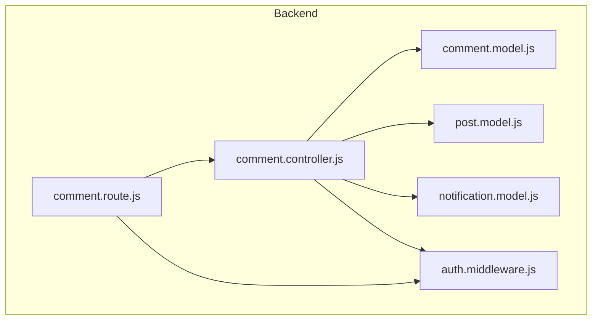
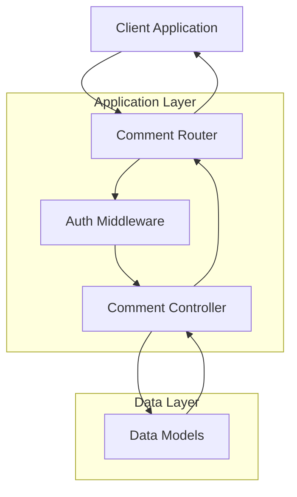
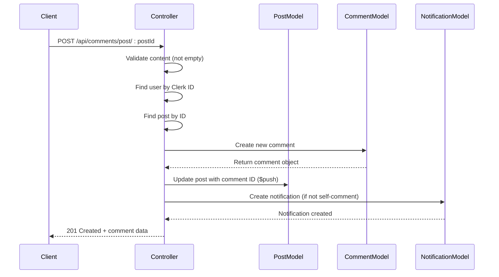
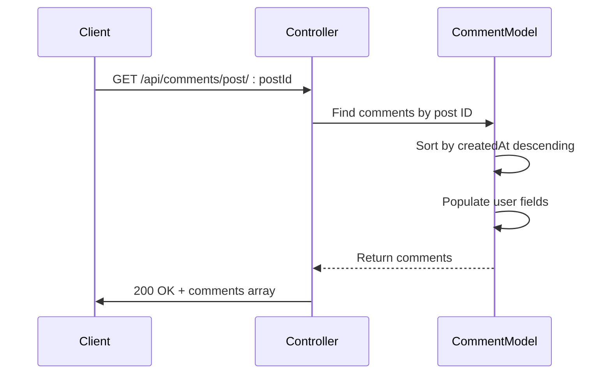
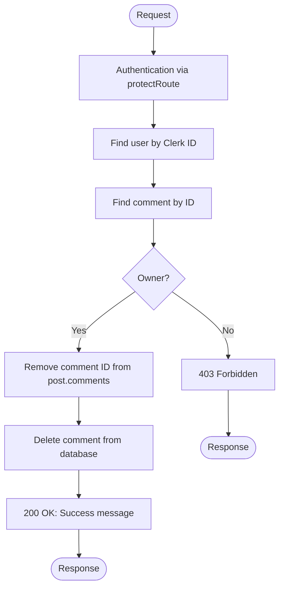
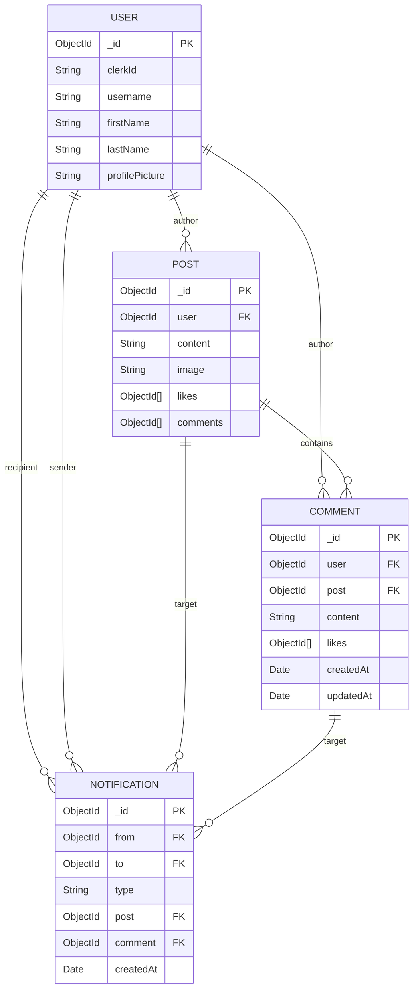
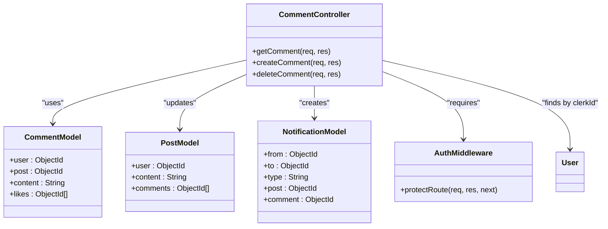

# Comment Business Logic

<cite>
**Referenced Files in This Document**   
- [comment.controller.js](file://backend/src/controllers/comment.controller.js)
- [comment.model.js](file://backend/src/models/comment.model.js)
- [post.model.js](file://backend/src/models/post.model.js)
- [notification.model.js](file://backend/src/models/notification.model.js)
- [comment.route.js](file://backend/src/routes/comment.route.js)
- [auth.middleware.js](file://backend/src/middleware/auth.middleware.js)
</cite>

## Table of Contents
1. [Introduction](#introduction)
2. [Project Structure](#project-structure)
3. [Core Components](#core-components)
4. [Architecture Overview](#architecture-overview)
5. [Detailed Component Analysis](#detailed-component-analysis)
6. [Dependency Analysis](#dependency-analysis)
7. [Performance Considerations](#performance-considerations)
8. [Troubleshooting Guide](#troubleshooting-guide)
9. [Conclusion](#conclusion)

## Introduction
This document provides a comprehensive analysis of the comment management system in the xClone application. It details the implementation of core functionalities such as creating, retrieving, and deleting comments, with a focus on data integrity, user ownership validation, and interaction with related models. The system is built using Node.js with Express and MongoDB via Mongoose, and integrates with Clerk for authentication. The goal is to provide both technical depth and accessibility for developers at all levels.

## Project Structure
The project follows a standard MVC (Model-View-Controller) architecture on the backend, with clear separation of concerns between models, controllers, routes, and middleware. The comment functionality resides in the backend under the `controllers`, `models`, and `routes` directories.

**Diagram sources**
- [comment.controller.js](file://backend/src/controllers/comment.controller.js)
- [comment.model.js](file://backend/src/models/comment.model.js)
- [post.model.js](file://backend/src/models/post.model.js)
- [notification.model.js](file://backend/src/models/notification.model.js)
- [comment.route.js](file://backend/src/routes/comment.route.js)
- [auth.middleware.js](file://backend/src/middleware/auth.middleware.js)

**Section sources**
- [comment.controller.js](file://backend/src/controllers/comment.controller.js)
- [comment.route.js](file://backend/src/routes/comment.route.js)

## Core Components
The core components of the comment system include:
- **Comment Model**: Defines the structure of comment data
- **Post Model**: Maintains a reference to associated comments
- **Comment Controller**: Implements business logic for CRUD operations
- **Comment Routes**: Define API endpoints with proper access control
- **Auth Middleware**: Ensures only authenticated users can modify data

These components work together to maintain data consistency and enforce business rules such as ownership validation and notification generation.

**Section sources**
- [comment.model.js](file://backend/src/models/comment.model.js#L1-L31)
- [post.model.js](file://backend/src/models/post.model.js#L1-L36)
- [comment.controller.js](file://backend/src/controllers/comment.controller.js#L1-L83)
- [comment.route.js](file://backend/src/routes/comment.route.js#L1-L15)

## Architecture Overview
The comment system follows a layered architecture where HTTP requests flow through routing, authentication, and controller layers before interacting with the database models. This ensures proper separation of concerns and maintainability.

**Diagram sources**
- [comment.route.js](file://backend/src/routes/comment.route.js#L1-L15)
- [auth.middleware.js](file://backend/src/middleware/auth.middleware.js#L1-L8)
- [comment.controller.js](file://backend/src/controllers/comment.controller.js#L1-L83)

## Detailed Component Analysis

### Comment Controller Analysis
The comment controller implements three primary operations: retrieving comments, creating new comments, and deleting existing comments. Each method follows a consistent pattern of input validation, data retrieval, business logic execution, and response generation.

#### createComment Method
This method handles the creation of new comments with full validation and side effects.

**Diagram sources**
- [comment.controller.js](file://backend/src/controllers/comment.controller.js#L15-L40)

**Section sources**
- [comment.controller.js](file://backend/src/controllers/comment.controller.js#L15-L40)

#### getCommentsByPost Method
Retrieves all comments for a specific post, sorted by creation time.

**Diagram sources**
- [comment.controller.js](file://backend/src/controllers/comment.controller.js#L5-L13)

**Section sources**
- [comment.controller.js](file://backend/src/controllers/comment.controller.js#L5-L13)

#### deleteComment Method
Handles secure deletion of comments with ownership verification.

**Diagram sources**
- [comment.controller.js](file://backend/src/controllers/comment.controller.js#L42-L82)

**Section sources**
- [comment.controller.js](file://backend/src/controllers/comment.controller.js#L42-L82)

### Data Model Analysis
The comment system relies on well-defined Mongoose schemas that establish relationships between users, posts, and comments.

**Diagram sources**
- [comment.model.js](file://backend/src/models/comment.model.js#L1-L31)
- [post.model.js](file://backend/src/models/post.model.js#L1-L36)
- [notification.model.js](file://backend/src/models/notification.model.js#L1-L36)

**Section sources**
- [comment.model.js](file://backend/src/models/comment.model.js#L1-L31)
- [post.model.js](file://backend/src/models/post.model.js#L1-L36)

## Dependency Analysis
The comment system has well-defined dependencies between components, ensuring loose coupling and high cohesion.

**Diagram sources**
- [comment.controller.js](file://backend/src/controllers/comment.controller.js)
- [comment.model.js](file://backend/src/models/comment.model.js)
- [post.model.js](file://backend/src/models/post.model.js)
- [notification.model.js](file://backend/src/models/notification.model.js)
- [auth.middleware.js](file://backend/src/middleware/auth.middleware.js)

**Section sources**
- [comment.controller.js](file://backend/src/controllers/comment.controller.js)
- [comment.model.js](file://backend/src/models/comment.model.js)

## Performance Considerations
The current implementation has several performance characteristics to consider:

1. **Indexing**: Ensure proper indexes on frequently queried fields:
   - `Comment.post` (for finding comments by post)
   - `Comment.user` (for ownership validation)
   - `Post._id` (for updating posts)

2. **Query Optimization**: The `getComment` method uses `.populate()` which performs a join operation. For high-traffic scenarios, consider:
   - Caching comment lists
   - Using aggregation pipelines for more efficient joins
   - Implementing pagination to limit result size

3. **Atomic Operations**: The current implementation uses separate database calls for comment creation and post update. Consider using MongoDB transactions for stronger consistency guarantees.

4. **Notification Overhead**: Notification creation adds latency to comment creation. For high-scale applications, consider queuing notifications asynchronously.

## Troubleshooting Guide
Common issues and their solutions:

**Issue: Comment creation fails with "user or post not found"**
- **Cause**: Invalid userId from Clerk or non-existent postId
- **Solution**: Verify the post exists and the user is properly authenticated

**Issue: Comment appears in database but not linked to post**
- **Cause**: Failure in the `$push` operation after comment creation
- **Solution**: Implement error handling around the `Post.findByIdAndUpdate` call and consider using transactions

**Issue: Users can delete comments they don't own**
- **Cause**: Flawed ownership comparison
- **Solution**: The current implementation correctly compares `comment.user.toString()` with `user._id.toString()`, which is appropriate for ObjectId comparison

**Issue: Notification created when user comments on own post**
- **Cause**: Incorrect condition in notification logic
- **Solution**: The current implementation correctly checks `post.user.toString() !== user._id.toString()` to prevent self-notifications

**Issue: Comment count on post becomes inconsistent**
- **Cause**: Direct database modifications bypassing the controller
- **Solution**: Always use the controller methods or implement database triggers/constraints

**Section sources**
- [comment.controller.js](file://backend/src/controllers/comment.controller.js#L15-L82)
- [post.model.js](file://backend/src/models/post.model.js#L1-L36)

## Conclusion
The comment business logic in xClone demonstrates a well-structured approach to managing user-generated content with proper validation, ownership enforcement, and relationship management. The system effectively links comments to posts while maintaining data integrity through careful database operations. Key strengths include ownership verification before deletion, automatic notification generation, and clean separation of concerns. For future improvements, consider implementing comment editing, nested replies, spam detection, and better error handling with transactions. The current architecture provides a solid foundation that can be extended to support more advanced commenting features.