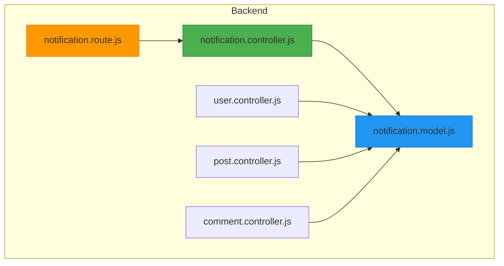
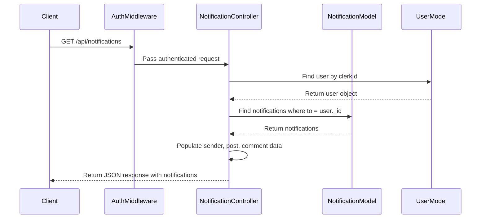
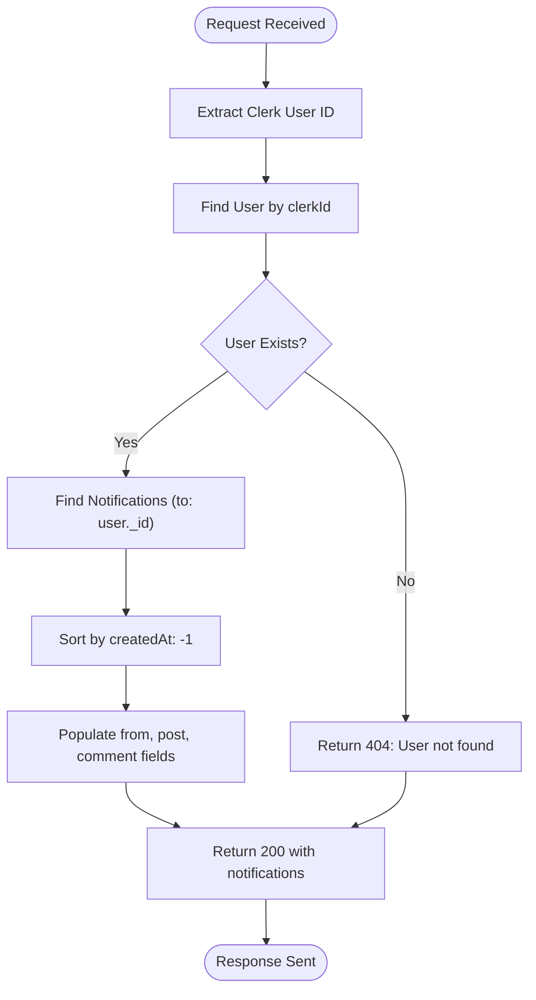
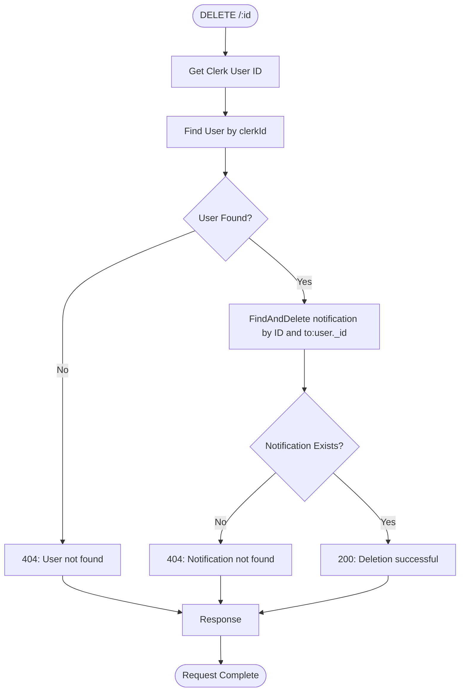
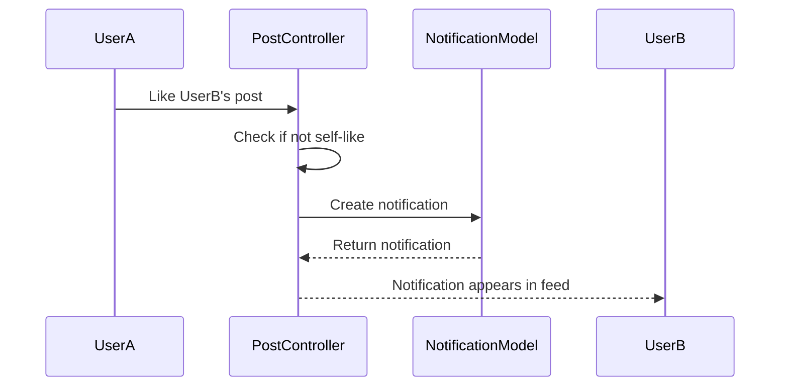
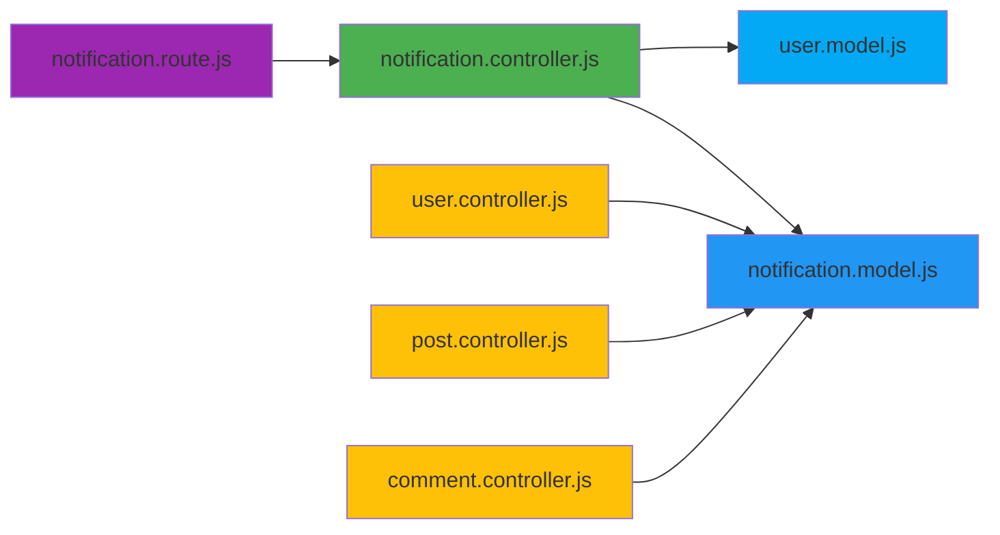

# Notification Business Logic

<cite>
**Referenced Files in This Document**   
- [notification.controller.js](file://backend/src/controllers/notification.controller.js)
- [notification.model.js](file://backend/src/models/notification.model.js)
- [user.controller.js](file://backend/src/controllers/user.controller.js)
- [post.controller.js](file://backend/src/controllers/post.controller.js)
- [comment.controller.js](file://backend/src/controllers/comment.controller.js)
- [notification.route.js](file://backend/src/routes/notification.route.js)
</cite>

## Table of Contents
1. [Introduction](#introduction)
2. [Project Structure](#project-structure)
3. [Core Components](#core-components)
4. [Architecture Overview](#architecture-overview)
5. [Detailed Component Analysis](#detailed-component-analysis)
6. [Dependency Analysis](#dependency-analysis)
7. [Performance Considerations](#performance-considerations)
8. [Troubleshooting Guide](#troubleshooting-guide)
9. [Conclusion](#conclusion)

## Introduction
This document provides a comprehensive analysis of the notification system's business logic in the xClone application. It focuses on the implementation of key features such as retrieving user notifications, deleting notifications, and generating notifications in response to social interactions like follows, likes, and comments. The system is built using Node.js with Express, MongoDB via Mongoose, and integrates with Clerk for authentication. The analysis covers controller methods, data models, routing, and real-world usage patterns across the codebase.

## Project Structure
The project follows a modular backend structure with clear separation of concerns. The notification system resides in the backend under the `controllers`, `models`, and `routes` directories. Key components include:
- **Controllers**: Handle HTTP request logic (`notification.controller.js`)
- **Models**: Define data schema (`notification.model.js`)
- **Routes**: Define API endpoints (`notification.route.js`)
- **Middleware**: Handle authentication and request processing
- **Other Controllers**: Generate notifications during social interactions



**Diagram sources**
- [notification.controller.js](file://backend/src/controllers/notification.controller.js)
- [notification.model.js](file://backend/src/models/notification.model.js)
- [notification.route.js](file://backend/src/routes/notification.route.js)

**Section sources**
- [notification.controller.js](file://backend/src/controllers/notification.controller.js)
- [notification.model.js](file://backend/src/models/notification.model.js)

## Core Components

### Notification Model
The `Notification` model defines the structure of notification records in the database. Each notification captures the sender, recipient, type of action, and optional references to related content.

<label>
**Schema Fields**
- from: ObjectId reference to User (sender)
- to: ObjectId reference to User (recipient)
- type: String enum ["follow", "like", "comment"]
- post: Optional ObjectId reference to Post
- comment: Optional ObjectId reference to Comment
- createdAt: Automatically generated timestamp
- updatedAt: Automatically generated timestamp
</label>

```javascript
// notification.model.js
const notificationSchema = new mongoose.Schema({
  from: { type: mongoose.Schema.Types.ObjectId, ref: "User", required: true },
  to: { type: mongoose.Schema.Types.ObjectId, ref: "User", required: true },
  type: { type: String, required: true, enum: ["follow", "like", "comment"] },
  post: { type: mongoose.Schema.Types.ObjectId, ref: "Post", default: null },
  comment: { type: mongoose.Schema.Types.ObjectId, ref: "Comment", default: null }
}, { timestamps: true });
```

**Section sources**
- [notification.model.js](file://backend/src/models/notification.model.js#L0-L35)

### Notification Controller
The controller implements two primary endpoints: retrieving notifications and deleting a notification. It uses Clerk authentication to identify the current user.

<label>
**Methods**
- getNotifications: Fetch all notifications for the authenticated user
- deleteNotification: Remove a specific notification by ID
</label>

```javascript
// notification.controller.js
export const getNotifications = asyncHandler(async (req, res) => {
  const { userId } = getAuth(req);
  const user = await User.findOne({ clerkId: userId });
  if (!user) return res.status(404).json({ error: "User not found" });

  const notifications = await Notification.find({ to: user._id })
    .sort({ createdAt: -1 })
    .populate("from", "username firstName lastName profilePicture")
    .populate("post", "content image")
    .populate("comment", "content");

  res.status(200).json({ notifications });
});
```

**Section sources**
- [notification.controller.js](file://backend/src/controllers/notification.controller.js#L0-L35)

## Architecture Overview



**Diagram sources**
- [notification.controller.js](file://backend/src/controllers/notification.controller.js#L0-L35)
- [notification.model.js](file://backend/src/models/notification.model.js#L0-L35)

## Detailed Component Analysis

### Retrieval Logic Analysis
The `getNotifications` method implements a secure, user-specific notification retrieval system.

<label>
**Request Flow**
- Authentication: Clerk extracts userId from JWT
- User Lookup: Find user document by clerkId
- Notification Query: Retrieve all notifications for the user
- Data Enrichment: Populate related user, post, and comment data
- Response: Return sorted notifications (newest first)
</label>

The method uses `.populate()` to resolve references and include relevant data from related collections, reducing the need for additional client-side requests.



**Diagram sources**
- [notification.controller.js](file://backend/src/controllers/notification.controller.js#L0-L15)

**Section sources**
- [notification.controller.js](file://backend/src/controllers/notification.controller.js#L0-L15)

### Deletion Logic Analysis
The `deleteNotification` method allows users to remove individual notifications.

<label>
**Security Checks**
- User authentication via Clerk
- Ownership verification (notification.to must match user._id)
- Existence validation
</label>

The method uses `findOneAndDelete` with a compound filter to ensure users can only delete their own notifications, preventing unauthorized access.



**Diagram sources**
- [notification.controller.js](file://backend/src/controllers/notification.controller.js#L17-L35)

**Section sources**
- [notification.controller.js](file://backend/src/controllers/notification.controller.js#L17-L35)

### Notification Creation Patterns
Although no dedicated `createNotification` controller exists, notifications are created programmatically within other controllers during social interactions.

#### Follow Notification
Generated when one user follows another.

```javascript
// user.controller.js
await Notification.create({
  from: currentUser._id,
  to: targetUserId,
  type: "follow",
});
```

#### Like Notification
Generated when a user likes another user's post.

```javascript
// post.controller.js
if (post.user.toString() !== user._id.toString()) {
  await Notification.create({
    from: user._id,
    to: post.user,
    type: "like",
    post: postId,
  });
}
```

#### Comment Notification
Implied in the model but not shown in the provided code; would follow similar pattern.



**Diagram sources**
- [user.controller.js](file://backend/src/controllers/user.controller.js#L68-L95)
- [post.controller.js](file://backend/src/controllers/post.controller.js#L77-L123)

**Section sources**
- [user.controller.js](file://backend/src/controllers/user.controller.js#L68-L95)
- [post.controller.js](file://backend/src/controllers/post.controller.js#L77-L123)

## Dependency Analysis



**Diagram sources**
- [notification.controller.js](file://backend/src/controllers/notification.controller.js)
- [notification.model.js](file://backend/src/models/notification.model.js)
- [user.controller.js](file://backend/src/controllers/user.controller.js)
- [post.controller.js](file://backend/src/controllers/post.controller.js)
- [comment.controller.js](file://backend/src/controllers/comment.controller.js)

**Section sources**
- [notification.controller.js](file://backend/src/controllers/notification.controller.js)
- [notification.model.js](file://backend/src/models/notification.model.js)

## Performance Considerations
The notification system demonstrates several performance-aware design choices:
- **Index Utilization**: Queries on `to` and `createdAt` fields benefit from MongoDB indexing
- **Data Population**: Selective population of only necessary fields (username, content) reduces payload size
- **Sorting**: Server-side sorting by `createdAt` ensures consistent ordering
- **Authentication**: Clerk middleware handles authentication efficiently
- **Error Handling**: Early returns prevent unnecessary database operations

Potential improvements:
- Add database indexes on `from`, `to`, and `createdAt` fields
- Implement pagination for large notification sets
- Consider soft deletion instead of hard deletion to maintain audit trails
- Add rate limiting to prevent notification flooding

## Troubleshooting Guide

<label>
**Common Issues**
- User not found: Clerk ID mismatch between authentication and database
- Empty notifications: No social interactions or incorrect user mapping
- Missing population: Ensure populate fields match model schema
- Deletion failures: Verify notification ownership and ID validity
</label>

<label>
**Debugging Steps**
1. Verify Clerk authentication is working
2. Check user document exists with correct clerkId
3. Validate notification document structure
4. Confirm populate paths are correct
5. Test database connectivity
</label>

<label>
**Error Responses**
- 404 "User not found": Authentication successful but no matching user in DB
- 404 "Notification not found": Invalid ID or user doesn't own notification
- 400 validation errors: Check request payload structure
</label>

**Section sources**
- [notification.controller.js](file://backend/src/controllers/notification.controller.js)
- [user.controller.js](file://backend/src/controllers/user.controller.js)

## Conclusion
The notification system in xClone effectively implements core social notification functionality with a clean, maintainable architecture. Key strengths include proper separation of concerns, secure authentication integration, and efficient data retrieval patterns. The system generates notifications contextually during social interactions rather than exposing direct creation endpoints, which enhances security and ensures notifications reflect actual user activity. Future enhancements could include read status tracking, notification types filtering, and improved performance optimizations for large datasets.