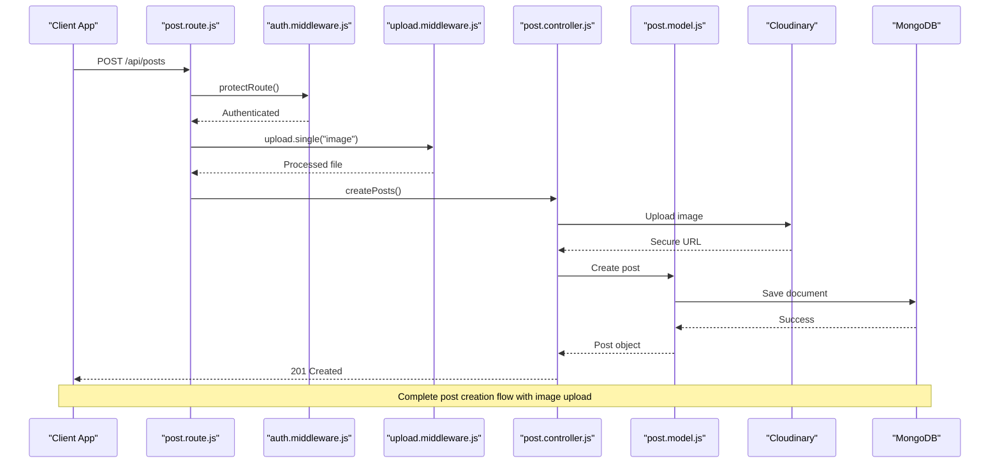
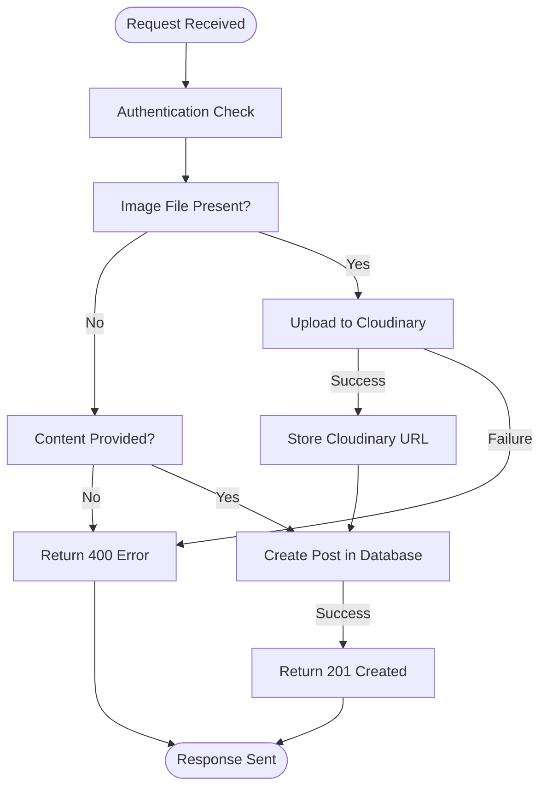
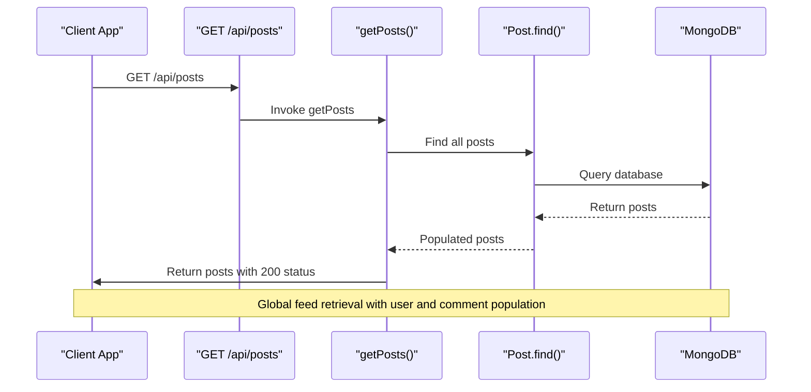
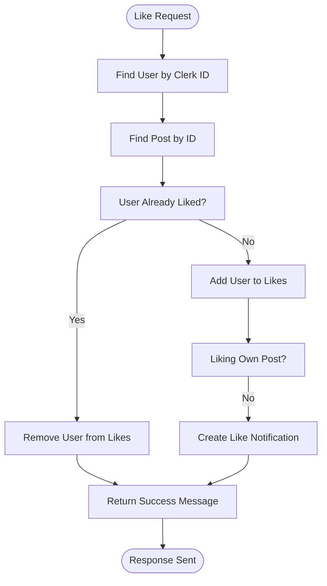
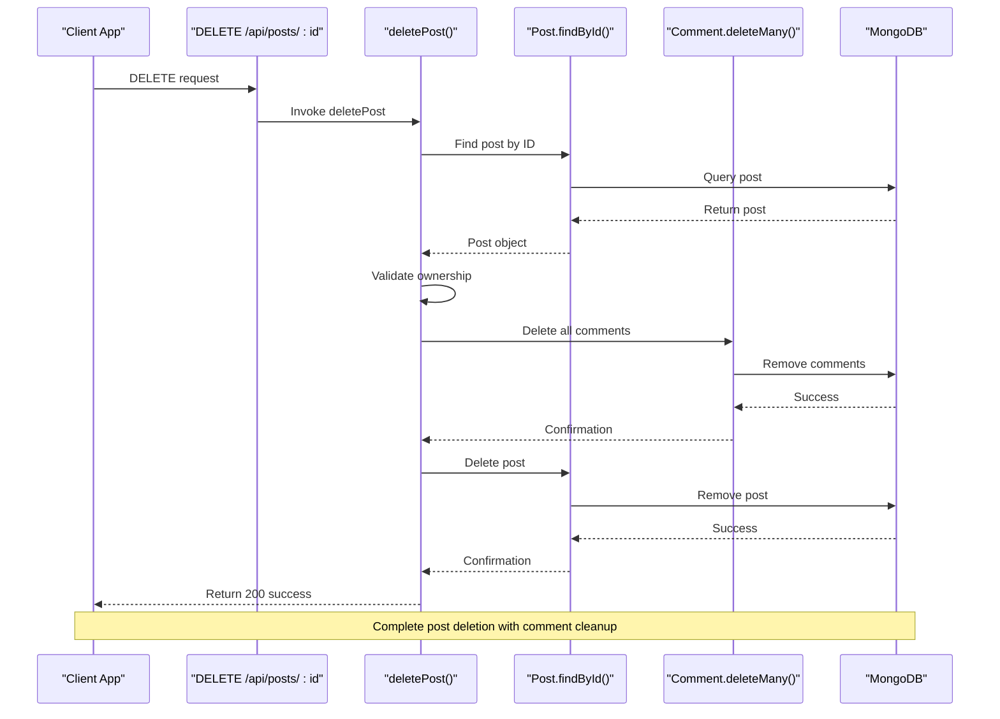

# Post Business Logic

<cite>
**Referenced Files in This Document**   
- [post.controller.js](file://backend/src/controllers/post.controller.js)
- [post.route.js](file://backend/src/routes/post.route.js)
- [post.model.js](file://backend/src/models/post.model.js)
- [upload.middleware.js](file://backend/src/middleware/upload.middleware.js)
- [cloudinary.js](file://backend/src/config/cloudinary.js)
- [env.js](file://backend/src/config/env.js)
</cite>

## Table of Contents
1. [Introduction](#introduction)
2. [Project Structure](#project-structure)
3. [Core Components](#core-components)
4. [Architecture Overview](#architecture-overview)
5. [Detailed Component Analysis](#detailed-component-analysis)
6. [Dependency Analysis](#dependency-analysis)
7. [Performance Considerations](#performance-considerations)
8. [Troubleshooting Guide](#troubleshooting-guide)
9. [Conclusion](#conclusion)

## Introduction
This document provides a comprehensive analysis of the post management business logic in the xClone application. It details the implementation of core functionalities such as creating posts (with text and image uploads), retrieving posts for global and user-specific feeds, liking/unliking posts, and deleting posts. The analysis covers the full invocation flow from HTTP routes through middleware to controller methods, and their interaction with the Post model, Cloudinary for image handling, and MongoDB for data persistence. Special attention is given to domain logic including like counting, ownership validation, feed generation, and error recovery strategies.

## Project Structure
The xClone project follows a modular backend architecture with clear separation of concerns. The post-related functionality is organized across several directories under `backend/src`:
- **controllers**: Contains `post.controller.js` with business logic
- **routes**: Contains `post.route.js` defining API endpoints
- **models**: Contains `post.model.js` defining the Post schema
- **middleware**: Includes `upload.middleware.js` for file handling
- **config**: Houses `cloudinary.js` and `env.js` for external service configuration

```mermaid
graph TB
subgraph "Backend Components"
Route[post.route.js]
Controller[post.controller.js]
Model[post.model.js]
Middleware[upload.middleware.js]
Config[cloudinary.js]
end
Route --> Controller : "Handles requests"
Controller --> Model : "CRUD operations"
Controller --> Config : "Image upload"
Middleware --> Controller : "File processing"
Config --> Cloudinary[(Cloudinary)]
Model --> MongoDB[(MongoDB)]
```

**Diagram sources**
- [post.route.js](file://backend/src/routes/post.route.js#L1-L20)
- [post.controller.js](file://backend/src/controllers/post.controller.js#L1-L158)
- [post.model.js](file://backend/src/models/post.model.js#L1-L35)

**Section sources**
- [post.route.js](file://backend/src/routes/post.route.js#L1-L20)
- [post.controller.js](file://backend/src/controllers/post.controller.js#L1-L158)

## Core Components
The post management system consists of several interconnected components that work together to provide a complete social media posting experience. The core components include:
- **Post Controller**: Implements business logic for all post operations
- **Post Model**: Defines the data structure and relationships for posts
- **Upload Middleware**: Handles image file processing before upload
- **Cloudinary Integration**: Manages image storage and optimization
- **Authentication Middleware**: Ensures secure access to protected routes

These components follow a clean architecture pattern where routes delegate to controllers, which interact with models and external services while respecting separation of concerns.

**Section sources**
- [post.controller.js](file://backend/src/controllers/post.controller.js#L1-L158)
- [post.model.js](file://backend/src/models/post.model.js#L1-L35)
- [upload.middleware.js](file://backend/src/middleware/upload.middleware.js#L1-L21)

## Architecture Overview
The post management system follows a RESTful API architecture with a middleware-based processing pipeline. The overall flow begins with HTTP requests being routed to specific endpoints, processed through authentication and file upload middleware, and handled by controller methods that interact with the database and external services.



**Diagram sources**
- [post.route.js](file://backend/src/routes/post.route.js#L1-L20)
- [post.controller.js](file://backend/src/controllers/post.controller.js#L38-L79)
- [upload.middleware.js](file://backend/src/middleware/upload.middleware.js#L1-L21)

## Detailed Component Analysis

### Post Creation Analysis
The post creation functionality allows users to create posts with optional text content and an image. The system validates input, processes images through Cloudinary, and stores the post data in MongoDB.

#### Post Creation Flowchart


**Diagram sources**
- [post.controller.js](file://backend/src/controllers/post.controller.js#L38-L79)
- [upload.middleware.js](file://backend/src/middleware/upload.middleware.js#L1-L21)

**Section sources**
- [post.controller.js](file://backend/src/controllers/post.controller.js#L38-L79)
- [upload.middleware.js](file://backend/src/middleware/upload.middleware.js#L1-L21)

#### Key Implementation Details
The `createPosts` controller method implements the following logic:
- Extracts user ID from authentication token using Clerk
- Validates that either content or image is provided
- Finds the user in the database by Clerk ID
- Processes image upload to Cloudinary if an image is included
- Creates a new post with user reference, content, and image URL
- Returns the created post with 201 status

The image upload process converts the file buffer to base64 format and applies Cloudinary transformations including:
- Size limiting to 800x600 pixels
- Automatic quality optimization
- Automatic format selection

```javascript
// Image upload configuration
const uploadResponse = await cloudinary.uploader.upload(base64Image, {
  folder: "social_media_posts",
  resource_type: "image",
  transformation: [
    { width: 800, height: 600, crop: "limit" },
    { quality: "auto" },
    { format: "auto" }
  ],
});
```

### Feed Retrieval Analysis
The system provides multiple endpoints for retrieving posts, supporting both global and user-specific feeds.

#### Feed Retrieval Sequence Diagram


**Diagram sources**
- [post.controller.js](file://backend/src/controllers/post.controller.js#L7-L24)
- [post.route.js](file://backend/src/routes/post.route.js#L1-L20)

**Section sources**
- [post.controller.js](file://backend/src/controllers/post.controller.js#L7-L24)

#### Key Implementation Details
The feed retrieval methods (`getPosts`, `getPost`, `getUserPosts`) implement the following patterns:
- Sort posts by creation date in descending order (newest first)
- Populate user information (username, name, profile picture) for display
- Populate comments with their associated user information
- Handle missing resources with appropriate 404 responses
- Support both global feed and user-specific feed retrieval

The population strategy ensures that client applications receive fully hydrated post objects without requiring additional API calls for user data.

### Like/Unlike Functionality Analysis
The like/unlike system implements a toggle mechanism that updates the post's like count and creates notifications for engagement.

#### Like/Unlike Flowchart


**Diagram sources**
- [post.controller.js](file://backend/src/controllers/post.controller.js#L77-L123)

**Section sources**
- [post.controller.js](file://backend/src/controllers/post.controller.js#L77-L123)

#### Key Implementation Details
The `likePost` controller method implements the following logic:
- Uses `$push` and `$pull` MongoDB operators to add/remove user IDs from the likes array
- Determines the action (like/unlike) based on whether the user ID already exists in the likes array
- Creates a notification when a user likes someone else's post
- Returns appropriate success messages for both like and unlike operations

The notification system prevents self-notification by checking if the post owner and liking user are the same.

### Post Deletion Analysis
The post deletion functionality includes ownership validation and cleanup of related resources.

#### Post Deletion Sequence Diagram


**Diagram sources**
- [post.controller.js](file://backend/src/controllers/post.controller.js#L121-L158)
- [post.model.js](file://backend/src/models/post.model.js#L1-L35)

**Section sources**
- [post.controller.js](file://backend/src/controllers/post.controller.js#L121-L158)

#### Key Implementation Details
The `deletePost` controller method implements the following safety and cleanup measures:
- Verifies that the requesting user owns the post being deleted
- Returns 403 Forbidden if attempting to delete another user's post
- Deletes all comments associated with the post to prevent orphaned records
- Uses `findByIdAndDelete` to remove the post document
- Returns success confirmation after all cleanup operations

This approach prevents orphaned comments and enforces proper authorization.

## Dependency Analysis
The post management system has well-defined dependencies between components, following a layered architecture pattern.

```mermaid
graph TD
Client --> Route
Route --> Auth
Route --> Upload
Route --> Controller
Controller --> Model
Controller --> Cloudinary
Model --> DB
Upload --> Cloudinary
Controller --> Notification
style Client fill:#f9f,stroke:#333
style DB fill:#ccf,stroke:#333
style Cloudinary fill:#cfc,stroke:#333
Note: "External services shown with distinct styling"
```

**Diagram sources**
- [post.route.js](file://backend/src/routes/post.route.js#L1-L20)
- [post.controller.js](file://backend/src/controllers/post.controller.js#L1-L158)
- [cloudinary.js](file://backend/src/config/cloudinary.js#L1-L10)

**Section sources**
- [post.controller.js](file://backend/src/controllers/post.controller.js#L1-L158)
- [cloudinary.js](file://backend/src/config/cloudinary.js#L1-L10)

## Performance Considerations
The post management system includes several performance optimizations:
- **Indexing**: The Post model should have indexes on frequently queried fields like `user` and `createdAt` for efficient feed generation
- **Population Optimization**: The use of selective population (`select` parameter) reduces payload size by only including necessary user fields
- **Image Optimization**: Cloudinary transformations automatically optimize images for web delivery with appropriate quality and format
- **Error Handling**: Asynchronous error handling prevents server crashes from individual request failures
- **Validation**: Input validation at the controller level prevents unnecessary database queries for invalid requests

Potential improvements include:
- Implementing caching for frequently accessed feeds
- Adding pagination to prevent large result sets
- Using aggregation pipelines for complex queries
- Implementing rate limiting to prevent abuse

## Troubleshooting Guide
Common issues and their solutions in the post management system:

### Unauthorized Post Modifications
**Issue**: Users can't delete posts or receive 403 errors
**Solution**: Verify that the ownership check is working correctly by ensuring:
- The user's Clerk ID matches the stored `clerkId` in the User model
- The post's `user` field matches the authenticated user's `_id`
- Authentication middleware is properly configured

### Failed Image Uploads
**Issue**: Image uploads fail with 400 errors
**Solution**: Check the following:
- Image file size is under 5MB limit enforced by multer
- File type is a valid image format (JPEG, PNG, etc.)
- Cloudinary credentials are correctly configured in environment variables
- Network connectivity to Cloudinary is available

### Orphaned Image Assets
**Issue**: Deleted posts leave images in Cloudinary storage
**Solution**: Implement a cleanup mechanism:
- Store Cloudinary asset IDs in the Post model
- Delete the Cloudinary asset when deleting the post
- Use Cloudinary's API to remove the image resource

### Missing Population Data
**Issue**: User information not appearing in post responses
**Solution**: Verify:
- The `populate()` calls in controller methods are correctly configured
- The referenced User documents exist in the database
- Field selection in populate matches the actual User model schema

**Section sources**
- [post.controller.js](file://backend/src/controllers/post.controller.js#L1-L158)
- [upload.middleware.js](file://backend/src/middleware/upload.middleware.js#L1-L21)
- [cloudinary.js](file://backend/src/config/cloudinary.js#L1-L10)

## Conclusion
The post management business logic in xClone demonstrates a well-structured implementation of social media functionality with proper separation of concerns, robust error handling, and integration with external services. The system effectively handles post creation with image uploads, feed retrieval, engagement features like liking, and secure post deletion with resource cleanup. The architecture follows RESTful principles with middleware-based processing, and the code is organized in a maintainable, scalable pattern. Key strengths include the use of transactional patterns for data consistency, proper authentication and authorization checks, and optimization of media assets through Cloudinary integration. The system provides a solid foundation for social media interactions while maintaining data integrity and user security.