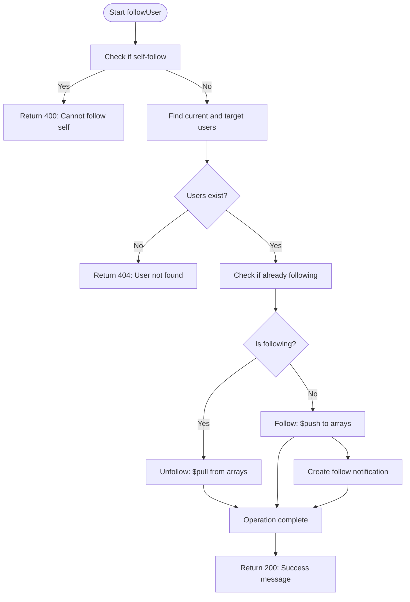

# User Business Logic

<cite>
**Referenced Files in This Document**   
- [user.controller.js](file://backend/src/controllers/user.controller.js)
- [user.model.js](file://backend/src/models/user.model.js)
- [auth.middleware.js](file://backend/src/middleware/auth.middleware.js)
- [user.route.js](file://backend/src/routes/user.route.js)
- [notification.model.js](file://backend/src/models/notification.model.js)
</cite>

## Table of Contents
1. [Introduction](#introduction)
2. [Project Structure](#project-structure)
3. [Core Components](#core-components)
4. [Architecture Overview](#architecture-overview)
5. [Detailed Component Analysis](#detailed-component-analysis)
6. [Dependency Analysis](#dependency-analysis)
7. [Performance Considerations](#performance-considerations)
8. [Troubleshooting Guide](#troubleshooting-guide)
9. [Conclusion](#conclusion)

## Introduction
This document provides a comprehensive analysis of the user management business logic implemented in the `user.controller.js` file of the xClone backend application. It details the implementation of user profile retrieval, follower/following relationship management, and user data synchronization with the Clerk authentication system. The document explains key controller methods such as `getUserProfile`, `followUser`, and `unfollowUser`, including their request/response signatures and interactions with the `User` model. It also covers middleware integration, domain logic, error handling, and concurrency control mechanisms.

## Project Structure
The project follows a modular backend structure with clear separation of concerns. The user-related functionality is organized under the `backend/src` directory with dedicated folders for controllers, models, middleware, and routes.


**Diagram sources**
- [user.controller.js](file://backend/src/controllers/user.controller.js)
- [user.model.js](file://backend/src/models/user.model.js)
- [auth.middleware.js](file://backend/src/middleware/auth.middleware.js)
- [user.route.js](file://backend/src/routes/user.route.js)
- [notification.model.js](file://backend/src/models/notification.model.js)

**Section sources**
- [user.controller.js](file://backend/src/controllers/user.controller.js)
- [user.model.js](file://backend/src/models/user.model.js)
- [auth.middleware.js](file://backend/src/middleware/auth.middleware.js)
- [user.route.js](file://backend/src/routes/user.route.js)

## Core Components
The core components of the user management system include:
- **User Controller**: Handles all user-related HTTP requests
- **User Model**: Defines the MongoDB schema for user data
- **Auth Middleware**: Enforces authentication requirements
- **User Routes**: Maps HTTP endpoints to controller methods
- **Notification Model**: Supports follow notification functionality

These components work together to provide a complete user management system with profile retrieval, follow/unfollow functionality, and authentication integration.

**Section sources**
- [user.controller.js](file://backend/src/controllers/user.controller.js#L1-L96)
- [user.model.js](file://backend/src/models/user.model.js#L1-L63)
- [auth.middleware.js](file://backend/src/middleware/auth.middleware.js#L1-L8)

## Architecture Overview
The user management system follows a standard Express.js MVC pattern with additional integration with external authentication services. The architecture features a clear separation between routing, business logic, data modeling, and security layers.


**Diagram sources**
- [user.route.js](file://backend/src/routes/user.route.js#L1-L18)
- [auth.middleware.js](file://backend/src/middleware/auth.middleware.js#L1-L8)
- [user.controller.js](file://backend/src/controllers/user.controller.js#L1-L96)

## Detailed Component Analysis

### User Profile Retrieval
The user profile retrieval functionality allows both public and authenticated access to user data.

#### getUserProfile Method
The `getUserProfile` method retrieves a user's public profile by username:

```javascript
export const getUserProfile = asyncHandler(async (req, res) => {
  const { username } = req.params;
  const user = await User.findOne({ username });
  if (!user) {
    return res.status(404).json({ message: "User not found" });
  }
  res.status(200).json({ user });
});
```

**Request**: `GET /profile/:username`  
**Response**: 200 with user object or 404 if not found  
**Access**: Public (no authentication required)

**Section sources**
- [user.controller.js](file://backend/src/controllers/user.controller.js#L1-L8)
- [user.route.js](file://backend/src/routes/user.route.js#L10)

#### getCurrentUser Method
The `getCurrentUser` method retrieves the authenticated user's complete profile:

```javascript
export const getCurrentUser = asyncHandler(async (req, res) => {
  const { userId } = getAuth(req);
  const user = await User.findOne({ clerkId: userId });
  if (!user) return res.status(404).json({ message: "User not found" });
  res.status(200).json({ user });
});
```

**Request**: `POST /me` (authenticated)  
**Response**: 200 with user object or 404 if not found  
**Access**: Protected (requires authentication)

**Section sources**
- [user.controller.js](file://backend/src/controllers/user.controller.js#L39-L45)
- [user.route.js](file://backend/src/routes/user.route.js#L13)

### Follower/Following Relationship Management
The system implements a bidirectional follow relationship system with atomic updates and notification integration.

#### Follow/Unfollow Logic
The `followUser` method handles both follow and unfollow operations in a single endpoint:

```javascript
export const followUser = asyncHandler(async (req, res) => {
  const { userId } = getAuth(req);
  const { targetUserId } = req.params;

  if (userId === targetUserId)
    return res.status(400).json({ error: "You cannot follow yourself" });

  const currentUser = await User.findOne({ clerkId: userId });
  const targetUser = await User.findById(targetUserId);

  if (!currentUser || !targetUser)
    return res.status(404).json({ error: "User not found" });

  const isFollowing = currentUser.following.includes(targetUserId);

  if (isFollowing) {
    // unfollow
    await User.findByIdAndUpdate(currentUser._id, {
      $pull: { following: targetUserId },
    });
    await User.findByIdAndUpdate(targetUserId, {
      $pull: { followers: currentUser._id },
    });
  } else {
    // follow
    await User.findByIdAndUpdate(currentUser._id, {
      $push: { following: targetUserId },
    });
    await User.findByIdAndUpdate(targetUserId, {
      $push: { followers: currentUser._id },
    });

    // create notification
    await Notification.create({
      from: currentUser._id,
      to: targetUserId,
      type: "follow",
    });
  }

  res.status(200).json({
    message: isFollowing
      ? "User unfollowed successfully"
      : "User followed successfully",
  });
});
```

**Request**: `POST /follow/:targetUserId` (authenticated)  
**Response**: 200 with success message  
**Access**: Protected (requires authentication)

The method implements several important domain rules:
- Prevents self-following
- Checks for existence of both users
- Uses MongoDB's atomic `$push` and `$pull` operations
- Creates follow notifications for new follows
- Returns appropriate success messages



**Diagram sources**
- [user.controller.js](file://backend/src/controllers/user.controller.js#L47-L95)

**Section sources**
- [user.controller.js](file://backend/src/controllers/user.controller.js#L47-L95)
- [user.model.js](file://backend/src/models/user.model.js#L30-L45)
- [notification.model.js](file://backend/src/models/notification.model.js#L1-L36)

### User Data Synchronization with Clerk
The system synchronizes user data between the Clerk authentication service and the local MongoDB database.

#### syncUser Method
The `syncUser` method creates a local user record from Clerk authentication data:

```javascript
export const syncUser = asyncHandler(async (req, res) => {
  const { userId } = getAuth(req);
  //checking if the user exists in the mongodb
  const existingUser = await User.findOne({ clerkId: userId });
  if (existingUser) res.status(200).json({ message: "User already exists" });
  //creating new user from clerk data
  const clerkUser = await clerkClient.users.getUser(userId);

  const userData = {
    clerkId: userId,
    email: clerkUser.emailAddresses[0].emailAddress,
    firstName: clerkUser.firstName || "",
    lastName: clerkUser.lastName || "",
    username: clerkUser.emailAddresses[0].emailAddress.split("@")[0],
    profilePicture: clerkUser.imageUrl || "",
  };
  const user = await User.create(userData);

  res.status(201).json({ user, message: "User created successfully" });
});
```

**Request**: `POST /sync` (authenticated)  
**Response**: 201 with user data or 200 if already exists  
**Access**: Protected (requires authentication)

The synchronization process:
1. Checks if user already exists locally
2. Fetches user data from Clerk API
3. Maps Clerk data to local schema
4. Creates new user record in MongoDB

**Section sources**
- [user.controller.js](file://backend/src/controllers/user.controller.js#L10-L37)
- [user.route.js](file://backend/src/routes/user.route.js#L12)

### Middleware Integration
The authentication middleware enforces access control across protected routes.

#### protectRoute Middleware
```javascript
export const protectRoute = async (req, res, next) => {
  if (!req.auth().isAuthenticated) {
    return res.status(401).json({
      message: "Unauthorized-you must be logged in",
    });
  }
  next();
};
```

This middleware is applied to all user modification endpoints, ensuring that only authenticated users can access them. It leverages Clerk's Express integration to verify authentication status.


**Diagram sources**
- [auth.middleware.js](file://backend/src/middleware/auth.middleware.js#L1-L8)
- [user.route.js](file://backend/src/routes/user.route.js#L12-L18)

**Section sources**
- [auth.middleware.js](file://backend/src/middleware/auth.middleware.js#L1-L8)
- [user.route.js](file://backend/src/routes/user.route.js#L12-L18)

## Dependency Analysis
The user management system has well-defined dependencies between components:


Key dependency relationships:
- **Routes depend on Controller**: Route definitions map to controller methods
- **Controller depends on Models**: Business logic interacts with data models
- **Controller depends on Middleware**: Authentication checks are applied
- **Controller depends on Clerk**: External authentication service integration
- **Models depend on MongoDB**: Data persistence layer

The system uses `express-async-handler` to simplify async error handling, eliminating the need for try-catch blocks in controller methods.

**Diagram sources**
- [user.route.js](file://backend/src/routes/user.route.js)
- [user.controller.js](file://backend/src/controllers/user.controller.js)
- [user.model.js](file://backend/src/models/user.model.js)
- [auth.middleware.js](file://backend/src/middleware/auth.middleware.js)

**Section sources**
- [user.controller.js](file://backend/src/controllers/user.controller.js#L1-L96)
- [package-lock.json](file://backend/package-lock.json#L745-L776)

## Performance Considerations
The user management system implements several performance and reliability features:

### Atomic Operations
The follow/unfollow operations use MongoDB's atomic `$push` and `$pull` operations to ensure data consistency and prevent race conditions. These operations are executed at the database level, providing transactional safety for the array modifications.

### Indexing Strategy
The User model includes several indexed fields for optimal query performance:
- `clerkId`: Unique index for authentication lookups
- `email`: Unique index for email-based queries
- `username`: Unique index for profile lookups

### Error Handling
The system uses `express-async-handler` to automatically catch and handle asynchronous errors, preventing unhandled promise rejections and ensuring proper error responses.

### Concurrency Control
While the current implementation doesn't use explicit transactions, the atomic nature of MongoDB's array operations provides sufficient protection against race conditions for the follow/unfollow functionality.

## Troubleshooting Guide
Common issues and their solutions:

### User Not Found (404)
**Symptoms**: `getUserProfile` returns 404 even when user exists
**Causes**: 
- Username parameter mismatch
- User not properly synced from Clerk
- Database connectivity issues

**Solutions**:
1. Verify the username exists in the database
2. Ensure user has completed the sync process
3. Check database connection status

### Authentication Required (401)
**Symptoms**: Protected routes return 401 Unauthorized
**Causes**:
- Missing or invalid authentication token
- Clerk session expired
- Middleware not properly configured

**Solutions**:
1. Ensure client includes proper authentication headers
2. Verify Clerk integration is working
3. Check that `protectRoute` middleware is applied correctly

### Duplicate Follow Requests
**Symptoms**: Multiple follow operations produce inconsistent state
**Causes**: 
- Race conditions in rapid succession
- Network retries

**Solutions**:
The current implementation naturally handles this through the `isFollowing` check, which determines whether to follow or unfollow based on current state.

### Self-Follow Attempts
**Symptoms**: Users attempting to follow themselves
**Solution**: The system explicitly prevents this with a validation check:
```javascript
if (userId === targetUserId) return res.status(400).json({ error: "You cannot follow yourself" });
```

**Section sources**
- [user.controller.js](file://backend/src/controllers/user.controller.js#L47-L95)
- [auth.middleware.js](file://backend/src/middleware/auth.middleware.js#L1-L8)

## Conclusion
The user management system in xClone provides a robust implementation of user profile management, follower relationships, and authentication integration. Key strengths include:

- **Clean Architecture**: Clear separation of concerns between routes, controllers, models, and middleware
- **Authentication Integration**: Seamless synchronization with Clerk authentication service
- **Data Consistency**: Use of atomic MongoDB operations to maintain follower/following integrity
- **Error Handling**: Comprehensive error handling using express-async-handler
- **Notification System**: Integrated follow notifications for social interactions

The system effectively handles the core requirements of user management while maintaining good performance and reliability characteristics. Future improvements could include adding database transactions for follow operations and implementing more sophisticated rate limiting.