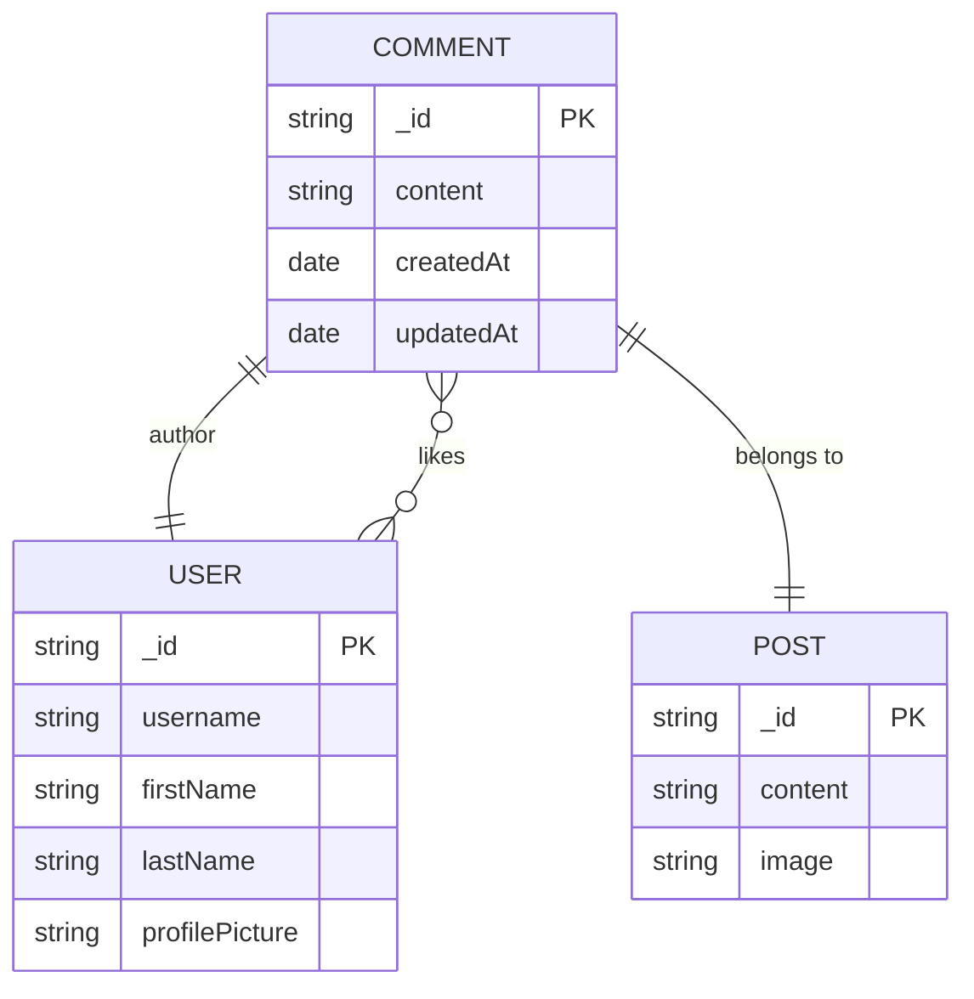
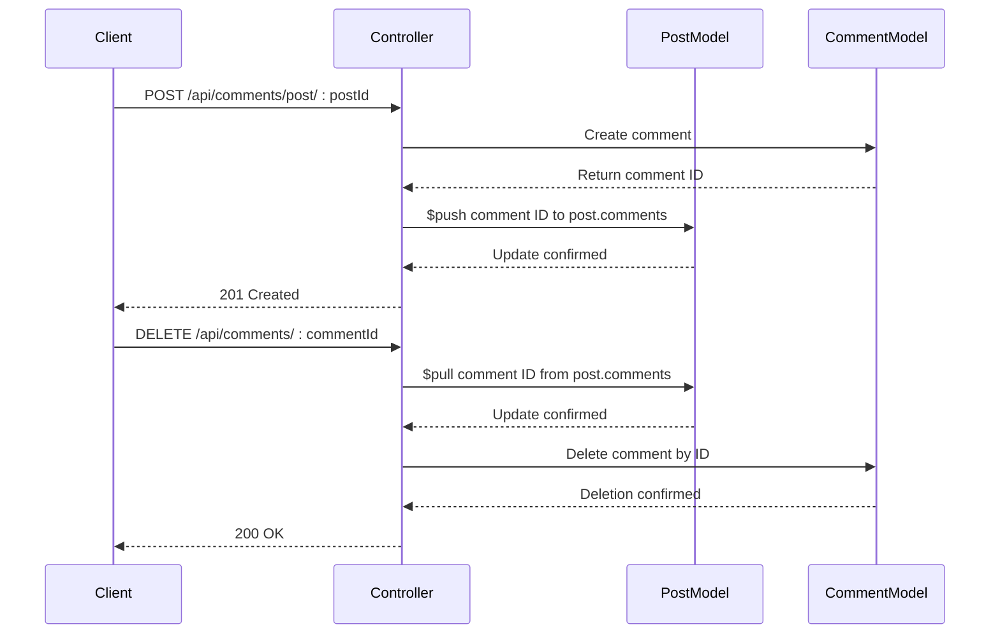

# Comment Model

<cite>
**Referenced Files in This Document**   
- [comment.model.js](file://backend/src/models/comment.model.js#L1-L32)
- [comment.controller.js](file://backend/src/controllers/comment.controller.js#L1-L83)
- [post.model.js](file://backend/src/models/post.model.js#L1-L36)
- [comment.route.js](file://backend/src/routes/comment.route.js#L1-L15)
</cite>

## Table of Contents
1. [Introduction](#introduction)
2. [Field Specifications](#field-specifications)
3. [Hierarchical Structure and Relationships](#hierarchical-structure-and-relationships)
4. [Query Behavior and Population](#query-behavior-and-population)
5. [Indexes and Performance Optimization](#indexes-and-performance-optimization)
6. [Middleware and Cascading Operations](#middleware-and-cascading-operations)
7. [Data Integrity and Deletion Semantics](#data-integrity-and-deletion-semantics)
8. [Usage Patterns](#usage-patterns)
9. [Sample JSON Representations](#sample-json-representations)
10. [Conclusion](#conclusion)

## Introduction
The **Comment Model** in xClone is a Mongoose schema designed to represent user comments on posts within a social media application. It supports core functionalities such as content creation, likes, author attribution, and hierarchical replies. This document provides a comprehensive overview of the model's structure, relationships, behavior, and usage patterns. The model ensures data consistency through validation rules, leverages MongoDB's indexing for performance, and maintains referential integrity with cascading operations.

**Section sources**
- [comment.model.js](file://backend/src/models/comment.model.js#L1-L32)

## Field Specifications
The Comment model defines the following fields:

### _id
- **Type**: ObjectId (automatically generated by MongoDB)
- **Purpose**: Unique identifier for each comment
- **Default**: Automatically assigned upon document creation

### content
- **Type**: String
- **Validation**: Required field; must not be empty or consist only of whitespace
- **Constraints**: Maximum length of 280 characters
- **Purpose**: Stores the textual content of the comment

### user (Author Reference)
- **Type**: ObjectId
- **Reference**: Refers to the `User` model
- **Validation**: Required field
- **Purpose**: Identifies the user who authored the comment

### post (Post Reference)
- **Type**: ObjectId
- **Reference**: Refers to the `Post` model
- **Validation**: Required field
- **Purpose**: Links the comment to the post it belongs to

### likes
- **Type**: Array of ObjectId
- **Reference**: Each element refers to a `User` model instance
- **Purpose**: Tracks users who have liked the comment
- **Default**: Empty array

### createdAt
- **Type**: Date
- **Purpose**: Timestamp indicating when the comment was created
- **Default**: Automatically set by Mongoose `timestamps` option

### updatedAt
- **Type**: Date
- **Purpose**: Timestamp indicating the last time the comment was modified
- **Default**: Automatically updated by Mongoose `timestamps` option



**Diagram sources**
- [comment.model.js](file://backend/src/models/comment.model.js#L1-L32)
- [user.model.js](file://backend/src/models/user.model.js#L1-L63)
- [post.model.js](file://backend/src/models/post.model.js#L1-L36)

**Section sources**
- [comment.model.js](file://backend/src/models/comment.model.js#L1-L32)

## Hierarchical Structure and Relationships
The current implementation of the Comment model does **not** support nested replies (i.e., parent-child comment threading). While the schema could be extended to include a `parentComment` field for hierarchical nesting, such a field is absent in the current codebase.

Instead, comments are structured in a flat hierarchy directly associated with a post. The relationship between `Post` and `Comment` is one-to-many:
- A single post can have multiple comments.
- Each comment belongs to exactly one post.

This relationship is maintained bidirectionally:
- The `Comment` model contains a `post` field referencing the `Post` document.
- The `Post` model contains a `comments` array storing references to associated `Comment` documents.

This design enables efficient retrieval of all comments for a given post and ensures referential integrity through explicit linking.

**Section sources**
- [comment.model.js](file://backend/src/models/comment.model.js#L1-L32)
- [post.model.js](file://backend/src/models/post.model.js#L1-L36)

## Query Behavior and Population
When retrieving comments, the application uses Mongoose's `populate()` method to replace reference fields with actual document data. For example, in the `getComment` controller:

```javascript
const comment = await Comment.find({ post: postId })
  .sort({ createdAt: -1 })
  .populate("user", "username firstName lastName profilePicture");
```

This query:
- Retrieves all comments associated with a specific `postId`
- Sorts them in descending order by creation time (newest first)
- Replaces the `user` ObjectId with selected fields (`username`, `firstName`, `lastName`, `profilePicture`) from the referenced `User` document

Population enhances response usability by providing enriched data without requiring additional client-side requests.

**Section sources**
- [comment.controller.js](file://backend/src/controllers/comment.controller.js#L5-L12)

## Indexes and Performance Optimization
Although no explicit indexes are defined in the schema, Mongoose automatically creates an index on the `_id` field. Additionally:
- Queries filtering by `post` (e.g., fetching all comments for a post) would benefit from an index on the `post` field.
- Sorting by `createdAt` suggests that a compound index on `post` and `createdAt` would optimize common access patterns.

Such an index could be added as follows:
```javascript
commentSchema.index({ post: 1, createdAt: -1 });
```

This would significantly improve performance for time-ordered comment retrieval per post.

**Section sources**
- [comment.model.js](file://backend/src/models/comment.model.js#L1-L32)
- [comment.controller.js](file://backend/src/controllers/comment.controller.js#L5-L12)

## Middleware and Cascading Operations
The Comment model does not define any pre/post hooks directly. However, cascading operations are handled at the application level in the controller logic:

### On Comment Creation
- The newly created comment's ID is pushed into the `comments` array of the associated `Post` document using `$push`.
- A notification is created if the commenter is not the post owner.

### On Comment Deletion
- The comment's ID is removed from the `comments` array of the parent `Post` using `$pull`.
- The comment document is then deleted from the database.

These operations ensure consistency between the `Post` and `Comment` collections and prevent orphaned references.



**Diagram sources**
- [comment.controller.js](file://backend/src/controllers/comment.controller.js#L25-L83)

**Section sources**
- [comment.controller.js](file://backend/src/controllers/comment.controller.js#L25-L83)

## Data Integrity and Deletion Semantics
Data integrity is maintained through:
- **Validation**: Required fields (`user`, `post`, `content`) prevent incomplete records.
- **Referential Consistency**: Application-level logic ensures that comments are added to and removed from the parent post’s `comments` array.
- **Ownership Enforcement**: Users can only delete their own comments, verified by comparing the authenticated user’s ID with the comment’s `user` field.

On post deletion (not shown in current code but implied by structure):
- The `Post` document would be removed.
- Associated `Comment` documents would become orphaned unless explicitly deleted.
- Best practice would involve deleting all related comments via a pre-remove hook on the `Post` model or in the deletion controller.

Currently, no such cleanup mechanism is implemented, which may lead to orphaned comment records if posts are deleted without cascading removal.

**Section sources**
- [comment.controller.js](file://backend/src/controllers/comment.controller.js#L60-L83)
- [post.model.js](file://backend/src/models/post.model.js#L1-L36)

## Usage Patterns
### Fetching All Comments for a Post
Used in `getComment` route:
```javascript
Comment.find({ post: postId }).populate("user", "username firstName lastName profilePicture");
```
Returns all comments sorted by creation time with author details.

### Creating a New Comment
Requires authentication (`protectRoute` middleware). Validates non-empty content, links comment to user and post, updates post’s comment list, and generates notifications.

### Deleting a Comment
Authenticated users can delete only their own comments. The operation removes the comment reference from the post and deletes the comment document.

**Section sources**
- [comment.route.js](file://backend/src/routes/comment.route.js#L1-L15)
- [comment.controller.js](file://backend/src/controllers/comment.controller.js#L25-L83)

## Sample JSON Representations
### Top-Level Comment
```json
{
  "_id": "652f8d9e1c9d440000a1b2c3",
  "content": "Great post! Thanks for sharing.",
  "user": {
    "_id": "652f8d9e1c9d440000a1b1a1",
    "username": "johndoe",
    "firstName": "John",
    "lastName": "Doe",
    "profilePicture": "https://example.com/images/john.jpg"
  },
  "post": "652f8d9e1c9d440000a1b2c0",
  "likes": [
    "652f8d9e1c9d440000a1b1a2",
    "652f8d9e1c9d440000a1b1a3"
  ],
  "createdAt": "2023-10-18T08:45:50.123Z",
  "updatedAt": "2023-10-18T08:45:50.123Z"
}
```

### Nested Reply (Hypothetical Extension)
If hierarchical comments were supported, a nested reply might look like:
```json
{
  "_id": "652f8d9e1c9d440000a1b2c4",
  "content": "I agree with you completely.",
  "user": {
    "_id": "652f8d9e1c9d440000a1b1a4",
    "username": "janedoe",
    "firstName": "Jane",
    "lastName": "Doe",
    "profilePicture": "https://example.com/images/jane.jpg"
  },
  "post": "652f8d9e1c9d440000a1b2c0",
  "parentComment": "652f8d9e1c9d440000a1b2c3",
  "likes": [],
  "createdAt": "2023-10-18T09:15:20.456Z",
  "updatedAt": "2023-10-18T09:15:20.456Z"
}
```

Note: The `parentComment` field is not present in the current schema and is shown for illustrative purposes only.

**Section sources**
- [comment.model.js](file://backend/src/models/comment.model.js#L1-L32)

## Conclusion
The Comment model in xClone provides a robust foundation for managing user-generated content on posts. It enforces data integrity through required fields and application-level consistency checks, supports efficient querying via population, and maintains clean relationships with users and posts. While currently flat in structure, the model could be extended to support nested replies. Future improvements should include explicit indexing for performance and cascading deletion logic to prevent orphaned records. The integration with notifications and authentication ensures a secure and interactive user experience.