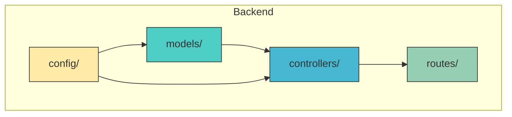
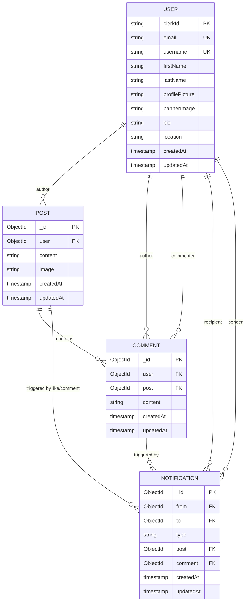

# Data Models & ORM Mapping

<cite>
**Referenced Files in This Document**   
- [user.model.js](file://backend/src/models/user.model.js)
- [post.model.js](file://backend/src/models/post.model.js)
- [comment.model.js](file://backend/src/models/comment.model.js)
- [notification.model.js](file://backend/src/models/notification.model.js)
- [user.controller.js](file://backend/src/controllers/user.controller.js)
- [post.controller.js](file://backend/src/controllers/post.controller.js)
</cite>

## Table of Contents
1. [Introduction](#introduction)
2. [Project Structure](#project-structure)
3. [Core Data Models](#core-data-models)
4. [Entity Relationships](#entity-relationships)
5. [Schema Details and Validation Rules](#schema-details-and-validation-rules)
6. [Indexes and Performance Optimization](#indexes-and-performance-optimization)
7. [Data Access Patterns](#data-access-patterns)
8. [Data Lifecycle and Cascade Behavior](#data-lifecycle-and-cascade-behavior)
9. [Sample Documents](#sample-documents)
10. [Conclusion](#conclusion)

## Introduction
This document provides comprehensive documentation for all MongoDB collections in the xClone application using the Mongoose Object-Relational Mapping (ORM) system. It details each data model's structure, field definitions, data types, default values, and validation constraints. The document also explains the relationships between entities such as users, posts, comments, and notifications, including one-to-many and many-to-many associations. Additionally, it covers indexing strategies, data access patterns, and lifecycle behaviors like cascading deletions. This documentation aims to serve both technical developers and stakeholders with limited technical background by providing clear explanations, visual diagrams, and real-world examples.

## Project Structure
The xClone project is organized into two main directories: `backend` and `mobile`. The backend, located in `backend/src`, follows a modular architecture with distinct folders for configuration, controllers, middleware, models, and routes. The data models are defined in the `models` directory and are implemented using Mongoose schemas. These models represent the core entities of the application: User, Post, Comment, and Notification. The controllers in the `controllers` directory interact with these models to handle business logic and API requests. The overall structure promotes separation of concerns, making the codebase maintainable and scalable.



**Diagram sources**
- [user.model.js](file://backend/src/models/user.model.js#L1-L63)
- [post.model.js](file://backend/src/models/post.model.js#L1-L36)
- [comment.model.js](file://backend/src/models/comment.model.js#L1-L32)
- [notification.model.js](file://backend/src/models/notification.model.js#L1-L36)

**Section sources**
- [user.model.js](file://backend/src/models/user.model.js#L1-L63)
- [post.model.js](file://backend/src/models/post.model.js#L1-L36)

## Core Data Models
The xClone application defines four primary data models using Mongoose: User, Post, Comment, and Notification. Each model corresponds to a MongoDB collection and encapsulates the structure and behavior of its respective entity. These models are designed to support social media functionality such as user profiles, content posting, engagement (likes, comments), and real-time notifications.

### User Model
The User model represents registered users of the application. It stores personal information, profile details, and social connections.

**Section sources**
- [user.model.js](file://backend/src/models/user.model.js#L1-L63)

### Post Model
The Post model represents content shared by users. Each post is associated with a user and may contain text, images, likes, and comments.

**Section sources**
- [post.model.js](file://backend/src/models/post.model.js#L1-L36)

### Comment Model
The Comment model represents user responses to posts. Each comment is linked to both a user and a specific post.

**Section sources**
- [comment.model.js](file://backend/src/models/comment.model.js#L1-L32)

### Notification Model
The Notification model tracks user interactions such as follows, likes, and comments. It supports polymorphic references to different types of activities.

**Section sources**
- [notification.model.js](file://backend/src/models/notification.model.js#L1-L36)

## Entity Relationships
The data models in xClone are interconnected through well-defined relationships that reflect real-world social media interactions. These relationships are implemented using MongoDB references (ObjectIds) and Mongoose population features.



**Diagram sources**
- [user.model.js](file://backend/src/models/user.model.js#L1-L63)
- [post.model.js](file://backend/src/models/post.model.js#L1-L36)
- [comment.model.js](file://backend/src/models/comment.model.js#L1-L32)
- [notification.model.js](file://backend/src/models/notification.model.js#L1-L36)

**Section sources**
- [user.model.js](file://backend/src/models/user.model.js#L1-L63)
- [post.model.js](file://backend/src/models/post.model.js#L1-L36)
- [comment.model.js](file://backend/src/models/comment.model.js#L1-L32)
- [notification.model.js](file://backend/src/models/notification.model.js#L1-L36)

## Schema Details and Validation Rules
Each Mongoose schema defines the structure, data types, validation rules, and default values for its corresponding MongoDB collection.

### User Schema
The User schema includes the following fields:

:clerkId:
- **Type**: String
- **Required**: Yes
- **Unique**: Yes
- **Description**: Unique identifier from Clerk authentication system

:email:
- **Type**: String
- **Required**: Yes
- **Unique**: Yes
- **Description**: User's email address

:firstName:
- **Type**: String
- **Required**: Yes
- **Description**: User's first name

:lastName:
- **Type**: String
- **Required**: Yes
- **Description**: User's last name

:username:
- **Type**: String
- **Required**: Yes
- **Unique**: Yes
- **Description**: Unique username for the user

:profilePicture:
- **Type**: String
- **Default**: Empty string
- **Description**: URL to user's profile picture

:bannerImage:
- **Type**: String
- **Default**: Empty string
- **Description**: URL to user's banner image

:bio:
- **Type**: String
- **Default**: Empty string
- **Max Length**: 160 characters
- **Description**: User's biography

:location:
- **Type**: String
- **Default**: Empty string
- **Description**: User's geographical location

:followers:
- **Type**: Array of ObjectIds
- **Reference**: User
- **Description**: List of users who follow this user

:following:
- **Type**: Array of ObjectIds
- **Reference**: User
- **Description**: List of users this user follows

**Section sources**
- [user.model.js](file://backend/src/models/user.model.js#L1-L63)

### Post Schema
The Post schema includes the following fields:

:user:
- **Type**: ObjectId
- **Reference**: User
- **Required**: Yes
- **Description**: Author of the post

:content:
- **Type**: String
- **Max Length**: 280 characters
- **Description**: Text content of the post

:image:
- **Type**: String
- **Default**: Empty string
- **Description**: URL to attached image

:likes:
- **Type**: Array of ObjectIds
- **Reference**: User
- **Description**: Users who liked this post

:comments:
- **Type**: Array of ObjectIds
- **Reference**: Comment
- **Description**: Comments on this post

**Section sources**
- [post.model.js](file://backend/src/models/post.model.js#L1-L36)

### Comment Schema
The Comment schema includes the following fields:

:user:
- **Type**: ObjectId
- **Reference**: User
- **Required**: Yes
- **Description**: Author of the comment

:post:
- **Type**: ObjectId
- **Reference**: Post
- **Required**: Yes
- **Description**: Post being commented on

:content:
- **Type**: String
- **Required**: Yes
- **Max Length**: 280 characters
- **Description**: Text content of the comment

:likes:
- **Type**: Array of ObjectIds
- **Reference**: User
- **Description**: Users who liked this comment

**Section sources**
- [comment.model.js](file://backend/src/models/comment.model.js#L1-L32)

### Notification Schema
The Notification schema includes the following fields:

:from:
- **Type**: ObjectId
- **Reference**: User
- **Required**: Yes
- **Description**: User who triggered the notification

:to:
- **Type**: ObjectId
- **Reference**: User
- **Required**: Yes
- **Description**: Target user receiving the notification

:type:
- **Type**: String
- **Required**: Yes
- **Enum**: ["follow", "like", "comment"]
- **Description**: Type of notification

:post:
- **Type**: ObjectId
- **Reference**: Post
- **Default**: null
- **Description**: Associated post (for like/comment notifications)

:comment:
- **Type**: ObjectId
- **Reference**: Comment
- **Default**: null
- **Description**: Associated comment (for comment notifications)

**Section sources**
- [notification.model.js](file://backend/src/models/notification.model.js#L1-L36)

## Indexes and Performance Optimization
Mongoose automatically creates indexes for fields marked with `unique: true`. In the User model, the following fields have unique indexes:

- :clerkId:
- :email:
- :username:

Additionally, the `timestamps: true` option creates indexes on `createdAt` and `updatedAt` fields for all models, enabling efficient time-based queries. The Post model's `user` field is frequently queried when retrieving a user's posts, so an index on this field would improve performance. Similarly, the Comment model's `post` field should be indexed to optimize retrieval of comments for a specific post. The Notification model's `to` field should be indexed to quickly fetch notifications for a particular user.

**Section sources**
- [user.model.js](file://backend/src/models/user.model.js#L1-L63)
- [post.model.js](file://backend/src/models/post.model.js#L1-L36)
- [comment.model.js](file://backend/src/models/comment.model.js#L1-L32)
- [notification.model.js](file://backend/src/models/notification.model.js#L1-L36)

## Data Access Patterns
The application uses Mongoose population to resolve references and retrieve related data in a single query.

### Populating User References
When retrieving posts, the application populates the `user` field to include the author's username, name, and profile picture:

```javascript
Post.find({ user: user._id })
  .populate("user", "username firstName lastName profilePicture")
  .populate({
    path: "comments",
    populate: {
      path: "user",
      select: "username firstName lastName profilePicture",
    },
  });
```

**Section sources**
- [post.controller.js](file://backend/src/controllers/post.controller.js#L38-L79)

### Filtering Notifications
Notifications are filtered by recipient (`to`) and can be further refined by type or associated content (post or comment). The polymorphic nature of the Notification model allows querying across different interaction types.

**Section sources**
- [notification.model.js](file://backend/src/models/notification.model.js#L1-L36)

## Data Lifecycle and Cascade Behavior
The current implementation does not define explicit cascade deletion rules in the Mongoose schemas. However, business logic in controllers should handle cleanup:

- When a Post is deleted, associated Comments and Notifications should also be removed.
- When a Comment is deleted, related Notifications should be cleaned up.
- When a User is deleted, all their Posts, Comments, and Notifications should be removed.

This cascade behavior should be implemented in service logic or using Mongoose middleware (e.g., `pre('remove')` hooks) to maintain data integrity.

**Section sources**
- [post.model.js](file://backend/src/models/post.model.js#L1-L36)
- [comment.model.js](file://backend/src/models/comment.model.js#L1-L32)
- [notification.model.js](file://backend/src/models/notification.model.js#L1-L36)

## Sample Documents
### Sample User Document
```json
{
  "_id": "60d5ecf3f1a2c34567890123",
  "clerkId": "user_123456789",
  "email": "john.doe@example.com",
  "firstName": "John",
  "lastName": "Doe",
  "username": "johndoe",
  "profilePicture": "https://example.com/images/john.jpg",
  "bannerImage": "https://example.com/images/banner.jpg",
  "bio": "Software developer passionate about open source.",
  "location": "San Francisco, CA",
  "followers": [
    "60d5ecf3f1a2c34567890124",
    "60d5ecf3f1a2c34567890125"
  ],
  "following": [
    "60d5ecf3f1a2c34567890126"
  ],
  "createdAt": "2023-06-25T10:00:00.000Z",
  "updatedAt": "2023-06-25T10:00:00.000Z"
}
```

### Sample Post Document
```json
{
  "_id": "60d5ecf3f1a2c34567890127",
  "user": "60d5ecf3f1a2c34567890123",
  "content": "Just finished building a new feature!",
  "image": "https://example.com/images/post1.jpg",
  "likes": [
    "60d5ecf3f1a2c34567890124",
    "60d5ecf3f1a2c34567890125"
  ],
  "comments": [
    "60d5ecf3f1a2c34567890128"
  ],
  "createdAt": "2023-06-25T11:00:00.000Z",
  "updatedAt": "2023-06-25T11:00:00.000Z"
}
```

### Sample Comment Document
```json
{
  "_id": "60d5ecf3f1a2c34567890128",
  "user": "60d5ecf3f1a2c34567890124",
  "post": "60d5ecf3f1a2c34567890127",
  "content": "Great work! Looking forward to trying it out.",
  "likes": [],
  "createdAt": "2023-06-25T11:05:00.000Z",
  "updatedAt": "2023-06-25T11:05:00.000Z"
}
```

### Sample Notification Document
```json
{
  "_id": "60d5ecf3f1a2c34567890129",
  "from": "60d5ecf3f1a2c34567890124",
  "to": "60d5ecf3f1a2c34567890123",
  "type": "comment",
  "post": "60d5ecf3f1a2c34567890127",
  "comment": "60d5ecf3f1a2c34567890128",
  "createdAt": "2023-06-25T11:05:00.000Z",
  "updatedAt": "2023-06-25T11:05:00.000Z"
}
```

**Section sources**
- [user.model.js](file://backend/src/models/user.model.js#L1-L63)
- [post.model.js](file://backend/src/models/post.model.js#L1-L36)
- [comment.model.js](file://backend/src/models/comment.model.js#L1-L32)
- [notification.model.js](file://backend/src/models/notification.model.js#L1-L36)

## Conclusion
The xClone application's data models are well-structured and effectively represent the core entities of a social media platform. The use of Mongoose ORM provides a robust foundation for data validation, relationship management, and query optimization. The relationships between users, posts, comments, and notifications accurately reflect social interactions, and the schema designs include appropriate validation rules and default values. To enhance data integrity, implementing cascade deletion logic would ensure that related documents are properly cleaned up when parent entities are removed. The current indexing strategy leverages unique constraints and timestamps, but additional indexes on frequently queried fields could further improve performance. Overall, the data model architecture is sound and scalable for future feature development.