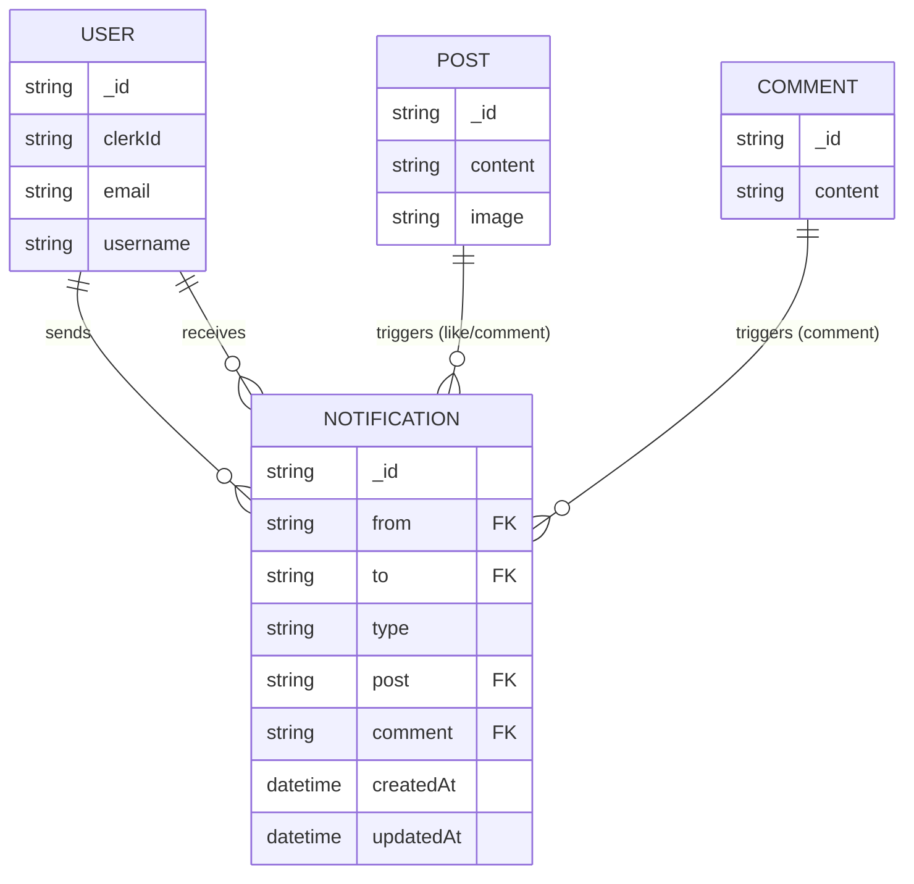
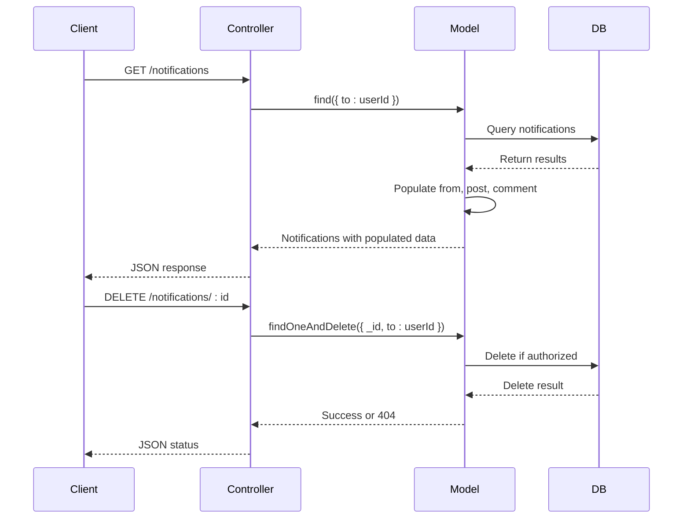

# Notification Model

<cite>
**Referenced Files in This Document**   
- [notification.model.js](file://backend/src/models/notification.model.js)
- [user.model.js](file://backend/src/models/user.model.js)
- [post.model.js](file://backend/src/models/post.model.js)
- [comment.model.js](file://backend/src/models/comment.model.js)
- [notification.controller.js](file://backend/src/controllers/notification.controller.js)
- [notification.route.js](file://backend/src/routes/notification.route.js)
</cite>

## Table of Contents
1. [Introduction](#introduction)
2. [Model Structure and Fields](#model-structure-and-fields)
3. [Polymorphic Relationship Pattern](#polymorphic-relationship-pattern)
4. [Validation Rules and Defaults](#validation-rules-and-defaults)
5. [Indexes and Query Performance](#indexes-and-query-performance)
6. [Data Access Patterns](#data-access-patterns)
7. [Sample Notification Documents](#sample-notification-documents)
8. [Retention and Deletion Strategy](#retention-and-deletion-strategy)
9. [Performance Considerations](#performance-considerations)
10. [Conclusion](#conclusion)

## Introduction
The Notification model in xClone is responsible for managing user-to-user notifications triggered by social interactions such as likes, comments, and follows. Built using Mongoose ORM on MongoDB, the model supports flexible referencing of various content types through a polymorphic design. This document provides a comprehensive overview of the model’s structure, relationships, validation rules, access patterns, and performance characteristics.

**Section sources**
- [notification.model.js](file://backend/src/models/notification.model.js#L1-L36)

## Model Structure and Fields
The Notification model defines the schema for storing user notifications with references to involved users and associated content. Below are the key fields and their descriptions:

**Label Structure Requirements**
- `_id`: ObjectId - Automatically generated unique identifier.
- `from`: ObjectId (ref: User) - The user who triggered the notification (e.g., liked a post).
- `to`: ObjectId (ref: User) - The recipient of the notification.
- `type`: String - The type of notification; must be one of: "follow", "like", "comment".
- `post`: ObjectId (ref: Post, optional) - Reference to a Post if the notification is related to a post.
- `comment`: ObjectId (ref: Comment, optional) - Reference to a Comment if applicable.
- `createdAt`: Date - Automatically generated timestamp when the notification is created.
- `updatedAt`: Date - Automatically updated timestamp on modification.

The schema leverages Mongoose’s `timestamps: true` option to auto-manage creation and update times.



**Diagram sources**
- [notification.model.js](file://backend/src/models/notification.model.js#L1-L36)
- [user.model.js](file://backend/src/models/user.model.js#L1-L63)
- [post.model.js](file://backend/src/models/post.model.js#L1-L36)
- [comment.model.js](file://backend/src/models/comment.model.js#L1-L32)

**Section sources**
- [notification.model.js](file://backend/src/models/notification.model.js#L1-L36)

## Polymorphic Relationship Pattern
The Notification model implements a polymorphic relationship pattern through optional references to different content types (`post`, `comment`). Instead of using a generic `targetId` and `targetType` pattern, xClone uses dedicated fields for each possible target:

- `post` field for notifications related to posts (e.g., like, comment)
- `comment` field for notifications involving comments (e.g., reply to a comment)

This approach simplifies querying and improves readability, as each notification clearly indicates which type of content it relates to via populated fields. It avoids the complexity of dynamic population based on `targetType`.

While not using a classic `targetId`/`targetType` pair, the design still achieves polymorphism by allowing one of several optional references to coexist in the same document.

**Section sources**
- [notification.model.js](file://backend/src/models/notification.model.js#L1-L36)

## Validation Rules and Defaults
The model enforces strict validation rules to ensure data integrity:

- `from` and `to` are required ObjectId references to the User model.
- `type` is required and must be one of: `"follow"`, `"like"`, `"comment"`.
- `post` and `comment` are optional and default to `null` when not provided.

No explicit `isRead` field is present in the current schema. However, read status could be inferred client-side or through external tracking. Future enhancements may include an `isRead` boolean field with a default value of `false`.

```javascript
// Example validation enforcement
{
  type: {
    type: String,
    required: true,
    enum: ["follow", "like", "comment"]
  },
  post: {
    type: mongoose.Schema.Types.ObjectId,
    ref: "Post",
    default: null
  },
  comment: {
    type: mongoose.Schema.Types.ObjectId,
    ref: "Comment",
    default: null
  }
}
```

**Section sources**
- [notification.model.js](file://backend/src/models/notification.model.js#L1-L36)

## Indexes and Query Performance
Currently, no explicit database indexes are defined in the schema. However, queries in the controller suggest the need for performance optimization:

- `getNotifications` fetches all notifications for a user (`to: user._id`) sorted by `createdAt` descending.
- This query would benefit from a compound index on `to` and `createdAt`.

Recommended index:
```javascript
notificationSchema.index({ to: 1, createdAt: -1 });
```

Such an index would significantly improve performance for inbox retrieval, especially as user notification volume grows.

**Section sources**
- [notification.model.js](file://backend/src/models/notification.model.js#L1-L36)
- [notification.controller.js](file://backend/src/controllers/notification.controller.js#L10-L20)

## Data Access Patterns
The primary data access patterns are implemented in the `notification.controller.js` file:

### Fetching Notifications
- **Endpoint**: `GET /api/notifications`
- Retrieves all notifications for the authenticated user.
- Populates sender (`from`) with basic user info.
- Optionally populates `post` (content, image) and `comment` (content) if present.
- Sorted by most recent first.

### Deleting Notifications
- **Endpoint**: `DELETE /api/notifications/:notificationId`
- Allows users to delete individual notifications.
- Validates ownership (`to: user._id`) before deletion.
- Uses `findOneAndDelete` for atomic removal.



**Diagram sources**
- [notification.controller.js](file://backend/src/controllers/notification.controller.js#L1-L36)
- [notification.route.js](file://backend/src/routes/notification.route.js#L1-L9)

**Section sources**
- [notification.controller.js](file://backend/src/controllers/notification.controller.js#L1-L36)

## Sample Notification Documents
Below are example JSON representations of notifications for each type:

### Follow Notification
```json
{
  "_id": "652f8e12c9e5402d1c8a3b12",
  "from": "652f8e12c9e5402d1c8a3a01",
  "to": "652f8e12c9e5402d1c8a3a02",
  "type": "follow",
  "post": null,
  "comment": null,
  "createdAt": "2023-10-18T14:22:10.123Z",
  "updatedAt": "2023-10-18T14:22:10.123Z"
}
```

### Like Notification
```json
{
  "_id": "652f8e12c9e5402d1c8a3b13",
  "from": "652f8e12c9e5402d1c8a3a03",
  "to": "652f8e12c9e5402d1c8a3a04",
  "type": "like",
  "post": "652f8e12c9e5402d1c8a3c01",
  "comment": null,
  "createdAt": "2023-10-18T14:25:30.456Z",
  "updatedAt": "2023-10-18T14:25:30.456Z"
}
```

### Comment Notification
```json
{
  "_id": "652f8e12c9e5402d1c8a3b14",
  "from": "652f8e12c9e5402d1c8a3a05",
  "to": "652f8e12c9e5402d1c8a3a06",
  "type": "comment",
  "post": "652f8e12c9e5402d1c8a3c02",
  "comment": "652f8e12c9e5402d1c8a3d01",
  "createdAt": "2023-10-18T14:30:15.789Z",
  "updatedAt": "2023-10-18T14:30:15.789Z"
}
```

**Section sources**
- [notification.model.js](file://backend/src/models/notification.model.js#L1-L36)

## Retention and Deletion Strategy
xClone implements a **hard-delete** strategy for notifications:

- Notifications are permanently removed upon user deletion via the `DELETE /notifications/:id` endpoint.
- No soft-delete mechanism (e.g., `isDeleted` flag) is currently in place.
- There is no automated retention policy or TTL index for automatic cleanup.

This approach keeps the database clean but offers no recovery option. For high-volume applications, consider implementing:
- A soft-delete pattern with `deletedAt` timestamp.
- A background job to purge soft-deleted notifications after a grace period.
- A TTL index on `createdAt` for automatic expiration (e.g., 90 days).

**Section sources**
- [notification.controller.js](file://backend/src/controllers/notification.controller.js#L22-L35)

## Performance Considerations
The Notification model must handle high-frequency writes during peak user activity (e.g., viral posts). Key performance considerations include:

- **Indexing**: As mentioned, a compound index on `to` and `createdAt` is critical for fast inbox queries.
- **Population Overhead**: Populating `from`, `post`, and `comment` increases query load. Consider selective population based on client needs.
- **Write Scalability**: MongoDB handles high write throughput well, but sharding by `to` (recipient) could distribute load in large-scale deployments.
- **Read Optimization**: For unread counts, consider caching in Redis or adding a lightweight aggregation pipeline.

Future improvements could include:
- Adding an `isRead` field with an index for filtering unread notifications.
- Implementing pagination (`limit`/`skip` or cursor-based) in the API.
- Using change streams or WebSocket updates for real-time delivery.

**Section sources**
- [notification.model.js](file://backend/src/models/notification.model.js#L1-L36)
- [notification.controller.js](file://backend/src/controllers/notification.controller.js#L10-L20)

## Conclusion
The Notification model in xClone effectively supports core social interactions through a clean, polymorphic schema design. It leverages Mongoose relationships and population to deliver rich notification data to clients. While the current implementation lacks explicit indexing and read-status tracking, it provides a solid foundation for scalable notification management. Strategic additions like proper indexing, soft-delete support, and performance optimizations will enhance reliability and user experience as the platform grows.