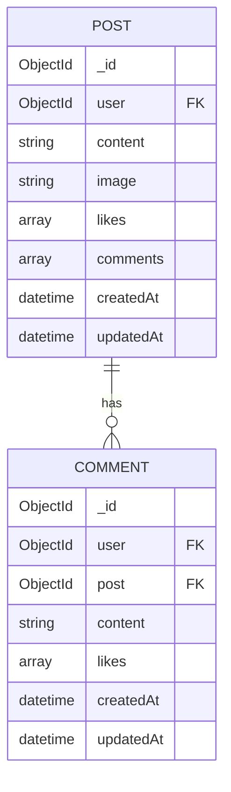
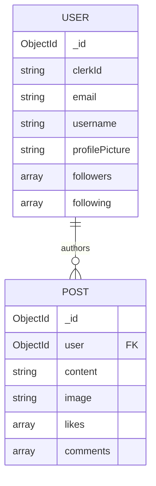
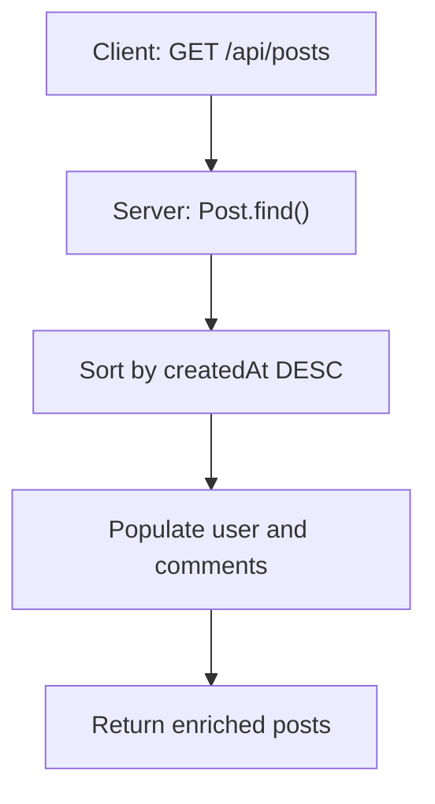
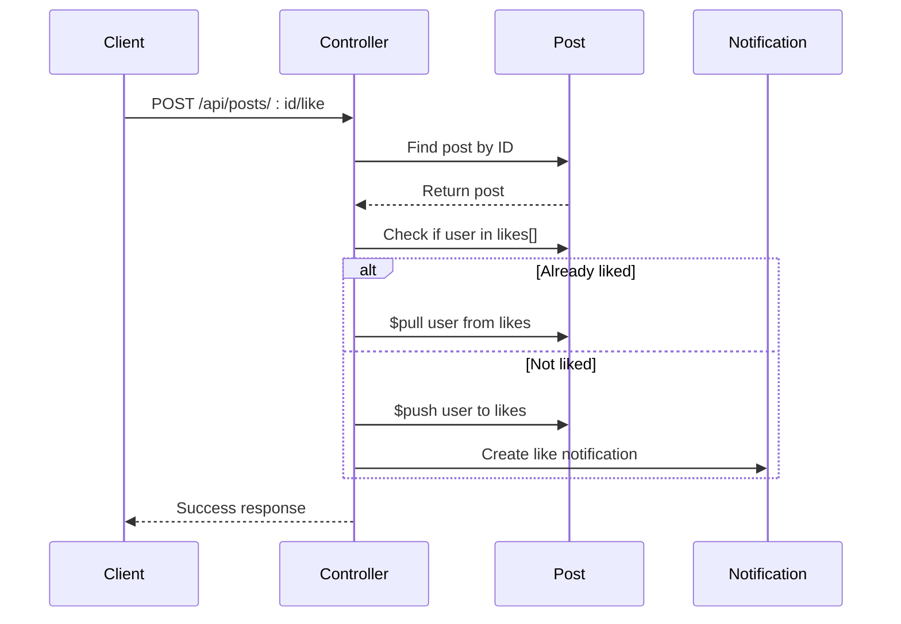

# Post Model

<cite>
**Referenced Files in This Document**   
- [post.model.js](file://backend/src/models/post.model.js#L1-L37)
- [comment.model.js](file://backend/src/models/comment.model.js#L1-L33)
- [user.model.js](file://backend/src/models/user.model.js#L1-L64)
- [post.controller.js](file://backend/src/controllers/post.controller.js#L1-L159)
- [post.route.js](file://backend/src/routes/post.route.js)
</cite>

## Table of Contents
1. [Introduction](#introduction)
2. [Schema Definition](#schema-definition)
3. [Field Specifications](#field-specifications)
4. [Relationships](#relationships)
5. [Data Access Patterns](#data-access-patterns)
6. [Mutations and Business Logic](#mutations-and-business-logic)
7. [Deletion Behavior](#deletion-behavior)
8. [Image Handling and Validation](#image-handling-and-validation)
9. [Performance Considerations](#performance-considerations)
10. [Sample Document](#sample-document)

## Introduction
The Post model in xClone is a central component of the social media application, representing user-generated content such as text posts and image uploads. Built using Mongoose ORM for MongoDB, this model supports core social features including likes, comments, and media sharing. It integrates tightly with the User and Comment models to enable rich interactions. This document provides a comprehensive overview of the model's structure, relationships, behavior, and usage patterns.

**Section sources**
- [post.model.js](file://backend/src/models/post.model.js#L1-L37)

## Schema Definition
The Post model is defined using Mongoose’s Schema constructor with strict type enforcement and automatic timestamp generation.

```javascript
const postSchema = new mongoose.Schema(
  {
    user: {
      type: mongoose.Schema.Types.ObjectId,
      ref: "User",
      required: true,
    },
    content: {
      type: String,
      maxLength: 280,
    },
    image: {
      type: String,
      default: "",
    },
    likes: [
      {
        type: mongoose.Schema.Types.ObjectId,
        ref: "User",
      },
    ],
    comments: [
      {
        type: mongoose.Schema.Types.ObjectId,
        ref: "Comment",
      },
    ],
  },
  { timestamps: true }
);
```

The `{ timestamps: true }` option automatically adds `createdAt` and `updatedAt` fields, eliminating the need for manual date tracking.

**Section sources**
- [post.model.js](file://backend/src/models/post.model.js#L1-L37)

## Field Specifications
Each field in the Post schema is designed with specific constraints and defaults to ensure data integrity and usability.

### Field Details
- **_id**: Automatically generated ObjectId by MongoDB. Serves as the primary key.
- **user**: 
  - *Type*: `ObjectId`
  - *Reference*: `User` model
  - *Constraint*: Required
  - *Purpose*: Identifies the author of the post
- **content**:
  - *Type*: `String`
  - *Max Length*: 280 characters
  - *Default*: Empty string
  - *Purpose*: Stores the textual content of the post (optional if image is present)
- **image**:
  - *Type*: `String`
  - *Default*: Empty string
  - *Purpose*: Stores the Cloudinary URL of the uploaded image
- **likes**:
  - *Type*: Array of `ObjectId`
  - *Reference*: `User` model
  - *Purpose*: Tracks users who have liked the post
- **comments**:
  - *Type*: Array of `ObjectId`
  - *Reference*: `Comment` model
  - *Purpose*: References all comments associated with the post
- **createdAt**:
  - *Type*: `Date`
  - *Auto-generated*: Yes
  - *Purpose*: Timestamp of post creation
- **updatedAt**:
  - *Type*: `Date`
  - *Auto-generated*: Yes
  - *Purpose*: Timestamp of last modification

**Section sources**
- [post.model.js](file://backend/src/models/post.model.js#L1-L37)

## Relationships
The Post model establishes several key relationships that define the social interaction model of xClone.

### One-to-Many: Post to Comment
Each post can have multiple comments. This relationship is maintained via the `comments` array in the Post schema, which stores ObjectIds referencing the Comment model.



**Diagram sources**
- [post.model.js](file://backend/src/models/post.model.js#L1-L37)
- [comment.model.js](file://backend/src/models/comment.model.js#L1-L33)

### One-to-Many: Post to Like
Likes are modeled as a direct reference from Post to User via the `likes` array. Each entry is an ObjectId pointing to a User document.

### Many-to-One: Post to User (Author)
The `user` field creates a many-to-one relationship where multiple posts can belong to a single user. The `ref: "User"` enables Mongoose population.



**Diagram sources**
- [post.model.js](file://backend/src/models/post.model.js#L1-L37)
- [user.model.js](file://backend/src/models/user.model.js#L1-L64)

## Data Access Patterns
The application retrieves posts using population to resolve referenced data, ensuring efficient and complete payloads.

### Retrieving Posts with Population
The `getPosts` controller method fetches all posts sorted by creation time (newest first), populating:
- Author details (`username`, `firstName`, `lastName`, `profilePicture`)
- Comments with their respective authors

```javascript
const posts = await Post.find()
  .sort({ createdAt: -1 })
  .populate("user", "username firstName lastName profilePicture")
  .populate({
    path: "comments",
    populate: {
      path: "user",
      select: "username firstName lastName profilePicture",
    },
  });
```

This nested population enables frontend rendering of fully enriched post cards without additional queries.

**Section sources**
- [post.controller.js](file://backend/src/controllers/post.controller.js#L5-L15)

### Indexing for Timeline Queries
Although no explicit index is defined in the schema, MongoDB automatically creates an index on `createdAt` due to the frequent sorting operation in feed queries. For production scaling, an explicit compound index on `{ createdAt: -1 }` should be considered.



**Diagram sources**
- [post.controller.js](file://backend/src/controllers/post.controller.js#L5-L15)

## Mutations and Business Logic
Key mutations include creating posts, liking posts, and deleting posts, each with specific logic and side effects.

### Create Post
Handles both text and image posts:
- Validates presence of content or image
- Uploads image to Cloudinary if provided
- Stores secure URL in `image` field
- Associates post with authenticated user via `clerkId`

Image transformation includes resizing (800x600), auto quality, and format optimization.

### Like/Unlike Toggle
Implemented via `likePost` controller:
- Checks if user already liked the post using `includes()`
- Uses `$pull` to remove like or `$push` to add like
- Generates a notification if liking someone else’s post



**Diagram sources**
- [post.controller.js](file://backend/src/controllers/post.controller.js#L100-L135)

**Section sources**
- [post.controller.js](file://backend/src/controllers/post.controller.js#L100-L135)

## Deletion Behavior
Post deletion follows a cascade pattern to maintain data consistency.

### Cascade Delete of Comments
When a post is deleted, all associated comments are explicitly removed using `Comment.deleteMany({ post: postId })`. This prevents orphaned comment documents and ensures referential integrity.

```javascript
await Comment.deleteMany({ post: postId });
await Post.findByIdAndDelete(postId);
```

This logic is enforced in the `deletePost` controller and requires the requesting user to be the post author.

**Section sources**
- [post.controller.js](file://backend/src/controllers/post.controller.js#L140-L159)

## Image Handling and Validation
Images are processed and validated before persistence to ensure quality and security.

### Upload Process
1. Image file received via multipart form
2. Converted to base64 data URL
3. Uploaded to Cloudinary with transformations:
   - Size limit: 800x600 pixels
   - Auto quality optimization
   - Auto format (WebP, JPEG, etc.)
4. Secure HTTPS URL stored in `image` field

No client-side validation is performed; the backend ensures only valid images are stored. Empty string is used as default when no image is provided.

**Section sources**
- [post.controller.js](file://backend/src/controllers/post.controller.js#L60-L95)

## Performance Considerations
While the current design works well for moderate loads, several optimizations can enhance scalability.

### Query Optimization
- **Population Overhead**: Nested population of comments and their users may become slow with high comment volume. Consider limiting comment count per post or paginating comments.
- **Indexing**: Add a compound index on `{ user: 1, createdAt: -1 }` for efficient user feed queries.
- **Denormalization**: For high-read scenarios, consider storing comment count and like count as fields on the Post model to avoid array length calculations.

### Scalability Recommendations
- Implement caching (Redis) for popular posts
- Use aggregation pipelines for complex queries
- Offload image processing to background workers if load increases

## Sample Document
Below is an example of a fully populated Post document as returned by the API:

```json
{
  "_id": "64a1b2c3d4e5f6a7b8c9d0e1",
  "user": {
    "_id": "64a1b2c3d4e5f6a7b8c9d0e0",
    "username": "johndoe",
    "firstName": "John",
    "lastName": "Doe",
    "profilePicture": "https://res.cloudinary.com/social-media/posts/profiles/john123.jpg"
  },
  "content": "Hello world from xClone!",
  "image": "https://res.cloudinary.com/social-media/posts/media/abc123.jpg",
  "likes": [
    "64a1b2c3d4e5f6a7b8c9d0e2",
    "64a1b2c3d4e5f6a7b8c9d0e3"
  ],
  "comments": [
    {
      "_id": "64a1b2c3d4e5f6a7b8c9d0f0",
      "user": {
        "_id": "64a1b2c3d4e5f6a7b8c9d0e2",
        "username": "janedoe",
        "firstName": "Jane",
        "lastName": "Doe",
        "profilePicture": "https://res.cloudinary.com/social-media/posts/profiles/jane456.jpg"
      },
      "content": "Great post!",
      "likes": [],
      "createdAt": "2024-07-01T10:00:00.000Z",
      "updatedAt": "2024-07-01T10:00:00.000Z"
    }
  ],
  "createdAt": "2024-07-01T09:30:00.000Z",
  "updatedAt": "2024-07-01T09:30:00.000Z"
}
```

This structure reflects the fully populated response used by the frontend to render posts with author and comment details.

**Section sources**
- [post.controller.js](file://backend/src/controllers/post.controller.js#L5-L15)
- [post.model.js](file://backend/src/models/post.model.js#L1-L37)