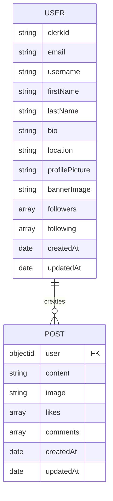
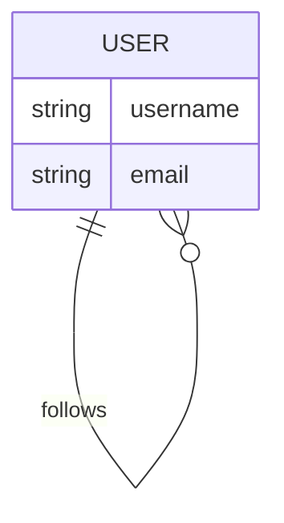
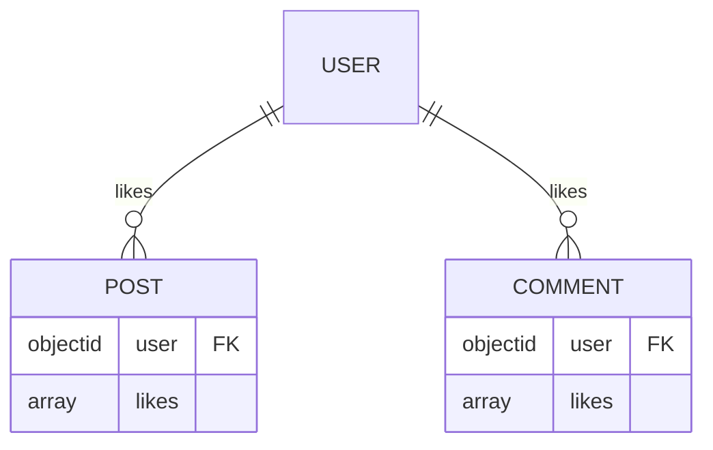
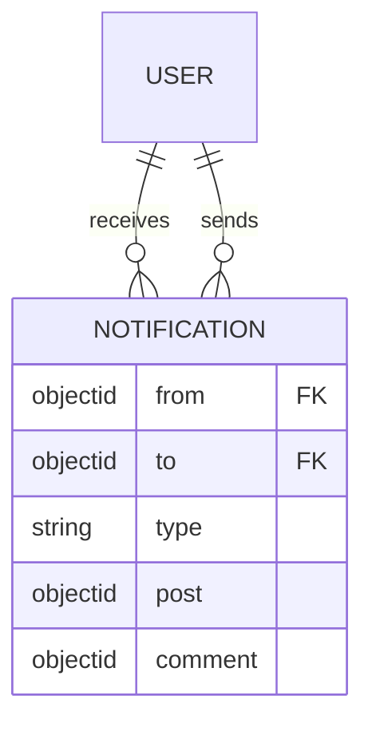

# User Model

<cite>
**Referenced Files in This Document**   
- [user.model.js](file://backend/src/models/user.model.js)
- [post.model.js](file://backend/src/models/post.model.js)
- [comment.model.js](file://backend/src/models/comment.model.js)
- [notification.model.js](file://backend/src/models/notification.model.js)
</cite>

## Table of Contents
1. [User Model](#user-model)
2. [Field Specifications](#field-specifications)
3. [Relationships and Cardinalities](#relationships-and-cardinalities)
4. [Schema Options and Indexing](#schema-options-and-indexing)
5. [Data Population Across Models](#data-population-across-models)
6. [Sample JSON Output](#sample-json-output)
7. [Data Lifecycle and Deletion Considerations](#data-lifecycle-and-deletion-considerations)

## Field Specifications

The User model is defined using Mongoose ORM and represents a user entity in the xClone application. Each field is structured with specific data types, validation rules, defaults, and constraints.

### Field Details

- **clerkId**
  - *Type*: String
  - *Required*: Yes
  - *Unique*: Yes
  - *Description*: External authentication identifier from Clerk, used to uniquely identify users without relying on internal IDs.

- **email**
  - *Type*: String
  - *Required*: Yes
  - *Unique*: Yes
  - *Description*: The user's email address, required for login and communication. Must be unique across the system.

- **firstName**
  - *Type*: String
  - *Required*: Yes
  - *Description*: The user's first name as provided during registration.

- **lastName**
  - *Type*: String
  - *Required*: Yes
  - *Description*: The user's last name as provided during registration.

- **username**
  - *Type*: String
  - *Required*: Yes
  - *Unique*: Yes
  - *Description*: A unique handle chosen by the user for identification and mentions. Enforced at the database level.

- **profilePicture**
  - *Type*: String
  - *Default*: ""
  - *Description*: URL to the user's profile image hosted externally (e.g., Cloudinary). Optional field.

- **bannerImage**
  - *Type*: String
  - *Default*: ""
  - *Description*: URL to the user's profile banner image. Optional field.

- **bio**
  - *Type*: String
  - *Default*: ""
  - *Max Length*: 160 characters
  - *Description*: Short biography or description of the user, similar to social media bios.

- **location**
  - *Type*: String
  - *Default*: ""
  - *Description*: Geographic location specified by the user (e.g., city, country).

- **followers**
  - *Type*: Array of ObjectId references
  - *Reference*: User
  - *Description*: List of users who follow this user. Implements many-to-many follower relationships.

- **following**
  - *Type*: Array of ObjectId references
  - *Reference*: User
  - *Description*: List of users that this user follows. Paired with followers for bidirectional social graph.

- **createdAt**
  - *Type*: Date
  - *Auto-generated*: Yes (via timestamps)
  - *Description*: Timestamp of when the user record was created.

- **updatedAt**
  - *Type*: Date
  - *Auto-generated*: Yes (via timestamps)
  - *Description*: Timestamp of the last update to the user record.

**Section sources**
- [user.model.js](file://backend/src/models/user.model.js#L1-L63)

## Relationships and Cardinalities

The User model participates in several key relationships across the application, forming the backbone of the social networking functionality.

### One-to-Many: User to Posts
Each user can create multiple posts. This relationship is defined in the Post model where the `user` field references the User model.



**Diagram sources**
- [user.model.js](file://backend/src/models/user.model.js#L1-L63)
- [post.model.js](file://backend/src/models/post.model.js#L1-L36)

### Many-to-Many: Followers/Following
The `followers` and `following` arrays implement a symmetric many-to-many relationship between users. Each entry is an ObjectId referencing another User document.

This design allows:
- Efficient querying of who a user follows
- Fast lookup of a user's followers
- Support for social features like feed generation



**Diagram sources**
- [user.model.js](file://backend/src/models/user.model.js#L1-L63)

### One-to-Many: User to Likes (via Posts and Comments)
Users can like both posts and comments. The `likes` array in both Post and Comment models references the User model.



**Diagram sources**
- [post.model.js](file://backend/src/models/post.model.js#L1-L36)
- [comment.model.js](file://backend/src/models/comment.model.js#L1-L32)
- [user.model.js](file://backend/src/models/user.model.js#L1-L63)

### One-to-Many: User to Notifications
Notifications are sent from one user (`from`) to another (`to`). The Notification model contains two references to the User model.



**Diagram sources**
- [notification.model.js](file://backend/src/models/notification.model.js#L1-L36)
- [user.model.js](file://backend/src/models/user.model.js#L1-L63)

## Schema Options and Indexing

The User schema uses the `{ timestamps: true }` option, which automatically adds `createdAt` and `updatedAt` fields to each document.

While no explicit indexes are defined in the schema code, Mongoose automatically creates unique indexes for fields marked with `unique: true`:
- `clerkId`
- `email`
- `username`

These ensure data integrity and support fast lookups during authentication and profile access.

Additionally, MongoDB implicitly creates an index on `_id`, which is used for all primary document retrieval operations.

**Section sources**
- [user.model.js](file://backend/src/models/user.model.js#L1-L63)

## Data Population Across Models

When retrieving user-related data, Mongoose's `populate()` method is used to replace ObjectId references with actual document data.

For example:
- Fetching a Post with `populate('user')` returns the full User object instead of just the ID
- Retrieving a Comment with `populate('likes')` includes details of users who liked it
- Getting a Notification with `populate('from')` shows sender information

This enables rich, relational-like queries in the otherwise schema-less MongoDB environment.

**Section sources**
- [post.model.js](file://backend/src/models/post.model.js#L1-L36)
- [comment.model.js](file://backend/src/models/comment.model.js#L1-L32)
- [notification.model.js](file://backend/src/models/notification.model.js#L1-L36)

## Sample JSON Output

Below is an example of a fully populated user document as it might appear in API responses:

```json
{
  "_id": "652f8e21b9b7c8d1a0c9d8e7",
  "clerkId": "user_2abc123xyz",
  "email": "jane.doe@example.com",
  "firstName": "Jane",
  "lastName": "Doe",
  "username": "jane_doe",
  "profilePicture": "https://res.cloudinary.com/dxclone/image/upload/v1234567890/profiles/jane.jpg",
  "bannerImage": "https://res.cloudinary.com/dxclone/image/upload/v1234567890/banners/jane_banner.jpg",
  "bio": "Software developer and open-source enthusiast.",
  "location": "San Francisco, CA",
  "followers": [
    {
      "_id": "652f8e21b9b7c8d1a0c9d8e8",
      "username": "john_smith",
      "firstName": "John",
      "lastName": "Smith",
      "profilePicture": "https://res.cloudinary.com/dxclone/image/upload/v1234567890/profiles/john.jpg"
    }
  ],
  "following": [
    {
      "_id": "652f8e21b9b7c8d1a0c9d8e9",
      "username": "alice_wonder",
      "firstName": "Alice",
      "lastName": "Wonder",
      "profilePicture": "https://res.cloudinary.com/dxclone/image/upload/v1234567890/profiles/alice.jpg"
    }
  ],
  "createdAt": "2023-10-18T08:45:22.123Z",
  "updatedAt": "2023-10-19T14:30:11.456Z"
}
```

**Section sources**
- [user.model.js](file://backend/src/models/user.model.js#L1-L63)

## Data Lifecycle and Deletion Considerations

Currently, the schema does not define automatic cascade deletion. If a user is deleted:

- Posts created by the user remain but lose reference integrity unless handled at the application level
- Comments by the user persist in threads
- Likes from the user remain on posts and comments
- Notifications involving the user are retained

To maintain data consistency, application-level cleanup logic should be implemented in the user controller, potentially including:
- Setting `user` fields to null in Post, Comment, and Notification models
- Removing the user from other users' `followers` and `following` arrays
- Deleting associated likes

Alternatively, soft deletion (marking `active: false`) is recommended to preserve social graph integrity while deactivating accounts.

**Section sources**
- [user.model.js](file://backend/src/models/user.model.js#L1-L63)
- [post.model.js](file://backend/src/models/post.model.js#L1-L36)
- [comment.model.js](file://backend/src/models/comment.model.js#L1-L32)
- [notification.model.js](file://backend/src/models/notification.model.js#L1-L36)