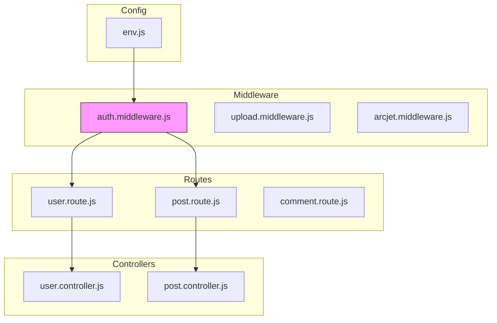
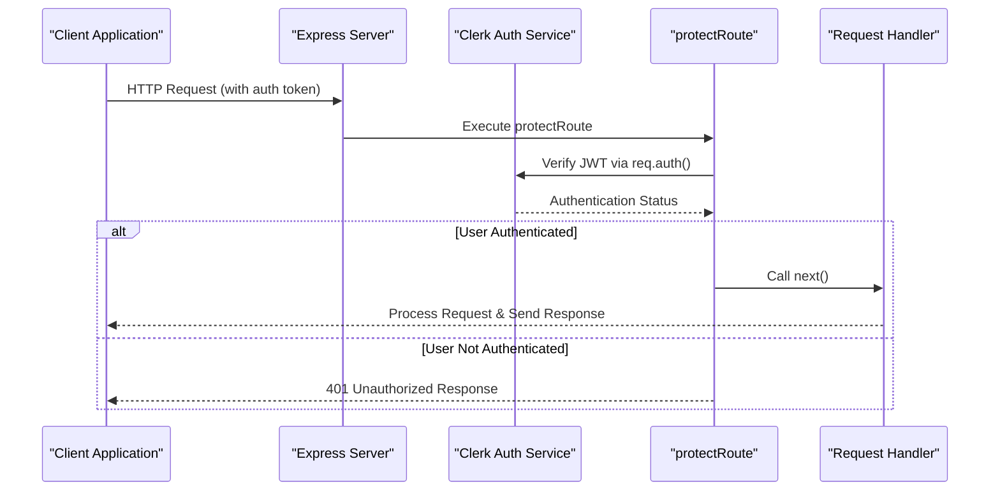
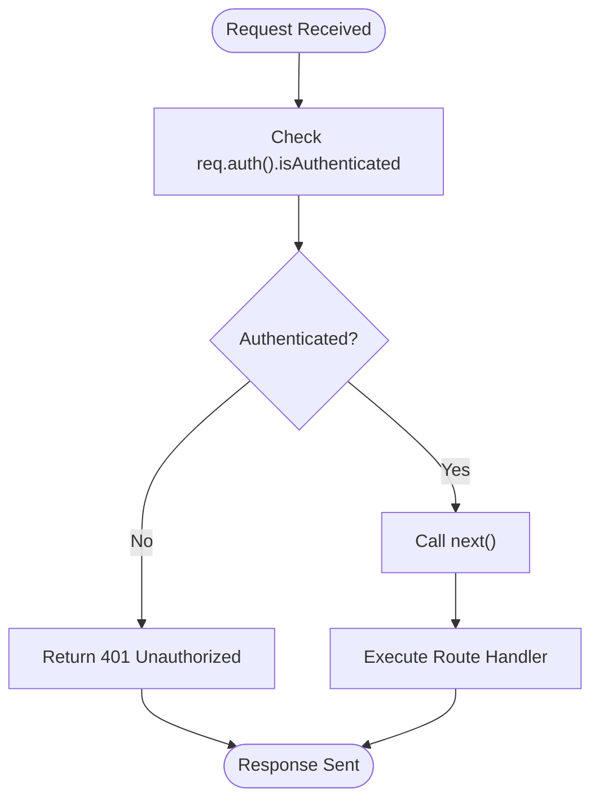
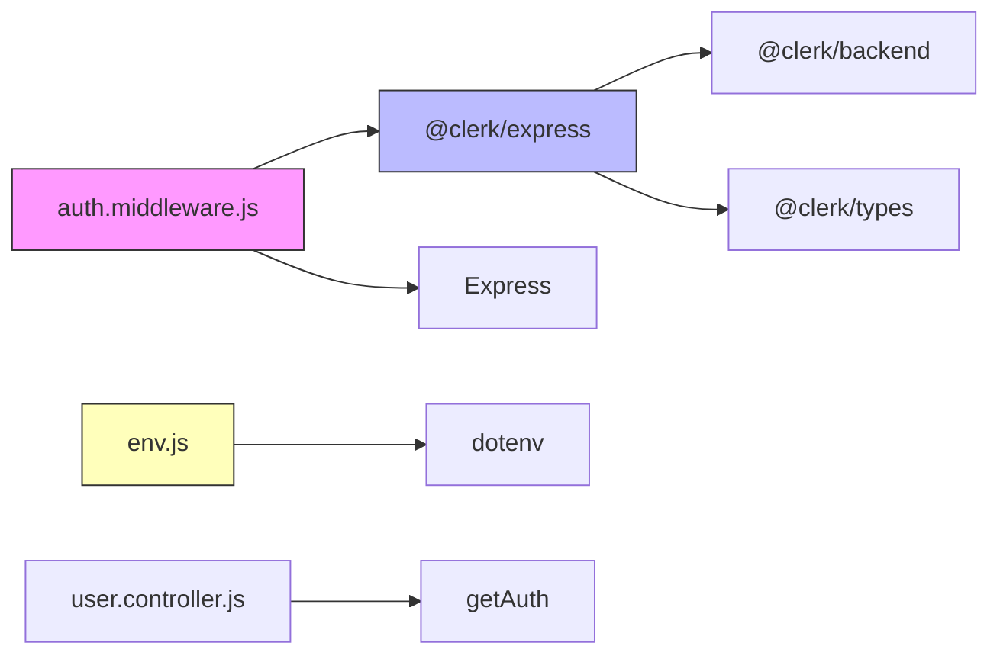

# Authentication Middleware

<cite>
**Referenced Files in This Document**   
- [auth.middleware.js](file://backend/src/middleware/auth.middleware.js#L1-L9)
- [user.route.js](file://backend/src/routes/user.route.js#L1-L19)
- [post.route.js](file://backend/src/routes/post.route.js#L1-L22)
- [env.js](file://backend/src/config/env.js#L1-L15)
- [user.controller.js](file://backend/src/controllers/user.controller.js#L1-L70)
- [package.json](file://backend/package.json#L1-L25)
</cite>

## Table of Contents
1. [Introduction](#introduction)
2. [Project Structure](#project-structure)
3. [Core Components](#core-components)
4. [Architecture Overview](#architecture-overview)
5. [Detailed Component Analysis](#detailed-component-analysis)
6. [Dependency Analysis](#dependency-analysis)
7. [Performance Considerations](#performance-considerations)
8. [Troubleshooting Guide](#troubleshooting-guide)
9. [Conclusion](#conclusion)

## Introduction
This document provides a comprehensive analysis of the authentication middleware implementation in the xClone backend system. It details how the `auth.middleware.js` file integrates with Clerk's authentication service to secure API endpoints, validate user sessions, and attach authenticated user context to incoming HTTP requests. The middleware plays a critical role in enforcing access control across protected routes in the application.

## Project Structure
The xClone project follows a modular backend architecture with clear separation of concerns. The authentication middleware resides in the `backend/src/middleware/` directory, alongside other middleware components. It is consumed by route handlers in the `routes/` directory and interacts with controllers and configuration files.



**Diagram sources**
- [auth.middleware.js](file://backend/src/middleware/auth.middleware.js#L1-L9)
- [user.route.js](file://backend/src/routes/user.route.js#L1-L19)
- [post.route.js](file://backend/src/routes/post.route.js#L1-L22)
- [env.js](file://backend/src/config/env.js#L1-L15)

**Section sources**
- [auth.middleware.js](file://backend/src/middleware/auth.middleware.js#L1-L9)
- [user.route.js](file://backend/src/routes/user.route.js#L1-L19)

## Core Components
The core component of the authentication system is the `protectRoute` middleware function, which intercepts incoming requests and verifies user authentication status using Clerk's session management system. This function is exported and reused across multiple route files to protect sensitive endpoints.

```javascript
export const protectRoute = async (req, res, next) => {
  if (!req.auth().isAuthenticated) {
    return res.status(401).json({
      message: "Unauthorized - you must be logged in",
    });
  }
  next();
};
```

This middleware leverages the `req.auth()` method provided by the `@clerk/express` integration to access authentication state directly from the request object. If the user is not authenticated, a 401 Unauthorized response is returned immediately.

**Section sources**
- [auth.middleware.js](file://backend/src/middleware/auth.middleware.js#L1-L9)

## Architecture Overview
The authentication architecture follows a layered security model where Clerk handles identity verification and session management, while the Express middleware enforces route-level access control.



**Diagram sources**
- [auth.middleware.js](file://backend/src/middleware/auth.middleware.js#L1-L9)
- [user.route.js](file://backend/src/routes/user.route.js#L1-L19)

## Detailed Component Analysis

### Authentication Middleware Implementation
The `protectRoute` middleware serves as a gatekeeper for protected API endpoints. It uses Clerk's Express integration to extract and validate the JSON Web Token (JWT) from incoming requests.

#### Key Functionality
- **Authentication Verification**: Checks `req.auth().isAuthenticated` property to determine login status
- **Early Termination**: Returns 401 response immediately for unauthenticated requests
- **Request Continuation**: Calls `next()` to proceed to the target route handler when authenticated

#### Code Flow


**Diagram sources**
- [auth.middleware.js](file://backend/src/middleware/auth.middleware.js#L1-L9)

**Section sources**
- [auth.middleware.js](file://backend/src/middleware/auth.middleware.js#L1-L9)

### Route Protection Examples
The `protectRoute` middleware is applied to specific routes in both user and post route handlers.

#### User Routes Protection
```javascript
router.post("/sync", protectRoute, syncUser);
router.post("/me", protectRoute, getCurrentUser);
router.put("/profile", protectRoute, updateProfile);
router.post("/follow/:targetUserId", protectRoute, followUser);
```

#### Post Routes Protection
```javascript
router.post("/", protectRoute, upload.single("image"), createPosts);
router.post("/:postId/like", protectRoute, likePost);
router.delete("/:postId", protectRoute, deletePost);
```

These examples show how the middleware is chained before controller functions to ensure only authenticated users can perform actions like creating posts, liking content, or updating profiles.

**Section sources**
- [user.route.js](file://backend/src/routes/user.route.js#L1-L19)
- [post.route.js](file://backend/src/routes/post.route.js#L1-L22)

### Environment Configuration
Authentication behavior is configured through environment variables defined in `env.js`.

```javascript
export const ENV = {
    CLERK_PUBLISHABLE_KEY: process.env.CLERK_PUBLISHABLE_KEY,
    CLERK_SECRET_KEY: process.env.CLERK_SECRET_KEY,
    // other config...
}
```

The `CLERK_SECRET_KEY` is particularly important as it enables the server to verify JWT tokens issued by Clerk. This key must be kept secure and never exposed client-side.

**Section sources**
- [env.js](file://backend/src/config/env.js#L1-L15)

### User Context Extraction
Controllers extract the authenticated user ID using Clerk's `getAuth()` utility:

```javascript
const { userId } = getAuth(req);
const user = await User.findOne({ clerkId: userId });
```

This pattern is used consistently across protected controllers to associate actions with the correct user account stored in the application database.

**Section sources**
- [user.controller.js](file://backend/src/controllers/user.controller.js#L32-L70)

## Dependency Analysis
The authentication system relies on several key dependencies managed through npm.



**Diagram sources**
- [package.json](file://backend/package.json#L1-L25)
- [auth.middleware.js](file://backend/src/middleware/auth.middleware.js#L1-L9)
- [env.js](file://backend/src/config/env.js#L1-L15)

## Performance Considerations
The authentication middleware introduces minimal overhead as token verification is handled efficiently by Clerk's SDK. The `req.auth()` call performs synchronous JWT validation without additional network requests in most cases, making it suitable for high-throughput APIs. However, developers should be aware that:
- Each protected route incurs JWT verification cost
- Network latency may occur during token refresh scenarios
- Proper caching strategies should be considered for frequently accessed authenticated data

## Troubleshooting Guide
Common authentication issues and their solutions:

| Issue | Cause | Solution |
|-------|-------|----------|
| 401 Unauthorized errors | Missing or invalid authentication token | Ensure client sends proper Authorization header or session cookie |
| Token expiration | JWT lifetime exceeded | Implement token refresh logic in client application |
| Session invalidation | User signed out or session revoked | Handle 401 responses gracefully with re-authentication flow |
| Configuration errors | Incorrect CLERK_SECRET_KEY | Verify environment variables are correctly set |
| Route protection bypass | Middleware not applied to route | Double-check route definitions include `protectRoute` |

Debugging tips:
- Log `req.auth()` output during development to inspect authentication state
- Verify `CLERK_SECRET_KEY` matches the one in Clerk dashboard
- Check browser developer tools for token transmission issues
- Test endpoints with Postman or curl to isolate client-side problems

**Section sources**
- [auth.middleware.js](file://backend/src/middleware/auth.middleware.js#L1-L9)
- [env.js](file://backend/src/config/env.js#L1-L15)

## Conclusion
The authentication middleware in xClone provides a robust and reusable mechanism for securing API routes using Clerk's authentication system. By centralizing authentication logic in the `protectRoute` function, the application maintains consistent security policies across all protected endpoints. The integration with environment configuration and controller-level user context extraction creates a seamless authentication experience. Future enhancements could include role-based access control by extending the middleware to check user permissions in addition to authentication status.