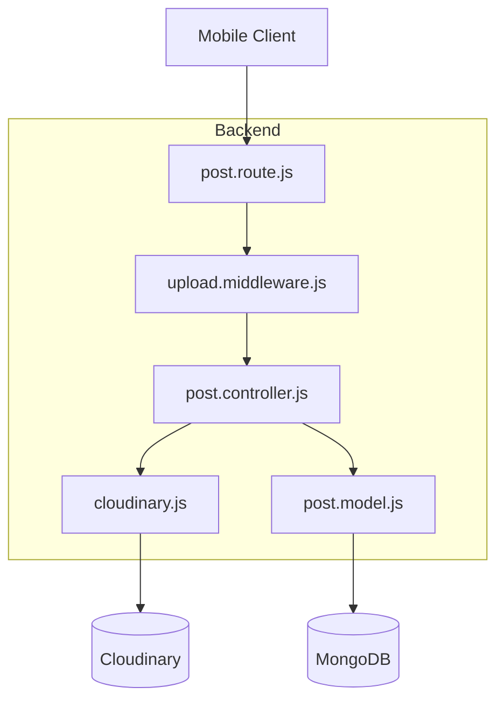
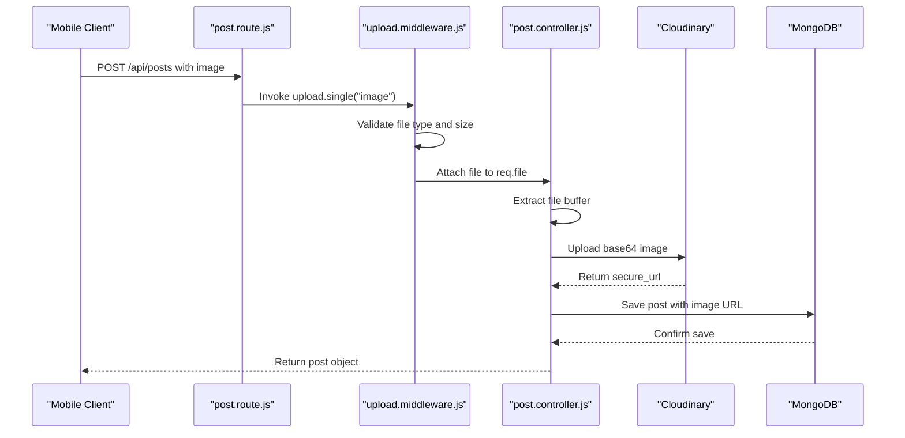
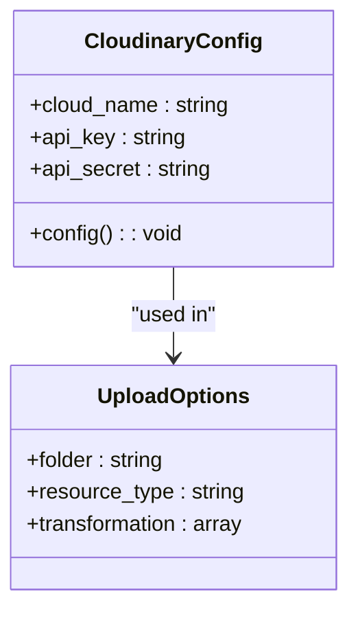
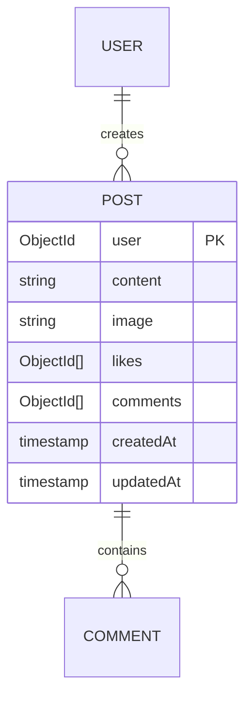
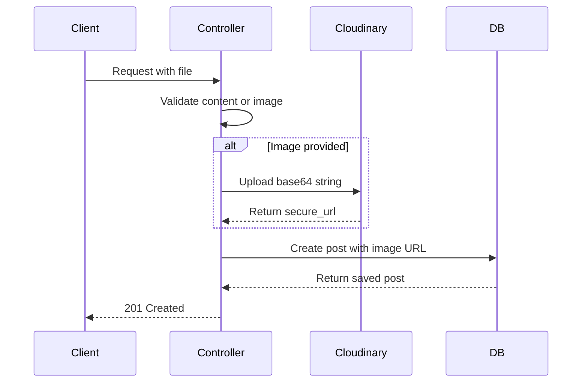
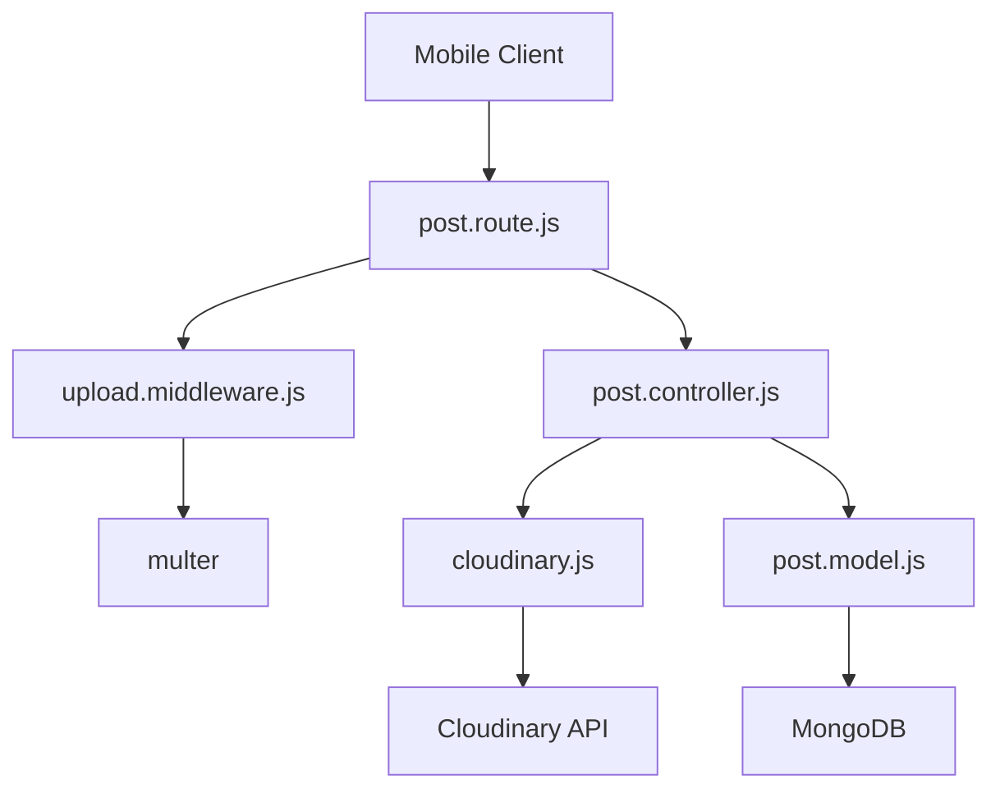

# File Upload Middleware

<cite>
**Referenced Files in This Document**   
- [upload.middleware.js](file://backend/src/middleware/upload.middleware.js)
- [cloudinary.js](file://backend/src/config/cloudinary.js)
- [post.model.js](file://backend/src/models/post.model.js)
- [post.route.js](file://backend/src/routes/post.route.js)
- [post.controller.js](file://backend/src/controllers/post.controller.js)
</cite>

## Table of Contents
1. [Introduction](#introduction)
2. [Project Structure](#project-structure)
3. [Core Components](#core-components)
4. [Architecture Overview](#architecture-overview)
5. [Detailed Component Analysis](#detailed-component-analysis)
6. [Dependency Analysis](#dependency-analysis)
7. [Performance Considerations](#performance-considerations)
8. [Troubleshooting Guide](#troubleshooting-guide)
9. [Conclusion](#conclusion)

## Introduction
This document provides a comprehensive analysis of the file upload processing pipeline in xClone, focusing on the integration of Multer middleware, Cloudinary media handling, and MongoDB persistence. It details the flow from mobile client image selection to secure storage and URL persistence in the database. The system is designed to handle image uploads during post creation with robust validation, transformation, and error handling.

## Project Structure
The xClone project follows a modular backend architecture with clear separation of concerns. The backend is organized into configuration, controllers, middleware, models, and routes. The file upload functionality is distributed across these layers, with specific responsibilities assigned to each component.



**Diagram sources**
- [upload.middleware.js](file://backend/src/middleware/upload.middleware.js#L1-L21)
- [cloudinary.js](file://backend/src/config/cloudinary.js#L1-L10)
- [post.model.js](file://backend/src/models/post.model.js#L1-L36)
- [post.route.js](file://backend/src/routes/post.route.js#L1-L21)
- [post.controller.js](file://backend/src/controllers/post.controller.js#L1-L158)

**Section sources**
- [upload.middleware.js](file://backend/src/middleware/upload.middleware.js#L1-L21)
- [post.route.js](file://backend/src/routes/post.route.js#L1-L21)

## Core Components
The file upload pipeline consists of five core components that work together to process image uploads:
- **upload.middleware.js**: Handles multipart form data and validates file uploads
- **cloudinary.js**: Configures Cloudinary SDK for media storage and transformation
- **post.model.js**: Defines MongoDB schema with image URL field
- **post.route.js**: Integrates middleware into Express route
- **post.controller.js**: Processes upload and persists data

These components form a cohesive pipeline from client request to database persistence.

**Section sources**
- [upload.middleware.js](file://backend/src/middleware/upload.middleware.js#L1-L21)
- [cloudinary.js](file://backend/src/config/cloudinary.js#L1-L10)
- [post.model.js](file://backend/src/models/post.model.js#L1-L36)
- [post.route.js](file://backend/src/routes/post.route.js#L1-L21)
- [post.controller.js](file://backend/src/controllers/post.controller.js#L1-L158)

## Architecture Overview
The file upload architecture follows a layered approach with clear data flow from client to storage. The process begins with the mobile client sending a multipart/form-data request containing image data. The Express server routes this request through middleware before processing in the controller.



**Diagram sources**
- [upload.middleware.js](file://backend/src/middleware/upload.middleware.js#L1-L21)
- [post.route.js](file://backend/src/routes/post.route.js#L15-L21)
- [post.controller.js](file://backend/src/controllers/post.controller.js#L77-L123)
- [cloudinary.js](file://backend/src/config/cloudinary.js#L1-L10)
- [post.model.js](file://backend/src/models/post.model.js#L1-L36)

## Detailed Component Analysis

### Upload Middleware Analysis
The upload middleware uses Multer to handle multipart form data, specifically configured for image uploads in the post creation process.


**Diagram sources**
- [upload.middleware.js](file://backend/src/middleware/upload.middleware.js#L1-L21)

#### Configuration Details
The middleware is configured with three key parameters:

**Storage Configuration**
- :storage: memoryStorage - Files are stored in memory as Buffer objects
- :benefit: Eliminates disk I/O operations
- :use_case: Ideal for immediate processing and cloud upload

**File Validation**
- :fileFilter: Custom function that validates image file types
- :validation_rule: Only files with mimetype starting with "image/" are accepted
- :error_handling: Returns error "Only image files are allowed" for invalid types

**Size Limits**
- :fileSize: 5 * 1024 * 1024 bytes (5MB)
- :purpose: Prevents excessively large file uploads
- :implementation: Native Multer limits option

**Section sources**
- [upload.middleware.js](file://backend/src/middleware/upload.middleware.js#L1-L21)

### Cloudinary Integration
The Cloudinary configuration establishes a secure connection between the backend and Cloudinary's media platform.



**Diagram sources**
- [cloudinary.js](file://backend/src/config/cloudinary.js#L1-L10)
- [post.controller.js](file://backend/src/controllers/post.controller.js#L77-L123)

#### Configuration Parameters
The Cloudinary SDK is initialized with environment variables for security:

**Connection Settings**
- :cloud_name: ENV.CLOUDINARY_CLOUD_NAME - Cloudinary account identifier
- :api_key: ENV.CLOUDINARY_API_KEY - Authentication key
- :api_secret: ENV.CLOUDINARY_API_SECRET - Secure authentication secret

**Upload Transformations**
- :folder: "social_media_posts" - Organizational folder in Cloudinary
- :resource_type: "image" - Specifies media type
- :transformation: Array of processing instructions:
  - :resize: { width: 800, height: 600, crop: "limit" } - Resizes while maintaining aspect ratio
  - :quality: "auto" - Optimizes file size without visible quality loss
  - :format: "auto" - Delivers optimal format (WebP, JPEG, etc.) based on browser

**Section sources**
- [cloudinary.js](file://backend/src/config/cloudinary.js#L1-L10)
- [post.controller.js](file://backend/src/controllers/post.controller.js#L77-L123)

### Post Model Structure
The post model defines the MongoDB schema that stores post data including image references.



**Diagram sources**
- [post.model.js](file://backend/src/models/post.model.js#L1-L36)

#### Schema Fields
The post schema includes specific fields for image handling:

**Image Field**
- :field: image
- :type: String
- :default: "" (empty string)
- :purpose: Stores Cloudinary secure URL

**Content Constraints**
- :content: maxLength 280 characters (similar to tweet length)
- :user: Required ObjectId reference to User collection
- :timestamps: Automatically managed createdAt and updatedAt fields

**Section sources**
- [post.model.js](file://backend/src/models/post.model.js#L1-L36)

### Route Integration
The post route integrates the upload middleware into the Express routing system.

```mermaid
flowchart TD
A[POST /api/posts] --> B[protectRoute]
B --> C[upload.single("image")]
C --> D[createPosts]
D --> E[Validate content or image]
E --> F[Upload to Cloudinary if image]
F --> G[Save to MongoDB]
G --> H[Return response]
```

**Diagram sources**
- [post.route.js](file://backend/src/routes/post.route.js#L1-L21)
- [post.controller.js](file://backend/src/controllers/post.controller.js#L38-L79)

#### Middleware Chain
The route employs a specific execution order:

**Authentication**
- :protectRoute: Ensures user is authenticated before processing

**File Upload**
- :upload.single("image"): Processes multipart data, expects field named "image"
- :memory_storage: File stored in memory as Buffer

**Controller Processing**
- :createPosts: Handles business logic and database operations

**Section sources**
- [post.route.js](file://backend/src/routes/post.route.js#L1-L21)

### Controller Processing Flow
The post controller manages the complete upload workflow from request to response.



**Diagram sources**
- [post.controller.js](file://backend/src/controllers/post.controller.js#L38-L123)

#### Processing Steps
The createPosts controller method follows a structured flow:

**Request Validation**
- :content_check: Ensures either text content or image is provided
- :user_validation: Confirms user exists in database

**Image Processing**
- :buffer_conversion: Converts file buffer to base64 data URL
- :cloudinary_upload: Sends to Cloudinary with transformations
- :error_handling: Catches upload failures and returns 400 status

**Database Persistence**
- :post_creation: Saves post with image URL from Cloudinary
- :response: Returns 201 status with created post object

**Section sources**
- [post.controller.js](file://backend/src/controllers/post.controller.js#L38-L123)

## Dependency Analysis
The file upload system has well-defined dependencies between components.



**Diagram sources**
- [post.route.js](file://backend/src/routes/post.route.js#L1-L21)
- [upload.middleware.js](file://backend/src/middleware/upload.middleware.js#L1-L21)
- [post.controller.js](file://backend/src/controllers/post.controller.js#L1-L158)
- [cloudinary.js](file://backend/src/config/cloudinary.js#L1-L10)
- [post.model.js](file://backend/src/models/post.model.js#L1-L36)

## Performance Considerations
The current implementation includes several performance optimizations:

**Image Optimization**
- :auto_format: Cloudinary delivers optimal image format based on browser capabilities
- :auto_quality: Balances file size and visual quality
- :resizing: Images are limited to 800x600 pixels, reducing bandwidth usage

**Memory Efficiency**
- :memory_storage: Multer stores files in memory, avoiding disk I/O
- :stream_processing: Files are processed immediately without temporary storage

**Recommendations for Further Optimization**
- :compression: Implement client-side image compression before upload
- :caching: Use Cloudinary's CDN caching for frequently accessed images
- :lazy_loading: Implement lazy loading for images in the mobile client
- :thumbnails: Generate and serve smaller thumbnails for list views

## Troubleshooting Guide
Common issues and their solutions in the file upload pipeline:

**File Type Errors**
- :symptom: "Only image files are allowed" error
- :cause: Non-image file uploaded or incorrect mimetype
- :solution: Ensure file is image format (JPEG, PNG, etc.)

**Size Limit Exceeded**
- :symptom: Upload fails without specific error
- :cause: File exceeds 5MB limit
- :solution: Compress image or implement chunked uploads

**Cloudinary Upload Failures**
- :symptom: "Failed to upload image" response
- :cause: Network issues or invalid Cloudinary credentials
- :solution: Check environment variables and network connectivity

**Missing Image Field**
- :symptom: Upload succeeds but no image saved
- :cause: Form field name not "image"
- :solution: Ensure mobile client uses "image" as field name

**Authentication Issues**
- :symptom: 401 Unauthorized errors
- :cause: Missing or invalid authentication token
- :solution: Ensure protectRoute middleware receives valid token

**Section sources**
- [upload.middleware.js](file://backend/src/middleware/upload.middleware.js#L1-L21)
- [post.controller.js](file://backend/src/controllers/post.controller.js#L38-L123)

## Conclusion
The xClone file upload pipeline provides a robust solution for handling image uploads in social media posts. By leveraging Multer for request processing, Cloudinary for media optimization, and MongoDB for data persistence, the system efficiently handles the complete upload workflow. The architecture demonstrates proper separation of concerns, with each component focusing on specific responsibilities. Security is maintained through file validation, size limits, and environment-based credential management. Performance is optimized through Cloudinary's transformation features and memory-based file handling. This implementation serves as a solid foundation for scalable media handling in social applications.