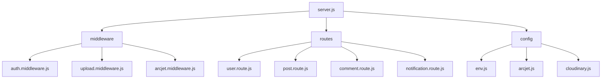
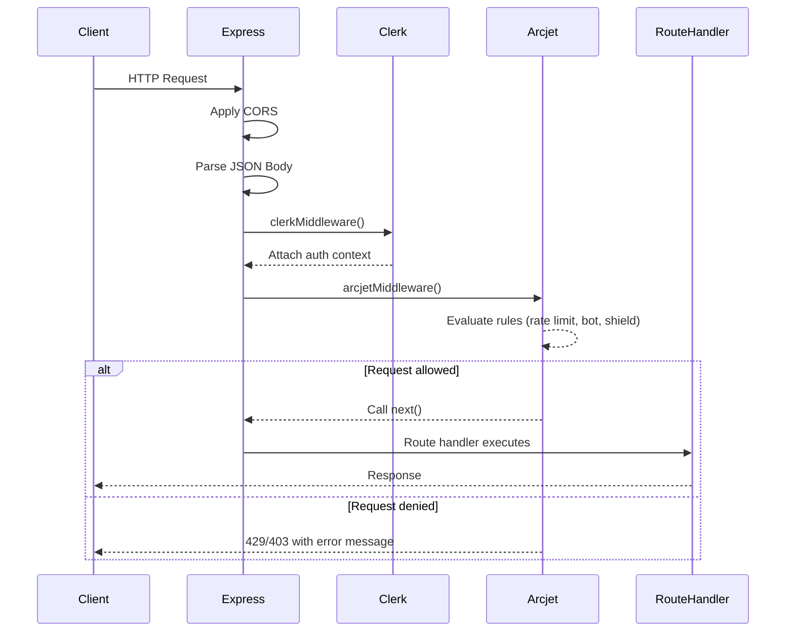

# Middleware & Security

<cite>
**Referenced Files in This Document**   
- [auth.middleware.js](file://backend/src/middleware/auth.middleware.js)
- [upload.middleware.js](file://backend/src/middleware/upload.middleware.js)
- [arcjet.middleware.js](file://backend/src/middleware/arcjet.middleware.js)
- [arcjet.js](file://backend/src/config/arcjet.js)
- [env.js](file://backend/src/config/env.js)
- [server.js](file://backend/src/server.js)
</cite>

## Table of Contents
1. [Introduction](#introduction)
2. [Project Structure](#project-structure)
3. [Core Middleware Components](#core-middleware-components)
4. [Security Configuration](#security-configuration)
5. [Middleware Integration in Request Lifecycle](#middleware-integration-in-request-lifecycle)
6. [Data Flow and Execution Order](#data-flow-and-execution-order)
7. [Error Handling and Resilience](#error-handling-and-resilience)
8. [Security Best Practices](#security-best-practices)
9. [Conclusion](#conclusion)

## Introduction
This document provides a comprehensive overview of the middleware and security infrastructure in xClone's backend system. It details the implementation and integration of custom middleware for authentication, file upload handling, and bot protection. The architecture leverages Clerk for JWT-based authentication, Multer for multipart form data processing, and Arcjet for rate limiting and threat detection. These components are orchestrated within an Express.js application to ensure secure, scalable, and resilient API operations.

## Project Structure
The backend of xClone follows a modular structure organized by functional concerns. The key directories include:
- `config`: Environment and service configuration (e.g., database, Arcjet, Cloudinary)
- `controllers`: Business logic for handling requests
- `middleware`: Custom request processing logic
- `models`: Data schema definitions using Mongoose
- `routes`: API endpoint definitions
- `server.js`: Application entry point

This separation enables maintainable and testable code with clear responsibilities.



**Diagram sources**
- [server.js](file://backend/src/server.js#L1-L48)
- [middleware](file://backend/src/middleware/)
- [config](file://backend/src/config/)

## Core Middleware Components

### Authentication Middleware
The `auth.middleware.js` file implements a route protection mechanism using Clerk's JWT authentication. It checks whether a user is authenticated before allowing access to protected endpoints.

```javascript
export const protectRoute = async (req, res, next) => {
  if (!req.auth().isAuthenticated) {
    return res.status(401).json({
      message: "Unauthorized-you must be logged in",
    });
  }
  next();
};
```

This middleware is designed to be used selectively on sensitive routes such as profile updates or post creation.

**Section sources**
- [auth.middleware.js](file://backend/src/middleware/auth.middleware.js#L1-L8)

### File Upload Middleware
The `upload.middleware.js` configures Multer to handle image uploads with strict validation rules:

- **Storage**: Files are stored in memory to facilitate direct upload to Cloudinary
- **File Type Filter**: Only MIME types starting with `image/` are accepted
- **Size Limit**: Maximum file size of 5MB enforced per upload

```javascript
const upload = multer({
  storage: storage,
  fileFilter: fileFilter,
  limits: { fileSize: 5 * 1024 * 1024 }, // 5MB limit
});
```

This configuration prevents abuse through large payloads and ensures only valid image content is processed.

**Section sources**
- [upload.middleware.js](file://backend/src/middleware/upload.middleware.js#L1-L21)

### Rate Limiting and Bot Protection Middleware
The `arcjet.middleware.js` integrates Arcjet for automated security enforcement. It evaluates each request against predefined rules and responds accordingly when violations occur.

Key behaviors:
- **Rate Limiting**: Returns 429 status when token bucket is exhausted
- **Bot Detection**: Blocks non-search engine bots with 403 status
- **Spoofed Bot Detection**: Identifies and denies requests from disguised malicious bots
- **Fail-Open Policy**: Allows requests to proceed if Arcjet service fails

```javascript
if (decision.isDenied()) {
  if (decision.reason.isRateLimit()) {
    return res.status(429).json({ error: "Too Many Requests" });
  } else if (decision.reason.isBot()) {
    return res.status(403).json({ error: "Bot access denied" });
  }
}
```

The middleware gracefully degrades by calling `next()` on internal errors, ensuring availability.

**Section sources**
- [arcjet.middleware.js](file://backend/src/middleware/arcjet.middleware.js#L1-L45)

## Security Configuration

### Environment Management
The `env.js` file centralizes environment variables using dotenv, providing fallbacks where appropriate:

```javascript
export const ENV = {
    PORT: process.env.PORT || 5001,
    MONGO_URI: process.env.MONGO_URI,
    ARCJET_KEY: process.env.ARCJET_KEY,
    CLOUDINARY_CLOUD_NAME: process.env.CLOUDINARY_CLOUD_NAME,
    // ... other secrets
}
```

This pattern prevents hardcoded credentials and supports multiple deployment environments.

**Section sources**
- [env.js](file://backend/src/config/env.js#L1-L15)

### Arcjet Security Rules
The `arcjet.js` configuration defines a multi-layered defense strategy:

1. **Shield**: Protects against common web attacks (SQLi, XSS, CSRF)
2. **Bot Detection**: Allows only search engine crawlers; blocks others
3. **Rate Limiting**: Token bucket algorithm with:
   - Refill rate: 10 tokens every 10 seconds
   - Maximum capacity: 15 tokens

```javascript
tokenBucket({
  mode: "LIVE",
  refillRate: 10,
  interval: 10,
  capacity: 15,
})
```

All rules operate in "LIVE" mode, actively enforcing policies rather than just monitoring.

**Section sources**
- [arcjet.js](file://backend/src/config/arcjet.js#L1-L30)

## Middleware Integration in Request Lifecycle

In `server.js`, middleware is applied globally in a specific order that aligns with the Express request processing pipeline:

```javascript
app.use(cors());
app.use(express.json());
app.use(clerkMiddleware());
app.use(arcjetMiddleware);
```

Execution order:
1. CORS headers applied
2. JSON body parsing
3. Clerk authentication context established
4. Arcjet security checks performed
5. Route-specific handlers executed

Sensitive routes like `/api/users` and `/api/posts` inherit this stack, while file upload endpoints can further apply the Multer middleware locally.

**Section sources**
- [server.js](file://backend/src/server.js#L1-L48)

## Data Flow and Execution Order



**Diagram sources**
- [server.js](file://backend/src/server.js#L10-L20)
- [arcjet.middleware.js](file://backend/src/middleware/arcjet.middleware.js#L1-L45)

## Error Handling and Resilience
The application includes a global error handler that catches unhandled exceptions:

```javascript
app.use((err, req, res, next) => {
  console.error("Unhandled error:", err);
  res.status(500).json({ error: err.message || "Internal server error" });
});
```

Additionally, the Arcjet middleware employs a fail-open approach—any failure in the security check does not block the request, prioritizing service availability over strict enforcement during outages.

This strategy balances security with reliability, especially important for public-facing services.

**Section sources**
- [server.js](file://backend/src/server.js#L25-L29)

## Security Best Practices
xClone implements several industry-standard security practices:

- **Environment Isolation**: Sensitive credentials loaded via environment variables
- **Input Validation**: Multer filters restrict file types and sizes
- **Automated Threat Detection**: Arcjet shields against bots and common attacks
- **Rate Limiting**: Prevents brute-force and DDoS attempts
- **Authentication Enforcement**: JWT-based session management via Clerk
- **Error Sanitization**: Generic error messages prevent information leakage

These layers collectively reduce the attack surface and improve system robustness.

## Conclusion
The middleware and security architecture of xClone demonstrates a thoughtful, layered approach to building secure web applications. By leveraging specialized tools like Clerk and Arcjet, and applying well-defined configurations for file uploads and environment management, the backend achieves a strong security posture without sacrificing developer experience. The modular design allows for easy updates and monitoring, making it suitable for production deployment at scale.