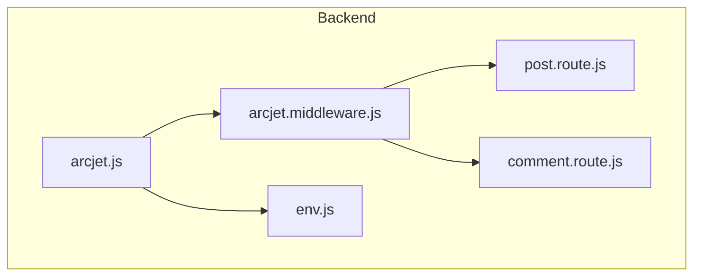
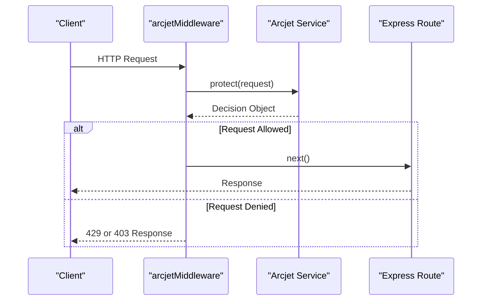
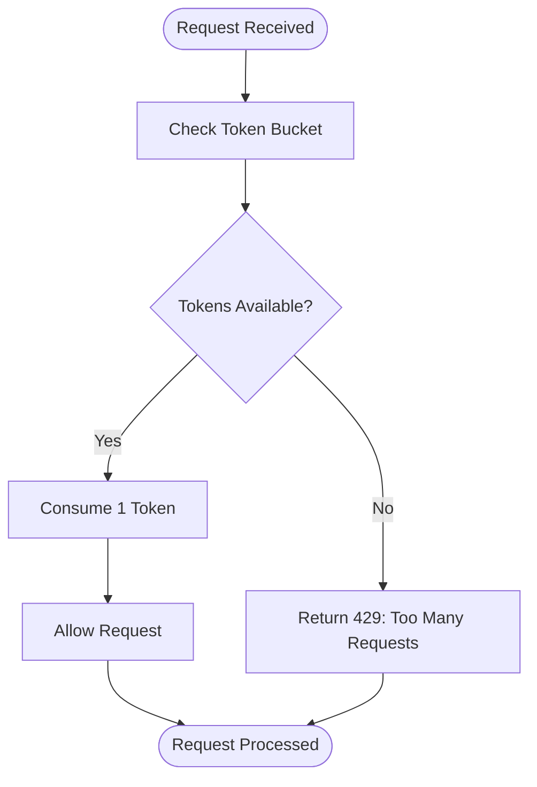
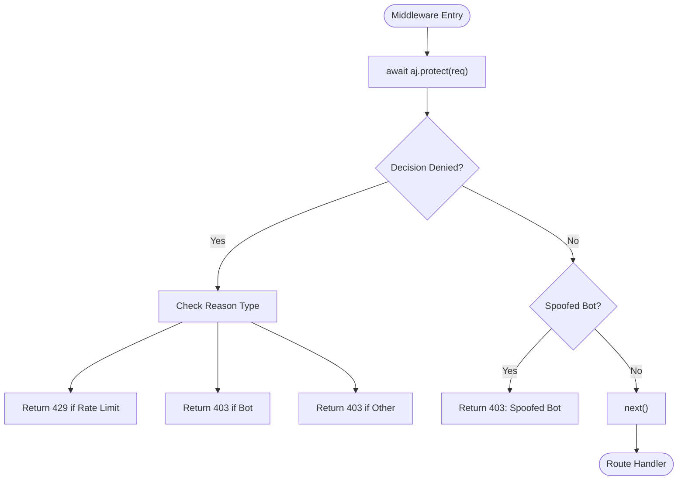
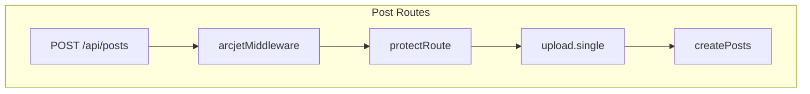

# Rate Limiting & Bot Protection

<cite>
**Referenced Files in This Document**   
- [arcjet.js](file://backend/src/config/arcjet.js#L1-L30)
- [arcjet.middleware.js](file://backend/src/middleware/arcjet.middleware.js#L1-L45)
- [post.route.js](file://backend/src/routes/post.route.js#L1-L22)
- [comment.route.js](file://backend/src/routes/comment.route.js#L1-L16)
- [env.js](file://backend/src/config/env.js#L1-L15)
- [package-lock.json](file://backend/package-lock.json#L39-L168)
</cite>

## Table of Contents
1. [Introduction](#introduction)
2. [Project Structure](#project-structure)
3. [Core Components](#core-components)
4. [Architecture Overview](#architecture-overview)
5. [Detailed Component Analysis](#detailed-component-analysis)
6. [Dependency Analysis](#dependency-analysis)
7. [Performance Considerations](#performance-considerations)
8. [Troubleshooting Guide](#troubleshooting-guide)
9. [Conclusion](#conclusion)

## Introduction
This document provides a comprehensive overview of the Arcjet-based security layer implemented in xClone, focusing on rate limiting and bot protection mechanisms. The system is designed to prevent abuse of API endpoints by enforcing request throttling, detecting malicious bots, and shielding against common web attacks. The integration with Express routes ensures that high-traffic or suspicious requests are handled gracefully with appropriate HTTP responses. This documentation explains the configuration, middleware logic, integration points, and operational considerations for maintaining a secure and resilient backend.

## Project Structure
The xClone project is structured into two main directories: `backend` and `mobile`. The security implementation is located in the `backend/src` directory, specifically within the `config`, `middleware`, and `routes` folders. The Arcjet configuration resides in `config/arcjet.js`, while the middleware logic is defined in `middleware/arcjet.middleware.js`. Protected routes are defined in individual route files such as `post.route.js` and `comment.route.js`.



**Diagram sources**
- [arcjet.js](file://backend/src/config/arcjet.js#L1-L30)
- [arcjet.middleware.js](file://backend/src/middleware/arcjet.middleware.js#L1-L45)
- [post.route.js](file://backend/src/routes/post.route.js#L1-L22)
- [comment.route.js](file://backend/src/routes/comment.route.js#L1-L16)

**Section sources**
- [arcjet.js](file://backend/src/config/arcjet.js#L1-L30)
- [arcjet.middleware.js](file://backend/src/middleware/arcjet.middleware.js#L1-L45)

## Core Components
The core components of the Arcjet security layer include:
- **Arcjet Configuration**: Defined in `arcjet.js`, it initializes the Arcjet instance with specific rules for rate limiting, bot detection, and attack shielding.
- **Middleware Handler**: Implemented in `arcjet.middleware.js`, this function intercepts incoming requests and applies the configured security policies.
- **Environment Integration**: The `env.js` file provides access to environment variables, including the `ARCJET_KEY` required for authentication with the Arcjet service.

**Section sources**
- [arcjet.js](file://backend/src/config/arcjet.js#L1-L30)
- [arcjet.middleware.js](file://backend/src/middleware/arcjet.middleware.js#L1-L45)
- [env.js](file://backend/src/config/env.js#L1-L15)

## Architecture Overview
The Arcjet security layer operates as middleware within the Express.js application stack. When a request arrives, it passes through the `arcjetMiddleware` before reaching the route handler. The middleware evaluates the request against predefined rules and returns an appropriate response if the request violates any policy.



**Diagram sources**
- [arcjet.middleware.js](file://backend/src/middleware/arcjet.middleware.js#L1-L45)
- [arcjet.js](file://backend/src/config/arcjet.js#L1-L30)

## Detailed Component Analysis

### Arcjet Configuration Analysis
The `arcjet.js` file configures the Arcjet instance with three primary rules: shield, bot detection, and rate limiting.

#### Rate Limiting Rule
The rate limiting is implemented using the token bucket algorithm:
- **Refill Rate**: 10 tokens per 10 seconds
- **Capacity**: 15 tokens maximum
This effectively allows bursts of up to 15 requests, with a sustained rate of 1 request per second.



**Diagram sources**
- [arcjet.js](file://backend/src/config/arcjet.js#L20-L30)

#### Bot Detection Rule
The bot detection rule blocks automated traffic while allowing legitimate search engine crawlers:
- **Mode**: LIVE (actively blocks requests)
- **Allowed Bots**: Only those categorized as "SEARCH_ENGINE"
This prevents scraping and spam while maintaining SEO visibility.

#### Shield Rule
The shield rule protects against common web vulnerabilities:
- SQL Injection
- Cross-Site Scripting (XSS)
- Cross-Site Request Forgery (CSRF)
It operates in LIVE mode, actively blocking malicious payloads.

**Section sources**
- [arcjet.js](file://backend/src/config/arcjet.js#L1-L30)

### Middleware Implementation Analysis
The `arcjetMiddleware` function processes each request through the Arcjet protection system.

#### Request Processing Flow


**Diagram sources**
- [arcjet.middleware.js](file://backend/src/middleware/arcjet.middleware.js#L1-L45)

#### Error Handling
The middleware includes robust error handling:
- If Arcjet fails to respond, the request continues (`next()`)
- Errors are logged to the console for debugging
- Fail-open behavior ensures service availability during Arcjet outages

**Section sources**
- [arcjet.middleware.js](file://backend/src/middleware/arcjet.middleware.js#L1-L45)

### Route Integration Analysis
The security middleware is integrated into protected routes in both `post.route.js` and `comment.route.js`.

#### Protected Endpoints
- **POST /api/posts**: Protected with `arcjetMiddleware`, `protectRoute`, and `upload.single`
- **POST /api/comments**: Protected with `arcjetMiddleware` and `protectRoute`



**Diagram sources**
- [post.route.js](file://backend/src/routes/post.route.js#L1-L22)
- [comment.route.js](file://backend/src/routes/comment.route.js#L1-L16)

**Section sources**
- [post.route.js](file://backend/src/routes/post.route.js#L1-L22)
- [comment.route.js](file://backend/src/routes/comment.route.js#L1-L16)

## Dependency Analysis
The Arcjet implementation depends on several external packages, as shown in the `package-lock.json` file.

```mermaid
graph TD
A[@arcjet/node] --> B[@arcjet/body]
A --> C[@arcjet/cache]
A --> D[@arcjet/headers]
A --> E[@arcjet/ip]
A --> F[@arcjet/logger]
A --> G[@arcjet/protocol]
A --> H[@arcjet/transport]
A --> I[arcjet]
```

**Diagram sources**
- [package-lock.json](file://backend/package-lock.json#L39-L168)

**Section sources**
- [package-lock.json](file://backend/package-lock.json#L39-L168)

## Performance Considerations
The current configuration provides a balance between security and performance:
- **Rate Limiting**: 10 requests per 10 seconds allows reasonable user activity while preventing abuse
- **Token Bucket**: Burst capacity of 15 tokens accommodates legitimate traffic spikes
- **Asynchronous Processing**: The middleware uses async/await to avoid blocking the event loop
- **Fail-Open Design**: Ensures application availability even if Arcjet service is unreachable

For production environments with higher traffic, consider:
- Increasing the refill rate and capacity
- Using Redis for distributed rate limiting
- Implementing caching for frequently accessed endpoints

## Troubleshooting Guide
Common issues and their solutions:

### False Positives
If legitimate users are being blocked:
1. Check the Arcjet dashboard for decision logs
2. Adjust the bot detection allow list if needed
3. Increase rate limit thresholds gradually

### Debugging Blocked Requests
Enable detailed logging:
```javascript
console.log("Arcjet decision:", JSON.stringify(decision, null, 2));
```

Monitor for:
- Frequent 429 responses indicating rate limiting
- 403 responses from bot detection
- Errors in the middleware catch block

### Environment Configuration
Ensure proper environment variables:
- **ARCJET_KEY**: Must be set in production
- **NODE_ENV**: Should be "production" in live environments
- Verify configuration in `env.js`

**Section sources**
- [arcjet.middleware.js](file://backend/src/middleware/arcjet.middleware.js#L1-L45)
- [env.js](file://backend/src/config/env.js#L1-L15)

## Conclusion
The Arcjet-based security layer in xClone provides robust protection against abuse through rate limiting, bot detection, and web attack shielding. The middleware integrates seamlessly with Express routes, providing clear feedback when requests are blocked. The configuration is flexible and can be adjusted based on traffic patterns and security requirements. By following the guidelines in this document, developers can effectively maintain and optimize the security posture of the application while ensuring a good user experience.