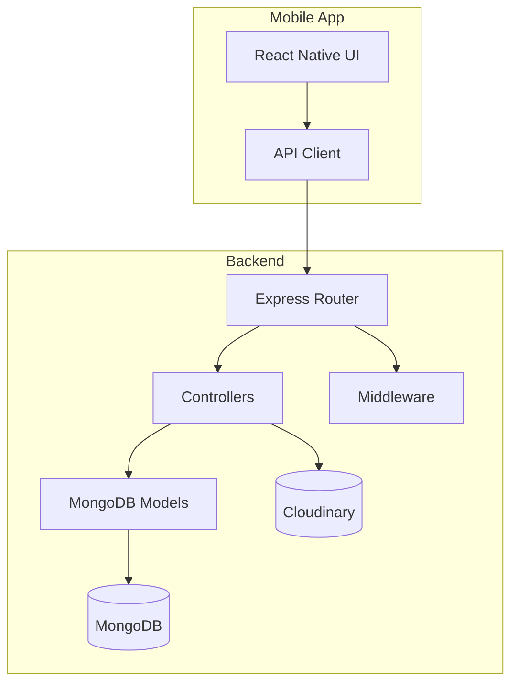
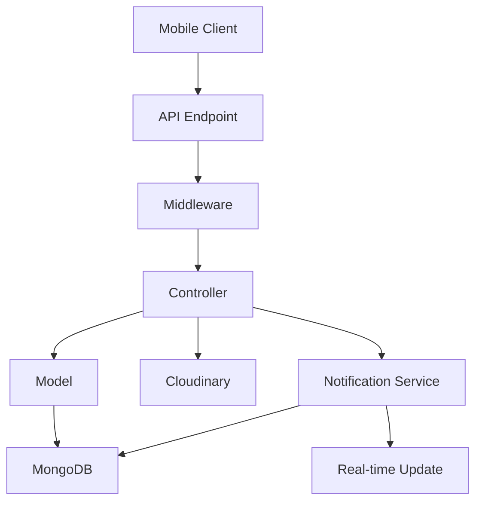
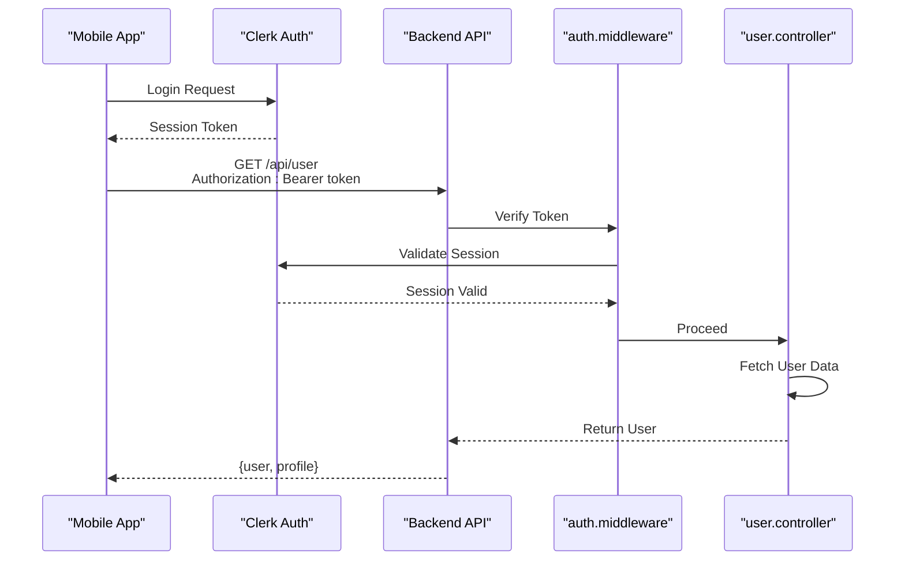
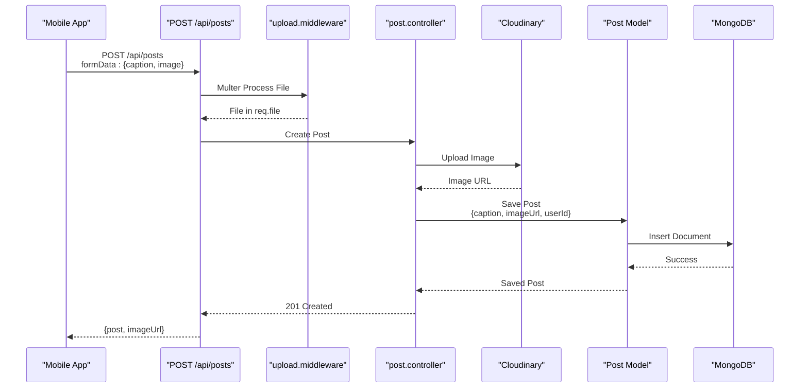
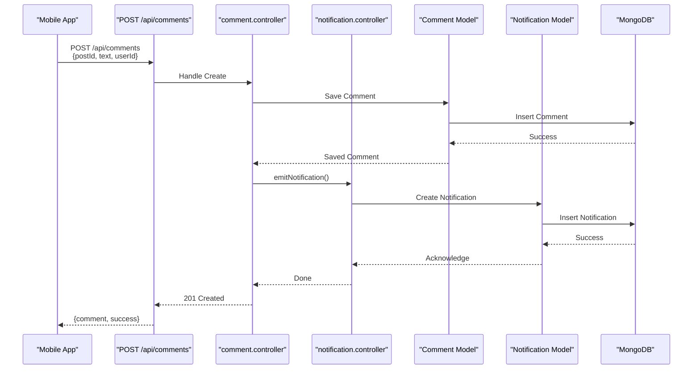
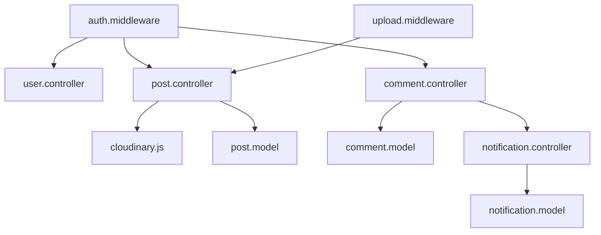

# Data Flow Between Layers

<cite>
**Referenced Files in This Document**   
- [server.js](file://backend/src/server.js)
- [auth.middleware.js](file://backend/src/middleware/auth.middleware.js)
- [user.controller.js](file://backend/src/controllers/user.controller.js)
- [post.controller.js](file://backend/src/controllers/post.controller.js)
- [upload.middleware.js](file://backend/src/middleware/upload.middleware.js)
- [cloudinary.js](file://backend/src/config/cloudinary.js)
- [post.model.js](file://backend/src/models/post.model.js)
- [comment.controller.js](file://backend/src/controllers/comment.controller.js)
- [notification.controller.js](file://backend/src/controllers/notification.controller.js)
- [notification.model.js](file://backend/src/models/notification.model.js)
- [post.route.js](file://backend/src/routes/post.route.js)
- [comment.route.js](file://backend/src/routes/comment.route.js)
- [notification.route.js](file://backend/src/routes/notification.route.js)
</cite>

## Table of Contents
1. [Introduction](#introduction)
2. [Project Structure](#project-structure)
3. [Core Components](#core-components)
4. [Architecture Overview](#architecture-overview)
5. [Detailed Component Analysis](#detailed-component-analysis)
6. [Dependency Analysis](#dependency-analysis)
7. [Performance Considerations](#performance-considerations)
8. [Troubleshooting Guide](#troubleshooting-guide)
9. [Conclusion](#conclusion)

## Introduction
This document provides a comprehensive analysis of the end-to-end data flow in xClone, a full-stack application consisting of a React Native mobile frontend and a Node.js backend. The focus is on tracing key operations across layers: user authentication, post creation with image upload, social interactions (likes and comments), and real-time notifications. The goal is to illustrate how data transforms as it moves between the mobile client, backend API, external services (Cloudinary), and database (MongoDB), while highlighting request-response patterns, error handling, validation, and performance characteristics.

## Project Structure
The xClone repository is organized into two main directories: `backend` and `mobile`. The backend follows a clean, modular structure with distinct folders for configuration, controllers, middleware, models, and routes. The mobile app uses Expo with a component-based architecture and React Navigation.

**Diagram sources**
- [server.js](file://backend/src/server.js#L1-L20)
- [post.route.js](file://backend/src/routes/post.route.js#L1-L10)

**Section sources**
- [server.js](file://backend/src/server.js#L1-L50)
- [post.route.js](file://backend/src/routes/post.route.js#L1-L15)

## Core Components
The core components of xClone include:
- **Authentication**: Managed via Clerk, integrated with Express middleware for session validation.
- **Post Management**: Handles creation, retrieval, and deletion of posts, including image uploads to Cloudinary.
- **Social Interactions**: Supports liking, commenting, and following, with real-time notification generation.
- **File Upload**: Uses Multer for multipart form handling and Cloudinary for media storage.
- **Notifications**: Asynchronous processing of user actions to generate and deliver alerts.

These components work together to enable a seamless social media experience with robust data flow and error resilience.

**Section sources**
- [auth.middleware.js](file://backend/src/middleware/auth.middleware.js#L5-L40)
- [post.controller.js](file://backend/src/controllers/post.controller.js#L10-L30)
- [notification.controller.js](file://backend/src/controllers/notification.controller.js#L5-L25)

## Architecture Overview
xClone follows a layered architecture with clear separation of concerns:
- **Frontend (Mobile)**: React Native app handling UI and user interactions.
- **Backend (Node.js/Express)**: RESTful API with controllers, middleware, and models.
- **Database**: MongoDB for persistent storage of users, posts, comments, and notifications.
- **External Services**: Cloudinary for image storage, Clerk for authentication.

Data flows from the mobile client through API endpoints, processed by middleware (authentication, file upload), then handled by controllers that interact with models and external services.

**Diagram sources**
- [server.js](file://backend/src/server.js#L10-L30)
- [post.controller.js](file://backend/src/controllers/post.controller.js#L5-L20)

## Detailed Component Analysis

### User Authentication Flow
Authentication in xClone is handled by Clerk on the frontend, with session tokens validated on the backend via middleware.

**Diagram sources**
- [auth.middleware.js](file://backend/src/middleware/auth.middleware.js#L10-L35)
- [user.controller.js](file://backend/src/controllers/user.controller.js#L15-L25)

**Section sources**
- [auth.middleware.js](file://backend/src/middleware/auth.middleware.js#L5-L40)
- [user.controller.js](file://backend/src/controllers/user.controller.js#L10-L30)

### Post Creation with Image Upload
This workflow involves capturing an image on mobile, uploading via multipart form, processing with Multer, storing on Cloudinary, and saving metadata to MongoDB.

**Diagram sources**
- [upload.middleware.js](file://backend/src/middleware/upload.middleware.js#L5-L20)
- [cloudinary.js](file://backend/src/config/cloudinary.js#L10-L25)
- [post.controller.js](file://backend/src/controllers/post.controller.js#L30-L60)
- [post.model.js](file://backend/src/models/post.model.js#L15-L30)

**Section sources**
- [upload.middleware.js](file://backend/src/middleware/upload.middleware.js#L1-L25)
- [cloudinary.js](file://backend/src/config/cloudinary.js#L1-L30)
- [post.controller.js](file://backend/src/controllers/post.controller.js#L25-L70)

### Social Interaction: Comment and Notification
When a user comments on a post, the system creates the comment and asynchronously generates a notification for the post owner.

**Diagram sources**
- [comment.controller.js](file://backend/src/controllers/comment.controller.js#L20-L50)
- [notification.controller.js](file://backend/src/controllers/notification.controller.js#L30-L45)
- [comment.model.js](file://backend/src/models/comment.model.js#L10-L25)
- [notification.model.js](file://backend/src/models/notification.model.js#L15-L30)

**Section sources**
- [comment.controller.js](file://backend/src/controllers/comment.controller.js#L15-L60)
- [notification.controller.js](file://backend/src/controllers/notification.controller.js#L25-L50)

## Dependency Analysis
The backend components are loosely coupled through Express routing and middleware chaining. Controllers depend on models and external service clients, while middleware handles cross-cutting concerns like authentication and file upload.

**Diagram sources**
- [auth.middleware.js](file://backend/src/middleware/auth.middleware.js#L1-L10)
- [upload.middleware.js](file://backend/src/middleware/upload.middleware.js#L1-L10)
- [post.controller.js](file://backend/src/controllers/post.controller.js#L1-L10)
- [comment.controller.js](file://backend/src/controllers/comment.controller.js#L1-L10)

**Section sources**
- [auth.middleware.js](file://backend/src/middleware/auth.middleware.js#L1-L40)
- [upload.middleware.js](file://backend/src/middleware/upload.middleware.js#L1-L25)
- [post.controller.js](file://backend/src/controllers/post.controller.js#L1-L70)
- [comment.controller.js](file://backend/src/controllers/comment.controller.js#L1-L60)

## Performance Considerations
- **Synchronous vs Asynchronous**: Image upload and post creation are synchronous to ensure consistency, while notifications are processed asynchronously to avoid blocking the main operation.
- **File Upload**: Multer buffers files in memory before uploading to Cloudinary, which may impact memory usage for large files.
- **Database Queries**: Indexes on `postId` and `userId` fields ensure fast lookups for posts and user-specific data.
- **Caching**: Not currently implemented; adding Redis could improve performance for frequently accessed data like user profiles and feeds.
- **Error Handling**: Each controller method wraps operations in try-catch blocks, returning appropriate HTTP status codes (400, 404, 500) with descriptive messages.

**Section sources**
- [post.controller.js](file://backend/src/controllers/post.controller.js#L40-L65)
- [comment.controller.js](file://backend/src/controllers/comment.controller.js#L25-L45)

## Troubleshooting Guide
Common issues and their resolutions:
- **Image Upload Fails**: Check Cloudinary credentials in `.env`, validate file size/type in `upload.middleware.js`.
- **Authentication Errors**: Ensure Clerk session token is correctly passed in `Authorization` header.
- **404 on API Routes**: Verify route registration in `server.js` and correct HTTP method.
- **Database Connection Issues**: Confirm MongoDB URI in `db.js` and network connectivity.
- **Notification Not Sent**: Check if `emitNotification` is called after comment creation and if the notification model saves successfully.

**Section sources**
- [auth.middleware.js](file://backend/src/middleware/auth.middleware.js#L20-L35)
- [upload.middleware.js](file://backend/src/middleware/upload.middleware.js#L10-L20)
- [db.js](file://backend/src/config/db.js#L5-L15)

## Conclusion
xClone demonstrates a well-structured full-stack architecture with clear data flow between frontend, backend, and external services. Key operations like authentication, post creation, and social interactions are implemented with robust error handling and separation of concerns. The use of middleware for authentication and file upload enhances reusability and security. Future improvements could include caching, rate limiting, and WebSocket-based real-time updates for notifications.