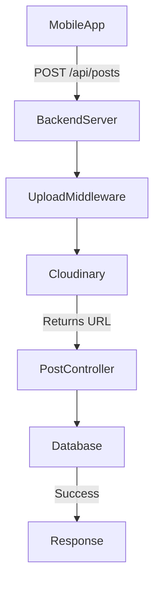
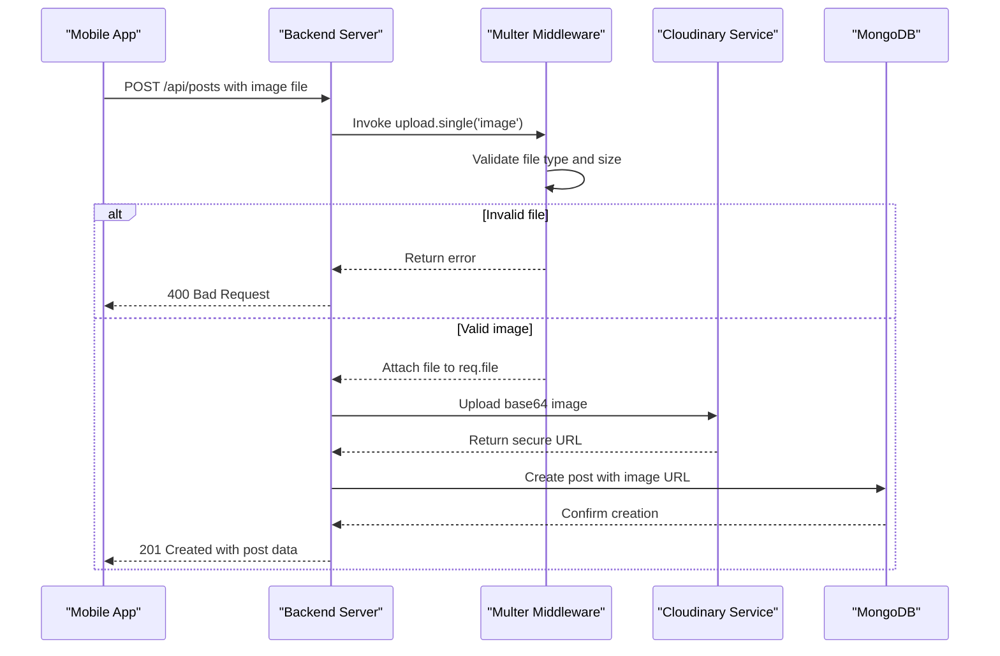

# Image Upload and Processing Flow

<cite>
**Referenced Files in This Document**   
- [upload.middleware.js](file://backend/src/middleware/upload.middleware.js)
- [cloudinary.js](file://backend/src/config/cloudinary.js)
- [post.controller.js](file://backend/src/controllers/post.controller.js)
- [post.model.js](file://backend/src/models/post.model.js)
</cite>

## Table of Contents
1. [Image Upload and Processing Flow](#image-upload-and-processing-flow)
2. [Project Structure Overview](#project-structure-overview)
3. [Core Components](#core-components)
4. [Image Upload Flow](#image-upload-flow)
5. [Cloudinary Integration](#cloudinary-integration)
6. [Post Creation and Database Storage](#post-creation-and-database-storage)
7. [Error Handling and Validation](#error-handling-and-validation)
8. [Performance and Optimization Considerations](#performance-and-optimization-considerations)
9. [Troubleshooting Guide](#troubleshooting-guide)

## Project Structure Overview

The xClone application follows a modular architecture with a clear separation between frontend (mobile) and backend (Node.js) components. The image upload functionality is primarily handled on the backend, with the mobile app initiating the upload request.

Key directories involved in image processing:
- `backend/src/middleware`: Contains `upload.middleware.js` for file parsing
- `backend/src/config`: Houses `cloudinary.js` for cloud storage configuration
- `backend/src/controllers`: Includes `post.controller.js` for business logic
- `backend/src/models`: Contains `post.model.js` for data persistence



**Diagram sources**
- [upload.middleware.js](file://backend/src/middleware/upload.middleware.js)
- [post.controller.js](file://backend/src/controllers/post.controller.js)
- [post.model.js](file://backend/src/models/post.model.js)

## Core Components

### Upload Middleware
The `upload.middleware.js` file implements Multer middleware to handle multipart form data. It processes image uploads directly into memory (not disk) using memory storage.

**Key configuration options:**
- **Storage**: `memoryStorage()` - stores files in memory as Buffer objects
- **File Filter**: Validates that only image files (mimetype starting with "image/") are accepted
- **Limits**: Enforces a 5MB file size limit

```javascript
const storage = multer.memoryStorage();

const fileFilter = (req, file, cb) => {
    if (file.mimetype.startsWith("image/")) {
      cb(null, true);
    } else {
      cb(new Error("Only image files are allowed"), false);
    }
  };
  
  const upload = multer({
    storage: storage,
    fileFilter: fileFilter,
    limits: { fileSize: 5 * 1024 * 1024 }, // 5MB limit
  });
```

**Section sources**
- [upload.middleware.js](file://backend/src/middleware/upload.middleware.js#L1-L21)

### Cloudinary Configuration
The `cloudinary.js` configuration file sets up the connection to Cloudinary's image hosting service using environment variables for security.

```javascript
import { v2 as cloudinary } from "cloudinary";
import { ENV } from "./env.js";

cloudinary.config({
  cloud_name: ENV.CLOUDINARY_CLOUD_NAME,
  api_key: ENV.CLOUDINARY_API_KEY,
  api_secret: ENV.CLOUDINARY_API_SECRET,
});
```

This configuration enables secure API communication with Cloudinary using credentials stored in environment variables, preventing exposure in source code.

**Section sources**
- [cloudinary.js](file://backend/src/config/cloudinary.js#L1-L9)

## Image Upload Flow

The image upload process follows a sequential flow from client to server to cloud storage:



**Diagram sources**
- [upload.middleware.js](file://backend/src/middleware/upload.middleware.js#L1-L21)
- [post.controller.js](file://backend/src/controllers/post.controller.js#L77-L123)

**Section sources**
- [upload.middleware.js](file://backend/src/middleware/upload.middleware.js#L1-L21)
- [post.controller.js](file://backend/src/controllers/post.controller.js#L77-L123)

## Cloudinary Integration

The integration with Cloudinary occurs in the `createPosts` controller function, where the uploaded image buffer is converted to base64 format for transmission.

### Upload Configuration
The following options are configured during upload:

**:Upload Options**
- **folder**: "social_media_posts" - Organizes images in a dedicated folder
- **resource_type**: "image" - Specifies the type of resource
- **transformation**: Array of image processing directives

**:Transformation Settings**
- **width: 800, height: 600, crop: "limit"**: Resizes image while maintaining aspect ratio
- **quality: "auto"**: Optimizes file size without visible quality loss
- **format: "auto"**: Delivers image in optimal format (WebP, JPEG, etc.) based on browser

```javascript
const base64Image = `data:${imageFile.mimetype};base64,${imageFile.buffer.toString("base64")}`;
const uploadResponse = await cloudinary.uploader.upload(base64Image, {
  folder: "social_media_posts",
  resource_type: "image",
  transformation: [
    { width: 800, height: 600, crop: "limit" },
    { quality: "auto" },
    { format: "auto" },
  ],
});
imageUrl = uploadResponse.secure_url;
```

This approach leverages Cloudinary's CDN delivery and automatic optimization features to ensure fast loading and responsive performance across devices.

**Section sources**
- [post.controller.js](file://backend/src/controllers/post.controller.js#L77-L123)
- [cloudinary.js](file://backend/src/config/cloudinary.js#L1-L9)

## Post Creation and Database Storage

After successful image upload to Cloudinary, the returned URL is stored in the MongoDB database via the Post model.

### Data Model Structure
The `post.model.js` defines the schema for storing posts:

```javascript
const postSchema = new mongoose.Schema({
  user: {
    type: mongoose.Schema.Types.ObjectId,
    ref: "User",
    required: true,
  },
  content: {
    type: String,
    maxLength: 280,
  },
  image: {
    type: String,
    default: "",
  },
  likes: [{
    type: mongoose.Schema.Types.ObjectId,
    ref: "User",
  }],
  comments: [{
    type: mongoose.Schema.Types.ObjectId,
    ref: "Comment",
  }],
}, { timestamps: true });
```

**:Key Fields**
- **image**: Stores the Cloudinary secure URL as a string
- **content**: Optional text content with 280-character limit
- **user**: Reference to the authoring user
- **timestamps**: Automatically adds createdAt and updatedAt fields

The controller creates a new post with the Cloudinary URL:
```javascript
const post = await Post.create({
  user: user._id,
  content: content || "",
  image: imageUrl,
});
```

**Section sources**
- [post.model.js](file://backend/src/models/post.model.js#L1-L36)
- [post.controller.js](file://backend/src/controllers/post.controller.js#L115-L123)

## Error Handling and Validation

The system implements comprehensive error handling at multiple levels:

### Client-Side Validation
- Ensures either content or image is provided
- Validates file type before upload
- Checks file size against 5MB limit

### Server-Side Validation
- Multer middleware rejects non-image files
- File size enforcement (5MB limit)
- Required field validation

### Cloudinary Error Handling
```javascript
try {
  const uploadResponse = await cloudinary.uploader.upload(base64Image, { /* options */ });
  imageUrl = uploadResponse.secure_url;
} catch (uploadError) {
  console.error("Cloudinary upload error:", uploadError);
  return res.status(400).json({ error: "Failed to upload image" });
}
```

**:Common Issues and Solutions**
- **Large file uploads**: Client-side compression recommended; 5MB server limit
- **Network interruptions**: Implement retry logic in mobile app
- **Unsupported formats**: Only image/* mimetypes accepted
- **Quota limitations**: Monitor Cloudinary usage and upgrade plan if needed

**Section sources**
- [upload.middleware.js](file://backend/src/middleware/upload.middleware.js#L1-L21)
- [post.controller.js](file://backend/src/controllers/post.controller.js#L77-L123)

## Performance and Optimization Considerations

### Client-Side Optimizations
- **Image compression**: Implement compression in mobile app before upload
- **Progress indicators**: Show upload progress to improve UX
- **Fallback mechanisms**: Provide alternative upload methods if primary fails

### Cloudinary Benefits
- **CDN delivery**: Global content delivery network for fast loading
- **Responsive transformations**: Automatic format and quality optimization
- **Bandwidth efficiency**: Reduced data transfer through compression

**:Cost Implications**
- **Storage costs**: Based on total image storage volume
- **Bandwidth costs**: Dependent on image delivery volume
- **Transformation costs**: Additional fees for on-the-fly image processing

Optimal strategy includes using Cloudinary's auto-settings (quality:auto, format:auto) to balance visual quality with performance and cost.

## Troubleshooting Guide

### Common Issues
**:Large File Uploads**
- **Symptom**: 413 Payload Too Large or timeout
- **Solution**: Implement client-side compression; increase server limits cautiously

**:Unsupported Formats**
- **Symptom**: "Only image files are allowed" error
- **Solution**: Ensure file mimetype starts with "image/"; convert unsupported formats

**:Cloudinary Authentication**
- **Symptom**: Upload failures with authentication errors
- **Solution**: Verify environment variables (CLOUDINARY_CLOUD_NAME, API_KEY, API_SECRET)

**:Network Interruptions**
- **Symptom**: Partial uploads or timeouts
- **Solution**: Implement retry logic with exponential backoff

### Recommended Best Practices
- Compress images on mobile device before upload
- Use progressive JPEGs for better perceived performance
- Implement proper error boundaries in UI
- Monitor upload success rates and failure types
- Set up logging for upload performance metrics

**Section sources**
- [upload.middleware.js](file://backend/src/middleware/upload.middleware.js#L1-L21)
- [post.controller.js](file://backend/src/controllers/post.controller.js#L77-L123)
- [cloudinary.js](file://backend/src/config/cloudinary.js#L1-L9)