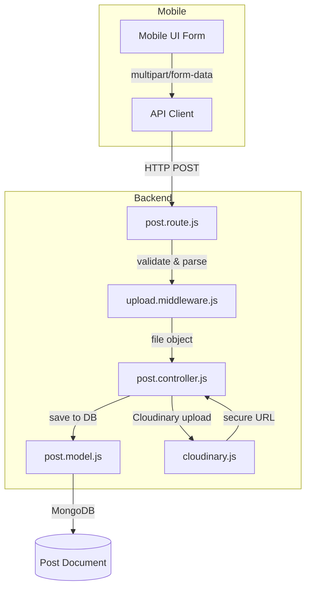
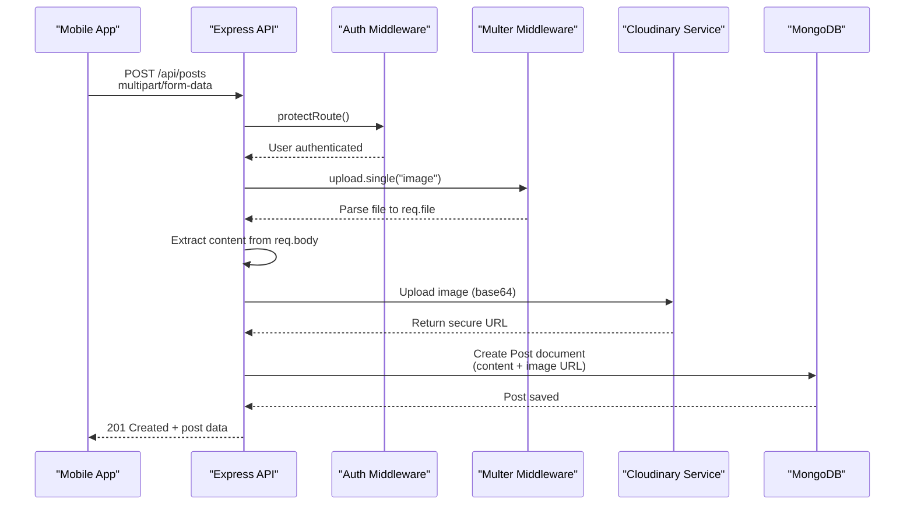
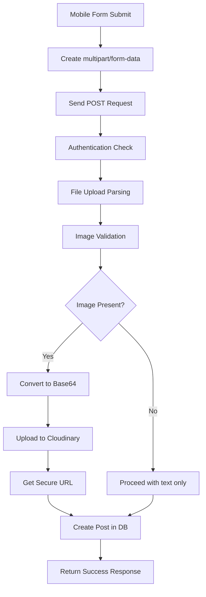
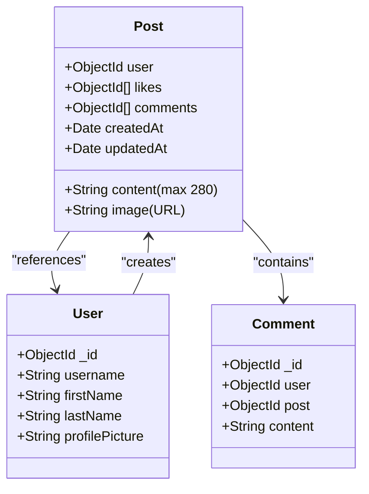
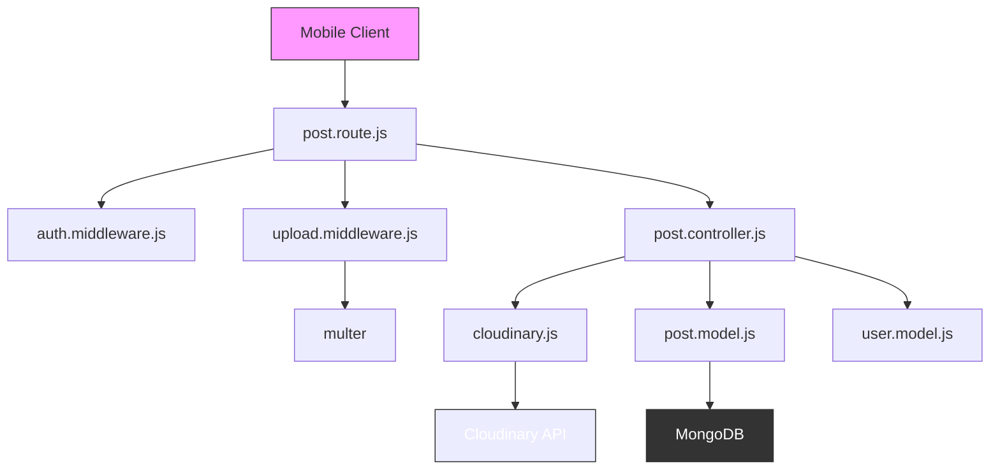

# Post Creation Data Flow

<cite>
**Referenced Files in This Document**   
- [post.controller.js](file://backend/src/controllers/post.controller.js)
- [post.route.js](file://backend/src/routes/post.route.js)
- [post.model.js](file://backend/src/models/post.model.js)
- [upload.middleware.js](file://backend/src/middleware/upload.middleware.js)
- [cloudinary.js](file://backend/src/config/cloudinary.js)
</cite>

## Table of Contents
1. [Introduction](#introduction)
2. [Project Structure](#project-structure)
3. [Core Components](#core-components)
4. [Architecture Overview](#architecture-overview)
5. [Detailed Component Analysis](#detailed-component-analysis)
6. [Dependency Analysis](#dependency-analysis)
7. [Performance Considerations](#performance-considerations)
8. [Troubleshooting Guide](#troubleshooting-guide)
9. [Conclusion](#conclusion)

## Introduction
This document provides a comprehensive analysis of the post creation data flow in the xClone application. It details the journey of a user-generated post from the mobile frontend submission through backend processing, media handling, and final storage in MongoDB. The focus is on the integration between the UI, API client, multipart form data handling, Cloudinary image upload, and persistent data modeling. The explanation is designed to be accessible to both technical and non-technical readers, with visual diagrams and concrete code examples.

## Project Structure
The xClone repository is organized into two main directories: `backend` and `mobile`. The backend is built using Node.js with Express, while the mobile frontend is implemented using React Native. The post creation functionality primarily involves backend components located in the `backend/src` directory, specifically within the `controllers`, `routes`, `models`, and `middleware` folders.



**Diagram sources**
- [post.controller.js](file://backend/src/controllers/post.controller.js)
- [post.route.js](file://backend/src/routes/post.route.js)
- [post.model.js](file://backend/src/models/post.model.js)
- [upload.middleware.js](file://backend/src/middleware/upload.middleware.js)
- [cloudinary.js](file://backend/src/config/cloudinary.js)

**Section sources**
- [post.controller.js](file://backend/src/controllers/post.controller.js)
- [post.route.js](file://backend/src/routes/post.route.js)

## Core Components
The post creation flow relies on several key backend components:
- **PostController.createPosts**: Handles the business logic for creating a new post.
- **PostRoute**: Defines the API endpoint and applies middleware.
- **UploadMiddleware**: Parses incoming multipart form data and validates image files.
- **PostModel**: Defines the MongoDB schema for storing post data.
- **CloudinaryConfig**: Manages the integration with Cloudinary for image storage and transformation.

These components work together to ensure that user content and images are properly validated, processed, and stored.

**Section sources**
- [post.controller.js](file://backend/src/controllers/post.controller.js#L60-L158)
- [post.route.js](file://backend/src/routes/post.route.js#L10-L15)
- [post.model.js](file://backend/src/models/post.model.js#L1-L37)
- [upload.middleware.js](file://backend/src/middleware/upload.middleware.js#L1-L22)

## Architecture Overview
The post creation architecture follows a layered pattern with clear separation of concerns. The mobile frontend submits a `multipart/form-data` request to the backend API. The request passes through authentication and file upload middleware before reaching the controller. The controller processes the text and image content, uploads the image to Cloudinary, and saves the post metadata to MongoDB.



**Diagram sources**
- [post.route.js](file://backend/src/routes/post.route.js#L10-L15)
- [upload.middleware.js](file://backend/src/middleware/upload.middleware.js#L1-L22)
- [post.controller.js](file://backend/src/controllers/post.controller.js#L60-L158)

## Detailed Component Analysis

### Post Creation Flow Analysis
The post creation process begins when the mobile UI submits a form containing optional text content and an optional image file. The API client packages these into a `multipart/form-data` request where the image is sent as a file field named "image" and text content as a form field named "content".

#### API Route and Middleware Integration
The route `/api/posts` is configured to accept POST requests only from authenticated users. It applies two middleware functions: `protectRoute` for authentication and `upload.single("image")` for handling the file upload.



**Diagram sources**
- [post.route.js](file://backend/src/routes/post.route.js#L10-L15)
- [upload.middleware.js](file://backend/src/middleware/upload.middleware.js#L1-L22)

**Section sources**
- [post.route.js](file://backend/src/routes/post.route.js#L10-L15)

#### Controller Implementation Details
The `createPosts` controller function (in `post.controller.js`) implements the core logic:

1. **Authentication**: Uses Clerk's `getAuth(req)` to retrieve the authenticated user ID.
2. **User Lookup**: Finds the corresponding user in MongoDB using the Clerk ID.
3. **Content Validation**: Ensures either text content or an image is provided.
4. **Image Processing**: If an image is present, converts the buffer to base64 and uploads to Cloudinary with transformations.
5. **Post Creation**: Saves the post document with user reference, content, and image URL.

Key code snippet from `post.controller.js`:
```javascript
const createPosts = asyncHandler(async (req, res) => {
  const { userId } = getAuth(req);
  const { content } = req.body;
  const imageFile = req.file;

  if (!content && !imageFile) {
    return res.status(400).json({ message: "Please provide content or image" });
  }

  const user = await User.findOne({ clerkId: userId });
  if (!user) return res.status(404).json({ message: "User not found" });

  let imageUrl = "";

  if (imageFile) {
    const base64Image = `data:${imageFile.mimetype};base64,${imageFile.buffer.toString("base64")}`;
    const uploadResponse = await cloudinary.uploader.upload(base64Image, {
      folder: "social_media_posts",
      resource_type: "image",
      transformation: [
        { width: 800, height: 600, crop: "limit" },
        { quality: "auto" },
        { format: "auto" },
      ],
    });
    imageUrl = uploadResponse.secure_url;
  }

  const post = await Post.create({
    user: user._id,
    content: content || "",
    image: imageUrl,
  });

  res.status(201).json({ post });
});
```

**Section sources**
- [post.controller.js](file://backend/src/controllers/post.controller.js#L60-L158)

#### Domain Model: Post Schema
The `Post` model defines the structure of post documents in MongoDB. It includes references to the user who created the post, optional text content (limited to 280 characters), an optional image URL, and arrays for likes and comments.



**Diagram sources**
- [post.model.js](file://backend/src/models/post.model.js#L1-L37)

**Section sources**
- [post.model.js](file://backend/src/models/post.model.js#L1-L37)

## Dependency Analysis
The post creation flow depends on several internal and external components:



**Diagram sources**
- [post.route.js](file://backend/src/routes/post.route.js)
- [upload.middleware.js](file://backend/src/middleware/upload.middleware.js)
- [post.controller.js](file://backend/src/controllers/post.controller.js)
- [post.model.js](file://backend/src/models/post.model.js)

**Section sources**
- [post.route.js](file://backend/src/routes/post.route.js)
- [post.controller.js](file://backend/src/controllers/post.controller.js)

## Performance Considerations
Several performance optimizations are implemented in the post creation flow:

- **Image Compression**: Cloudinary automatically applies quality optimization (`quality: "auto"`) and format optimization (`format: "auto"`) to reduce file size.
- **Size Limiting**: Multer enforces a 5MB file size limit to prevent excessive resource usage.
- **Resolution Capping**: Images are resized to a maximum of 800x600 pixels during upload.
- **CDN Delivery**: Cloudinary serves images through a global CDN, ensuring fast delivery to users worldwide.
- **Mobile Pre-compression**: Although not shown in the code, best practice recommends compressing images on the mobile device before upload to reduce bandwidth and processing time.

For high-traffic scenarios, consider implementing:
- Client-side image compression using libraries like `react-native-image-resizer`
- Upload progress tracking and retry mechanisms for failed uploads
- Caching strategies for frequently accessed posts
- Database indexing on frequently queried fields like `user` and `createdAt`

## Troubleshooting Guide
Common issues in the post creation flow and their solutions:

**Section sources**
- [post.controller.js](file://backend/src/controllers/post.controller.js#L60-L158)
- [upload.middleware.js](file://backend/src/middleware/upload.middleware.js#L1-L22)

### Upload Timeouts
**Symptoms**: Request hangs or returns 504 Gateway Timeout  
**Causes**: Large image files, slow network, Cloudinary API latency  
**Solutions**: 
- Implement client-side upload progress indicators
- Add timeout handling in the frontend
- Compress images on mobile before upload
- Increase server timeout settings if necessary

### File Type Validation Errors
**Symptoms**: "Only image files are allowed" error  
**Causes**: Non-image file uploaded or incorrect MIME type detection  
**Solutions**:
- Ensure frontend only allows image selection
- Verify file extension and MIME type match
- Test with common image formats (JPEG, PNG, WebP)

### Failed Cloudinary Uploads
**Symptoms**: "Failed to upload image" error with 400 status  
**Causes**: Invalid Cloudinary configuration, network issues, file corruption  
**Solutions**:
- Verify Cloudinary environment variables are correctly set
- Check internet connectivity
- Validate image file integrity
- Implement retry logic with exponential backoff

### Client-Side Feedback Recommendations
- Show loading spinner during upload
- Display upload progress percentage
- Provide clear error messages for different failure types
- Implement automatic retry for transient failures
- Cache draft posts locally to prevent data loss

## Conclusion
The post creation data flow in xClone demonstrates a robust implementation of modern web application patterns. By leveraging multer for file parsing, Cloudinary for media management, and MongoDB for data persistence, the system efficiently handles user-generated content. The architecture separates concerns effectively, making the code maintainable and scalable. Key strengths include automatic image optimization, proper error handling, and a clean API design. Future improvements could include enhanced client-side validation, more sophisticated retry mechanisms, and additional media types support.