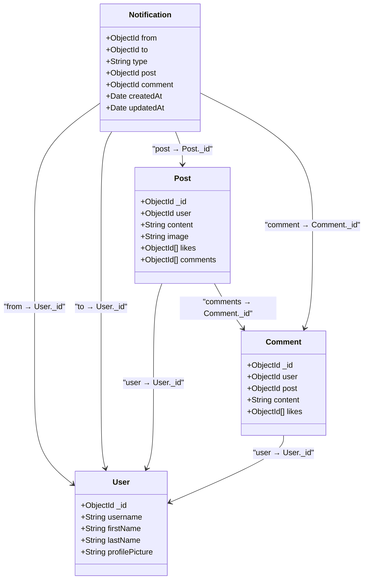
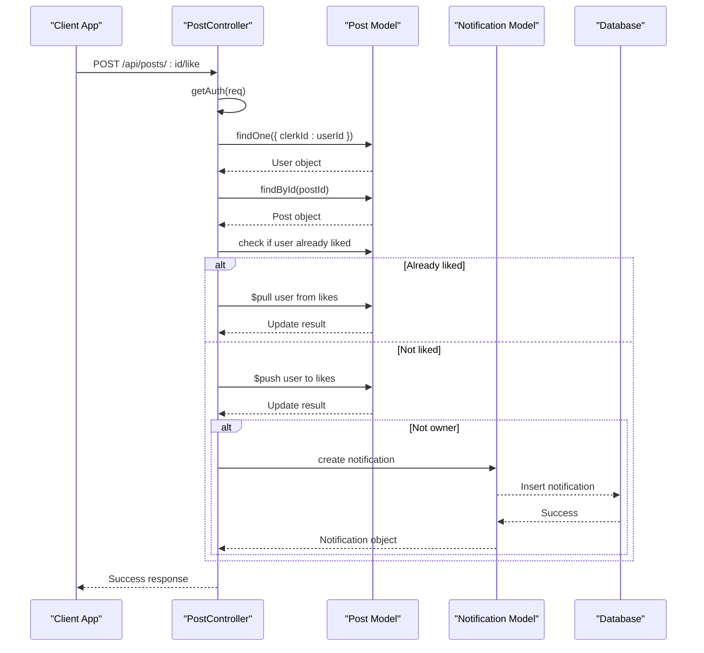
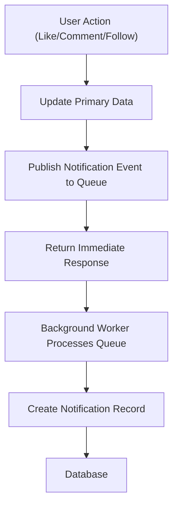
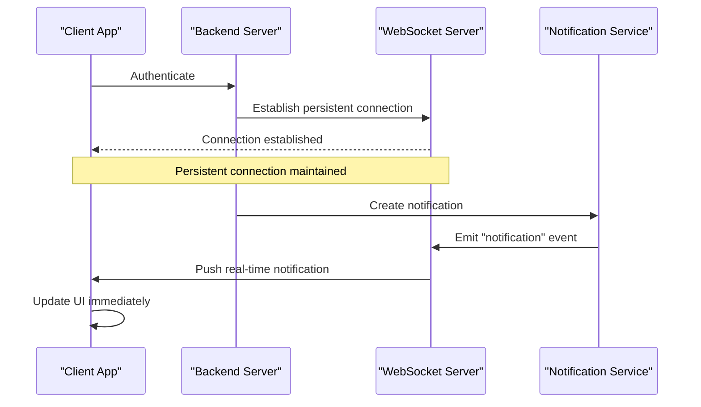
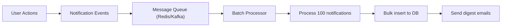

# Social Interaction and Notification Flow

<cite>
**Referenced Files in This Document**   
- [post.controller.js](file://backend/src/controllers/post.controller.js)
- [comment.controller.js](file://backend/src/controllers/comment.controller.js)
- [user.controller.js](file://backend/src/controllers/user.controller.js)
- [notification.controller.js](file://backend/src/controllers/notification.controller.js)
- [notification.model.js](file://backend/src/models/notification.model.js)
- [post.model.js](file://backend/src/models/post.model.js)
- [comment.model.js](file://backend/src/models/comment.model.js)
- [server.js](file://backend/src/server.js)
</cite>

## Table of Contents
1. [Introduction](#introduction)
2. [Core Interaction Flows](#core-interaction-flows)
3. [Notification Domain Model](#notification-domain-model)
4. [Controller Implementation Details](#controller-implementation-details)
5. [Data Flow and Sequence Diagrams](#data-flow-and-sequence-diagrams)
6. [Race Conditions and Duplicate Prevention](#race-conditions-and-duplicate-prevention)
7. [Performance Considerations](#performance-considerations)
8. [Unread Notification Queries](#unread-notification-queries)
9. [Future Enhancements](#future-enhancements)

## Introduction
This document details the social interaction and notification system in xClone, a social media application. It explains how user actions such as liking posts, commenting, and following other users generate notifications. The architecture leverages MongoDB with Mongoose for data modeling, Express.js for RESTful API endpoints, and Clerk for authentication. Notifications are created synchronously within transactional flows but could benefit from asynchronous processing in high-scale scenarios.

**Section sources**
- [server.js](file://backend/src/server.js#L1-L46)

## Core Interaction Flows
The primary social interactions in xClone include liking posts, creating comments, and following users. Each of these actions triggers a backend controller method that updates the relevant data model and conditionally creates a notification when the action involves another user.

These interactions follow a consistent pattern:
1. Authenticate the requesting user via Clerk
2. Validate input and retrieve target entities (post, user, comment)
3. Update the primary data model (Post, Comment, User)
4. Conditionally create a notification if the action affects another user

For example, when a user likes a post, the `likePost` controller checks whether the post belongs to someone else before creating a "like" notification. Similarly, commenting on another user's post or following a user triggers corresponding "comment" and "follow" notifications.

**Section sources**
- [post.controller.js](file://backend/src/controllers/post.controller.js#L77-L123)
- [comment.controller.js](file://backend/src/controllers/comment.controller.js#L34-L82)
- [user.controller.js](file://backend/src/controllers/user.controller.js#L68-L95)

## Notification Domain Model
The Notification schema defines the structure of all notification records in the system. It captures the sender (from), recipient (to), event type, and optional references to related content.



**Diagram sources**
- [notification.model.js](file://backend/src/models/notification.model.js#L0-L35)
- [post.model.js](file://backend/src/models/post.model.js#L0-L35)
- [comment.model.js](file://backend/src/models/comment.model.js#L0-L31)

**Section sources**
- [notification.model.js](file://backend/src/models/notification.model.js#L0-L35)

## Controller Implementation Details
The backend controllers handle social interactions and notification creation. Each controller method follows a consistent pattern using Express-async-handler for error handling.

### Like Post Implementation
When a user likes a post, the `likePost` function in `post.controller.js` performs the following steps:

```javascript
export const likePost = asyncHandler(async (req, res) => {
  const { postId } = req.params;
  const { userId } = getAuth(req);
  const user = await User.findOne({ clerkId: userId });
  const post = await Post.findById(postId);

  if (!user || !post) return res.status(404).json({ message: "User or post Not found" });

  const isLiked = post.likes.includes(user._id);

  if (isLiked) {
    await Post.findByIdAndUpdate(postId, { $pull: { likes: user._id } });
  } else {
    await Post.findByIdAndUpdate(postId, { $push: { likes: user._id } });

    if (post.user.toString() !== user._id.toString()) {
      await Notification.create({
        from: user._id,
        to: post.user,
        type: "like",
        post: postId,
      });
    }
  }

  res.status(200).json({
    message: isLiked ? "Post unliked successfully" : "Post liked successfully",
  });
});
```

### Comment Creation Implementation
The `createComment` controller handles comment creation and notification:

```javascript
export const createComment = asyncHandler(async (req, res) => {
  // ... authentication and validation

  const comment = await Comment.create({
    user: user._id,
    post: post._id,
    content,
  });

  await Post.findByIdAndUpdate(postId, {
    $push: { comments: comment._id },
  });

  if (post.user.toString() !== user._id.toString()) {
    await Notification.create({
      from: user._id,
      to: post.user,
      type: "comment",
      post: postId,
      comment: comment._id,
    });
  }

  res.status(201).json({ comment });
});
```

### Follow User Implementation
The `followUser` controller manages follow/unfollow actions:

```javascript
export const followUser = asyncHandler(async (req, res) => {
  // ... authentication and validation

  if (isFollowing) {
    // unfollow logic
  } else {
    // follow logic
    await User.findByIdAndUpdate(currentUser._id, {
      $push: { following: targetUserId },
    });
    await User.findByIdAndUpdate(targetUserId, {
      $push: { followers: currentUser._id },
    });

    await Notification.create({
      from: currentUser._id,
      to: targetUserId,
      type: "follow",
    });
  }

  res.status(200).json({
    message: isFollowing ? "User unfollowed successfully" : "User followed successfully",
  });
});
```

**Section sources**
- [post.controller.js](file://backend/src/controllers/post.controller.js#L77-L123)
- [comment.controller.js](file://backend/src/controllers/comment.controller.js#L34-L82)
- [user.controller.js](file://backend/src/controllers/user.controller.js#L68-L95)

## Data Flow and Sequence Diagrams
The following sequence diagrams illustrate the flow of social interactions and notification creation.

### Like Post Sequence


**Diagram sources**
- [post.controller.js](file://backend/src/controllers/post.controller.js#L77-L123)

### Comment Creation Sequence
```mermaid
sequenceDiagram
participant Client as "Client App"
participant CommentController as "CommentController"
participant CommentModel as "Comment Model"
participant PostModel as "Post Model"
participant NotificationModel as "Notification Model"
participant DB as "Database"
Client->>CommentController : POST /api/comments/post/ : postId
CommentController->>CommentController : getAuth(req)
CommentController->>CommentModel : validate content
alt Content empty
CommentController-->>Client : 400 Error
stop
end
CommentController->>CommentModel : findOne({ clerkId : userId })
CommentModel-->>CommentController : User object
CommentController->>PostModel : findById(postId)
PostModel-->>CommentController : Post object
CommentController->>CommentModel : create comment
CommentModel-->>DB : Insert comment
DB-->>CommentModel : Comment with _id
CommentModel-->>CommentController : New comment
CommentController->>PostModel : $push comment._id to post.comments
PostModel-->>DB : Update post
DB-->>PostModel : Success
alt Not owner
CommentController->>NotificationModel : create notification
NotificationModel-->>DB : Insert notification
DB-->>NotificationModel : Success
NotificationModel-->>CommentController : Notification object
end
CommentController-->>Client : 201 Created with comment
```

**Diagram sources**
- [comment.controller.js](file://backend/src/controllers/comment.controller.js#L0-L82)

## Race Conditions and Duplicate Prevention
The current implementation is susceptible to race conditions during high-frequency interactions. For example, if a user rapidly clicks the like button multiple times, concurrent requests could result in multiple notifications being created for the same action.

Potential solutions include:
- Implementing client-side debouncing to prevent rapid successive requests
- Using Redis or in-memory locks to prevent concurrent processing of the same user-post interaction
- Adding unique constraints at the database level (e.g., compound index on from+to+type+post to prevent duplicate like notifications)

Currently, the system relies on the application logic to check `isLiked` status before creating notifications, but this check and update are not atomic, creating a window for race conditions.

**Section sources**
- [post.controller.js](file://backend/src/controllers/post.controller.js#L77-L123)

## Performance Considerations
The notification system currently creates notifications synchronously within the main request flow, which blocks the response until the notification is written to the database. This ensures consistency but impacts performance.

### Asynchronous Notification Processing
To improve performance, notifications could be processed asynchronously using a message queue:



This approach would:
- Reduce response time for user interactions
- Prevent notification failures from affecting primary operations
- Allow for batch processing of notifications
- Enable richer notification delivery (email, push) without impacting API performance

Currently, all notification creation is synchronous, which is simpler but less scalable.

**Section sources**
- [post.controller.js](file://backend/src/controllers/post.controller.js#L105-L118)
- [comment.controller.js](file://backend/src/controllers/comment.controller.js#L65-L75)
- [user.controller.js](file://backend/src/controllers/user.controller.js#L85-L90)

## Unread Notification Queries
The `getNotifications` controller in `notification.controller.js` handles retrieval of all notifications for a user:

```javascript
export const getNotifications = asyncHandler(async (req, res) => {
  const { userId } = getAuth(req);
  const user = await User.findOne({ clerkId: userId });
  
  if (!user) return res.status(404).json({ error: "User not found" });

  const notifications = await Notification.find({ to: user._id })
    .sort({ createdAt: -1 })
    .populate("from", "username firstName lastName profilePicture")
    .populate("post", "content image")
    .populate("comment", "content");

  res.status(200).json({ notifications });
});
```

For unread count queries, the system would need to extend the Notification schema with a `read` boolean field and create an index on `{ to: 1, read: 1 }` for efficient querying. Currently, all notifications are retrieved without read state tracking.

To implement unread counts efficiently:
```javascript
// Add to notification.schema.js
read: { type: Boolean, default: false }

// Index for performance
NotificationSchema.index({ to: 1, read: 1 });

// Query for unread count
const unreadCount = await Notification.countDocuments({
  to: userId,
  read: false
});
```

**Section sources**
- [notification.controller.js](file://backend/src/controllers/notification.controller.js#L0-L35)

## Future Enhancements
Several improvements can enhance the notification system:

### WebSocket Integration
Implement real-time notification delivery using WebSocket:



### Batch Processing
Implement batch notification processing using a queue system:



### Additional Features
- **Notification preferences**: Allow users to customize which events generate notifications
- **Notification grouping**: Combine multiple likes on a post into a single notification
- **Delivery channels**: Support email, push, and in-app notifications
- **Expiry policies**: Automatically remove old notifications to manage storage

These enhancements would improve user experience, system performance, and scalability.

**Section sources**
- [notification.controller.js](file://backend/src/controllers/notification.controller.js#L0-L35)
- [post.controller.js](file://backend/src/controllers/post.controller.js#L105-L118)