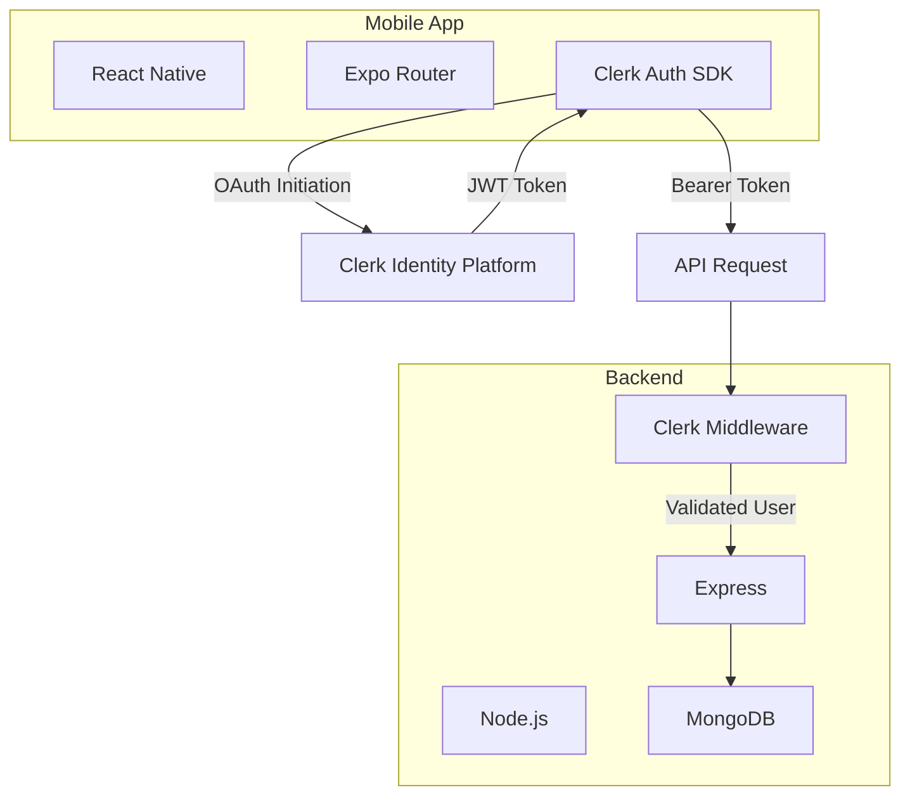
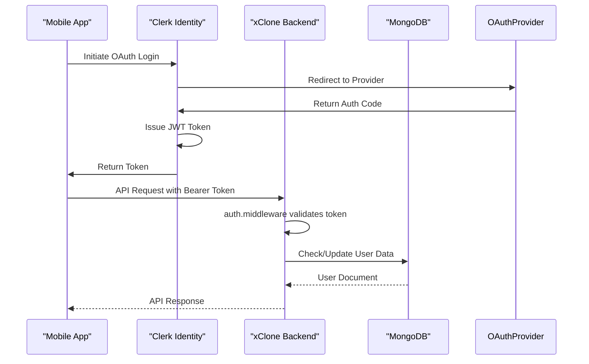
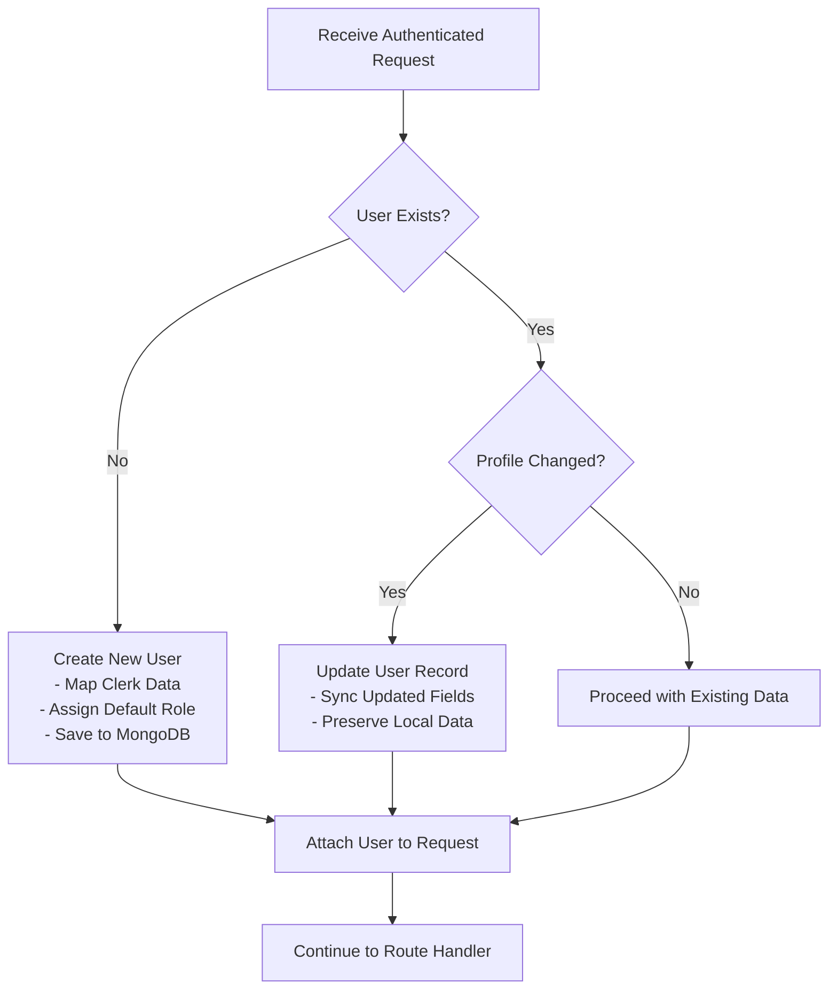
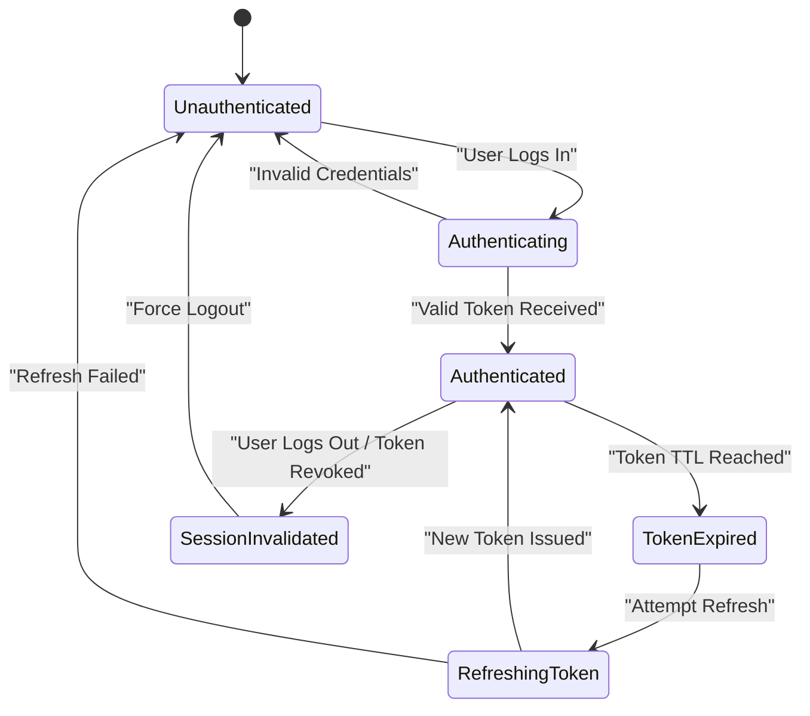

# User Authentication Data Flow

<cite>
**Referenced Files in This Document**   
- [auth.middleware.js](file://backend/src/middleware/auth.middleware.js#L1-L50)
- [user.controller.js](file://backend/src/controllers/user.controller.js#L1-L100)
- [user.model.js](file://backend/src/models/user.model.js#L1-L40)
- [server.js](file://backend/src/server.js#L1-L20)
- [app.json](file://mobile/app.json#L1-L15)
</cite>

## Table of Contents
1. [Introduction](#introduction)
2. [Project Structure](#project-structure)
3. [Core Components](#core-components)
4. [Authentication Flow Overview](#authentication-flow-overview)
5. [Frontend Authentication Initiation](#frontend-authentication-initiation)
6. [Backend Token Verification](#backend-token-verification)
7. [User Data Synchronization](#user-data-synchronization)
8. [Error Handling and Security](#error-handling-and-security)
9. [Token Management and Storage](#token-management-and-storage)
10. [Data Transformation and Role Assignment](#data-transformation-and-role-assignment)
11. [Conclusion](#conclusion)

## Introduction
This document details the user authentication data flow in xClone, a full-stack application utilizing Clerk for OAuth-based authentication. The system enables secure user login via third-party providers, token exchange, and protected API access. It covers the complete journey from mobile app login initiation to backend token validation and user data synchronization between Clerk and the local MongoDB database. The explanation is designed to be accessible to both technical and non-technical stakeholders.

## Project Structure
The xClone project follows a standard full-stack separation with a backend Node.js/Express server and a React Native mobile frontend using Expo. The backend organizes code by concern into config, controllers, middleware, models, and routes directories. The mobile app uses Expo's file-based routing with React components and hooks.



**Diagram sources**
- [server.js](file://backend/src/server.js#L1-L20)
- [app.json](file://mobile/app.json#L1-L15)

**Section sources**
- [server.js](file://backend/src/server.js#L1-L20)
- [app.json](file://mobile/app.json#L1-L15)

## Core Components
The authentication system relies on several key components:
- **Clerk**: Handles identity management, OAuth flows, and JWT token issuance
- **auth.middleware.js**: Validates incoming JWT tokens and attaches user data to requests
- **user.controller.js**: Manages user creation and retrieval logic
- **User Model**: Defines the schema for local user persistence in MongoDB
- **Mobile Auth Hooks**: Facilitate login UI and token handling in the React Native app

These components work together to ensure secure, stateless authentication across the application.

**Section sources**
- [auth.middleware.js](file://backend/src/middleware/auth.middleware.js#L1-L50)
- [user.controller.js](file://backend/src/controllers/user.controller.js#L1-L100)
- [user.model.js](file://backend/src/models/user.model.js#L1-L40)

## Authentication Flow Overview
The authentication process begins on the mobile device with a user-initiated login. The Clerk SDK redirects to the selected OAuth provider (e.g., Google, GitHub). Upon successful authentication, Clerk issues a JWT token that is stored securely on the device. This token is included in the Authorization header of all subsequent API requests to the backend, where it is validated by the auth middleware before allowing access to protected routes.



**Diagram sources**
- [auth.middleware.js](file://backend/src/middleware/auth.middleware.js#L1-L50)
- [user.controller.js](file://backend/src/controllers/user.controller.js#L1-L100)

## Frontend Authentication Initiation
The mobile application uses Clerk's React Native SDK to manage the authentication lifecycle. When a user selects "Sign In," the app triggers the Clerk sign-in flow, which presents available OAuth options. After successful authentication, the SDK automatically stores the JWT token in secure storage and makes it available for API requests.

While specific mobile implementation files like `useAuth` hooks are not present in the provided structure, the configuration in `app.json` indicates proper setup for deep linking and universal login flows required by Clerk.

**Section sources**
- [app.json](file://mobile/app.json#L1-L15)

## Backend Token Verification
The `auth.middleware.js` file contains the core logic for token validation. It extracts the JWT from the Authorization header, verifies its signature using Clerk's public keys, and decodes the payload to extract user information. If valid, it attaches the user object to the request for downstream handlers.

```javascript
// Pseudocode representation of auth.middleware.js logic
const authenticateJwt = (req, res, next) => {
  const token = req.headers.authorization?.split(' ')[1];
  if (!token) return res.status(401).json({ error: "No token provided" });

  try {
    const verified = await clerkClient.authenticateJwt(token);
    req.user = verified.payload;
    next();
  } catch (error) {
    return res.status(401).json({ error: "Invalid token" });
  }
};
```

This middleware is applied to all protected routes, ensuring that only authenticated requests proceed.

**Section sources**
- [auth.middleware.js](file://backend/src/middleware/auth.middleware.js#L1-L50)

## User Data Synchronization
Upon first login or profile update, the system synchronizes user data from Clerk to the local MongoDB instance. The `UserController` contains methods that check for existing users by Clerk ID and create or update records accordingly.



**Diagram sources**
- [user.controller.js](file://backend/src/controllers/user.controller.js#L1-L100)
- [user.model.js](file://backend/src/models/user.model.js#L1-L40)

**Section sources**
- [user.controller.js](file://backend/src/controllers/user.controller.js#L1-L100)
- [user.model.js](file://backend/src/models/user.model.js#L1-L40)

## Error Handling and Security
The system implements robust error handling for authentication failures:
- **Token expiration**: Returns 401 Unauthorized, prompting the mobile app to refresh or re-authenticate
- **Invalid tokens**: Immediately rejects with 401 status
- **Missing tokens**: Blocks access to protected routes
- **Session invalidation**: Clerk's token revocation mechanism ensures immediate logout across devices

The `auth.middleware.js` centralizes this logic, providing consistent security enforcement across all API endpoints.



**Diagram sources**
- [auth.middleware.js](file://backend/src/middleware/auth.middleware.js#L1-L50)

## Token Management and Storage
On the mobile device, JWT tokens are stored using secure storage mechanisms provided by the Clerk SDK and Expo SecureStore. This ensures tokens are encrypted and protected from unauthorized access. The recommended strategy includes:
- Storing tokens in secure, encrypted storage
- Implementing silent token refresh before expiration
- Clearing tokens on logout
- Using HTTP-only flags when possible (limited in mobile context)

The backend remains stateless, relying solely on token validation rather than session storage, improving scalability and resilience.

## Data Transformation and Role Assignment
When creating or updating a local user record, data is transformed from Clerk's user object to match the internal User model schema. Key mappings include:
- `clerkId` → `clerkId` (unique identifier)
- `email_addresses[0].email` → `email`
- `first_name`, `last_name` → `name`
- `profile_image_url` → `avatar`

Role assignment follows a default pattern:
- First user: automatically assigned "admin" role
- Subsequent users: assigned "user" role
- Roles can be updated via administrative interfaces (not shown in current code)

This transformation occurs in the `UserController.createUser` method, ensuring consistent data representation across the system.

**Section sources**
- [user.controller.js](file://backend/src/controllers/user.controller.js#L1-L100)
- [user.model.js](file://backend/src/models/user.model.js#L1-L40)

## Conclusion
The xClone authentication system effectively leverages Clerk for secure, scalable identity management while maintaining a local user database for application-specific data. The flow from mobile login to backend verification is well-structured, with clear separation of concerns between frontend and backend components. Token-based authentication ensures stateless, secure API access, while data synchronization keeps local user records up to date. Future enhancements could include role-based access control expansion and improved token refresh handling on the mobile client.