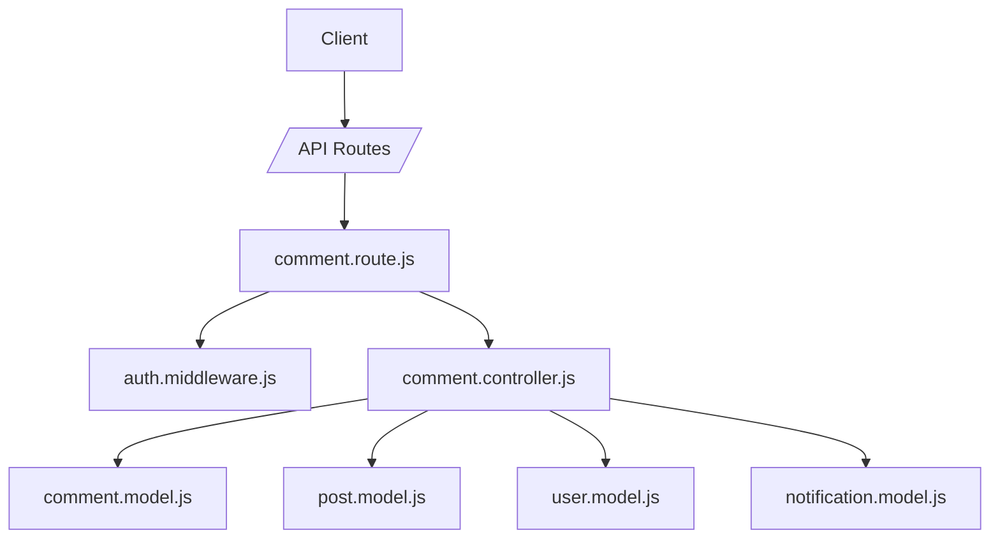
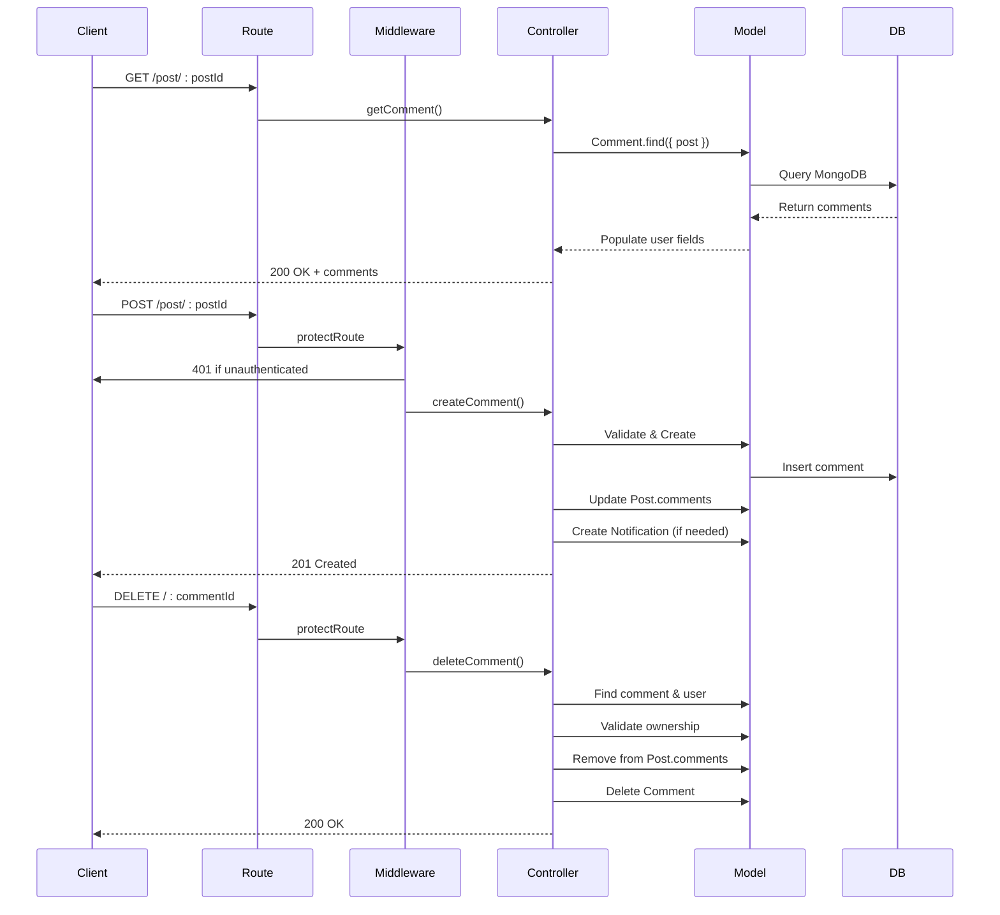
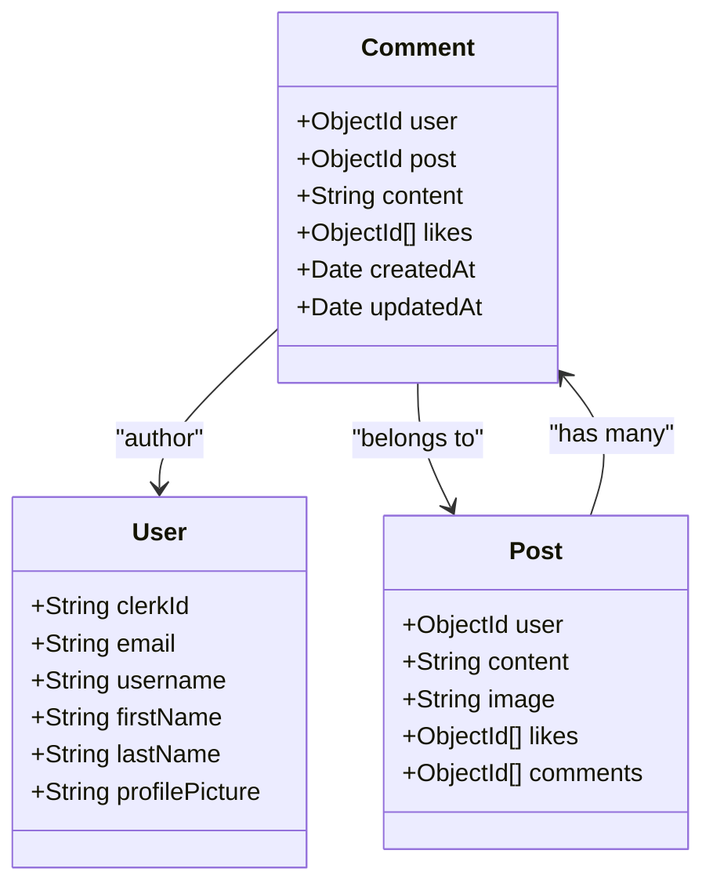
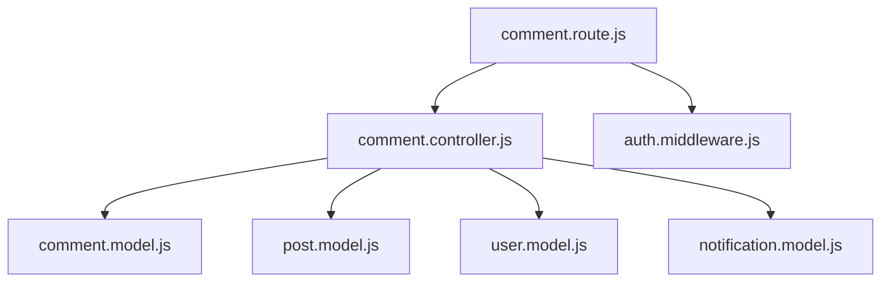

# Comment System

<cite>
**Referenced Files in This Document**  
- [comment.model.js](file://backend/src/models/comment.model.js#L1-L32)
- [comment.controller.js](file://backend/src/controllers/comment.controller.js#L1-L83)
- [comment.route.js](file://backend/src/routes/comment.route.js#L1-L15)
- [post.model.js](file://backend/src/models/post.model.js#L1-L36)
- [user.model.js](file://backend/src/models/user.model.js#L1-L63)
- [auth.middleware.js](file://backend/src/middleware/auth.middleware.js#L1-L8)
</cite>

## Table of Contents
1. [Introduction](#introduction)
2. [Project Structure](#project-structure)
3. [Core Components](#core-components)
4. [Architecture Overview](#architecture-overview)
5. [Detailed Component Analysis](#detailed-component-analysis)
6. [Dependency Analysis](#dependency-analysis)
7. [Performance Considerations](#performance-considerations)
8. [Troubleshooting Guide](#troubleshooting-guide)

## Introduction
The Comment System in xClone enables users to interact with posts by creating, retrieving, and deleting comments. It supports a flat comment structure (no nested replies), enforces ownership validation, integrates with notifications, and ensures data integrity through MongoDB relationships. This document details the implementation, data model, CRUD operations, security checks, and performance considerations.

## Project Structure
The comment system is implemented in the backend using Express.js with Mongoose ORM. Key components are organized in a modular fashion:
- **Models**: Define schema and relationships
- **Controllers**: Handle business logic for CRUD operations
- **Routes**: Define API endpoints with middleware
- **Middleware**: Enforce authentication



**Diagram sources**
- [comment.route.js](file://backend/src/routes/comment.route.js#L1-L15)
- [comment.controller.js](file://backend/src/controllers/comment.controller.js#L1-L83)
- [comment.model.js](file://backend/src/models/comment.model.js#L1-L32)

**Section sources**
- [comment.route.js](file://backend/src/routes/comment.route.js#L1-L15)
- [comment.controller.js](file://backend/src/controllers/comment.controller.js#L1-L83)

## Core Components
The core components of the comment system include:
- **Comment Model**: Defines structure and relationships
- **Comment Controller**: Implements CRUD logic
- **Comment Routes**: Exposes RESTful endpoints
- **Auth Middleware**: Secures routes

These components work together to provide a secure and scalable commenting feature.

**Section sources**
- [comment.model.js](file://backend/src/models/comment.model.js#L1-L32)
- [comment.controller.js](file://backend/src/controllers/comment.controller.js#L1-L83)
- [comment.route.js](file://backend/src/routes/comment.route.js#L1-L15)

## Architecture Overview
The comment system follows a standard MVC-like pattern in Express:
- **Routes** receive HTTP requests
- **Middleware** authenticates users
- **Controllers** process logic and interact with models
- **Models** manage data persistence and relationships



**Diagram sources**
- [comment.route.js](file://backend/src/routes/comment.route.js#L1-L15)
- [auth.middleware.js](file://backend/src/middleware/auth.middleware.js#L1-L8)
- [comment.controller.js](file://backend/src/controllers/comment.controller.js#L1-L83)

## Detailed Component Analysis

### Comment Model Analysis
The `Comment` model defines the structure of a comment and its relationship to users and posts.



**Diagram sources**
- [comment.model.js](file://backend/src/models/comment.model.js#L1-L32)
- [post.model.js](file://backend/src/models/post.model.js#L1-L36)
- [user.model.js](file://backend/src/models/user.model.js#L1-L63)

**Section sources**
- [comment.model.js](file://backend/src/models/comment.model.js#L1-L32)

#### Schema Details
- **user**: Reference to the `User` model (required)
- **post**: Reference to the `Post` model (required)
- **content**: String with max length 280 characters (required)
- **likes**: Array of user IDs who liked the comment
- **timestamps**: Automatically managed `createdAt` and `updatedAt`

#### Validation Rules
- Content cannot be empty or whitespace-only
- User and post must exist in the database
- Only authenticated users can create/delete comments

### Comment Controller Analysis
The `comment.controller.js` file implements all CRUD operations with proper validation and error handling.

#### Get Comments
Retrieves all comments for a given post, sorted by creation time (newest first), with user details populated.

```javascript
const getComment = asyncHandler(async (req, res) => {
  const { postId } = req.params;
  const comment = await Comment.find({ post: postId })
    .sort({ createdAt: -1 })
    .populate("user", "username firstName lastName profilePicture");

  if (!comment) return res.status(404).json({ message: "there is no comment" });
  res.status(200).json({ comment });
});
```

**Section sources**
- [comment.controller.js](file://backend/src/controllers/comment.controller.js#L3-L12)

#### Create Comment
Handles comment creation with validation, ownership linking, and notification generation.

```javascript
const createComment = asyncHandler(async (req, res) => {
  const { userId } = getAuth(req);
  const { postId } = req.params;
  const { content } = req.body;
  if (!content || content.trim() === "") {
    return res.status(400).json({ error: "Comment cannot be empty" });
  }
  const user = await User.findOne({ clerkId: userId });
  const post = await Post.findById(postId);
  if (!user || !post)
    return res.status(404).json({ message: "user or post not found" });

  const comment = await Comment.create({
    user: user._id,
    post: post._id,
    content,
  });

  await Post.findByIdAndUpdate(postId, {
    $push: { comments: comment._id },
  });

  if (post.user.toString() !== user._id.toString()) {
    await Notification.create({
      from: user._id,
      to: post.user,
      type: "comment",
      post: postId,
      comment: comment._id,
    });
  }

  res.status(201).json({ comment });
});
```

**Key Logic:**
- Validates non-empty content
- Finds user by Clerk ID
- Links comment to post via `$push`
- Creates notification if commenting on others' posts

**Section sources**
- [comment.controller.js](file://backend/src/controllers/comment.controller.js#L14-L47)

#### Delete Comment
Implements ownership verification and cascade removal from parent post.

```javascript
const deleteComment = asyncHandler(async (req, res) => {
  const { userId } = getAuth(req);
  const { commentId } = req.params;

  const user = await User.findOne({ clerkId: userId });
  const comment = await Comment.findById(commentId);

  if (!user || !comment) {
    return res.status(404).json({ error: "User or comment not found" });
  }

  if (comment.user.toString() !== user._id.toString()) {
    return res
      .status(403)
      .json({ error: "You can only delete your own comments" });
  }

  await Post.findByIdAndUpdate(comment.post, {
    $pull: { comments: commentId },
  });

  await Comment.findByIdAndDelete(commentId);

  res.status(200).json({ message: "Comment deleted successfully" });
});
```

**Key Logic:**
- Verifies user authentication
- Confirms comment ownership
- Removes comment ID from post's comments array
- Deletes the comment document

**Section sources**
- [comment.controller.js](file://backend/src/controllers/comment.controller.js#L49-L83)

### Comment Routes Analysis
Defines public and protected endpoints with appropriate middleware.

```javascript
router.get("/post/:postId", getComment)
router.post("/post/:postId", protectRoute, createComment)
router.delete("/:commentId", protectRoute, deleteComment)
```

- **GET /post/:postId**: Public route to fetch comments
- **POST /post/:postId**: Protected route to create comment
- **DELETE /:commentId**: Protected route to delete comment

**Section sources**
- [comment.route.js](file://backend/src/routes/comment.route.js#L1-L15)

## Dependency Analysis
The comment system depends on several core models and middleware:



**Diagram sources**
- [comment.controller.js](file://backend/src/controllers/comment.controller.js#L1-L83)
- [comment.route.js](file://backend/src/routes/comment.route.js#L1-L15)

**Section sources**
- [comment.controller.js](file://backend/src/controllers/comment.controller.js#L1-L83)
- [comment.route.js](file://backend/src/routes/comment.route.js#L1-L15)

## Performance Considerations
- **Indexing**: Ensure indexes on `Comment.post` and `Comment.user` fields for fast queries
- **Pagination**: Currently not implemented; consider adding limit/offset for large comment threads
- **Population**: Using `.populate()` on user fields may impact performance; consider caching
- **Validation**: Lightweight validation at controller level prevents unnecessary database calls
- **Atomic Operations**: Comment creation and post update are separate operations; consider transactions for consistency

## Troubleshooting Guide
Common issues and solutions:

### Missing Comments
- **Cause**: Incorrect `postId` parameter
- **Fix**: Verify post exists and ID is correct
- **Debug**: Check `Post.findById(postId)` returns valid result

### Permission Errors (403)
- **Cause**: User trying to delete another user's comment
- **Fix**: Ensure `comment.user` matches authenticated user
- **Debug**: Log `comment.user.toString()` vs `user._id.toString()`

### Database Consistency Issues
- **Symptom**: Comment exists but not linked to post
- **Cause**: Failure in `$push` operation during creation
- **Fix**: Wrap comment creation and post update in transaction
- **Prevention**: Add error handling and rollback mechanism

### Empty Comments Allowed
- **Cause**: Validation bypassed
- **Fix**: Ensure `content.trim()` check is enforced
- **Test**: Send request with whitespace-only content

**Section sources**
- [comment.controller.js](file://backend/src/controllers/comment.controller.js#L1-L83)
- [comment.model.js](file://backend/src/models/comment.model.js#L1-L32)