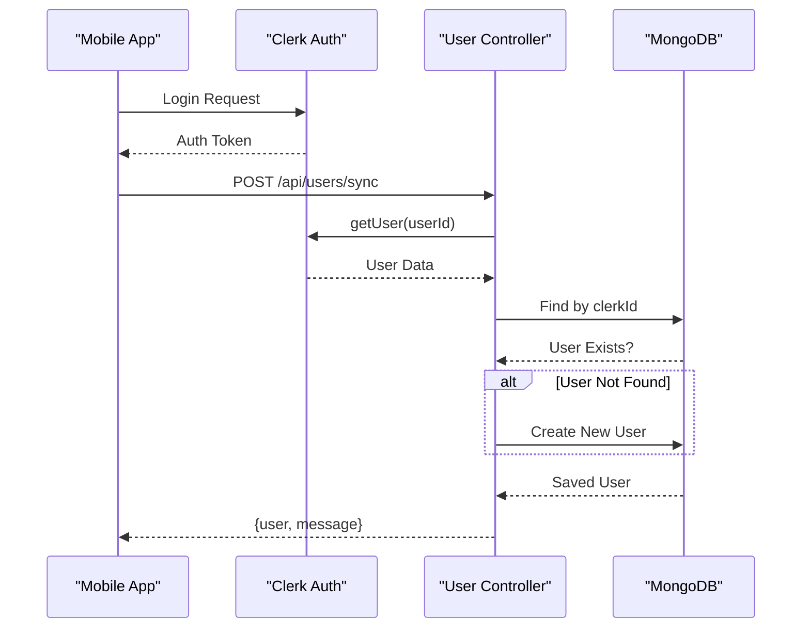
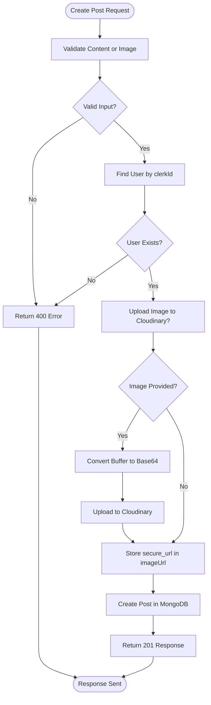
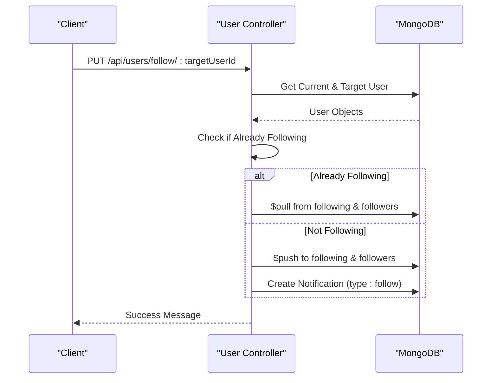
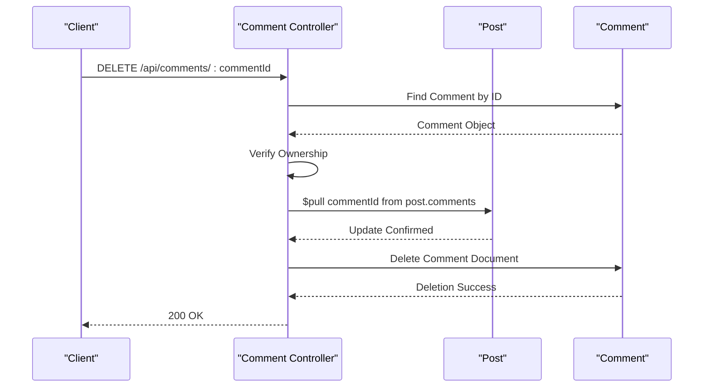

# Feature Implementation Details

<cite>
**Referenced Files in This Document**   
- [user.controller.js](file://backend/src/controllers/user.controller.js)
- [user.model.js](file://backend/src/models/user.model.js)
- [post.controller.js](file://backend/src/controllers/post.controller.js)
- [post.model.js](file://backend/src/models/post.model.js)
- [comment.controller.js](file://backend/src/controllers/comment.controller.js)
- [comment.model.js](file://backend/src/models/comment.model.js)
- [notification.controller.js](file://backend/src/controllers/notification.controller.js)
- [notification.model.js](file://backend/src/models/notification.model.js)
- [cloudinary.js](file://backend/src/config/cloudinary.js)
</cite>

## Table of Contents
1. [User Authentication and Profile Synchronization](#user-authentication-and-profile-synchronization)
2. [Post Creation Pipeline](#post-creation-pipeline)
3. [Social Interaction System](#social-interaction-system)
4. [Comment System Architecture](#comment-system-architecture)
5. [Performance and Optimization Strategies](#performance-and-optimization-strategies)

## User Authentication and Profile Synchronization

The user authentication flow in xClone begins on the mobile client and integrates with Clerk for secure identity management. Upon successful login via Clerk, the backend synchronizes user data from Clerk into MongoDB using a dedicated synchronization endpoint.

When a user logs in for the first time, the `syncUser` controller method retrieves user information from Clerk's API using the authenticated `userId`. It checks if the user already exists in MongoDB by matching the `clerkId`. If not found, it extracts essential fields such as email, name, and profile picture, then creates a new record in the `User` collection.

**Diagram sources**
- [user.controller.js](file://backend/src/controllers/user.controller.js#L25-L50)
- [user.model.js](file://backend/src/models/user.model.js#L1-L63)

The `User` model defines core attributes including `clerkId`, `email`, `username`, and social metadata like `followers` and `following`, stored as arrays of ObjectIds referencing other users.

**Section sources**
- [user.controller.js](file://backend/src/controllers/user.controller.js#L25-L58)
- [user.model.js](file://backend/src/models/user.model.js#L1-L63)

## Post Creation Pipeline

The post creation process supports both text content and image uploads. The `createPosts` controller handles incoming requests, validates input, and processes media through Cloudinary.

If an image is included, it is converted to a base64-encoded string and uploaded to Cloudinary with automated transformations for optimization (resizing to 800x600, auto quality, and format). The resulting secure URL is saved in the `Post` document alongside the user reference and optional text content.

**Diagram sources**
- [post.controller.js](file://backend/src/controllers/post.controller.js#L40-L85)
- [cloudinary.js](file://backend/src/config/cloudinary.js)

The `Post` model includes references to the author (`user`), optional image URL, content (limited to 280 characters), and arrays for `likes` and `comments`.

**Section sources**
- [post.controller.js](file://backend/src/controllers/post.controller.js#L40-L85)
- [post.model.js](file://backend/src/models/post.model.js#L1-L36)

## Social Interaction System

xClone implements a robust social interaction system enabling users to follow others, like posts, and receive real-time notifications.

### Follow/Unfollow Mechanics

The `followUser` controller toggles the follow state between users. It prevents self-following and uses atomic `$push` and `$pull` operations to update both the follower’s `following` list and the target’s `followers` list. A notification of type `"follow"` is created when a new follow occurs.

**Diagram sources**
- [user.controller.js](file://backend/src/controllers/user.controller.js#L60-L96)

### Feed Generation and Notifications

While feed generation logic is not fully visible in current files, the system supports notification creation for likes and comments. The `Notification` model stores `from`, `to`, `type`, and optional references to `post` or `comment`.

Like actions trigger notifications only when a user likes someone else's post, avoiding self-notifications. Similarly, commenting on another user's post generates a notification.

**Section sources**
- [user.controller.js](file://backend/src/controllers/user.controller.js#L60-L96)
- [post.controller.js](file://backend/src/controllers/post.controller.js#L100-L130)
- [comment.controller.js](file://backend/src/controllers/comment.controller.js#L40-L60)
- [notification.model.js](file://backend/src/models/notification.model.js)

## Comment System Architecture

The comment system features a hierarchical structure where comments are linked to posts and users. Each comment is stored in the `Comment` collection with references to the `user` and `post`.

### Hierarchical Structure

Comments are retrieved via the `getComment` controller, which queries all comments for a given `postId` and populates user details. The frontend is responsible for rendering them in chronological order.

### Deletion Cascade Behavior

When a comment is deleted, the system ensures data consistency by removing the comment ID from the parent post’s `comments` array before deleting the comment document. This two-step process maintains referential integrity.

**Diagram sources**
- [comment.controller.js](file://backend/src/controllers/comment.controller.js#L65-L83)
- [comment.model.js](file://backend/src/models/comment.model.js)

**Section sources**
- [comment.controller.js](file://backend/src/controllers/comment.controller.js#L20-L83)
- [comment.model.js](file://backend/src/models/comment.model.js#L1-L32)

## Performance and Optimization Strategies

xClone employs several performance optimization techniques to ensure scalability and responsiveness.

### Indexing Strategies

Although index definitions are not visible in model files, optimal query performance for feed generation would require compound indexes on:
- `Post.user` and `Post.createdAt` for user-specific post retrieval
- `Post.createdAt` for global feed sorting
- `User.username` for profile lookups

### Notification Deduplication

Currently, the system does not implement deduplication for notifications. However, edge cases such as concurrent likes are mitigated by MongoDB’s atomic update operations (`$push`, `$pull`) which prevent race conditions on likes and follows.

### Efficient Batching

Notification delivery appears to be immediate rather than batched. For future scalability, implementing a queue-based system (e.g., Redis or RabbitMQ) could enable batched notification processing and reduce database load during peak activity.

### Edge Case Handling

- **Concurrent Likes**: Handled via atomic MongoDB operations
- **Profile Privacy**: Not implemented in current code; all profiles are publicly accessible
- **Empty Comments/Posts**: Prevented by input validation in controllers
- **Orphaned Data**: Ensured by deletion cascades in comment removal

**Section sources**
- [post.controller.js](file://backend/src/controllers/post.controller.js#L100-L130)
- [comment.controller.js](file://backend/src/controllers/comment.controller.js#L65-L83)
- [user.controller.js](file://backend/src/controllers/user.controller.js#L60-L96)