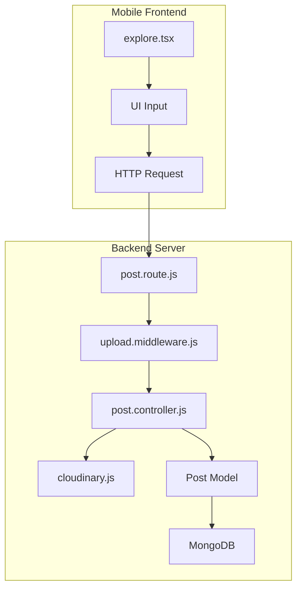
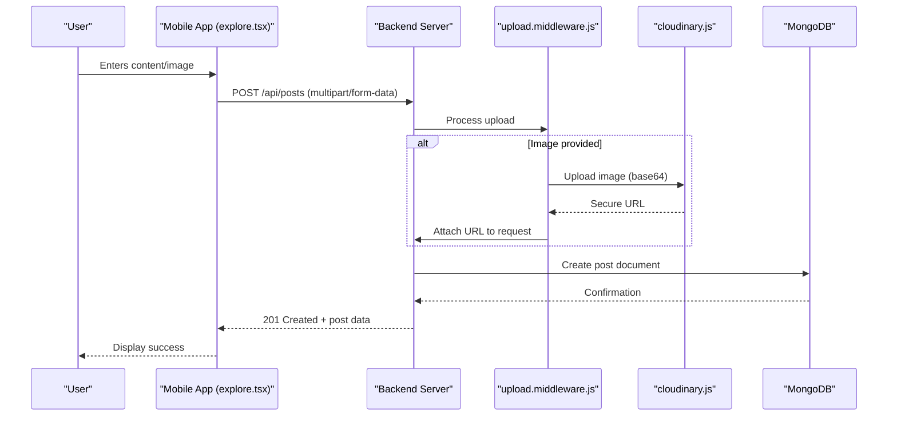
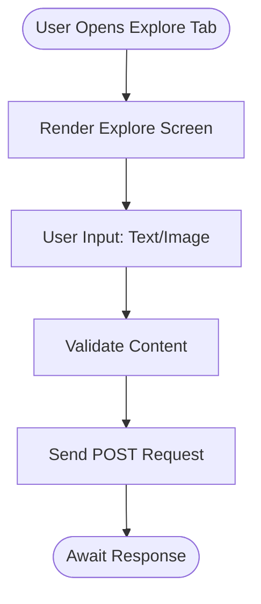
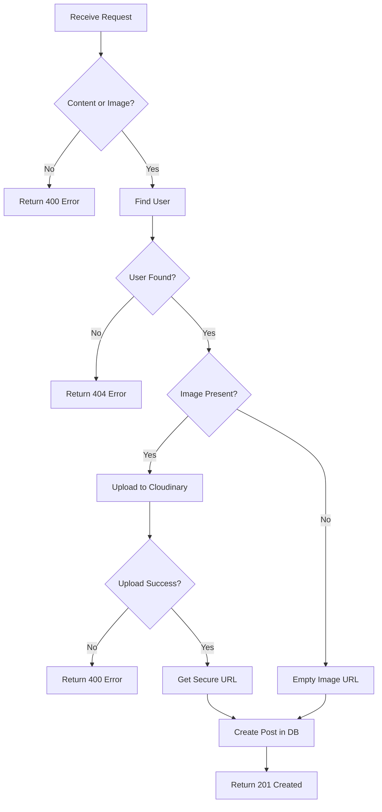
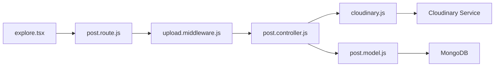

# Post Creation Pipeline

<cite>
**Referenced Files in This Document**   
- [explore.tsx](file://mobile/app/(tabs)/explore.tsx)
- [post.controller.js](file://backend/src/controllers/post.controller.js)
- [upload.middleware.js](file://backend/src/middleware/upload.middleware.js)
- [cloudinary.js](file://backend/src/config/cloudinary.js)
- [post.model.js](file://backend/src/models/post.model.js)
</cite>

## Table of Contents
1. [Introduction](#introduction)
2. [Project Structure](#project-structure)
3. [Core Components](#core-components)
4. [Architecture Overview](#architecture-overview)
5. [Detailed Component Analysis](#detailed-component-analysis)
6. [Dependency Analysis](#dependency-analysis)
7. [Performance Considerations](#performance-considerations)
8. [Troubleshooting Guide](#troubleshooting-guide)
9. [Conclusion](#conclusion)

## Introduction
This document provides a comprehensive analysis of the post creation pipeline in the xClone application. It traces the full lifecycle of a post from user input in the mobile frontend to backend persistence in MongoDB. The pipeline includes handling text content and image uploads via Multer middleware, processing images through Cloudinary for secure storage and optimization, and storing post data using the Post model. Special attention is given to validation, error handling, and integration points between components. The explanation is designed to be accessible to both technical and non-technical readers.

## Project Structure
The xClone project follows a modular architecture with a clear separation between frontend and backend components. The mobile application is built using React Native with Expo, while the backend is implemented in Node.js with Express and MongoDB.



**Diagram sources**
- [explore.tsx](file://mobile/app/(tabs)/explore.tsx#L1-L110)
- [post.controller.js](file://backend/src/controllers/post.controller.js#L1-L158)
- [upload.middleware.js](file://backend/src/middleware/upload.middleware.js#L1-L21)

**Section sources**
- [explore.tsx](file://mobile/app/(tabs)/explore.tsx#L1-L110)
- [post.controller.js](file://backend/src/controllers/post.controller.js#L1-L158)

## Core Components
The post creation pipeline consists of several key components:
- **Mobile UI (explore.tsx)**: Provides the user interface for creating posts
- **Multer Middleware (upload.middleware.js)**: Handles file uploads in memory
- **Cloudinary Integration (cloudinary.js)**: Manages image storage and transformation
- **Post Controller (post.controller.js)**: Implements business logic for post creation
- **Post Model (post.model.js)**: Defines the data structure and schema for posts

These components work together to ensure secure, efficient, and reliable post creation with both text and image content.

**Section sources**
- [post.controller.js](file://backend/src/controllers/post.controller.js#L1-L158)
- [upload.middleware.js](file://backend/src/middleware/upload.middleware.js#L1-L21)
- [post.model.js](file://backend/src/models/post.model.js#L1-L36)

## Architecture Overview
The post creation pipeline follows a request-response architecture with clear separation of concerns between frontend and backend components.



**Diagram sources**
- [explore.tsx](file://mobile/app/(tabs)/explore.tsx#L1-L110)
- [upload.middleware.js](file://backend/src/middleware/upload.middleware.js#L1-L21)
- [cloudinary.js](file://backend/src/config/cloudinary.js#L1-L10)
- [post.controller.js](file://backend/src/controllers/post.controller.js#L1-L158)

## Detailed Component Analysis

### Mobile UI Component (explore.tsx)
The explore.tsx file contains the user interface for the Explore tab, which serves as the entry point for post creation. While the current implementation is primarily informational, it establishes the foundation for user interaction.



**Diagram sources**
- [explore.tsx](file://mobile/app/(tabs)/explore.tsx#L1-L110)

**Section sources**
- [explore.tsx](file://mobile/app/(tabs)/explore.tsx#L1-L110)

### Upload Middleware (upload.middleware.js)
The upload middleware uses Multer to handle multipart form data, specifically for image uploads. It stores files in memory as buffers, which is ideal for forwarding to Cloudinary without writing to disk.

```javascript
const storage = multer.memoryStorage();
const fileFilter = (req, file, cb) => {
    if (file.mimetype.startsWith("image/")) {
      cb(null, true);
    } else {
      cb(new Error("Only image files are allowed"), false);
    }
  };
  
  const upload = multer({
    storage: storage,
    fileFilter: fileFilter,
    limits: { fileSize: 5 * 1024 * 1024 }, // 5MB limit
  });
```

Key features:
- **Memory Storage**: Files are stored in RAM as Buffer objects
- **File Type Validation**: Only image files are accepted
- **Size Limitation**: Maximum 5MB per file
- **Error Handling**: Rejects non-image files with descriptive errors

**Section sources**
- [upload.middleware.js](file://backend/src/middleware/upload.middleware.js#L1-L21)

### Cloudinary Configuration (cloudinary.js)
The Cloudinary configuration establishes a secure connection to the Cloudinary service using environment variables for sensitive credentials.

```javascript
import { v2 as cloudinary } from "cloudinary";
import { ENV } from "./env.js";

cloudinary.config({
  cloud_name: ENV.CLOUDINARY_CLOUD_NAME,
  api_key: ENV.CLOUDINARY_API_KEY,
  api_secret: ENV.CLOUDINARY_API_SECRET,
});

export default cloudinary;
```

Security considerations:
- Credentials are loaded from environment variables
- No hardcoded API keys in source code
- Secure transmission via HTTPS by default

**Section sources**
- [cloudinary.js](file://backend/src/config/cloudinary.js#L1-L10)

### Post Controller (post.controller.js)
The post.controller.js file contains the createPosts function that orchestrates the entire post creation process.



**Diagram sources**
- [post.controller.js](file://backend/src/controllers/post.controller.js#L50-L95)

**Section sources**
- [post.controller.js](file://backend/src/controllers/post.controller.js#L50-L95)

### Post Model (post.model.js)
The Post model defines the schema for storing posts in MongoDB.

```javascript
const postSchema = new mongoose.Schema(
  {
    user: {
      type: mongoose.Schema.Types.ObjectId,
      ref: "User",
      required: true,
    },
    content: {
      type: String,
      maxLength: 280,
    },
    image: {
      type: String,
      default: "",
    },
    likes: [
      {
        type: mongoose.Schema.Types.ObjectId,
        ref: "User",
      },
    ],
    comments: [
      {
        type: mongoose.Schema.Types.ObjectId,
        ref: "Comment",
      },
    ],
  },
  { timestamps: true }
);
```

Data structure:
- **user**: Reference to User model (required)
- **content**: Text content with 280-character limit
- **image**: Cloudinary URL (optional)
- **likes**: Array of user references
- **comments**: Array of comment references
- **timestamps**: Automatically generated createdAt and updatedAt fields

**Section sources**
- [post.model.js](file://backend/src/models/post.model.js#L1-L36)

## Dependency Analysis
The post creation pipeline has a clear dependency chain from frontend to backend.



**Diagram sources**
- [explore.tsx](file://mobile/app/(tabs)/explore.tsx#L1-L110)
- [post.controller.js](file://backend/src/controllers/post.controller.js#L1-L158)
- [upload.middleware.js](file://backend/src/middleware/upload.middleware.js#L1-L21)
- [cloudinary.js](file://backend/src/config/cloudinary.js#L1-L10)
- [post.model.js](file://backend/src/models/post.model.js#L1-L36)

## Performance Considerations
To optimize the post creation pipeline, consider the following recommendations:

- **Client-side Image Optimization**: Compress and resize images before upload to reduce bandwidth usage and Cloudinary processing time
- **Indexing**: Ensure createdAt field is indexed in MongoDB for efficient feed queries
- **Caching**: Implement response caching for frequently accessed posts
- **Error Handling**: Use proper error boundaries to prevent cascading failures
- **Validation**: Perform client-side validation to reduce unnecessary server requests
- **Rate Limiting**: Implement rate limiting to prevent abuse of the post creation endpoint

## Troubleshooting Guide
Common issues and solutions for the post creation pipeline:

**Issue: Image upload fails with "Failed to upload image"**
- **Cause**: Cloudinary API error or network issue
- **Solution**: Check Cloudinary credentials, verify internet connection, ensure proper CORS configuration

**Issue: "Only image files are allowed" error**
- **Cause**: Non-image file type uploaded
- **Solution**: Ensure file has image MIME type (image/jpeg, image/png, etc.)

**Issue: "Please provide content or image" error**
- **Cause**: Empty post submission
- **Solution**: Require at least text content or image before submission

**Issue: 500 Internal Server Error during upload**
- **Cause**: Server-side exception
- **Solution**: Check server logs, verify Multer configuration, ensure sufficient memory

**Issue: Slow image processing**
- **Cause**: Large image files
- **Solution**: Implement client-side image compression, set appropriate Cloudinary transformations

**Section sources**
- [post.controller.js](file://backend/src/controllers/post.controller.js#L50-L95)
- [upload.middleware.js](file://backend/src/middleware/upload.middleware.js#L1-L21)

## Conclusion
The post creation pipeline in xClone demonstrates a robust architecture for handling user-generated content with both text and images. The system effectively leverages Multer for file handling, Cloudinary for image storage and optimization, and MongoDB for persistent data storage. The clear separation of concerns between components enhances maintainability and scalability. By following best practices for validation, error handling, and performance optimization, the pipeline provides a reliable user experience. Future improvements could include client-side image optimization, enhanced error reporting, and additional media type support.