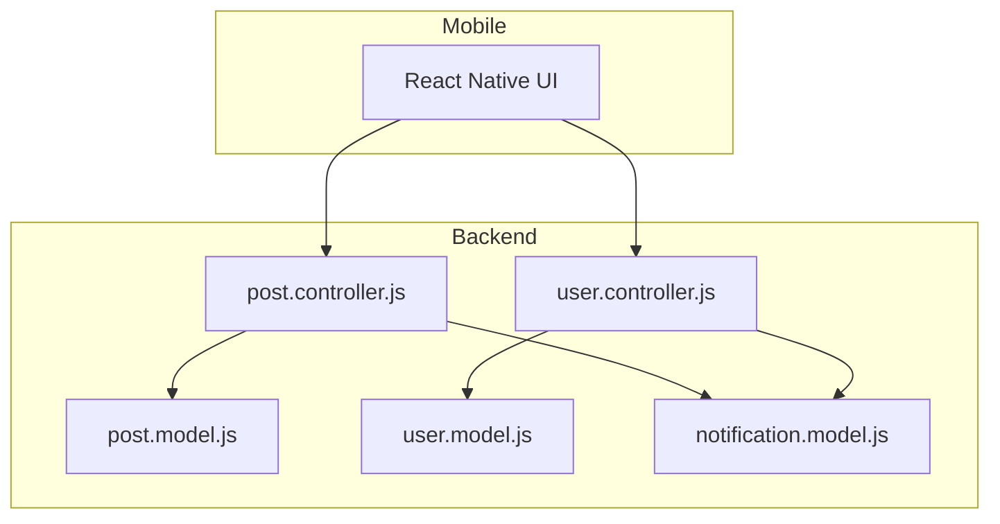
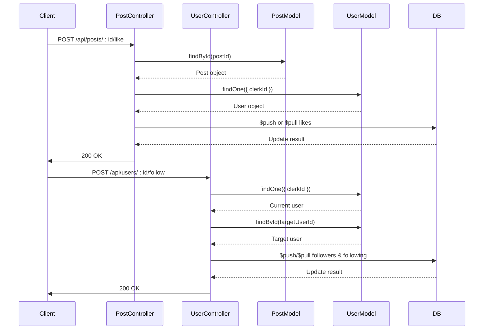
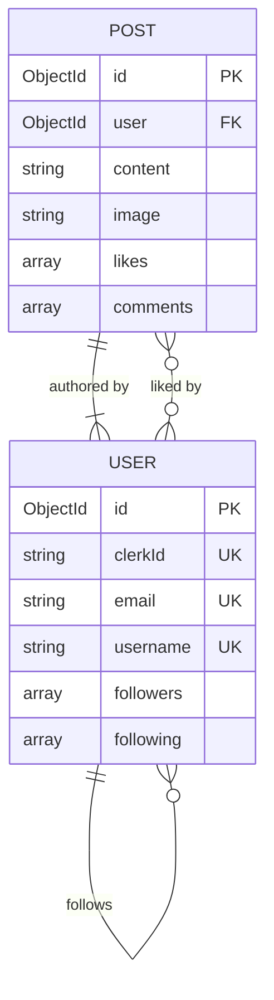
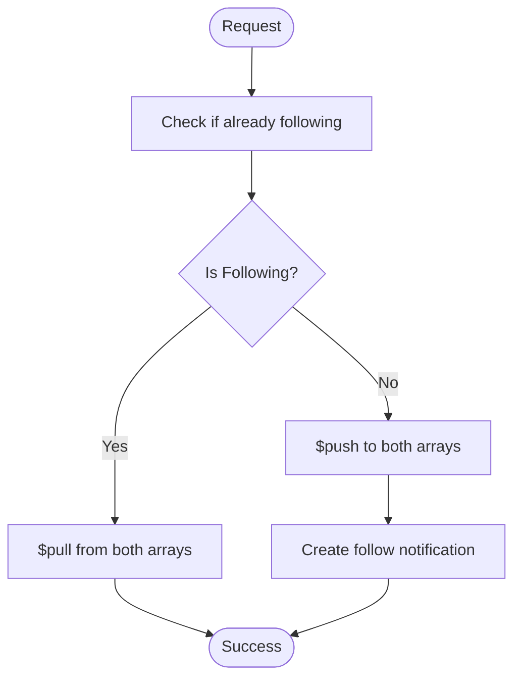
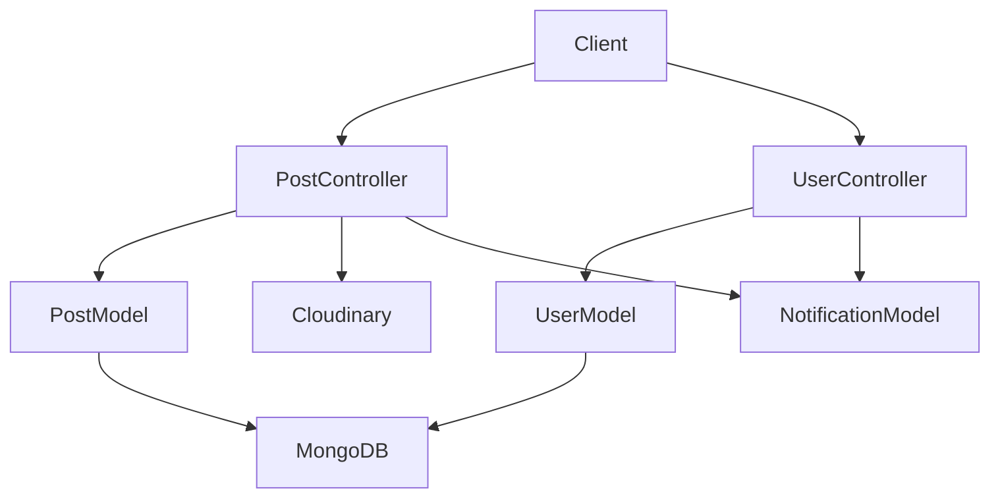

# Social Interactions System

<cite>
**Referenced Files in This Document**   
- [post.controller.js](file://backend/src/controllers/post.controller.js)
- [user.controller.js](file://backend/src/controllers/user.controller.js)
- [post.model.js](file://backend/src/models/post.model.js)
- [user.model.js](file://backend/src/models/user.model.js)
</cite>

## Table of Contents
1. [Introduction](#introduction)
2. [Project Structure](#project-structure)
3. [Core Components](#core-components)
4. [Architecture Overview](#architecture-overview)
5. [Detailed Component Analysis](#detailed-component-analysis)
6. [Dependency Analysis](#dependency-analysis)
7. [Performance Considerations](#performance-considerations)
8. [Troubleshooting Guide](#troubleshooting-guide)
9. [Conclusion](#conclusion)

## Introduction
The Social Interactions System in xClone enables users to engage with content and other users through likes, follows, and notifications. This document provides a comprehensive analysis of the implementation of like/unlike and follow/unfollow functionality, their impact on data models, concurrency handling, and performance optimization strategies. The system leverages MongoDB’s atomic operations to ensure data integrity during state toggling and uses efficient indexing and population techniques for scalable feed generation.

## Project Structure
The xClone project is structured into two main directories: `backend` and `mobile`. The backend implements RESTful APIs using Express.js, with controllers managing business logic and models defining MongoDB schemas. The social interaction features are primarily handled in the `post.controller.js` and `user.controller.js` files, which interact with the `Post` and `User` models.



**Diagram sources**
- [post.controller.js](file://backend/src/controllers/post.controller.js)
- [user.controller.js](file://backend/src/controllers/user.controller.js)
- [post.model.js](file://backend/src/models/post.model.js)
- [user.model.js](file://backend/src/models/user.model.js)

**Section sources**
- [post.controller.js](file://backend/src/controllers/post.controller.js)
- [user.controller.js](file://backend/src/controllers/user.controller.js)

## Core Components
The core components of the social interactions system include:
- **Like/Unlike functionality**: Implemented in `likePost` controller, modifying the `likes` array in the `Post` model.
- **Follow/Unfollow mechanics**: Handled in `followUser`, updating `followers` and `following` arrays in the `User` model.
- **Notification system**: Triggers notifications when a user likes another’s post or is followed.

These components use MongoDB’s atomic `$push` and `$pull` operations to safely modify arrays without race conditions.

**Section sources**
- [post.controller.js](file://backend/src/controllers/post.controller.js#L120-L157)
- [user.controller.js](file://backend/src/controllers/user.controller.js#L60-L96)

## Architecture Overview
The social interactions system follows a layered architecture:
- **Controller Layer**: Handles HTTP requests and orchestrates business logic.
- **Model Layer**: Defines data schema and relationships using Mongoose.
- **Database Layer**: Stores data in MongoDB with references between collections.



**Diagram sources**
- [post.controller.js](file://backend/src/controllers/post.controller.js)
- [user.controller.js](file://backend/src/controllers/user.controller.js)

## Detailed Component Analysis

### Like/Unlike Functionality
The `likePost` function in `post.controller.js` toggles a user’s like status on a post using atomic MongoDB operations.

#### Implementation
```javascript
export const likePost = asyncHandler(async (req, res) => {
  const { postId } = req.params;
  const { userId } = getAuth(req);
  const user = await User.findOne({ clerkId: userId });
  const post = await Post.findById(postId);

  const isLiked = post.likes.includes(user._id);

  if (isLiked) {
    await Post.findByIdAndUpdate(postId, { $pull: { likes: user._id } });
  } else {
    await Post.findByIdAndUpdate(postId, { $push: { likes: user._id } });
    if (post.user.toString() !== user._id.toString()) {
      await Notification.create({
        from: user._id,
        to: post.user,
        type: "like",
        post: postId,
      });
    }
  }

  res.status(200).json({
    message: isLiked ? "Post unliked" : "Post liked",
  });
});
```

#### Data Model


**Diagram sources**
- [post.model.js](file://backend/src/models/post.model.js#L1-L37)
- [post.controller.js](file://backend/src/controllers/post.controller.js#L120-L157)

**Section sources**
- [post.controller.js](file://backend/src/controllers/post.controller.js#L120-L157)
- [post.model.js](file://backend/src/models/post.model.js#L1-L37)

### Follow/Unfollow Mechanics
The `followUser` function manages bidirectional updates to `followers` and `following` arrays.

#### Implementation
```javascript
export const followUser = asyncHandler(async (req, res) => {
  const { userId } = getAuth(req);
  const { targetUserId } = req.params;

  const currentUser = await User.findOne({ clerkId: userId });
  const targetUser = await User.findById(targetUserId);

  const isFollowing = currentUser.following.includes(targetUserId);

  if (isFollowing) {
    await User.findByIdAndUpdate(currentUser._id, { $pull: { following: targetUserId } });
    await User.findByIdAndUpdate(targetUserId, { $pull: { followers: currentUser._id } });
  } else {
    await User.findByIdAndUpdate(currentUser._id, { $push: { following: targetUserId } });
    await User.findByIdAndUpdate(targetUserId, { $push: { followers: currentUser._id } });
    await Notification.create({
      from: currentUser._id,
      to: targetUserId,
      type: "follow",
    });
  }

  res.status(200).json({ message: isFollowing ? "Unfollowed" : "Followed" });
});
```

#### State Toggling and Concurrency
MongoDB’s atomic operations prevent race conditions during concurrent follow/unfollow requests. Each update is isolated and ensures data consistency.



**Diagram sources**
- [user.controller.js](file://backend/src/controllers/user.controller.js#L60-L96)
- [user.model.js](file://backend/src/models/user.model.js#L1-L64)

**Section sources**
- [user.controller.js](file://backend/src/controllers/user.controller.js#L60-L96)
- [user.model.js](file://backend/src/models/user.model.js#L1-L64)

## Dependency Analysis
The social interactions system depends on several components:
- **Clerk Authentication**: Provides user identity via `getAuth`.
- **Cloudinary**: Handles image uploads for posts.
- **MongoDB**: Stores all user and post data.



**Diagram sources**
- [post.controller.js](file://backend/src/controllers/post.controller.js)
- [user.controller.js](file://backend/src/controllers/user.controller.js)

**Section sources**
- [post.controller.js](file://backend/src/controllers/post.controller.js)
- [user.controller.js](file://backend/src/controllers/user.controller.js)

## Performance Considerations
### Indexing Strategy
To optimize query performance:
- Index `clerkId`, `username`, and `email` in the `User` model.
- Index `user` and `createdAt` in the `Post` model for fast timeline queries.

### Feed Generation
Potential approaches:
- **Pull-based**: Fetch posts from followed users on each request.
- **Push-based**: Precompute feeds and store in a separate collection.

Push-based is more scalable but requires background jobs to maintain consistency.

### Optimization Techniques
- Use MongoDB’s `$in` operator to fetch posts from multiple users.
- Limit and paginate results to reduce payload size.
- Cache frequently accessed profiles and feeds using Redis.

## Troubleshooting Guide
### Common Issues
- **Inconsistent like counts**: Caused by failed atomic updates. Check MongoDB logs.
- **Missing notifications**: Verify `Notification.create()` is called after successful follow/like.
- **Duplicate entries**: Ensure `$push` does not allow duplicates; consider using `$addToSet`.

### Data Integrity Checks
```javascript
// Check for duplicate likes
const post = await Post.findById(postId);
if (post.likes.filter(id => id.equals(userId)).length > 1) {
  // Handle duplicate
}
```

### Debugging Steps
1. Log all database operations.
2. Validate input parameters before updates.
3. Use MongoDB transactions for multi-document updates if needed.

**Section sources**
- [post.controller.js](file://backend/src/controllers/post.controller.js#L120-L157)
- [user.controller.js](file://backend/src/controllers/user.controller.js#L60-L96)

## Conclusion
The social interactions system in xClone effectively implements like/unlike and follow/unfollow features using MongoDB’s atomic operations for data consistency. The design emphasizes simplicity, scalability, and real-time user engagement through notifications. Future improvements could include feed caching, transactional updates, and enhanced error handling for edge cases.