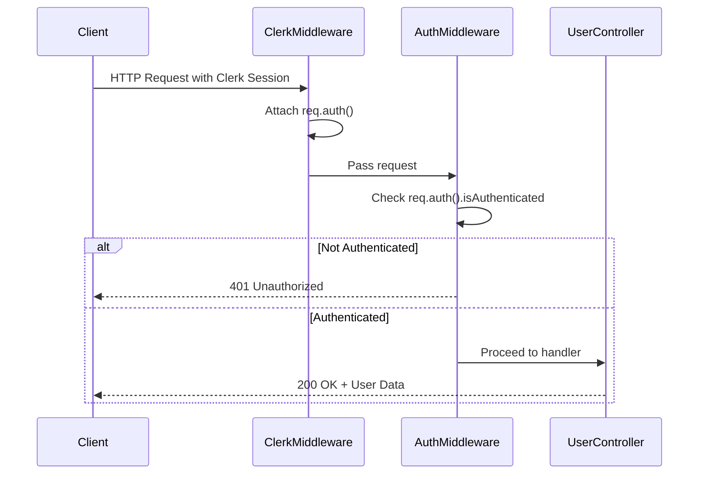
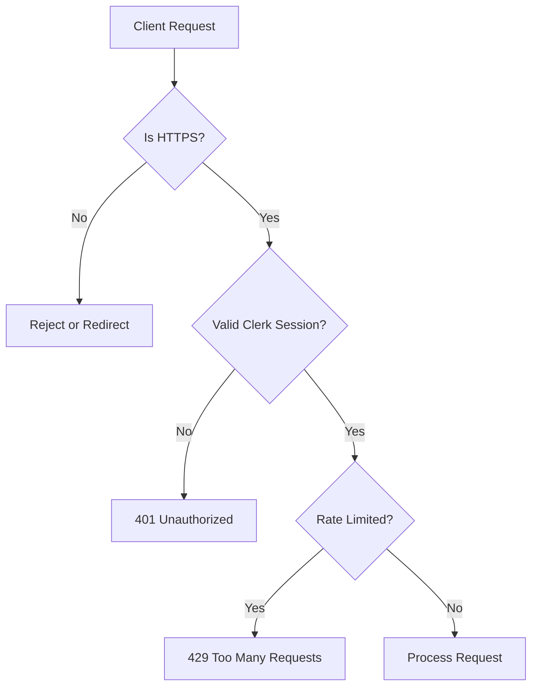

# User Authentication Flow

<cite>
**Referenced Files in This Document**   
- [user.controller.js](file://backend/src/controllers/user.controller.js)
- [auth.middleware.js](file://backend/src/middleware/auth.middleware.js)
- [user.model.js](file://backend/src/models/user.model.js)
- [server.js](file://backend/src/server.js)
</cite>

## Table of Contents
1. [User Authentication Flow](#user-authentication-flow)
2. [Authentication Integration with Clerk](#authentication-integration-with-clerk)
3. [User Profile Synchronization](#user-profile-synchronization)
4. [Backend Controller Methods](#backend-controller-methods)
5. [Route Protection and User Context](#route-protection-and-user-context)
6. [Edge Case Handling](#edge-case-handling)
7. [Debugging and Token Validation](#debugging-and-token-validation)
8. [Security Considerations](#security-considerations)

## Authentication Integration with Clerk

xClone implements OAuth-based authentication using **Clerk**, a third-party identity management platform. The integration is facilitated through the `@clerk/express` SDK, which provides middleware and utilities for handling authentication state, token verification, and user session management.

The `clerkMiddleware()` is applied globally in `server.js` to intercept all incoming requests and attach authentication context via `req.auth()`. This context includes user identity claims and session status, enabling downstream route handlers to access authenticated user data without manual token parsing.

```javascript
// backend/src/server.js
app.use(clerkMiddleware());
```

Clerk handles login, registration, and session persistence on the frontend, while the backend validates the authenticity of the session via Clerk’s server-side SDK. This decoupled approach enhances security by offloading sensitive credential handling to a dedicated identity provider.

**Section sources**
- [server.js](file://backend/src/server.js#L10-L11)
- [user.controller.js](file://backend/src/controllers/user.controller.js#L3)

## User Profile Synchronization

Upon first login, xClone synchronizes user data from Clerk to the local MongoDB database using the `syncUser` controller method. This ensures that user profiles are persisted in the application’s data layer for features like social interactions, notifications, and content ownership.

The synchronization process:
1. Extracts the authenticated user ID via `getAuth(req)`
2. Checks if a user with the matching `clerkId` already exists in MongoDB
3. If not found, retrieves full user data from Clerk’s API using `clerkClient.users.getUser(userId)`
4. Normalizes and maps the data to the local `User` model
5. Persists the new user document in MongoDB

```javascript
// backend/src/controllers/user.controller.js
export const syncUser = asyncHandler(async (req, res) => {
  const { userId } = getAuth(req);
  const existingUser = await User.findOne({ clerkId: userId });
  if (existingUser) return res.status(200).json({ message: "User already exists" });

  const clerkUser = await clerkClient.users.getUser(userId);
  const userData = {
    clerkId: userId,
    email: clerkUser.emailAddresses[0].emailAddress,
    firstName: clerkUser.firstName || "",
    lastName: clerkUser.lastName || "",
    username: clerkUser.emailAddresses[0].emailAddress.split("@")[0],
    profilePicture: clerkUser.imageUrl || "",
  };
  const user = await User.create(userData);
  res.status(201).json({ user, message: "User created successfully" });
});
```

This lazy synchronization strategy ensures scalability by deferring database writes until a user actively logs in.

**Section sources**
- [user.controller.js](file://backend/src/controllers/user.controller.js#L15-L34)

## Backend Controller Methods

The `user.controller.js` file contains key methods for user lifecycle management. These controllers interact with the `User` model and Clerk’s API to manage profile data.

### User Creation (`syncUser`)
As described above, this method creates a new user in MongoDB upon first login.

### User Retrieval (`getCurrentUser`, `getUserProfile`)
- `getCurrentUser`: Fetches the authenticated user’s profile using `clerkId` from the session.
- `getUserProfile`: Retrieves a public user profile by `username` for display on profile pages.

```javascript
export const getCurrentUser = asyncHandler(async (req, res) => {
  const { userId } = getAuth(req);
  const user = await User.findOne({ clerkId: userId });
  if (!user) return res.status(404).json({ message: "User not found" });
  res.status(200).json({ user });
});
```

### Profile Update (`updateProfile`)
Allows authenticated users to update their profile fields (e.g., bio, location). The update is performed via `findOneAndUpdate` using the `clerkId` as the lookup key.

```javascript
export const updateProfile = asyncHandler(async (req, res) => {
  const { userId } = getAuth(req);
  const user = await User.findOneAndUpdate({ clerkId: userId }, req.body, {
    new: true,
  });
  if (!user) return res.status(404).json({ message: "User not found" });
  res.status(200).json({ user });
});
```

**Section sources**
- [user.controller.js](file://backend/src/controllers/user.controller.js#L0-L70)

## Route Protection and User Context

The `auth.middleware.js` file defines the `protectRoute` middleware, which enforces authentication on protected endpoints. It checks the `isAuthenticated` flag provided by `req.auth()` (injected by Clerk middleware) and rejects unauthenticated requests with a 401 status.

```javascript
// backend/src/middleware/auth.middleware.js
export const protectRoute = async (req, res, next) => {
  if (!req.auth().isAuthenticated) {
    return res.status(401).json({
      message: "Unauthorized - you must be logged in",
    });
  }
  next();
};
```

This middleware is applied to routes that require authentication, such as profile updates or social actions (e.g., following users). It ensures that only valid sessions can access sensitive operations.



**Diagram sources**
- [auth.middleware.js](file://backend/src/middleware/auth.middleware.js#L1-L8)
- [user.controller.js](file://backend/src/controllers/user.controller.js#L3)

**Section sources**
- [auth.middleware.js](file://backend/src/middleware/auth.middleware.js#L1-L8)

## Edge Case Handling

The authentication flow includes handling for several edge cases:

### Email Conflicts
While Clerk manages email uniqueness, the local `User` model enforces `email` and `username` uniqueness via MongoDB constraints. If a duplicate email is attempted during sync, MongoDB will throw a duplicate key error.

### Profile Updates for Non-Existent Users
If `updateProfile` is called for a user not found in MongoDB, the controller returns a 404 error. This prevents orphaned updates and ensures data consistency.

### Session Expiration
Clerk manages session expiration on the frontend. When a session expires, `req.auth().isAuthenticated` becomes `false`, and `protectRoute` blocks access. The frontend should redirect to login upon receiving a 401 response.

### Self-Follow Prevention
The `followUser` endpoint explicitly checks if the requester is attempting to follow themselves, returning a 400 error if true.

```javascript
if (userId === targetUserId) {
  return res.status(400).json({ error: "You cannot follow yourself" });
}
```

**Section sources**
- [user.controller.js](file://backend/src/controllers/user.controller.js#L45-L50)

## Debugging and Token Validation

To debug authentication issues:
1. Verify that `clerkMiddleware()` is applied before route handlers.
2. Log `req.auth()` to inspect session claims during requests.
3. Use Clerk’s dashboard to inspect active sessions and user states.

Token validation is handled automatically by Clerk’s SDK. The `getAuth(req)` function validates the session JWT’s signature, expiration, and issuer. Developers should not manually decode or validate tokens unless for logging purposes.

Example debugging snippet:
```javascript
console.log("Auth object:", req.auth());
```

Ensure that environment variables (e.g., `CLERK_SECRET_KEY`) are correctly set in production to prevent token validation failures.

**Section sources**
- [user.controller.js](file://backend/src/controllers/user.controller.js#L3)
- [auth.middleware.js](file://backend/src/middleware/auth.middleware.js#L3)

## Security Considerations

### JWT Validation
Clerk’s middleware automatically validates JWTs using the issuer’s public keys. This includes checking:
- Signature authenticity
- Token expiration (`exp`)
- Issuer (`iss`) and audience (`aud`) claims

### Rate Limiting
The `arcjetMiddleware` provides rate limiting on authentication endpoints to prevent brute-force attacks. It denies requests exceeding the threshold with a 429 status.

```javascript
// arcjet.middleware.js
if (decision.reason.isRateLimit()) {
  return res.status(429).json({ error: "Too Many Requests" });
}
```

### Input Sanitization
While Clerk handles input validation during registration, the backend should still validate and sanitize profile update payloads to prevent injection attacks.

### Secure Transmission
Ensure HTTPS is enforced in production to protect session tokens in transit.



**Diagram sources**
- [arcjet.middleware.js](file://backend/src/middleware/arcjet.middleware.js#L5-L15)
- [auth.middleware.js](file://backend/src/middleware/auth.middleware.js#L3)

**Section sources**
- [arcjet.middleware.js](file://backend/src/middleware/arcjet.middleware.js#L1-L20)
- [auth.middleware.js](file://backend/src/middleware/auth.middleware.js#L1-L8)