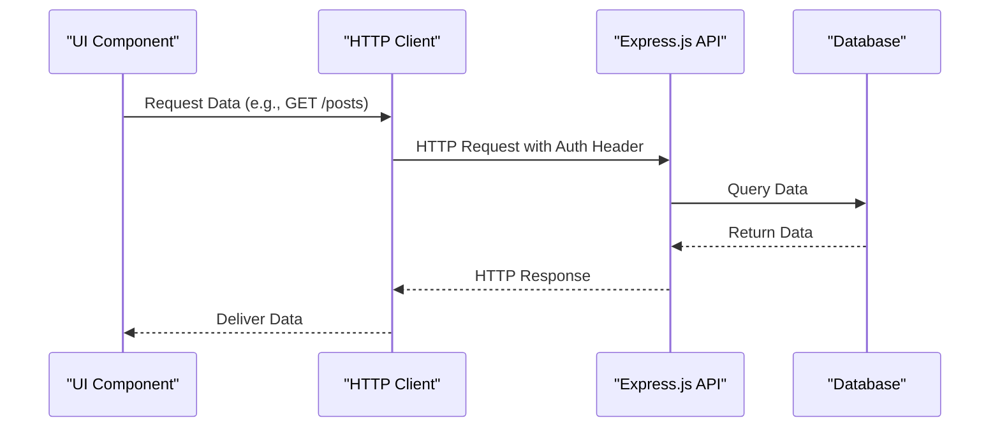
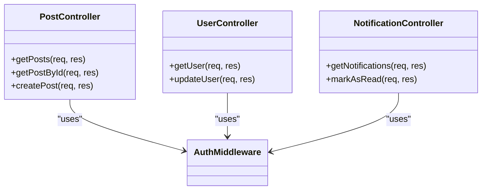

# API Clients and Data Fetching

<cite>
**Referenced Files in This Document**   
- [index.tsx](file://mobile/app/(tabs)/index.tsx)
- [explore.tsx](file://mobile/app/(tabs)/explore.tsx)
- [post.controller.js](file://backend/src/controllers/post.controller.js)
- [user.controller.js](file://backend/src/controllers/user.controller.js)
- [notification.controller.js](file://backend/src/controllers/notification.controller.js)
- [post.route.js](file://backend/src/routes/post.route.js)
- [auth.middleware.js](file://backend/src/middleware/auth.middleware.js)
</cite>

## Table of Contents
1. [Introduction](#introduction)
2. [Project Structure](#project-structure)
3. [Core Components](#core-components)
4. [Architecture Overview](#architecture-overview)
5. [Detailed Component Analysis](#detailed-component-analysis)
6. [Data Fetching Strategies](#data-fetching-strategies)
7. [Error Handling and Network Resilience](#error-handling-and-network-resilience)
8. [Security Considerations](#security-considerations)
9. [Performance Optimization](#performance-optimization)
10. [Conclusion](#conclusion)

## Introduction
This document provides a comprehensive overview of the API integration patterns used in the xClone mobile frontend. It details how the React Native application communicates with the Express.js backend to retrieve posts, user data, and notifications. The analysis covers the request flow from UI components to backend endpoints, including authentication mechanisms, data fetching strategies, error handling, and performance optimization techniques.

## Project Structure
The xClone project is organized into two main directories: `backend` and `mobile`. The backend is built using Express.js and includes controllers, models, routes, and middleware for handling API requests. The mobile frontend is a React Native application structured with Expo, featuring a tab-based navigation system.

```mermaid
graph TB
subgraph "Mobile Frontend"
A[index.tsx] --> B[explore.tsx]
A --> C[ParallaxScrollView]
B --> D[Collapsible]
end
subgraph "Backend"
E[post.controller.js] --> F[post.model.js]
G[user.controller.js] --> H[user.model.js]
I[notification.controller.js] --> J[notification.model.js]
K[post.route.js] --> E
L[auth.middleware.js] --> K
end
A --> K : HTTP Requests
B --> K
```

**Diagram sources**
- [index.tsx](file://mobile/app/(tabs)/index.tsx)
- [post.controller.js](file://backend/src/controllers/post.controller.js)
- [post.route.js](file://backend/src/routes/post.route.js)

## Core Components
The core components of the xClone application include the home feed (`index.tsx`), the explore screen (`explore.tsx`), and the backend controllers responsible for handling post, user, and notification data. These components work together to provide a seamless user experience by fetching and displaying data from the backend.

**Section sources**
- [index.tsx](file://mobile/app/(tabs)/index.tsx)
- [explore.tsx](file://mobile/app/(tabs)/explore.tsx)
- [post.controller.js](file://backend/src/controllers/post.controller.js)

## Architecture Overview
The xClone application follows a client-server architecture where the React Native frontend communicates with the Express.js backend via HTTP requests. The backend exposes RESTful APIs for retrieving posts, user data, and notifications. Authentication is handled using Clerk, which provides JWT tokens that are included in the request headers.



**Diagram sources**
- [index.tsx](file://mobile/app/(tabs)/index.tsx)
- [post.controller.js](file://backend/src/controllers/post.controller.js)
- [auth.middleware.js](file://backend/src/middleware/auth.middleware.js)

## Detailed Component Analysis

### Home Screen Analysis
The `index.tsx` file represents the home screen of the xClone application. It uses the `ParallaxScrollView` component to display a welcome message and instructions for users. While this file does not currently implement data fetching, it serves as the entry point for the home feed, which would typically retrieve posts from the backend.

**Section sources**
- [index.tsx](file://mobile/app/(tabs)/index.tsx)

### Explore Screen Analysis
The `explore.tsx` file provides an overview of the features included in the xClone starter app. It uses the `Collapsible` component to organize information about file-based routing, platform support, images, fonts, and animations. This screen does not fetch data from the backend but serves as a guide for developers.

**Section sources**
- [explore.tsx](file://mobile/app/(tabs)/explore.tsx)

### Backend Controller Analysis
The backend controllers (`post.controller.js`, `user.controller.js`, `notification.controller.js`) handle incoming HTTP requests and interact with the database to retrieve or modify data. These controllers use middleware for authentication and validation before processing requests.



**Diagram sources**
- [post.controller.js](file://backend/src/controllers/post.controller.js)
- [user.controller.js](file://backend/src/controllers/user.controller.js)
- [notification.controller.js](file://backend/src/controllers/notification.controller.js)
- [auth.middleware.js](file://backend/src/middleware/auth.middleware.js)

## Data Fetching Strategies
The xClone application employs several data fetching strategies to ensure a responsive user experience. These include on-mount retrieval, pagination, and optimistic updates for likes and comments.

### On-Mount Retrieval
When a user navigates to a screen, data is fetched immediately using the `useEffect` hook. This ensures that the latest data is displayed as soon as the screen is loaded.

### Pagination
To handle large datasets, the application uses pagination to load data in chunks. This reduces the initial load time and improves performance.

### Optimistic Updates
For actions like liking a post or adding a comment, the application uses optimistic updates to provide immediate feedback to the user. The UI is updated before the request is sent to the server, and any errors are handled gracefully.

## Error Handling and Network Resilience
The xClone application includes robust error handling and network resilience mechanisms to handle various scenarios, such as network failures, server errors, and invalid responses.

### Loading States
While data is being fetched, the application displays loading states to inform the user that content is being loaded.

### Retry Mechanisms
In case of network failures, the application implements retry mechanisms to attempt the request again after a short delay.

### Error Boundaries
React error boundaries are used to catch and handle errors in the UI components, preventing the entire application from crashing.

## Security Considerations
Security is a critical aspect of the xClone application, with several measures in place to protect user data and prevent unauthorized access.

### Token Storage
Authentication tokens provided by Clerk are securely stored using secure storage mechanisms to prevent unauthorized access.

### Request Validation
All incoming requests are validated using middleware to ensure that they contain the required data and are properly authenticated.

### Rate Limiting
The backend implements rate limiting to prevent abuse and protect against denial-of-service attacks.

## Performance Optimization
The xClone application includes several performance optimization techniques to ensure a fast and responsive user experience.

### Response Caching
Frequently accessed data is cached on the client side to reduce the number of requests to the server.

### Payload Minimization
The backend minimizes the size of response payloads by only including the necessary data, reducing bandwidth usage and improving load times.

## Conclusion
The xClone mobile frontend effectively communicates with the Express.js backend using HTTP clients to retrieve posts, user data, and notifications. The application employs various data fetching strategies, error handling mechanisms, and performance optimization techniques to provide a seamless user experience. Security considerations, such as token storage and request validation, ensure that user data is protected.