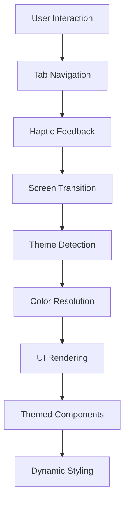
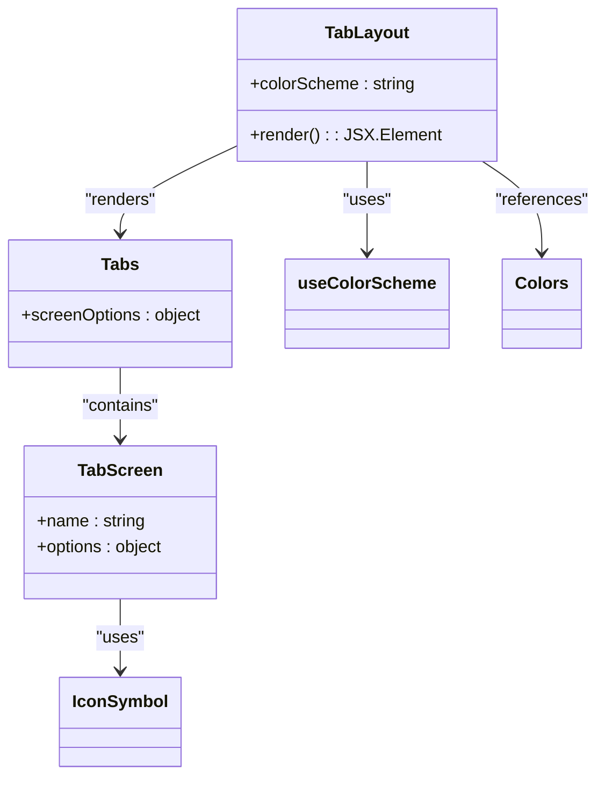
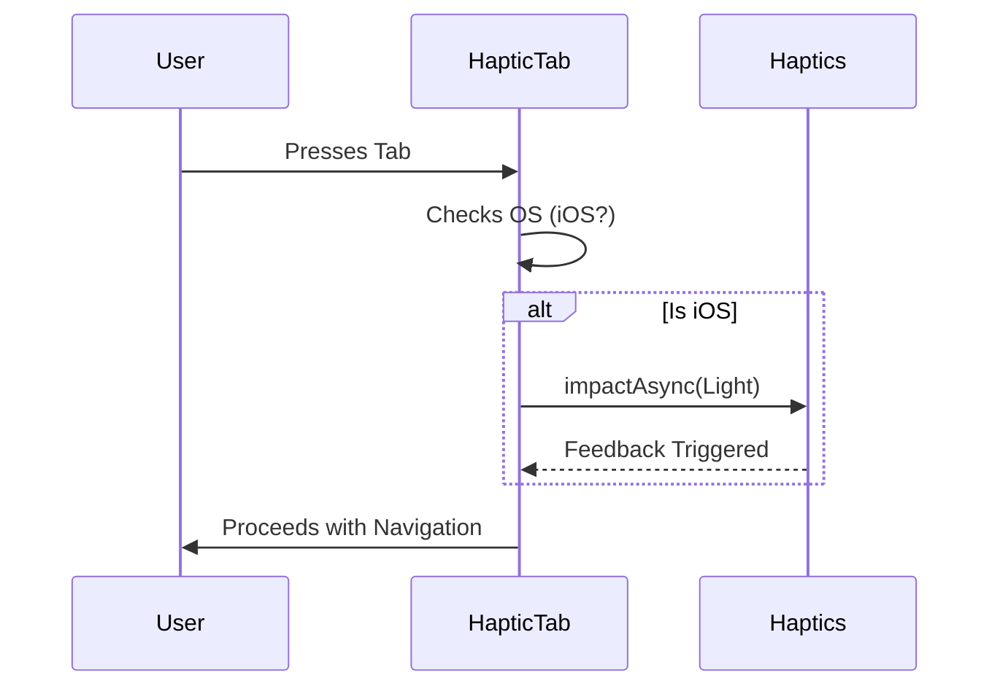
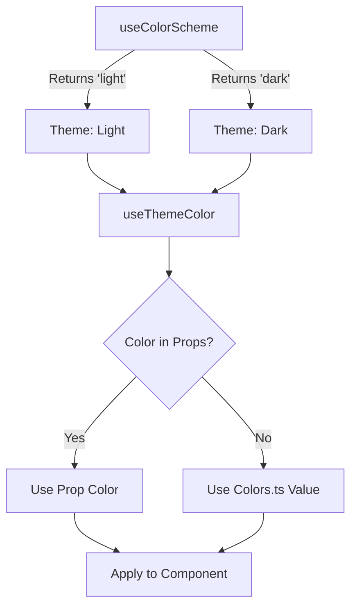

# Frontend Architecture

<cite>
**Referenced Files in This Document**   
- [app/(tabs)/_layout.tsx](file://mobile/app/(tabs)/_layout.tsx#L1-L45)
- [components/HapticTab.tsx](file://mobile/components/HapticTab.tsx#L1-L18)
- [constants/Colors.ts](file://mobile/constants/Colors.ts#L1-L26)
- [hooks/useColorScheme.ts](file://mobile/hooks/useColorScheme.ts#L1-L2)
- [hooks/useThemeColor.ts](file://mobile/hooks/useThemeColor.ts#L1-L21)
- [components/ThemedText.tsx](file://mobile/components/ThemedText.tsx#L1-L60)
- [components/ThemedView.tsx](file://mobile/components/ThemedView.tsx#L1-L14)
- [components/ui/TabBarBackground.tsx](file://mobile/components/ui/TabBarBackground.tsx#L1-L6)
- [components/ui/IconSymbol.tsx](file://mobile/components/ui/IconSymbol.tsx)
- [app/_layout.tsx](file://mobile/app/_layout.tsx)
- [app/index.tsx](file://mobile/app/index.tsx)
- [app/explore.tsx](file://mobile/app/explore.tsx)
</cite>

## Table of Contents
1. [Introduction](#introduction)
2. [Project Structure](#project-structure)
3. [Core Components](#core-components)
4. [Architecture Overview](#architecture-overview)
5. [Detailed Component Analysis](#detailed-component-analysis)
6. [Dependency Analysis](#dependency-analysis)
7. [Performance Considerations](#performance-considerations)
8. [Conclusion](#conclusion)

## Introduction
This document provides a comprehensive architectural overview of the React Native frontend for xClone, built using Expo and Expo Router. The application leverages file-driven routing, dynamic theming, and tab-based navigation to deliver a responsive and accessible mobile experience. The architecture emphasizes reusability, maintainability, and performance, with a clear separation of concerns between UI components, navigation logic, and theme management.

## Project Structure
The frontend resides in the `mobile` directory and follows Expo's file-based routing convention via the `app` directory. The structure is organized into logical folders:
- `app`: Contains route files and layout definitions using Expo Router
- `components`: Reusable UI components, including themed elements and navigation utilities
- `constants`: Shared values such as color palettes
- `hooks`: Custom React hooks for theme and color logic
- `scripts`: Utility scripts for project maintenance

The routing system uses the `(tabs)` group to define a tab navigator, with `index.tsx` and `explore.tsx` as tab screens. The root `_layout.tsx` wraps the entire app, while `(tabs)/_layout.tsx` defines the tab-specific layout.

```mermaid
graph TB
A[App Root] --> B[app/_layout.tsx]
A --> C[app/(tabs)/_layout.tsx]
C --> D[app/index.tsx]
C --> E[app/explore.tsx]
A --> F[components/]
A --> G[constants/Colors.ts]
A --> H[hooks/]
```

**Diagram sources**
- [app/_layout.tsx](file://mobile/app/_layout.tsx)
- [app/(tabs)/_layout.tsx](file://mobile/app/(tabs)/_layout.tsx#L1-L45)

## Core Components
The frontend architecture is built around reusable, theme-aware components and a robust navigation system. Key components include:
- **ThemedText** and **ThemedView**: Theme-aware wrappers for `Text` and `View` that adapt to light/dark mode
- **HapticTab**: Enhances tab interaction with haptic feedback on iOS
- **useColorScheme**: Hook to detect the system's preferred color scheme
- **useThemeColor**: Abstracts color resolution based on current theme and props
- **TabBarBackground**: Platform-specific tab bar background handling

These components work together to create a consistent, accessible, and performant user interface.

**Section sources**
- [components/ThemedText.tsx](file://mobile/components/ThemedText.tsx#L1-L60)
- [components/ThemedView.tsx](file://mobile/components/ThemedView.tsx#L1-L14)
- [hooks/useThemeColor.ts](file://mobile/hooks/useThemeColor.ts#L1-L21)
- [components/HapticTab.tsx](file://mobile/components/HapticTab.tsx#L1-L18)

## Architecture Overview
The application uses Expo Router's file-based routing to define navigation. The `(tabs)` directory contains a `_layout.tsx` file that configures a bottom tab navigator with two primary screens: Home and Explore. The layout leverages React Navigation under the hood, enhanced with custom components for visual and tactile feedback.

Theme management is centralized through `useColorScheme` from React Native, with color resolution handled by `useThemeColor`. This allows components to dynamically adapt their appearance based on the user's system preferences. The `Colors` constant defines a structured palette for both light and dark modes.



**Diagram sources**
- [app/(tabs)/_layout.tsx](file://mobile/app/(tabs)/_layout.tsx#L1-L45)
- [hooks/useColorScheme.ts](file://mobile/hooks/useColorScheme.ts#L1-L2)
- [hooks/useThemeColor.ts](file://mobile/hooks/useThemeColor.ts#L1-L21)

## Detailed Component Analysis

### Tab Navigation System
The tab navigation is defined in `app/(tabs)/_layout.tsx` using Expo Router's `Tabs` component. It configures two screens: Home and Explore, each with a title and icon rendered via `IconSymbol`.

The `screenOptions` prop customizes the tab bar appearance and behavior:
- `tabBarActiveTintColor`: Dynamically set based on the current theme
- `headerShown`: Disabled to use screen-specific headers
- `tabBarButton`: Enhanced with `HapticTab` for tactile feedback
- `tabBarBackground`: Uses `TabBarBackground` component
- `tabBarStyle`: iOS-specific absolute positioning for visual effects



**Diagram sources**
- [app/(tabs)/_layout.tsx](file://mobile/app/(tabs)/_layout.tsx#L1-L45)

**Section sources**
- [app/(tabs)/_layout.tsx](file://mobile/app/(tabs)/_layout.tsx#L1-L45)

### Haptic Feedback Implementation
The `HapticTab` component wraps the tab button pressability and adds haptic feedback on iOS devices. It uses `PlatformPressable` from React Navigation and `expo-haptics` to trigger a light impact when the user presses a tab.

The implementation checks `process.env.EXPO_OS` to ensure haptics are only triggered on iOS, where the tactile experience is most effective. This prevents unnecessary operations on Android and web platforms.



**Diagram sources**
- [components/HapticTab.tsx](file://mobile/components/HapticTab.tsx#L1-L18)

**Section sources**
- [components/HapticTab.tsx](file://mobile/components/HapticTab.tsx#L1-L18)

### Theme Management System
The theme system uses React Native's `useColorScheme` to detect the user's preferred color mode. The `useThemeColor` hook abstracts color resolution, allowing components to specify custom light/dark colors or fall back to the default palette in `Colors.ts`.

`ThemedText` and `ThemedView` are higher-level components that use `useThemeColor` to apply dynamic styles. They support multiple text variants (default, title, subtitle, etc.) and accept optional `lightColor` and `darkColor` props for overrides.



**Diagram sources**
- [hooks/useColorScheme.ts](file://mobile/hooks/useColorScheme.ts#L1-L2)
- [hooks/useThemeColor.ts](file://mobile/hooks/useThemeColor.ts#L1-L21)
- [constants/Colors.ts](file://mobile/constants/Colors.ts#L1-L26)
- [components/ThemedText.tsx](file://mobile/components/ThemedText.tsx#L1-L60)
- [components/ThemedView.tsx](file://mobile/components/ThemedView.tsx#L1-L14)

**Section sources**
- [hooks/useColorScheme.ts](file://mobile/hooks/useColorScheme.ts#L1-L2)
- [hooks/useThemeColor.ts](file://mobile/hooks/useThemeColor.ts#L1-L21)
- [constants/Colors.ts](file://mobile/constants/Colors.ts#L1-L26)
- [components/ThemedText.tsx](file://mobile/components/ThemedText.tsx#L1-L60)
- [components/ThemedView.tsx](file://mobile/components/ThemedView.tsx#L1-L14)

## Dependency Analysis
The frontend components form a well-defined dependency graph with minimal coupling. The core dependencies are:
- Expo Router for navigation and routing
- React Native for base components and hooks
- expo-haptics for tactile feedback
- Custom hooks and components for theme management

There are no circular dependencies, and external dependencies are limited to Expo-managed libraries. The architecture promotes reusability through composable components and hooks.

```mermaid
graph LR
A[app/(tabs)/_layout.tsx] --> B[expo-router/Tabs]
A --> C[useColorScheme]
A --> D[HapticTab]
A --> E[TabBarBackground]
A --> F[Colors]
D --> G[expo-haptics]
C --> H[react-native/useColorScheme]
E --> I[Platform]
F --> J[constants/Colors]
```

**Diagram sources**
- [app/(tabs)/_layout.tsx](file://mobile/app/(tabs)/_layout.tsx#L1-L45)
- [components/HapticTab.tsx](file://mobile/components/HapticTab.tsx#L1-L18)
- [hooks/useColorScheme.ts](file://mobile/hooks/useColorScheme.ts#L1-L2)
- [constants/Colors.ts](file://mobile/constants/Colors.ts#L1-L26)

**Section sources**
- [app/(tabs)/_layout.tsx](file://mobile/app/(tabs)/_layout.tsx#L1-L45)
- [components/HapticTab.tsx](file://mobile/components/HapticTab.tsx#L1-L18)
- [hooks/useColorScheme.ts](file://mobile/hooks/useColorScheme.ts#L1-L2)
- [constants/Colors.ts](file://mobile/constants/Colors.ts#L1-L26)

## Performance Considerations
The application is optimized for mobile performance through several strategies:
- **Haptic Feedback**: Limited to iOS and triggered only on press-in, minimizing performance impact
- **Theme Resolution**: Memoized through React hooks, avoiding unnecessary re-renders
- **Component Reusability**: Themed components reduce code duplication and improve bundle size
- **Asset Optimization**: Icons are rendered via `IconSymbol` as vector graphics, ensuring crisp display at any resolution
- **Conditional Styling**: Platform-specific styles (e.g., iOS tab bar positioning) are applied only when needed
- **Efficient Rendering**: Functional components with minimal state and pure rendering logic

The use of Expo's development tools ensures optimal debugging and profiling capabilities across platforms.

## Conclusion
The xClone React Native frontend demonstrates a modern, scalable architecture using Expo and Expo Router. The combination of file-based routing, dynamic theming, and reusable components creates a maintainable and user-friendly mobile application. The integration of haptic feedback and platform-specific optimizations enhances the user experience, particularly on iOS devices. This architecture provides a solid foundation for future feature development and performance improvements.