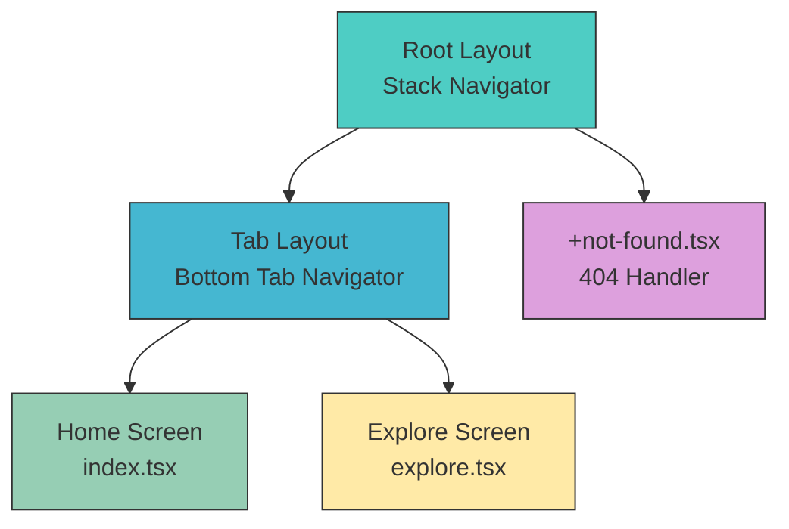
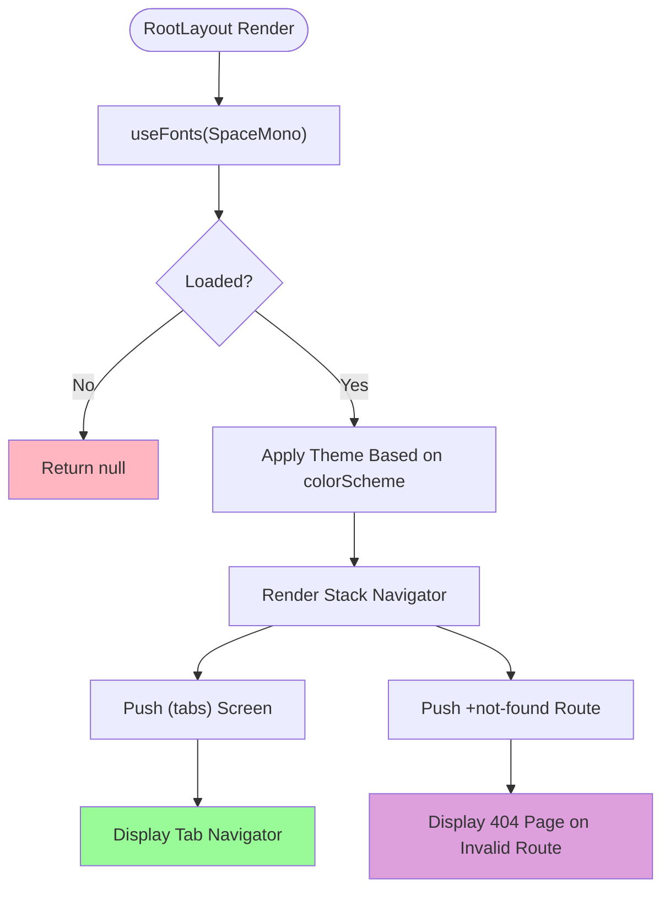
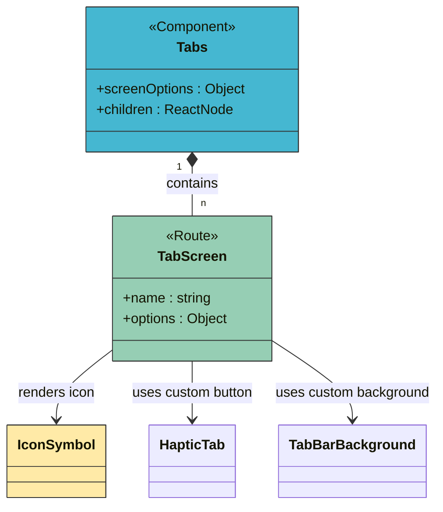

# Navigation Structure

<cite>
**Referenced Files in This Document**   
- [app/_layout.tsx](file://mobile/app/_layout.tsx)
- [app/(tabs)/_layout.tsx](file://mobile/app/(tabs)/_layout.tsx)
- [app/(tabs)/index.tsx](file://mobile/app/(tabs)/index.tsx)
- [app/(tabs)/explore.tsx](file://mobile/app/(tabs)/explore.tsx)
- [app/+not-found.tsx](file://mobile/app/+not-found.tsx)
</cite>

## Table of Contents
1. [Introduction](#introduction)
2. [Project Structure](#project-structure)
3. [Core Components](#core-components)
4. [Architecture Overview](#architecture-overview)
5. [Detailed Component Analysis](#detailed-component-analysis)
6. [Dependency Analysis](#dependency-analysis)
7. [Performance Considerations](#performance-considerations)
8. [Troubleshooting Guide](#troubleshooting-guide)
9. [Conclusion](#conclusion)

## Introduction
This document provides a comprehensive overview of the navigation system in xClone's React Native frontend, powered by Expo Router. It explains the file-based routing architecture, layout organization, tab navigation, error handling, and routing flow. The goal is to offer both technical depth and accessibility for developers at all levels, enabling a clear understanding of how screen navigation is structured and managed within the application.

## Project Structure
The navigation system is organized under the `app/` directory, which follows Expo Router’s file-based routing convention. This structure eliminates the need for manual route configuration and instead uses the file system hierarchy to define navigable screens and layout contexts.

Key directories and files:
- `app/`: Root directory for all navigable screens and layouts
- `(tabs)/`: A route group that encapsulates tab-based navigation
- `_layout.tsx`: Layout components that wrap child screens with shared UI and navigation context
- `index.tsx`: Default screen for a route (e.g., Home screen)
- `explore.tsx`: Secondary tab screen
- `+not-found.tsx`: Custom 404-style fallback for undefined routes

```mermaid
graph TB
A[app/] --> B[_layout.tsx]
A --> C[(tabs)/]
A --> D[+not-found.tsx]
C --> E[_layout.tsx]
C --> F[index.tsx]
C --> G[explore.tsx]
style A fill:#f9f,stroke:#333
style B fill:#bbf,stroke:#333
style C fill:#f96,stroke:#333
style D fill:#6f9,stroke:#333
style E fill:#bbf,stroke:#333
style F fill:#6f9,stroke:#333
style G fill:#6f9,stroke:#333
subgraph "Navigation Hierarchy"
B --> |"Root Stack"| C
E --> |"Tab Navigator"| F
E --> |"Tab Navigator"| G
end
```

**Diagram sources**
- [app/_layout.tsx](file://mobile/app/_layout.tsx#L1-L29)
- [app/(tabs)/_layout.tsx](file://mobile/app/(tabs)/_layout.tsx#L1-L45)

**Section sources**
- [app/_layout.tsx](file://mobile/app/_layout.tsx#L1-L29)
- [app/(tabs)/_layout.tsx](file://mobile/app/(tabs)/_layout.tsx#L1-L45)

## Core Components
The navigation system relies on several core components provided by Expo Router and React Navigation:
- **Stack**: Implements vertical navigation stack (e.g., modal screens, nested flows)
- **Tabs**: Provides bottom tab navigation between primary app sections
- **ThemeProvider**: Manages light/dark theme context for navigation UI
- **StatusBar**: Controls appearance of the device status bar
- **useColorScheme**: Hook to detect user’s preferred color scheme

These components are orchestrated through `_layout.tsx` files to define shared behavior and appearance across groups of screens.

**Section sources**
- [app/_layout.tsx](file://mobile/app/_layout.tsx#L1-L29)
- [app/(tabs)/_layout.tsx](file://mobile/app/(tabs)/_layout.tsx#L1-L45)

## Architecture Overview
The navigation architecture uses a **nested layout system** where each `_layout.tsx` file defines a routing context for its children. The root layout (`app/_layout.tsx`) sets up a **Stack Navigator**, which renders the `(tabs)` group as a single screen with no header. Inside `(tabs)`, another `_layout.tsx` configures a **Bottom Tab Navigator** with two tabs: Home and Explore.

This layered approach enables:
- Shared theming and font loading at the root level
- Header suppression for tab screens
- Independent tab routing with persistent navigation state
- Automatic deep linking support
- Custom 404 handling



**Diagram sources**
- [app/_layout.tsx](file://mobile/app/_layout.tsx#L1-L29)
- [app/(tabs)/_layout.tsx](file://mobile/app/(tabs)/_layout.tsx#L1-L45)

## Detailed Component Analysis

### Root Layout Analysis
The `app/_layout.tsx` file serves as the entry point for the entire navigation tree. It:
- Loads custom fonts asynchronously using `useFonts`
- Applies a theme based on the user’s system preference via `useColorScheme`
- Wraps the app in a `ThemeProvider` from React Navigation
- Defines a `Stack` navigator with two screens:
  - `(tabs)`: Main tab interface, with `headerShown: false`
  - `+not-found`: Fallback for invalid routes

If fonts are not yet loaded, the component returns `null`, implementing a simple splash state.



**Diagram sources**
- [app/_layout.tsx](file://mobile/app/_layout.tsx#L1-L29)

**Section sources**
- [app/_layout.tsx](file://mobile/app/_layout.tsx#L1-L29)

### Tab Layout Analysis
The `app/(tabs)/_layout.tsx` file defines the **Bottom Tab Navigator** using Expo Router’s `Tabs` component. It:
- Sets global tab bar options:
  - `tabBarActiveTintColor`: Dynamic color based on theme
  - `headerShown: false`: Hides header for tab screens
  - `tabBarButton`: Uses `HapticTab` for tactile feedback on press
  - `tabBarBackground`: Custom background component with iOS blur effect
- Defines two tab screens:
  - `index`: Labeled "Home", with house icon
  - `explore`: Labeled "Explore", with paperplane icon

The `Platform.select` utility applies iOS-specific styling (absolute positioning for blur effect).



**Diagram sources**
- [app/(tabs)/_layout.tsx](file://mobile/app/(tabs)/_layout.tsx#L1-L45)

**Section sources**
- [app/(tabs)/_layout.tsx](file://mobile/app/(tabs)/_layout.tsx#L1-L45)

### Screen Components
#### Home Screen (`index.tsx`)
- Displays a welcome message with animated wave (`HelloWave`)
- Uses `ParallaxScrollView` for dynamic header effects
- Shows instructions for development and project reset
- Serves as the default tab screen

#### Explore Screen (`explore.tsx`)
- Provides documentation on key app features:
  - File-based routing
  - Cross-platform support
  - Image handling
  - Font loading
  - Theme support
  - Animations
- Uses `Collapsible` sections for organized content
- Includes `ExternalLink` components for further reading

Both screens are wrapped in `ParallaxScrollView` with themed headers and content containers.

**Section sources**
- [app/(tabs)/index.tsx](file://mobile/app/(tabs)/index.tsx#L1-L75)
- [app/(tabs)/explore.tsx](file://mobile/app/(tabs)/explore.tsx#L1-L110)

## Dependency Analysis
The navigation system depends on:
- **Expo Router**: For file-based routing and layout composition
- **React Navigation**: For theme, stack, and tab navigation primitives
- **expo-status-bar**: For status bar styling
- **expo-font**: For asynchronous font loading
- **react-native-reanimated**: For animations (e.g., `HelloWave`)
- **Custom Components**: `HapticTab`, `IconSymbol`, `TabBarBackground`, etc.

No circular dependencies exist. Layouts are cleanly separated by route scope.

```mermaid
graph LR
A[app/_layout.tsx] --> B[expo-router/Stack]
A --> C[react-navigation/ThemeProvider]
A --> D[expo-font/useFonts]
A --> E[@/hooks/useColorScheme]
F[app/(tabs)/_layout.tsx] --> G[expo-router/Tabs]
F --> H[@/components/HapticTab]
F --> I[@/components/ui/IconSymbol]
F --> J[@/components/ui/TabBarBackground]
F --> K[@/constants/Colors]
F --> E
B --> A
G --> F
style A fill:#bbf,stroke:#333
style F fill:#bbf,stroke:#333
style B fill:#6f9,stroke:#333
style G fill:#6f9,stroke:#333
```

**Diagram sources**
- [app/_layout.tsx](file://mobile/app/_layout.tsx#L1-L29)
- [app/(tabs)/_layout.tsx](file://mobile/app/(tabs)/_layout.tsx#L1-L45)

**Section sources**
- [app/_layout.tsx](file://mobile/app/_layout.tsx#L1-L29)
- [app/(tabs)/_layout.tsx](file://mobile/app/(tabs)/_layout.tsx#L1-L45)

## Performance Considerations
- **Font Loading**: Async font loading prevents layout shift but may briefly show fallback fonts
- **Theme Handling**: `useColorScheme` is optimized for performance and re-renders only when system theme changes
- **Image Optimization**: Static assets are preloaded; `expo-image` supports advanced loading strategies
- **Tab Persistence**: Tab screens retain state when switching due to React Navigation’s tab persistence
- **Bundle Size**: Expo Router tree-shakes unused navigators, minimizing bundle impact

No major performance bottlenecks are present in the current navigation setup.

## Troubleshooting Guide
### Common Issues and Solutions

**Issue: Screen not found or blank**
- **Cause**: Fonts not loaded yet
- **Fix**: Ensure `SpaceMono-Regular.ttf` exists in `assets/fonts/`

**Issue: Tab bar not showing**
- **Cause**: `headerShown: false` might be misapplied
- **Fix**: Verify `Tabs.Screen` options in `(tabs)/_layout.tsx`

**Issue: Incorrect theme colors**
- **Cause**: `useColorScheme` not returning expected value
- **Fix**: Check `@/hooks/useColorScheme.ts` implementation and device settings

**Issue: Deep linking not working**
- **Cause**: Expo Router configuration incomplete
- **Fix**: Ensure `app.json` includes correct `expo.scheme` and `expo.router` settings

**Issue: Haptic feedback not working**
- **Cause**: `HapticTab` not properly linked or iOS-only
- **Fix**: Verify `HapticTab` component supports target platform

**Section sources**
- [app/_layout.tsx](file://mobile/app/_layout.tsx#L1-L29)
- [app/(tabs)/_layout.tsx](file://mobile/app/(tabs)/_layout.tsx#L1-L45)
- [app/+not-found.tsx](file://mobile/app/+not-found.tsx#L1-L32)

## Conclusion
The navigation structure in xClone leverages Expo Router’s file-based routing to deliver a clean, scalable, and maintainable architecture. By using nested `_layout.tsx` files, the app separates concerns between root-level configuration (theming, fonts, stack navigation) and tab-level routing (bottom tabs, icons, labels). The integration of React Navigation ensures compatibility across platforms, while custom components enhance UX with haptics and visual feedback. Error handling via `+not-found.tsx` improves robustness, and the overall design supports future expansion with minimal configuration.