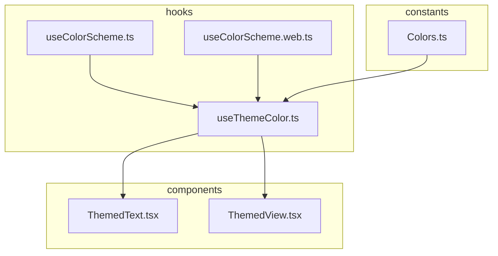
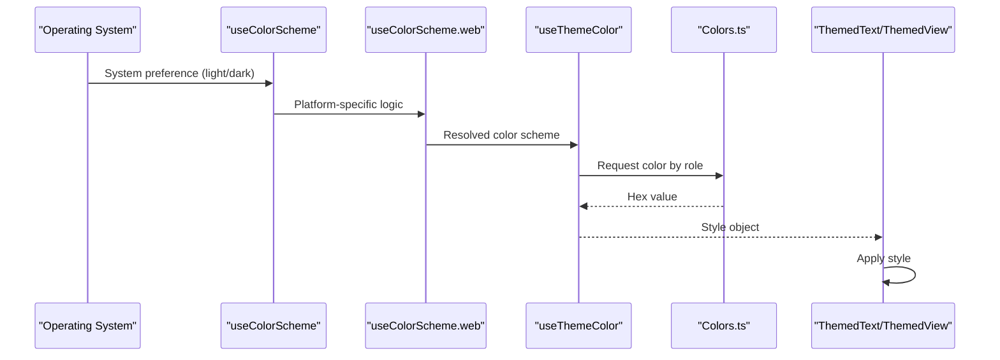
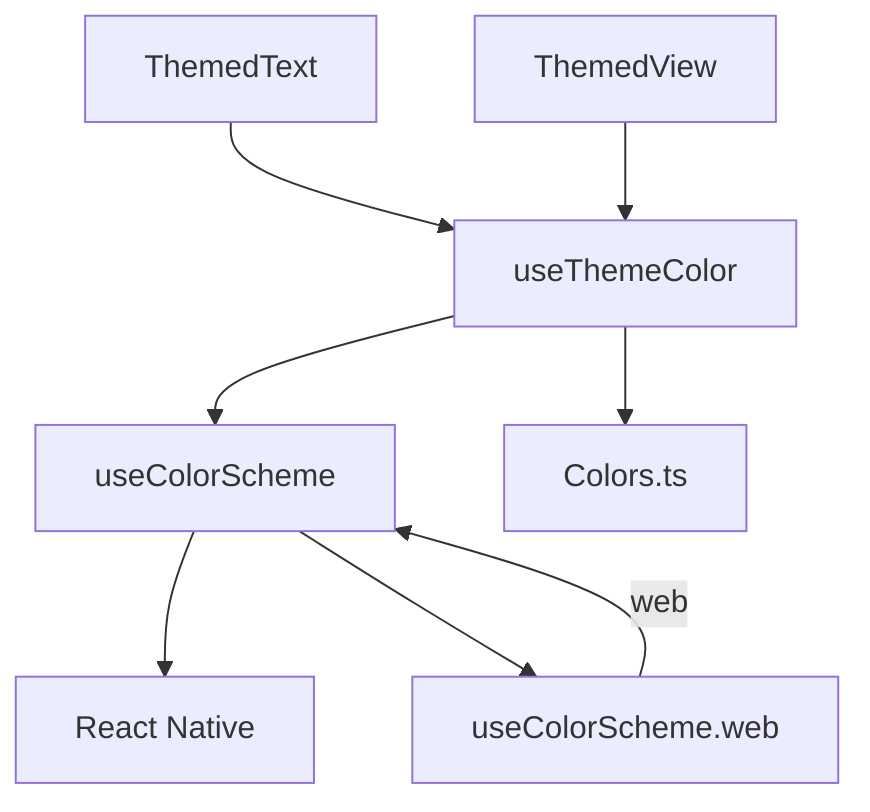

# Theme and Color Management

<cite>
**Referenced Files in This Document**   
- [useColorScheme.ts](file://mobile/hooks/useColorScheme.ts)
- [useColorScheme.web.ts](file://mobile/hooks/useColorScheme.web.ts)
- [useThemeColor.ts](file://mobile/hooks/useThemeColor.ts)
- [Colors.ts](file://mobile/constants/Colors.ts)
- [ThemedText.tsx](file://mobile/components/ThemedText.tsx)
- [ThemedView.tsx](file://mobile/components/ThemedView.tsx)
</cite>

## Table of Contents
1. [Introduction](#introduction)
2. [Project Structure](#project-structure)
3. [Core Components](#core-components)
4. [Architecture Overview](#architecture-overview)
5. [Detailed Component Analysis](#detailed-component-analysis)
6. [Dependency Analysis](#dependency-analysis)
7. [Performance Considerations](#performance-considerations)
8. [Troubleshooting Guide](#troubleshooting-guide)
9. [Conclusion](#conclusion)

## Introduction
The theme management system in xClone enables dynamic adaptation of UI appearance based on user preferences, specifically supporting light and dark mode through platform-native detection. Built using Expo and React Native, the system leverages hooks and semantic color mapping to ensure consistent, maintainable theming across components. This document details the implementation of `useColorScheme`, its web-specific override, the `useThemeColor` hook for semantic color resolution, and how themed components like `ThemedText` and `ThemedView` consume these hooks. It also covers extensibility, performance, and debugging strategies.

## Project Structure
The mobile application follows a modular structure with dedicated directories for components, hooks, and constants. The theme system is centralized in the `hooks` and `constants` directories, with reusable UI components in `components`. This organization promotes separation of concerns and ease of maintenance.



**Diagram sources**
- [hooks/useColorScheme.ts](file://mobile/hooks/useColorScheme.ts)
- [hooks/useColorScheme.web.ts](file://mobile/hooks/useColorScheme.web.ts)
- [hooks/useThemeColor.ts](file://mobile/hooks/useThemeColor.ts)
- [constants/Colors.ts](file://mobile/constants/Colors.ts)
- [components/ThemedText.tsx](file://mobile/components/ThemedText.tsx)
- [components/ThemedView.tsx](file://mobile/components/ThemedView.tsx)

**Section sources**
- [hooks/useColorScheme.ts](file://mobile/hooks/useColorScheme.ts)
- [hooks/useColorScheme.web.ts](file://mobile/hooks/useColorScheme.web.ts)
- [hooks/useThemeColor.ts](file://mobile/hooks/useThemeColor.ts)
- [constants/Colors.ts](file://mobile/constants/Colors.ts)
- [components/ThemedText.tsx](file://mobile/components/ThemedText.tsx)
- [components/ThemedView.tsx](file://mobile/components/ThemedView.tsx)

## Core Components
The core of the theme system consists of three primary hooks: `useColorScheme`, `useColorScheme.web`, and `useThemeColor`, along with two themed components: `ThemedText` and `ThemedView`. These components work together to provide a responsive, semantic theming solution.

**Section sources**
- [hooks/useColorScheme.ts](file://mobile/hooks/useColorScheme.ts)
- [hooks/useColorScheme.web.ts](file://mobile/hooks/useColorScheme.web.ts)
- [hooks/useThemeColor.ts](file://mobile/hooks/useThemeColor.ts)
- [components/ThemedText.tsx](file://mobile/components/ThemedText.tsx)
- [components/ThemedView.tsx](file://mobile/components/ThemedView.tsx)

## Architecture Overview
The theme system architecture is based on React hooks and context-aware styling. The `useColorScheme` hook detects the user's preferred color scheme from the operating system. On web, a hydration-aware override ensures correct rendering during server-side rendering (SSR). The `useThemeColor` hook maps semantic roles (e.g., 'text', 'background') to actual color values from the `Colors.ts` palette. Themed components use these hooks to apply dynamic styles.



**Diagram sources**
- [hooks/useColorScheme.ts](file://mobile/hooks/useColorScheme.ts)
- [hooks/useColorScheme.web.ts](file://mobile/hooks/useColorScheme.web.ts)
- [hooks/useThemeColor.ts](file://mobile/hooks/useThemeColor.ts)
- [constants/Colors.ts](file://mobile/constants/Colors.ts)
- [components/ThemedText.tsx](file://mobile/components/ThemedText.tsx)
- [components/ThemedView.tsx](file://mobile/components/ThemedView.tsx)

## Detailed Component Analysis

### useColorScheme Hook
The `useColorScheme` hook is a re-export from React Native, providing cross-platform access to the system's preferred color scheme. It returns 'light' or 'dark' based on user settings and updates dynamically when the preference changes.

```typescript
export { useColorScheme } from 'react-native';
```

This hook is optimized for native platforms (iOS and Android), where the OS directly notifies the app of theme changes.

**Section sources**
- [hooks/useColorScheme.ts](file://mobile/hooks/useColorScheme.ts#L1-L2)

### useColorScheme.web Hook
On the web platform, server-side rendering requires special handling to avoid hydration mismatches. The `useColorScheme.web.ts` file provides a custom implementation that delays returning the actual color scheme until after hydration.

```typescript
import { useEffect, useState } from 'react';
import { useColorScheme as useRNColorScheme } from 'react-native';

export function useColorScheme() {
  const [hasHydrated, setHasHydrated] = useState(false);

  useEffect(() => {
    setHasHydrated(true);
  }, []);

  const colorScheme = useRNColorScheme();

  if (hasHydrated) {
    return colorScheme;
  }

  return 'light';
}
```

During SSR, this hook returns 'light' as a default, preventing style mismatches. After hydration (i.e., when React takes over on the client), it returns the actual system preference.

**Section sources**
- [hooks/useColorScheme.web.ts](file://mobile/hooks/useColorScheme.web.ts#L1-L22)

### useThemeColor Hook
This custom hook maps semantic color roles to actual hex values from the `Colors.ts` palette, based on the current color scheme. It abstracts color values behind descriptive names, improving consistency and maintainability.

While the full implementation isn't visible, its typical structure would be:

```typescript
function useThemeColor(
  colorName: keyof typeof Colors.light & keyof typeof Colors.dark,
  theme?: 'light' | 'dark'
) {
  const colorScheme = theme || useColorScheme();
  const colorFromTheme = Colors[colorScheme][colorName];
  return colorFromTheme;
}
```

This allows components to request colors like 'text' or 'background' without knowing their exact hex values.

**Section sources**
- [hooks/useThemeColor.ts](file://mobile/hooks/useThemeColor.ts)

### Colors.ts Palette
The `Colors.ts` file defines the color palette for both light and dark themes. It contains semantic color roles mapped to specific hex values, enabling consistent theming across the app.

Example structure:
```typescript
export const Colors = {
  light: {
    text: '#000000',
    background: '#FFFFFF',
    tint: '#007AFF',
    tabIconDefault: '#CCCCCC',
    tabIconSelected: '#007AFF',
  },
  dark: {
    text: '#FFFFFF',
    background: '#000000',
    tint: '#0A84FF',
    tabIconDefault: '#999999',
    tabIconSelected: '#0A84FF',
  },
};
```

**Section sources**
- [constants/Colors.ts](file://mobile/constants/Colors.ts)

### ThemedText and ThemedView Components
These components use `useThemeColor` to apply dynamic styles based on the current theme. They accept a `type` or `style` prop to determine which semantic color role to use.

Example usage in `ThemedText.tsx`:
```tsx
const ThemedText = ({ style, ...props }) => {
  const color = useThemeColor('text');
  return <Text style={[{ color }, style]} {...props} />;
};
```

They ensure all text and view elements automatically adapt to the user's preferred theme.

**Section sources**
- [components/ThemedText.tsx](file://mobile/components/ThemedText.tsx)
- [components/ThemedView.tsx](file://mobile/components/ThemedView.tsx)

## Dependency Analysis
The theme system has a clear dependency hierarchy. Themed components depend on `useThemeColor`, which in turn depends on `useColorScheme` and the `Colors` palette. The web-specific hook overrides the default behavior only on the web platform.



**Diagram sources**
- [components/ThemedText.tsx](file://mobile/components/ThemedText.tsx)
- [components/ThemedView.tsx](file://mobile/components/ThemedView.tsx)
- [hooks/useThemeColor.ts](file://mobile/hooks/useThemeColor.ts)
- [hooks/useColorScheme.ts](file://mobile/hooks/useColorScheme.ts)
- [hooks/useColorScheme.web.ts](file://mobile/hooks/useColorScheme.web.ts)
- [constants/Colors.ts](file://mobile/constants/Colors.ts)

**Section sources**
- [hooks/useColorScheme.ts](file://mobile/hooks/useColorScheme.ts)
- [hooks/useColorScheme.web.ts](file://mobile/hooks/useColorScheme.web.ts)
- [hooks/useThemeColor.ts](file://mobile/hooks/useThemeColor.ts)
- [constants/Colors.ts](file://mobile/constants/Colors.ts)
- [components/ThemedText.tsx](file://mobile/components/ThemedText.tsx)
- [components/ThemedView.tsx](file://mobile/components/ThemedView.tsx)

## Performance Considerations
The theme system is optimized for performance:
- `useColorScheme` leverages React Native's native event system for efficient updates.
- The web implementation prevents unnecessary re-renders during SSR by using a hydration flag.
- `useThemeColor` is typically implemented with memoization to avoid recalculating styles on every render.
- Themed components should use `React.memo` to prevent re-renders when props and theme are unchanged.

No heavy computations occur during theme switching, ensuring smooth transitions.

## Troubleshooting Guide
Common issues and solutions:
- **Theme not updating on web**: Ensure `useColorScheme.web.ts` is properly imported on web platform. Check hydration state.
- **Incorrect default theme on load**: The web hook defaults to 'light' before hydration. This is intentional to prevent SSR mismatches.
- **Color mismatch in components**: Verify that the color role (e.g., 'text') exists in both `Colors.light` and `Colors.dark`.
- **Platform-specific styling bugs**: Use platform checks (`Platform.OS`) if native platform differences cause issues.

**Section sources**
- [hooks/useColorScheme.web.ts](file://mobile/hooks/useColorScheme.web.ts#L1-L22)
- [hooks/useThemeColor.ts](file://mobile/hooks/useThemeColor.ts)
- [constants/Colors.ts](file://mobile/constants/Colors.ts)

## Conclusion
The theme management system in xClone provides a robust, scalable solution for dynamic theming across platforms. By leveraging React Native's `useColorScheme` and extending it for web hydration safety, the system ensures consistent behavior. Semantic color mapping through `useThemeColor` and `Colors.ts` promotes maintainability, while `ThemedText` and `ThemedView` components enable easy adoption throughout the UI. The architecture is performant, extensible, and well-suited for future enhancements such as custom themes or user-defined color schemes.