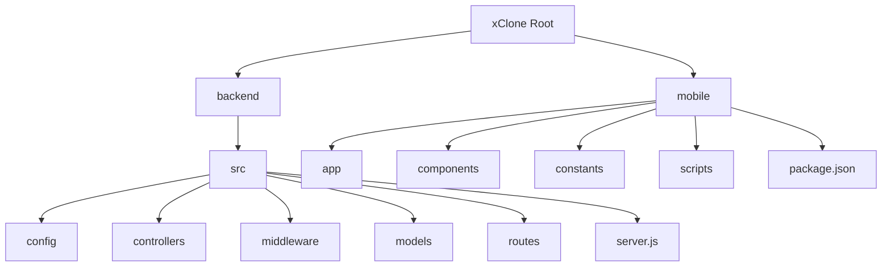

# Getting Started

<cite>
**Referenced Files in This Document**   
- [package.json](file://backend/package.json)
- [package.json](file://mobile/package.json)
- [README.md](file://mobile/README.md)
- [db.js](file://backend/src/config/db.js)
- [env.js](file://backend/src/config/env.js)
- [server.js](file://backend/src/server.js)
</cite>

## Table of Contents
1. [Introduction](#introduction)
2. [Project Structure](#project-structure)
3. [Development Environment Setup](#development-environment-setup)
4. [Environment Configuration](#environment-configuration)
5. [Dependency Installation](#dependency-installation)
6. [Startup Sequence](#startup-sequence)
7. [Basic Usage Examples](#basic-usage-examples)
8. [Troubleshooting Guide](#troubleshooting-guide)

## Introduction
This guide provides a comprehensive walkthrough for setting up the xClone development environment. The application consists of a backend API built with Node.js and Express, and a mobile frontend developed using Expo and React Native. This document outlines the complete setup process, from installing prerequisites to launching the application and performing basic interactions.

## Project Structure

The xClone project follows a modular architecture with separate directories for backend and mobile components:



**Diagram sources**
- [backend/src/server.js](file://backend/src/server.js#L1-L10)
- [mobile/app](file://mobile/app)

**Section sources**
- [backend](file://backend)
- [mobile](file://mobile)

## Development Environment Setup

Before running xClone, ensure the following prerequisites are installed:

### Node.js Installation
xClone requires Node.js version 18 or higher. Verify your installation with:
```bash
node --version
```

If Node.js is not installed, download it from [nodejs.org](https://nodejs.org) or use a version manager like nvm.

### Expo CLI Installation
Install the Expo CLI globally to manage the mobile application:
```bash
npm install -g expo-cli
```

### MongoDB Installation
Install MongoDB Community Edition or use MongoDB Atlas for cloud hosting. For local installation:
1. Download from [mongodb.com](https://www.mongodb.com/try/download/community)
2. Follow platform-specific installation instructions
3. Start the MongoDB service:
   ```bash
   # On macOS/Linux
   sudo systemctl start mongod
   
   # On Windows (if installed as service)
   net start MongoDB
   ```

**Section sources**
- [package.json](file://backend/package.json)
- [package.json](file://mobile/package.json)

## Environment Configuration

Both backend and mobile projects require environment variables for proper operation.

### Backend Environment Variables
1. Navigate to the backend directory:
   ```bash
   cd backend
   ```
2. Create a `.env` file by copying the example:
   ```bash
   cp .env.example .env
   ```
3. Configure the following variables in `.env`:
   - `MONGODB_URI`: MongoDB connection string (e.g., `mongodb://localhost:27017/xclone`)
   - `PORT`: Server port (default: 5000)
   - `CLOUDINARY_CLOUD_NAME`, `CLOUDINARY_API_KEY`, `CLOUDINARY_API_SECRET`: Cloudinary credentials for media storage
   - `CLERK_SECRET_KEY`: Clerk authentication secret key

The backend configuration is handled by `src/config/env.js`, which validates and loads these environment variables.

### Mobile Environment Variables
The mobile application may require environment variables for API endpoints and third-party services. Create a `.env` file in the mobile directory:
```bash
cd mobile
touch .env
```

Add the following configuration:
- `API_BASE_URL`: Backend server URL (e.g., `http://localhost:5000`)

**Section sources**
- [src/config/env.js](file://backend/src/config/env.js#L1-L50)
- [src/config/db.js](file://backend/src/config/db.js#L1-L20)

## Dependency Installation

Install dependencies for both projects using npm.

### Backend Dependencies
```bash
cd backend
npm install
```

This installs the following key dependencies:
- `express`: Web server framework
- `mongoose`: MongoDB object modeling
- `@clerk/express`: Authentication service
- `cloudinary`: Media upload and management
- `cors`: Cross-origin resource sharing

### Mobile Dependencies
```bash
cd mobile
npm install
```

This installs Expo and React Native dependencies including:
- `expo`: Expo development framework
- `react-native`: Mobile UI framework
- `expo-router`: Navigation system
- `@react-navigation`: Navigation components

**Section sources**
- [package.json](file://backend/package.json)
- [package.json](file://mobile/package.json)

## Startup Sequence

Follow this sequence to launch the complete xClone application.

### Step 1: Start MongoDB
Ensure MongoDB is running before starting the backend:
```bash
# Verify MongoDB is accessible
mongo --eval "db.runCommand({ping:1})"
```

### Step 2: Launch Backend Server
```bash
cd backend
npm run dev
```

The server will start on port 5000 (or the port specified in `.env`). You should see:
```
Server running on port 5000
Connected to MongoDB
```

### Step 3: Launch Mobile Application
```bash
cd mobile
npx expo start
```

This opens the Expo Developer Tools in your browser. Choose your preferred method to run the app:
- **Android**: Connect device or start emulator, press "Run on Android device/emulator"
- **iOS**: Start simulator, press "Run on iOS simulator"
- **Expo Go**: Scan QR code with Expo Go app on physical device

**Section sources**
- [server.js](file://backend/src/server.js#L1-L30)
- [package.json](file://backend/package.json#L5-L8)
- [package.json](file://mobile/package.json#L5-L10)

## Basic Usage Examples

Once both applications are running, you can test basic functionality.

### User Authentication
1. Open the mobile app
2. Navigate to the login screen
3. Use test credentials (if available) or create a new account
4. Verify authentication by checking for user profile data

### Creating a Test Post
```javascript
// Example API request to create a post
POST http://localhost:5000/api/posts
Content-Type: application/json
Authorization: Bearer <your-jwt-token>

{
  "content": "Hello from xClone!",
  "media": []
}
```

### Interacting with Content
1. Open the Explore tab in the mobile app
2. Find a post and tap the like button
3. Add a comment:
   ```javascript
   POST http://localhost:5000/api/comments
   {
     "postId": "post-id-here",
     "content": "Great post!"
   }
   ```

These interactions are handled by the backend controllers in `src/controllers/post.controller.js` and `src/controllers/comment.controller.js`.

**Section sources**
- [post.controller.js](file://backend/src/controllers/post.controller.js#L1-L100)
- [comment.controller.js](file://backend/src/controllers/comment.controller.js#L1-L80)

## Troubleshooting Guide

### Port Conflicts
If port 5000 is already in use:
1. Change the `PORT` variable in backend `.env`
2. Update the mobile app's `API_BASE_URL` to match
3. Restart both applications

### Missing Environment Variables
Error: `Environment variable not found`
1. Verify `.env` file exists in both backend and mobile directories
2. Check for typos in variable names
3. Restart the application after making changes

### MongoDB Connection Issues
Error: `Failed to connect to MongoDB`
1. Verify MongoDB service is running
2. Check `MONGODB_URI` format:
   - Local: `mongodb://localhost:27017/xclone`
   - Atlas: `mongodb+srv://<username>:<password>@cluster.mongodb.net/xclone`
3. Ensure firewall allows connections on port 27017

### Device Connection Problems (Mobile)
For Android:
```bash
# Enable USB debugging and run
adb devices
```

For iOS:
- Ensure Xcode command line tools are installed
- Use simulator for development

### Common npm Errors
If `npm install` fails:
1. Delete `node_modules` and `package-lock.json`
2. Run `npm cache clean --force`
3. Reinstall dependencies

**Section sources**
- [db.js](file://backend/src/config/db.js#L1-L40)
- [env.js](file://backend/src/config/env.js#L1-L30)
- [README.md](file://mobile/README.md#L1-L20)