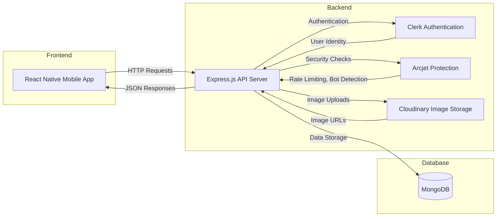
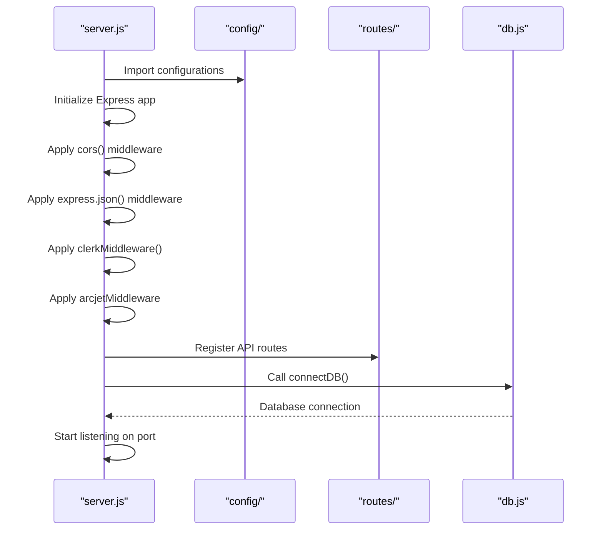
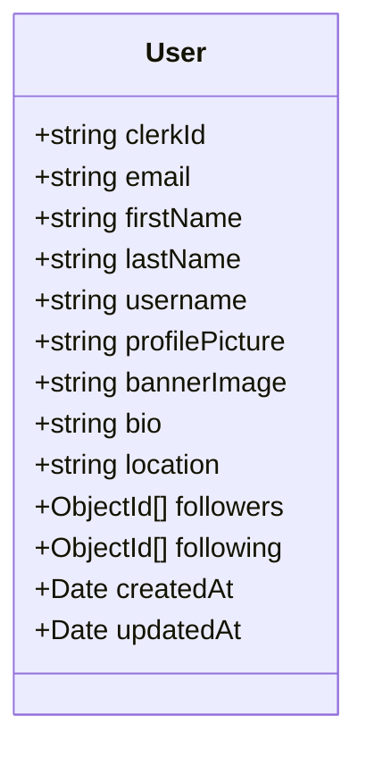
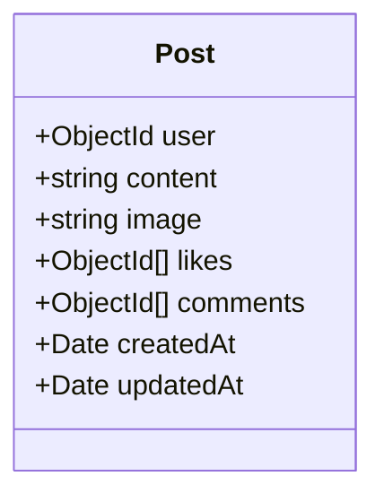
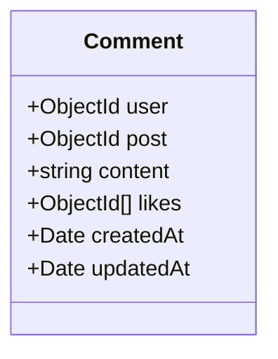
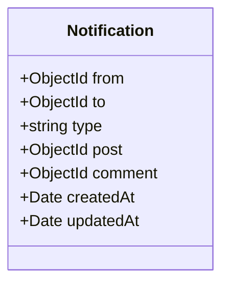
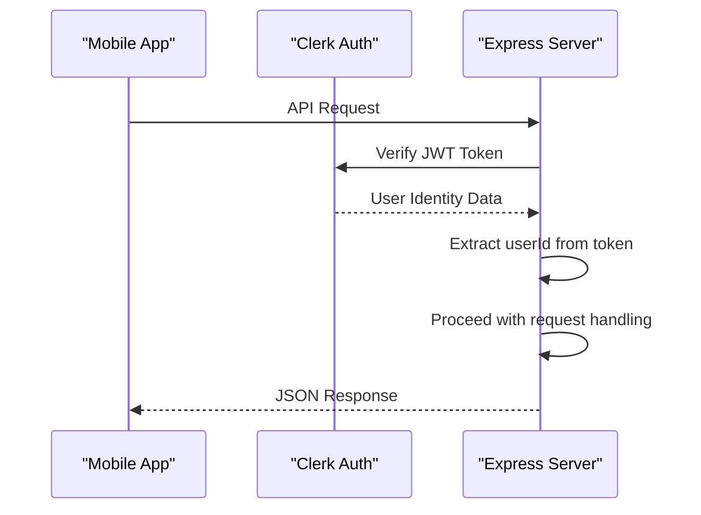
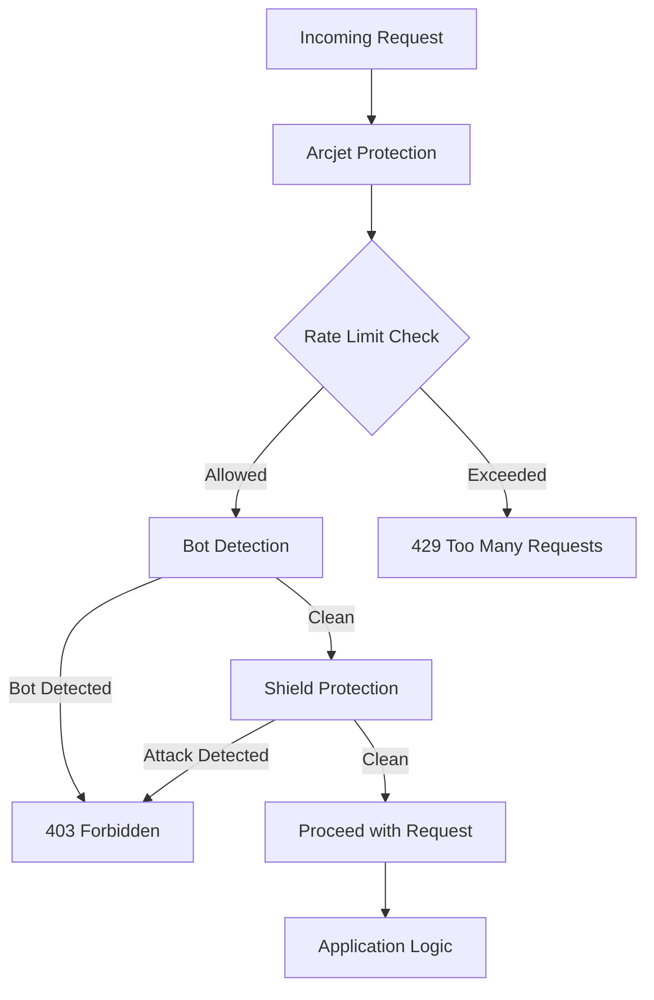
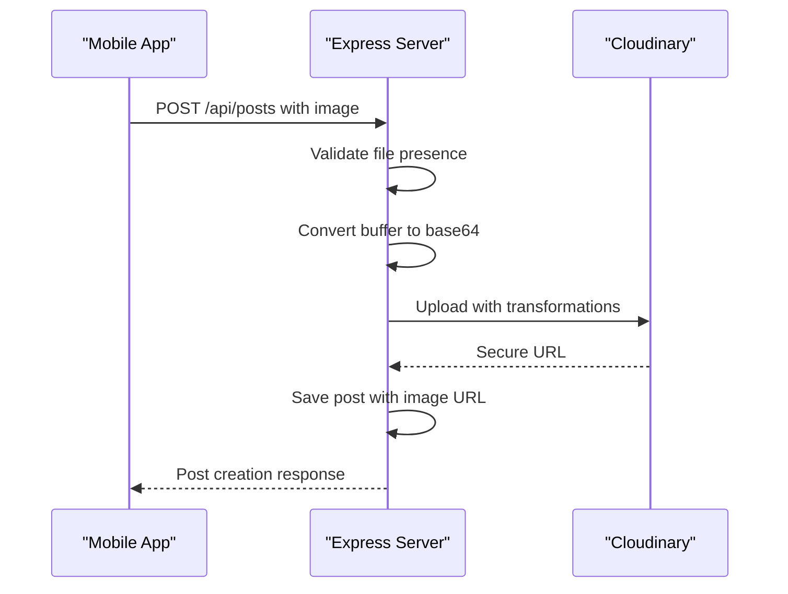

# System Overview

<cite>
**Referenced Files in This Document**   
- [server.js](file://backend/src/server.js#L1-L48)
- [db.js](file://backend/src/config/db.js#L1-L12)
- [env.js](file://backend/src/config/env.js#L1-L16)
- [arcjet.js](file://backend/src/config/arcjet.js#L1-L29)
- [cloudinary.js](file://backend/src/config/cloudinary.js#L1-L11)
- [user.model.js](file://backend/src/models/user.model.js#L1-L62)
- [post.model.js](file://backend/src/models/post.model.js#L1-L35)
- [comment.model.js](file://backend/src/models/comment.model.js#L1-L31)
- [notification.model.js](file://backend/src/models/notification.model.js#L1-L35)
- [user.controller.js](file://backend/src/controllers/user.controller.js#L1-L95)
- [post.controller.js](file://backend/src/controllers/post.controller.js#L1-L158)
- [comment.controller.js](file://backend/src/controllers/comment.controller.js#L1-L82)
- [notification.controller.js](file://backend/src/controllers/notification.controller.js#L1-L35)
- [auth.middleware.js](file://backend/src/middleware/auth.middleware.js#L1-L9)
- [arcjet.middleware.js](file://backend/src/middleware/arcjet.middleware.js#L1-L46)
- [upload.middleware.js](file://backend/src/middleware/upload.middleware.js)
- [user.route.js](file://backend/src/routes/user.route.js#L1-L17)
- [post.route.js](file://backend/src/routes/post.route.js#L1-L20)
- [comment.route.js](file://backend/src/routes/comment.route.js#L1-L15)
- [notification.route.js](file://backend/src/routes/notification.route.js#L1-L9)
- [package.json](file://backend/package.json#L1-L25)
- [README.md](file://mobile/README.md#L1-L51)
</cite>

## Table of Contents
1. [System Overview](#system-overview)
2. [Project Structure](#project-structure)
3. [Core Components](#core-components)
4. [Architecture Overview](#architecture-overview)
5. [Detailed Component Analysis](#detailed-component-analysis)
6. [Data Models](#data-models)
7. [API Endpoints and Routing](#api-endpoints-and-routing)
8. [Security and Authentication](#security-and-authentication)
9. [Deployment and Scalability](#deployment-and-scalability)

## Project Structure

The xClone repository follows a clean, modular architecture with a clear separation between frontend and backend components. The project is organized into two main directories: `backend` and `mobile`, representing the server-side and client-side applications respectively.

```mermaid
graph TB
subgraph "Root"
backend[backend/]
mobile[mobile/]
end
subgraph "Backend"
backend --> src[src/]
backend --> package.json[package.json]
src --> config[config/]
src --> controllers[controllers/]
src --> middleware[middleware/]
src --> models[models/]
src --> routes[routes/]
src --> server.js[server.js]
config --> arcjet.js[arcjet.js]
config --> cloudinary.js[cloudinary.js]
config --> db.js[db.js]
config --> env.js[env.js]
controllers --> user.controller.js[user.controller.js]
controllers --> post.controller.js[post.controller.js]
controllers --> comment.controller.js[comment.controller.js]
controllers --> notification.controller.js[notification.controller.js]
middleware --> auth.middleware.js[auth.middleware.js]
middleware --> arcjet.middleware.js[arcjet.middleware.js]
middleware --> upload.middleware.js[upload.middleware.js]
models --> user.model.js[user.model.js]
models --> post.model.js[post.model.js]
models --> comment.model.js[comment.model.js]
models --> notification.model.js[notification.model.js]
routes --> user.route.js[user.route.js]
routes --> post.route.js[post.route.js]
routes --> comment.route.js[comment.route.js]
routes --> notification.route.js[notification.route.js]
end
subgraph "Mobile Frontend"
mobile --> app[app/]
mobile --> components[components/]
mobile --> constants[constants/]
mobile --> hooks[hooks/]
mobile --> scripts[scripts/]
mobile --> package.json[package.json]
mobile --> app.json[app.json]
mobile --> tsconfig.json[tsconfig.json]
mobile --> README.md[README.md]
app --> tabs[(tabs)/]
app --> index.tsx[index.tsx]
app --> explore.tsx[explore.tsx]
app --> _layout.tsx[_layout.tsx]
components --> ui[ui/]
components --> Collapsible.tsx[Collapsible.tsx]
components --> ExternalLink.tsx[ExternalLink.tsx]
components --> HapticTab.tsx[HapticTab.tsx]
components --> HelloWave.tsx[HelloWave.tsx]
components --> ParallaxScrollView.tsx[ParallaxScrollView.tsx]
components --> ThemedText.tsx[ThemedText.tsx]
components --> ThemedView.tsx[ThemedView.tsx]
end
```

**Diagram sources**
- [server.js](file://backend/src/server.js#L1-L48)
- [README.md](file://mobile/README.md#L1-L51)

**Section sources**
- [server.js](file://backend/src/server.js#L1-L48)
- [README.md](file://mobile/README.md#L1-L51)

## Core Components

The xClone application consists of several core components that work together to provide a Twitter/X-like social media experience. The system is built with a React Native frontend for mobile devices and an Express.js backend for server-side logic, connected through RESTful APIs.

The backend handles user authentication, post management, commenting, following relationships, and notifications, while the frontend provides the user interface for interacting with these features. Third-party services like Clerk for authentication, Cloudinary for image storage, and Arcjet for security are integrated to enhance functionality and protect the application.

**Section sources**
- [server.js](file://backend/src/server.js#L1-L48)
- [package.json](file://backend/package.json#L1-L25)

## Architecture Overview

xClone follows a classic three-tier architecture with a clear separation of concerns between presentation, business logic, and data layers. The mobile frontend communicates with the backend API over HTTP, which in turn interacts with MongoDB for data persistence and third-party services for specialized functionality.



**Diagram sources**
- [server.js](file://backend/src/server.js#L1-L48)
- [env.js](file://backend/src/config/env.js#L1-L16)
- [package.json](file://backend/package.json#L1-L25)

## Detailed Component Analysis

### Backend Server Initialization

The backend server is initialized in `server.js`, where Express.js is configured with necessary middleware for CORS, JSON parsing, authentication, and security. The server connects to MongoDB and sets up routes for various resources.



**Diagram sources**
- [server.js](file://backend/src/server.js#L1-L48)
- [db.js](file://backend/src/config/db.js#L1-L12)

**Section sources**
- [server.js](file://backend/src/server.js#L1-L48)
- [db.js](file://backend/src/config/db.js#L1-L12)

### Environment Configuration

Environment variables are managed through the `env.js` file, which loads configuration from `.env` files using the `dotenv` package. This centralizes all configuration settings including port, database URI, and third-party service credentials.

```javascript
// env.js structure
export const ENV = {
    PORT: process.env.PORT || 5001,
    MONGO_URI: process.env.MONGO_URI,
    NODE_ENV: process.env.NODE_ENV,
    CLERK_PUBLISHABLE_KEY: process.env.CLERK_PUBLISHABLE_KEY,
    CLERK_SECRET_KEY: process.env.CLERK_SECRET_KEY,
    ARCJET_KEY: process.env.ARCJET_KEY,
    CLOUDINARY_CLOUD_NAME: process.env.CLOUDINARY_CLOUD_NAME,
    CLOUDINARY_API_KEY: process.env.CLOUDINARY_API_KEY,
    CLOUDINARY_API_SECRET: process.env.CLOUDINARY_API_SECRET,
}
```

**Section sources**
- [env.js](file://backend/src/config/env.js#L1-L16)

## Data Models

The application uses MongoDB with Mongoose for data modeling. There are four main models that represent the core entities of the social media platform.

### User Model

The User model stores user profile information and relationships. It uses Clerk's user ID as the primary identifier and maintains arrays for followers and following users.



**Diagram sources**
- [user.model.js](file://backend/src/models/user.model.js#L1-L62)

### Post Model

The Post model represents user-generated content with support for text and images. Each post is linked to a user and can have multiple comments and likes.



**Diagram sources**
- [post.model.js](file://backend/src/models/post.model.js#L1-L35)

### Comment Model

The Comment model represents user comments on posts. Each comment is linked to both a user and a post, and can be liked by other users.



**Diagram sources**
- [comment.model.js](file://backend/src/models/comment.model.js#L1-L31)

### Notification Model

The Notification model handles user notifications for activities like follows, likes, and comments. Notifications are categorized by type and linked to the relevant users and content.



**Diagram sources**
- [notification.model.js](file://backend/src/models/notification.model.js#L1-L35)

## API Endpoints and Routing

The backend API is organized into four main route groups, each handling a specific domain of functionality. All protected routes require authentication via Clerk.

```mermaid
graph TB
API[/api]
subgraph "Users"
API --> Users[/api/users]
Users --> Profile[/profile/:username]
Users --> Sync[/sync]
Users --> Me[/me]
Users --> ProfileUpdate[/profile]
Users --> Follow[/follow/:targetUserId]
end
subgraph "Posts"
API --> Posts[/api/posts]
Posts --> List[/]
Posts --> Detail[/postId]
Posts --> UserPosts[/user/:username]
Posts --> Create[/]
Posts --> Like[/postId/like]
Posts --> Delete[/postId]
end
subgraph "Comments"
API --> Comments[/api/comments]
Comments --> List[/post/:postId]
Comments --> Create[/post/:postId]
Comments --> Delete[/:commentId]
end
subgraph "Notifications"
API --> Notifications[/api/notifications]
Notifications --> List[/]
Notifications --> Delete[/:notificationId]
end
```

**Diagram sources**
- [user.route.js](file://backend/src/routes/user.route.js#L1-L17)
- [post.route.js](file://backend/src/routes/post.route.js#L1-L20)
- [comment.route.js](file://backend/src/routes/comment.route.js#L1-L15)
- [notification.route.js](file://backend/src/routes/notification.route.js#L1-L9)

## Security and Authentication

xClone implements a robust security architecture using multiple layers of protection to ensure application integrity and user safety.

### Authentication with Clerk

User authentication is handled by Clerk, a third-party identity provider. The `clerkMiddleware` is applied globally to protect routes, and user identity is verified through JWT tokens.



**Diagram sources**
- [server.js](file://backend/src/server.js#L1-L48)
- [auth.middleware.js](file://backend/src/middleware/auth.middleware.js#L1-L9)

### Security with Arcjet

Arcjet provides comprehensive security protection including rate limiting, bot detection, and shield protection against common web attacks. The token bucket algorithm limits requests to 10 per 10 seconds with a burst capacity of 15.



**Diagram sources**
- [arcjet.js](file://backend/src/config/arcjet.js#L1-L29)
- [arcjet.middleware.js](file://backend/src/middleware/arcjet.middleware.js#L1-L46)

### Image Upload Security

Image uploads are handled securely through Cloudinary integration. The upload process converts file buffers to base64 and applies transformations for optimization.



**Diagram sources**
- [cloudinary.js](file://backend/src/config/cloudinary.js#L1-L11)
- [post.controller.js](file://backend/src/controllers/post.controller.js#L77-L123)

## Deployment and Scalability

The xClone application is designed with deployment and scalability in mind, following modern best practices for full-stack applications.

### Development Setup

The mobile frontend is built with Expo, allowing for rapid development and testing on both Android and iOS platforms. Developers can start the application with simple npm commands:

```bash
# Mobile frontend
npm install
npx expo start

# Backend server
npm run dev
```

### Production Considerations

For production deployment, the application can be hosted on various platforms:
- Backend: Vercel, Render, or AWS with MongoDB Atlas for database
- Frontend: Expo Application Services (EAS) for mobile app distribution

The modular architecture allows for independent scaling of frontend and backend components. The use of environment variables makes configuration management straightforward across different deployment environments.

### Scalability Features

Several design decisions enhance the application's scalability:
- **Stateless API**: The Express.js backend is stateless, enabling horizontal scaling
- **Database Indexing**: Mongoose models can be optimized with appropriate indexes
- **Caching Potential**: Response caching can be added at the API layer
- **CDN Integration**: Cloudinary provides built-in CDN for image delivery
- **Rate Limiting**: Arcjet prevents abuse and ensures fair resource usage

The current rate limiting configuration (10 requests per 10 seconds) provides a good balance between accessibility and protection, which can be adjusted based on actual usage patterns.

**Section sources**
- [server.js](file://backend/src/server.js#L1-L48)
- [env.js](file://backend/src/config/env.js#L1-L16)
- [README.md](file://mobile/README.md#L1-L51)