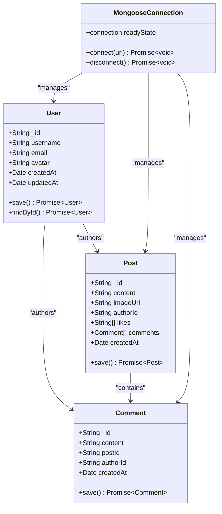
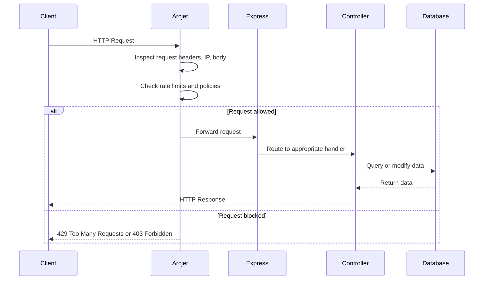

# Technology Stack

<cite>
**Referenced Files in This Document**   
- [package.json](file://backend/package.json)
- [package.json](file://mobile/package.json)
- [db.js](file://backend/src/config/db.js)
- [env.js](file://backend/src/config/env.js)
- [arcjet.middleware.js](file://backend/src/middleware/arcjet.middleware.js)
- [user.model.js](file://backend/src/models/user.model.js)
</cite>

## Table of Contents
1. [Introduction](#introduction)
2. [Project Structure](#project-structure)
3. [Frontend Technologies](#frontend-technologies)
4. [Backend Technologies](#backend-technologies)
5. [Critical Dependencies](#critical-dependencies)
6. [Technology Rationale](#technology-rationale)
7. [Version Compatibility and Upgrade Considerations](#version-compatibility-and-upgrade-considerations)
8. [Local Development Setup Requirements](#local-development-setup-requirements)

## Introduction
This document provides a comprehensive overview of the technology stack used in the xClone application. It details the frontend and backend technologies, critical dependencies, rationale behind key technology choices, version compatibility, and local development setup requirements. The analysis is based on the actual codebase structure and configuration files.

## Project Structure

The xClone repository is organized into two main directories: `backend` and `mobile`. This reflects a clean separation between the server-side API and the client-side mobile application.

```mermaid
graph TB
root["xClone (root)"]
root --> backend
root --> mobile
backend --> src
backend --> package.json
backend --> package-lock.json
backend --> vercel.json
src --> config
src --> controllers
src --> middleware
src --> models
src --> routes
src --> server.js
config --> db.js
config --> env.js
config --> arcjet.js
config --> cloudinary.js
controllers --> user.controller.js
controllers --> post.controller.js
controllers --> comment.controller.js
controllers --> notification.controller.js
middleware --> arcjet.middleware.js
middleware --> auth.middleware.js
middleware --> upload.middleware.js
models --> user.model.js
models --> post.model.js
models --> comment.model.js
models --> notification.model.js
routes --> user.route.js
routes --> post.route.js
routes --> comment.route.js
routes --> notification.route.js
mobile --> app
mobile --> components
mobile --> constants
mobile --> hooks
mobile --> scripts
mobile --> package.json
mobile --> app.json
mobile --> tsconfig.json
app --> "(tabs)"
app --> "+not-found.tsx"
app --> "_layout.tsx"
"(tabs)" --> index.tsx
"(tabs)" --> explore.tsx
```

**Diagram sources**
- [backend/package.json](file://backend/package.json)
- [mobile/package.json](file://mobile/package.json)

**Section sources**
- [backend/package.json](file://backend/package.json)
- [mobile/package.json](file://mobile/package.json)

## Frontend Technologies

The mobile frontend of xClone is built using modern React Native technologies with Expo for cross-platform development.

### React Native with Expo
The application uses React Native as the core framework for building native mobile experiences. Expo is used as a layer on top of React Native to simplify development, providing pre-built components and services. Expo enables rapid development with features like over-the-air updates, camera access, and push notifications without requiring direct native code modifications.

### TypeScript
TypeScript is used for type safety and improved developer experience. The presence of `tsconfig.json` and TypeScript dependencies in the mobile package.json confirms static typing implementation, which helps catch errors during development and improves code maintainability.

### Expo Router
Expo Router (`expo-router`) provides file-based routing for the application. The directory structure under `/app` directly maps to the app's navigation structure. Special directories like `(tabs)` indicate route groups, while files like `+not-found.tsx` handle routing edge cases.

### React Native Reanimated
React Native Reanimated (`react-native-reanimated`) is used for smooth UI interactions and animations. This library enables high-performance animations by running them on the UI thread rather than the JavaScript thread, preventing jank during complex interactions.

**Section sources**
- [mobile/package.json](file://mobile/package.json)
- [mobile/tsconfig.json](file://mobile/tsconfig.json)
- [mobile/app/_layout.tsx](file://mobile/app/_layout.tsx)

## Backend Technologies

The backend of xClone is built on a Node.js stack with Express.js for API handling and MongoDB for data persistence.

### Express.js for REST API
Express.js is used as the web framework for creating RESTful API endpoints. The backend routes are organized in the `/routes` directory, with corresponding controllers in the `/controllers` directory. Express middleware handles cross-cutting concerns like authentication and request processing.

### Node.js Runtime
The backend runs on Node.js, as evidenced by the `package.json` configuration and the use of ES modules (indicated by `"type": "module"`). The `dev` script uses `node --watch` for development, enabling automatic reloading when files change.

### MongoDB with Mongoose ORM
MongoDB is used as the primary database, with Mongoose as the Object Data Modeling (ODM) library. The `connectDB` function in `db.js` establishes the connection to MongoDB using the Mongoose driver, providing schema-based modeling and validation.



**Diagram sources**
- [backend/src/models/user.model.js](file://backend/src/models/user.model.js)
- [backend/src/config/db.js](file://backend/src/config/db.js)

### JavaScript ES6+ Features
The codebase uses modern JavaScript features including ES modules (import/export syntax), async/await for asynchronous operations, arrow functions, and destructuring assignment. This is evident from the use of `import` statements and async functions in the backend code.

**Section sources**
- [backend/src/server.js](file://backend/src/server.js)
- [backend/src/config/db.js](file://backend/src/config/db.js)
- [backend/src/controllers/user.controller.js](file://backend/src/controllers/user.controller.js)

## Critical Dependencies

The following dependencies are categorized by their primary purpose in the application.

### Frameworks and Core Libraries
- **express**: Web framework for Node.js backend
- **react**: UI library for frontend components
- **react-native**: Native mobile framework
- **expo**: Development framework for React Native
- **mongoose**: MongoDB ODM for Node.js
- **@react-navigation**: Navigation solution for React Native

### Utilities
- **dotenv**: Environment variable management
- **cors**: Cross-origin resource sharing middleware
- **multer**: Middleware for handling multipart/form-data (file uploads)
- **express-async-handler**: Utility for handling async errors in Express
- **expo-font**: Font loading utilities
- **expo-splash-screen**: Splash screen management

### Security
- **@arcjet/node**: Security and rate limiting framework
- **@arcjet/inspect**: Request inspection utilities
- **@clerk/express**: Authentication and user management

### Database
- **mongoose**: MongoDB object modeling
- **cloudinary**: Cloud-based media storage and management

### UI and Styling
- **@expo/vector-icons**: Icon library
- **expo-blur**: Visual effect components
- **react-native-reanimated**: Advanced animations
- **react-native-gesture-handler**: Gesture recognition
- **expo-haptics**: Haptic feedback

### Development Tools
- **typescript**: Type checking and compilation
- **eslint**: Code linting
- **@babel/core**: JavaScript compiler

**Section sources**
- [backend/package.json](file://backend/package.json)
- [mobile/package.json](file://mobile/package.json)

## Technology Rationale

### Expo for Rapid Mobile Development
Expo was chosen to accelerate mobile development by providing a managed workflow with pre-configured build processes, access to native APIs without ejecting, and a rich ecosystem of pre-built components. This allows the team to focus on application logic rather than native build configurations.

### Mongoose for Schema Modeling
Mongoose provides a structured way to define data models with validation, type casting, and middleware hooks. By using Mongoose, the application ensures data consistency and provides a clear contract for database interactions, reducing the likelihood of data integrity issues.

### Arcjet for Security
Arcjet is integrated as a security layer to protect against common web vulnerabilities including rate limiting, bot detection, and malicious request filtering. The presence of `arcjet.middleware.js` and Arcjet dependencies indicates a proactive approach to application security.



**Diagram sources**
- [backend/src/middleware/arcjet.middleware.js](file://backend/src/middleware/arcjet.middleware.js)
- [backend/src/routes/user.route.js](file://backend/src/routes/user.route.js)

**Section sources**
- [backend/src/middleware/arcjet.middleware.js](file://backend/src/middleware/arcjet.middleware.js)
- [backend/package.json](file://backend/package.json)

## Version Compatibility and Upgrade Considerations

The current technology stack uses the following key versions:
- **Node.js**: Expected to be compatible with ESM and Express 5.x (inferred from package.json)
- **React Native**: 0.79.6
- **Expo**: ~53.0.22
- **React**: 19.0.0
- **Express**: ^5.1.0
- **Mongoose**: ^8.16.0
- **TypeScript**: ~5.8.3

Upgrade considerations:
- **Express 5.x**: Requires Node.js 18.18+ or 20.9+. The async error handling with `express-async-handler` may become less necessary as Express 5 has improved native async support.
- **React 19**: Major version upgrade that may introduce breaking changes in React Native compatibility. Requires verification with React Native 0.79.6.
- **Mongoose 8.x**: Includes improved TypeScript support and performance optimizations, but requires Node.js 16.20+ or 18.17+.
- **TypeScript 5.8+**: Provides better performance and new language features, but may require configuration updates to `tsconfig.json`.

When upgrading, it's recommended to:
1. Update one major dependency at a time
2. Run comprehensive testing after each update
3. Check compatibility between React, React Native, and Expo versions
4. Review breaking changes in migration guides

**Section sources**
- [backend/package.json](file://backend/package.json)
- [mobile/package.json](file://mobile/package.json)
- [mobile/tsconfig.json](file://mobile/tsconfig.json)

## Local Development Setup Requirements

To set up the xClone project for local development, the following requirements must be met:

### Node.js
- **Version**: 18.18+ or 20.9+ (to support Express 5 and ESM)
- **Reason**: Required to run the backend server and npm scripts
- **Installation**: Use nvm (Node Version Manager) for version control

### Expo CLI
- **Installation**: `npm install -g expo-cli`
- **Purpose**: To run the mobile development server and manage Expo projects
- **Commands**: 
  - `npm run android` - Launch on Android emulator
  - `npm run ios` - Launch on iOS simulator
  - `npm run web` - Launch web version

### MongoDB
- **Version**: 6.0+ (compatible with Mongoose 8.x)
- **Setup Options**:
  - Local installation
  - Docker container: `docker run -d -p 27017:27017 mongo:6.0`
  - MongoDB Atlas (cloud) with connection string in `.env`

### Environment Variables
Create a `.env` file in the backend directory with the following variables:
```
PORT=5001
MONGO_URI=mongodb://localhost:27017/xclone
NODE_ENV=development
CLERK_PUBLISHABLE_KEY=your_clerk_publishable_key
CLERK_SECRET_KEY=your_clerk_secret_key
ARCJET_KEY=your_arcjet_key
CLOUDINARY_CLOUD_NAME=your_cloudinary_cloud_name
CLOUDINARY_API_KEY=your_cloudinary_api_key
CLOUDINARY_API_SECRET=your_cloudinary_api_secret
```

### Development Workflow
1. Start MongoDB server
2. Navigate to `backend/` and run `npm run dev`
3. Navigate to `mobile/` and run `npm run start`
4. Open the Expo Go app on mobile device or use emulator

**Section sources**
- [backend/package.json](file://backend/package.json)
- [backend/src/config/env.js](file://backend/src/config/env.js)
- [backend/src/config/db.js](file://backend/src/config/db.js)