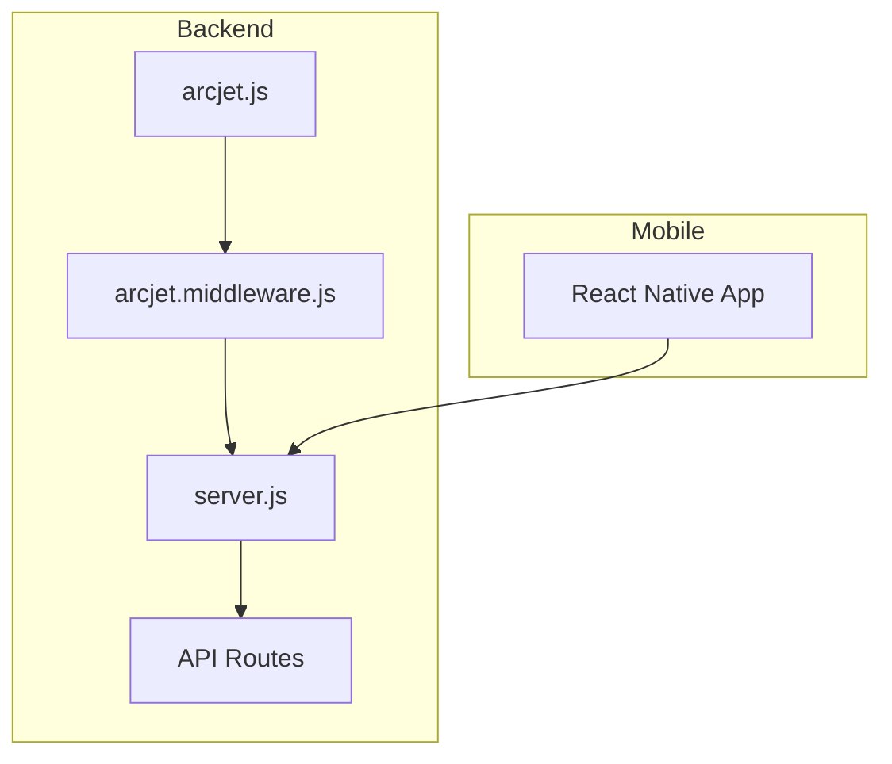
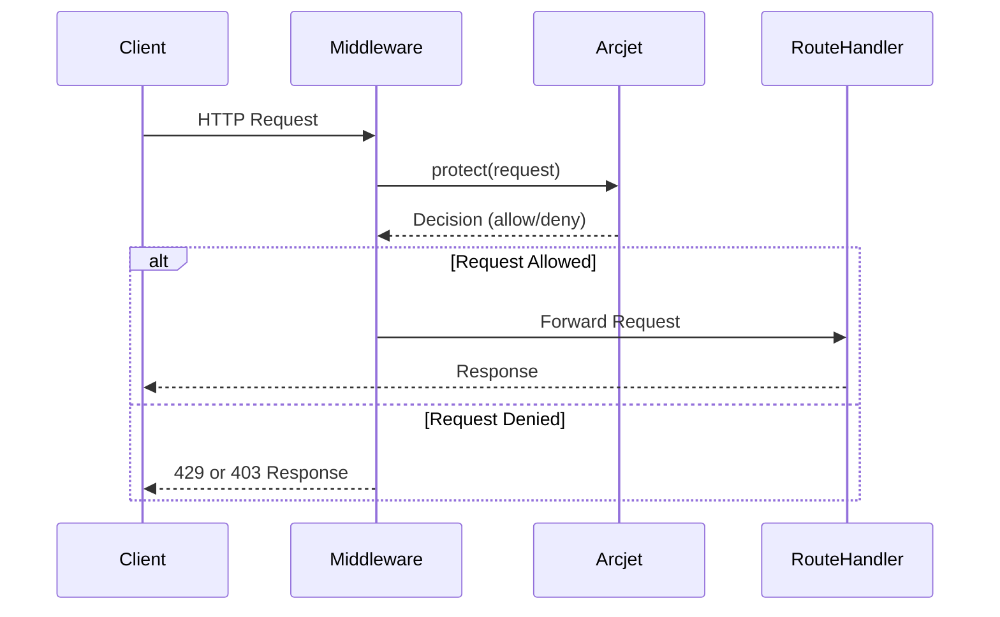
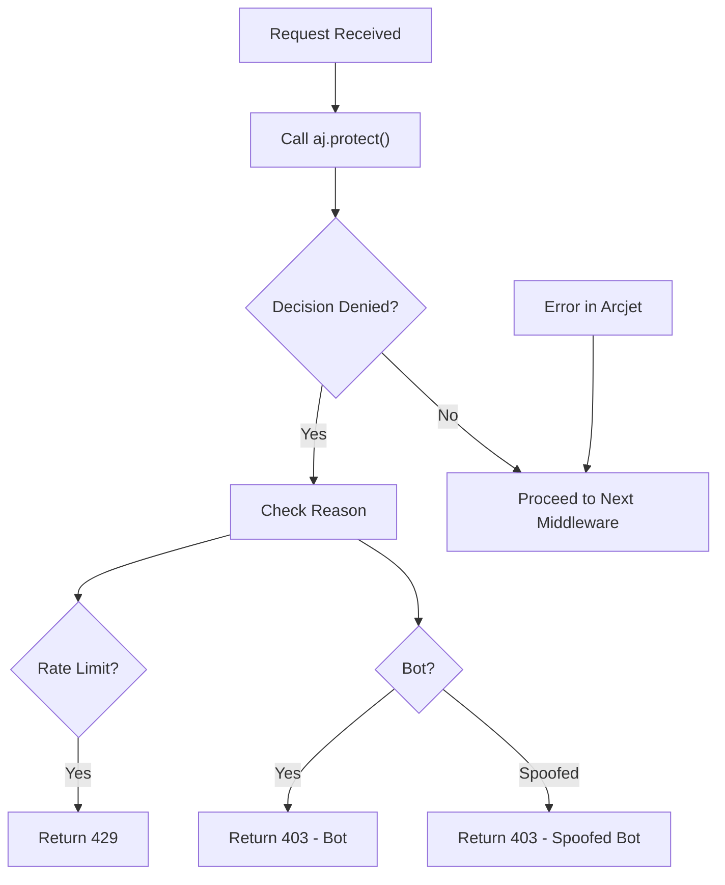

# Arcjet Security & Rate Limiting

<cite>
**Referenced Files in This Document**   
- [arcjet.js](file://backend/src/config/arcjet.js#L1-L30)
- [arcjet.middleware.js](file://backend/src/middleware/arcjet.middleware.js#L1-L45)
- [server.js](file://backend/src/server.js#L1-L47)
</cite>

## Table of Contents
1. [Introduction](#introduction)
2. [Project Structure](#project-structure)
3. [Core Components](#core-components)
4. [Architecture Overview](#architecture-overview)
5. [Detailed Component Analysis](#detailed-component-analysis)
6. [Dependency Analysis](#dependency-analysis)
7. [Performance Considerations](#performance-considerations)
8. [Troubleshooting Guide](#troubleshooting-guide)
9. [Conclusion](#conclusion)

## Introduction
This document provides a comprehensive overview of the Arcjet integration in xClone, a full-stack social media application. Arcjet is used to secure the backend API by preventing abuse such as DDoS attacks, bot scraping, and brute force attempts. The implementation includes request rate limiting, bot detection, and protection against common web vulnerabilities. This documentation details how Arcjet is initialized, configured, and integrated into the Express.js application, along with best practices for handling security decisions and monitoring threats.

## Project Structure
The xClone project is structured into two main directories: `backend` and `mobile`. The backend, built with Node.js and Express, contains the Arcjet security implementation in the `src/config` and `src/middleware` directories. The mobile app is built using React Native and does not directly interact with Arcjet, which operates exclusively on the server side.



**Diagram sources**
- [arcjet.js](file://backend/src/config/arcjet.js#L1-L30)
- [arcjet.middleware.js](file://backend/src/middleware/arcjet.middleware.js#L1-L45)
- [server.js](file://backend/src/server.js#L1-L47)

**Section sources**
- [arcjet.js](file://backend/src/config/arcjet.js#L1-L30)
- [arcjet.middleware.js](file://backend/src/middleware/arcjet.middleware.js#L1-L45)
- [server.js](file://backend/src/server.js#L1-L47)

## Core Components
The core components of the Arcjet implementation include:
- **arcjet.js**: Configuration file where Arcjet is initialized with security rules.
- **arcjet.middleware.js**: Middleware that intercepts HTTP requests and applies Arcjet's protection logic.
- **server.js**: Entry point of the Express application where the Arcjet middleware is registered.

These components work together to evaluate each incoming request, determine its risk level, and either allow, challenge, or block it based on predefined policies.

**Section sources**
- [arcjet.js](file://backend/src/config/arcjet.js#L1-L30)
- [arcjet.middleware.js](file://backend/src/middleware/arcjet.middleware.js#L1-L45)
- [server.js](file://backend/src/server.js#L1-L47)

## Architecture Overview
Arcjet is integrated as a middleware layer in the Express.js application. When a request arrives, it passes through the Arcjet middleware before reaching any route handler. The middleware sends the request context to Arcjet for analysis, which returns a decision based on configured rules. If the request is denied, the middleware responds with an appropriate HTTP error code. Otherwise, the request proceeds to the intended route.



**Diagram sources**
- [arcjet.middleware.js](file://backend/src/middleware/arcjet.middleware.js#L1-L45)
- [server.js](file://backend/src/server.js#L1-L47)

## Detailed Component Analysis

### Arcjet Configuration (arcjet.js)
The `arcjet.js` file initializes the Arcjet instance with three primary rules:
- **Shield**: Protects against common attacks like SQL injection, XSS, and CSRF.
- **detectBot**: Identifies and blocks automated bots, except for recognized search engines.
- **tokenBucket**: Implements rate limiting using the token bucket algorithm.

The configuration uses environment variables for the Arcjet API key and sets the rate limit to 10 requests every 10 seconds, with a burst capacity of 15.

```javascript
export const aj = arcjet({
  key: ENV.ARCJET_KEY,
  characteristics: ["ip.src"],
  rules: [
    shield({ mode: "LIVE" }),
    detectBot({
      mode: "LIVE",
      allow: ["CATEGORY:SEARCH_ENGINE"],
    }),
    tokenBucket({
      mode: "LIVE",
      refillRate: 10,
      interval: 10,
      capacity: 15,
    }),
  ],
});
```

**Section sources**
- [arcjet.js](file://backend/src/config/arcjet.js#L1-L30)

### Arcjet Middleware (arcjet.middleware.js)
The middleware function `arcjetMiddleware` is responsible for enforcing Arcjet's decisions. It calls `aj.protect()` with the incoming request and checks the decision result. If the request is denied due to rate limiting, a 429 status is returned. If denied due to bot activity, a 403 is returned. The middleware also specifically checks for spoofed bots, which are bots masquerading as legitimate traffic.

Error handling ensures that if Arcjet fails (e.g., network issue), the request is still allowed to proceed, maintaining application availability.



**Diagram sources**
- [arcjet.middleware.js](file://backend/src/middleware/arcjet.middleware.js#L1-L45)

**Section sources**
- [arcjet.middleware.js](file://backend/src/middleware/arcjet.middleware.js#L1-L45)

### Integration in Server (server.js)
The Arcjet middleware is applied globally in `server.js` using `app.use(arcjetMiddleware)`. This ensures that all incoming requests are evaluated by Arcjet before being processed by any route handler. The middleware is placed after CORS and JSON parsing but before any route definitions, ensuring consistent protection across all endpoints.

```javascript
app.use(cors());
app.use(express.json());
app.use(clerkMiddleware());
app.use(arcjetMiddleware); // Applied before routes
app.use("/api/users", userRouters);
```

**Section sources**
- [server.js](file://backend/src/server.js#L1-L47)

## Dependency Analysis
Arcjet is included as a dependency in the project via the `package-lock.json` file, specifically version `1.0.0-beta.8`. It depends on several internal Arcjet modules for analysis, caching, and protocol handling. The middleware integrates with Express.js and relies on the request object being fully parsed before evaluation.

```mermaid
graph LR
A[arcjet] --> B[@arcjet/analyze]
A --> C[@arcjet/cache]
A --> D[@arcjet/duration]
A --> E[@arcjet/headers]
A --> F[@arcjet/protocol]
A --> G[@arcjet/runtime]
A --> H[@arcjet/stable-hash]
I[Express.js] --> A
```

**Diagram sources**
- [package-lock.json](file://backend/package-lock.json#L361-L432)

## Performance Considerations
Arcjet's protection is designed to be lightweight and non-blocking. The token bucket algorithm ensures smooth rate limiting without abrupt cutoffs. In case of Arcjet service unavailability, the middleware falls back to allowing requests, ensuring the application remains operational. However, this means that during outages, rate limiting and bot protection are temporarily disabled.

For high-traffic scenarios, consider adjusting the `refillRate`, `interval`, and `capacity` values to match expected user behavior and prevent false positives on legitimate high-volume users.

## Troubleshooting Guide
Common issues and their solutions:

- **False positives on legitimate users**: Users making rapid requests (e.g., power users) may hit rate limits. Consider increasing the `capacity` or `refillRate`, or implement user-based rate limiting using `characteristics: ["user.id"]` if user identity is available.

- **Blocked search engine bots**: Ensure that `CATEGORY:SEARCH_ENGINE` is included in the `allow` list of `detectBot`. Refer to [Arcjet's bot list](https://arcjet.com/bot-list) for updates.

- **Arcjet middleware errors**: Errors are logged to the console but do not block requests. Monitor logs for `Arcjet middleware error:` messages and verify network connectivity to Arcjet's API.

- **Debugging blocked requests**: Use Arcjet's dashboard to inspect decision logs, including the reason for denial (rate limit, bot, etc.) and request metadata.

## Conclusion
The Arcjet integration in xClone provides robust protection against common web threats through a combination of rate limiting, bot detection, and attack shielding. The implementation is modular, with clear separation between configuration and middleware logic, and is resilient to service failures. By tuning the rules and monitoring the dashboard, the system can effectively balance security and usability in production environments.