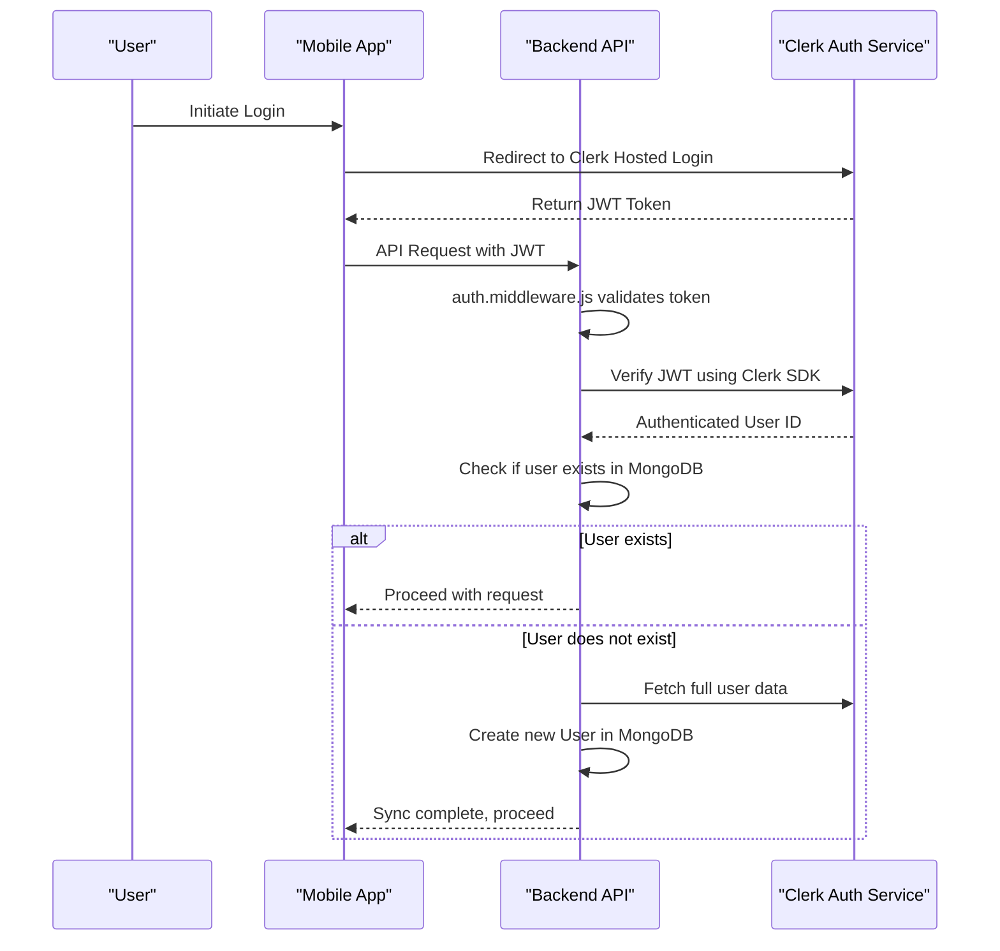

# Clerk Authentication Integration

<cite>
**Referenced Files in This Document**   
- [auth.middleware.js](file://backend/src/middleware/auth.middleware.js)
- [user.controller.js](file://backend/src/controllers/user.controller.js)
- [user.model.js](file://backend/src/models/user.model.js)
- [user.route.js](file://backend/src/routes/user.route.js)
- [env.js](file://backend/src/config/env.js)
- [app.json](file://mobile/app.json)
</cite>

## Table of Contents
1. [Introduction](#introduction)
2. [Project Structure](#project-structure)
3. [Core Components](#core-components)
4. [Authentication Flow Overview](#authentication-flow-overview)
5. [Middleware Implementation](#middleware-implementation)
6. [User Synchronization and Profile Management](#user-synchronization-and-profile-management)
7. [Environment Configuration](#environment-configuration)
8. [Mobile Deep Linking Setup](#mobile-deep-linking-setup)
9. [Protected Routes and Error Handling](#protected-routes-and-error-handling)
10. [Best Practices and Troubleshooting](#best-practices-and-troubleshooting)

## Introduction
This document provides a comprehensive overview of the Clerk authentication integration within the xClone application. Clerk is used as the primary identity provider to manage user authentication via OAuth, enabling secure JWT-based session management and seamless user identity verification. The integration includes middleware for request validation, automatic user profile synchronization between Clerk and the local MongoDB database, and secure environment configuration. This system ensures that only authenticated users can access protected endpoints while maintaining data consistency across external and internal user representations.

## Project Structure
The xClone project follows a modular architecture with a clear separation between frontend (mobile) and backend services. The backend implements Express.js with a structured folder layout for configuration, controllers, middleware, models, and routes. The mobile application is built using Expo and React Native, leveraging deep linking for authentication callbacks.

Key directories:
- `backend/src`: Contains all server-side logic
  - `config`: Environment and service configurations
  - `controllers`: Business logic handlers
  - `middleware`: Request processing components (e.g., auth)
  - `models`: MongoDB schema definitions
  - `routes`: API endpoint definitions
- `mobile`: Expo-based mobile application
  - `app`: Core application screens and navigation
  - `constants`, `hooks`, `components`: UI and utility modules

**Section sources**
- [auth.middleware.js](file://backend/src/middleware/auth.middleware.js#L1-L9)
- [user.route.js](file://backend/src/routes/user.route.js#L1-L17)

## Core Components
The Clerk authentication system in xClone revolves around several core components:
- **Authentication Middleware**: Validates incoming requests using Clerk’s SDK
- **User Controller**: Manages user data synchronization and profile operations
- **User Model**: Defines the MongoDB schema for local user storage
- **Environment Configuration**: Stores sensitive Clerk API keys securely
- **Mobile App Configuration**: Enables deep linking for authentication redirects

These components work together to ensure secure, stateless authentication with persistent user data.

**Section sources**
- [auth.middleware.js](file://backend/src/middleware/auth.middleware.js#L1-L9)
- [user.controller.js](file://backend/src/controllers/user.controller.js#L1-L70)
- [user.model.js](file://backend/src/models/user.model.js#L1-L62)

## Authentication Flow Overview
The authentication process begins when a user logs in via Clerk’s hosted UI or social providers. Upon successful login, Clerk issues a JWT token that is sent to the backend with each request. The backend verifies this token using Clerk’s Express SDK and extracts the authenticated user’s identity. If the user does not exist locally, their profile is synchronized from Clerk into the MongoDB `User` collection.



**Diagram sources**
- [auth.middleware.js](file://backend/src/middleware/auth.middleware.js#L1-L9)
- [user.controller.js](file://backend/src/controllers/user.controller.js#L34-L70)

## Middleware Implementation
The `protectRoute` middleware is responsible for validating all incoming requests that require authentication. It uses the `@clerk/express` SDK to inspect the request and determine whether the user is authenticated.

### Code Implementation
```javascript
export const protectRoute = async (req, res, next) => {
  if (!req.auth().isAuthenticated) {
    return res.status(401).json({
      message: "Unauthorized - you must be logged in",
    });
  }
  next();
};
```

This middleware checks the result of `req.auth().isAuthenticated`, a method provided by Clerk’s Express integration. If the user is not authenticated, a 401 Unauthorized response is returned. Otherwise, the request proceeds to the next handler.

The middleware is applied to specific routes in `user.route.js`, ensuring that only authenticated users can access profile updates, user syncing, and follow actions.

**Section sources**
- [auth.middleware.js](file://backend/src/middleware/auth.middleware.js#L1-L9)
- [user.route.js](file://backend/src/routes/user.route.js#L10-L17)

## User Synchronization and Profile Management
To maintain consistency between Clerk’s user directory and the local database, xClone implements a user synchronization mechanism. When a new authenticated user accesses the system, their data is pulled from Clerk and stored in MongoDB.

### User Model Schema
The `User` model in MongoDB mirrors key attributes from Clerk:

```javascript
const userSchema = new mongoose.Schema({
  clerkId: { type: String, required: true, unique: true },
  email: { type: String, required: true, unique: true },
  firstName: { type: String, required: true },
  lastName: { type: String, required: true },
  username: { type: String, required: true, unique: true },
  profilePicture: { type: String, default: "" },
  followers: [{ type: mongoose.Schema.Types.ObjectId, ref: "User" }],
  following: [{ type: mongoose.Schema.Types.ObjectId, ref: "User" }],
}, { timestamps: true });
```

### Sync Logic
The `syncUser` controller function performs the synchronization:

```javascript
export const syncUser = asyncHandler(async (req, res) => {
  const { userId } = getAuth(req);
  const existingUser = await User.findOne({ clerkId: userId });
  if (existingUser) return res.status(200).json({ message: "User already exists" });

  const clerkUser = await clerkClient.users.getUser(userId);
  const userData = {
    clerkId: userId,
    email: clerkUser.emailAddresses[0].emailAddress,
    firstName: clerkUser.firstName || "",
    lastName: clerkUser.lastName || "",
    username: clerkUser.emailAddresses[0].emailAddress.split("@")[0],
    profilePicture: clerkUser.imageUrl || "",
  };
  const user = await User.create(userData);
  res.status(201).json({ user, message: "User created successfully" });
});
```

This ensures that every authenticated user has a corresponding local record, enabling features like following, notifications, and personalized content.

**Section sources**
- [user.model.js](file://backend/src/models/user.model.js#L1-L62)
- [user.controller.js](file://backend/src/controllers/user.controller.js#L34-L70)

## Environment Configuration
Secure handling of API credentials is critical for authentication systems. xClone uses environment variables to store Clerk’s sensitive keys.

### Environment Variables
```javascript
export const ENV = {
    PORT: process.env.PORT || 5001,
    MONGO_URI: process.env.MONGO_URI,
    NODE_ENV: process.env.NODE_ENV,
    CLERK_PUBLISHABLE_KEY: process.env.CLERK_PUBLISHABLE_KEY,
    CLERK_SECRET_KEY: process.env.CLERK_SECRET_KEY,
    ARCJET_KEY: process.env.ARCJET_KEY,
    CLOUDINARY_CLOUD_NAME: process.env.CLOUDINARY_CLOUD_NAME,
    CLOUDINARY_API_KEY: process.env.CLOUDINARY_API_KEY,
    CLOUDINARY_API_SECRET: process.env.CLOUDINARY_API_SECRET,
}
```

- `CLERK_PUBLISHABLE_KEY`: Used on the frontend to initialize the Clerk client
- `CLERK_SECRET_KEY`: Used on the backend to verify JWT tokens (must never be exposed)

These values are loaded via `dotenv` and should be set in a `.env` file or deployment environment.

**Section sources**
- [env.js](file://backend/src/config/env.js#L1-L16)

## Mobile Deep Linking Setup
For seamless authentication in the mobile app, deep linking is configured in `app.json` to allow the app to handle authentication callbacks.

### app.json Configuration
```json
{
  "expo": {
    "name": "mobile",
    "slug": "mobile",
    "scheme": "mobile",
    "plugins": [
      "expo-router",
      [
        "expo-splash-screen",
        {
          "image": "./assets/images/splash-icon.png"
        }
      ]
    ]
  }
}
```

- `scheme: "mobile"` enables custom URI scheme handling (e.g., `mobile://`)
- This allows the app to intercept authentication redirects from Clerk after login
- The Expo Router handles navigation based on the deep link

This setup ensures a smooth login experience without requiring users to switch contexts.

**Section sources**
- [app.json](file://mobile/app.json#L1-L43)

## Protected Routes and Error Handling
Protected routes are defined in `user.route.js` and use the `protectRoute` middleware to enforce authentication.

### Example Protected Routes
```javascript
router.post("/sync", protectRoute, syncUser);
router.post("/me", protectRoute, getCurrentUser);
router.put("/profile", protectRoute, updateProfile);
router.post("/follow/:targetUserId", protectRoute, followUser);
```

All these endpoints require valid authentication. If an unauthenticated request is made, the middleware returns:
```json
{
  "message": "Unauthorized - you must be logged in"
}
```

The `getCurrentUser` controller uses `getAuth(req)` to retrieve the authenticated user ID and fetches the corresponding local user record.

### Error Handling
- **401 Unauthorized**: Triggered when no valid token is present
- **404 Not Found**: Returned when a user exists in Clerk but not in MongoDB (should be rare due to sync)
- Input validation and edge cases (e.g., self-following) are also handled explicitly

**Section sources**
- [user.route.js](file://backend/src/routes/user.route.js#L1-L17)
- [user.controller.js](file://backend/src/controllers/user.controller.js#L45-L70)

## Best Practices and Troubleshooting

### Best Practices
- **Never expose `CLERK_SECRET_KEY`** – keep it server-side only
- Use HTTPS in production to protect JWT transmission
- Implement rate limiting and bot protection (Arcjet is integrated for this)
- Regularly audit user data synchronization logic
- Keep Clerk SDKs updated for security patches

### Common Issues and Solutions
| Issue | Cause | Solution |
|------|-------|----------|
| Token expiration | JWT lifetime exceeded | Implement token refresh logic in mobile app |
| CORS errors during development | Origin mismatch | Add localhost origins to Clerk dashboard allowed list |
| User not found after login | Sync failure | Ensure `syncUser` is called on first login |
| Deep link not opening app | Scheme misconfiguration | Verify `scheme` in `app.json` matches intent URL |

### Testing Authenticated Endpoints
Use tools like Postman or curl with a valid JWT in the request headers:
```bash
curl -H "Authorization: Bearer <token>" http://localhost:5001/api/users/me
```

Ensure test environments use separate Clerk application instances to avoid affecting production data.

**Section sources**
- [auth.middleware.js](file://backend/src/middleware/auth.middleware.js#L1-L9)
- [env.js](file://backend/src/config/env.js#L1-L16)
- [user.controller.js](file://backend/src/controllers/user.controller.js#L1-L70)