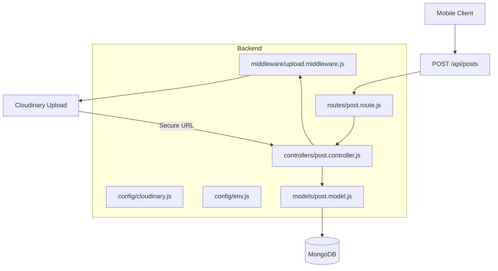
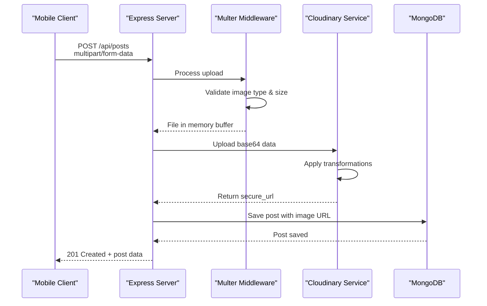
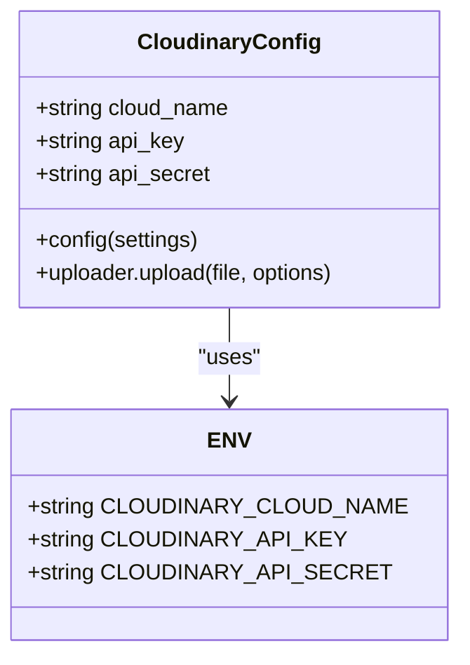
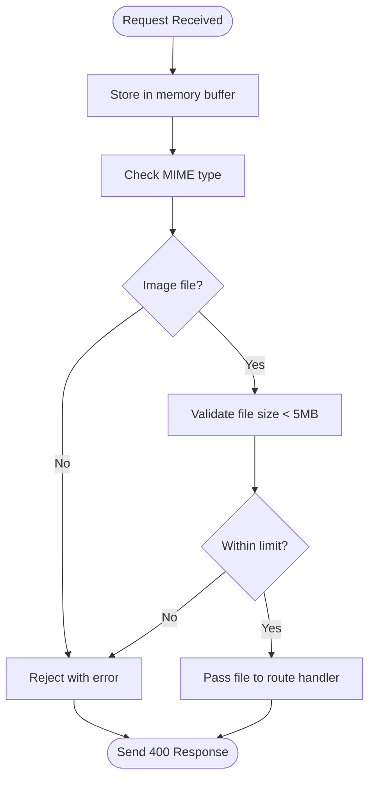
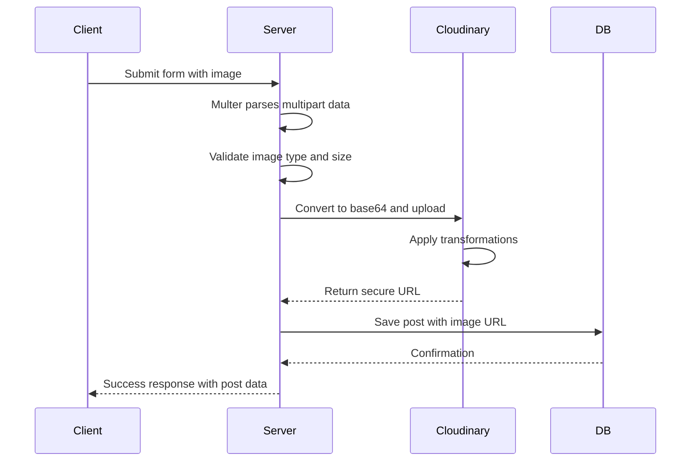

# Cloudinary Media Storage Integration

<cite>
**Referenced Files in This Document**   
- [cloudinary.js](file://backend/src/config/cloudinary.js#L1-L11)
- [env.js](file://backend/src/config/env.js#L1-L16)
- [upload.middleware.js](file://backend/src/middleware/upload.middleware.js#L1-L22)
- [post.model.js](file://backend/src/models/post.model.js#L1-L37)
- [post.controller.js](file://backend/src/controllers/post.controller.js#L1-L159)
</cite>

## Table of Contents
1. [Introduction](#introduction)
2. [Project Structure](#project-structure)
3. [Core Components](#core-components)
4. [Architecture Overview](#architecture-overview)
5. [Detailed Component Analysis](#detailed-component-analysis)
6. [Image Upload Pipeline](#image-upload-pipeline)
7. [Cloudinary Configuration](#cloudinary-configuration)
8. [Security and Error Handling](#security-and-error-handling)
9. [Best Practices](#best-practices)
10. [Troubleshooting Guide](#troubleshooting-guide)

## Introduction
This document provides a comprehensive overview of the Cloudinary media storage integration within the xClone application. It details the end-to-end image upload process from the mobile client through server-side processing to secure storage on Cloudinary. The integration enables users to upload images with automatic optimization, transformation, and secure URL generation for efficient delivery via CDN.

## Project Structure
The xClone project follows a modular backend architecture with clear separation of concerns. The Cloudinary integration is implemented across configuration, middleware, model, and controller layers in the backend service.



**Diagram sources**
- [cloudinary.js](file://backend/src/config/cloudinary.js#L1-L11)
- [upload.middleware.js](file://backend/src/middleware/upload.middleware.js#L1-L22)
- [post.controller.js](file://backend/src/controllers/post.controller.js#L1-L159)
- [post.model.js](file://backend/src/models/post.model.js#L1-L37)

**Section sources**
- [cloudinary.js](file://backend/src/config/cloudinary.js#L1-L11)
- [upload.middleware.js](file://backend/src/middleware/upload.middleware.js#L1-L22)

## Core Components
The Cloudinary integration relies on several core components working in concert:

- **cloudinary.js**: Configuration module that initializes the Cloudinary SDK with environment credentials
- **upload.middleware.js**: Multer middleware that processes multipart form data and validates image uploads
- **post.model.js**: Mongoose schema storing the publicly accessible Cloudinary URL in the Post document
- **post.controller.js**: Business logic handling the complete upload workflow including transformation and error handling

These components form a cohesive pipeline ensuring secure, optimized, and reliable image storage.

**Section sources**
- [cloudinary.js](file://backend/src/config/cloudinary.js#L1-L11)
- [upload.middleware.js](file://backend/src/middleware/upload.middleware.js#L1-L22)
- [post.model.js](file://backend/src/models/post.model.js#L1-L37)
- [post.controller.js](file://backend/src/controllers/post.controller.js#L1-L159)

## Architecture Overview
The image upload architecture follows a layered approach with distinct responsibilities:



**Diagram sources**
- [upload.middleware.js](file://backend/src/middleware/upload.middleware.js#L1-L22)
- [post.controller.js](file://backend/src/controllers/post.controller.js#L1-L159)
- [cloudinary.js](file://backend/src/config/cloudinary.js#L1-L11)

## Detailed Component Analysis

### Cloudinary Configuration Analysis
The Cloudinary SDK is configured using environment variables for security and flexibility.



**Diagram sources**
- [cloudinary.js](file://backend/src/config/cloudinary.js#L1-L11)
- [env.js](file://backend/src/config/env.js#L1-L16)

#### Configuration Implementation
The `cloudinary.js` module imports the Cloudinary SDK and configures it with credentials from the environment:

```javascript
import { v2 as cloudinary } from "cloudinary";
import { ENV } from "./env.js";

cloudinary.config({
  cloud_name: ENV.CLOUDINARY_CLOUD_NAME,
  api_key: ENV.CLOUDINARY_API_KEY,
  api_secret: ENV.CLOUDINARY_API_SECRET,
});

export default cloudinary;
```

This approach ensures API credentials are never hardcoded and can be easily rotated or changed per deployment environment.

**Section sources**
- [cloudinary.js](file://backend/src/config/cloudinary.js#L1-L11)
- [env.js](file://backend/src/config/env.js#L1-L16)

### Upload Middleware Analysis
The multer middleware handles the initial processing of uploaded files.



**Diagram sources**
- [upload.middleware.js](file://backend/src/middleware/upload.middleware.js#L1-L22)

#### Middleware Implementation
The `upload.middleware.js` file configures multer to:

- Store files in memory (not on disk)
- Filter only image MIME types
- Enforce a 5MB file size limit

```javascript
const storage = multer.memoryStorage();

const fileFilter = (req, file, cb) => {
    if (file.mimetype.startsWith("image/")) {
      cb(null, true);
    } else {
      cb(new Error("Only image files are allowed"), false);
    }
  };
  
  const upload = multer({
    storage: storage,
    fileFilter: fileFilter,
    limits: { fileSize: 5 * 1024 * 1024 }, // 5MB limit
  });
```

This configuration is optimal for Cloudinary integration as it allows direct streaming of image data without temporary file storage.

**Section sources**
- [upload.middleware.js](file://backend/src/middleware/upload.middleware.js#L1-L22)

## Image Upload Pipeline
The complete image upload process involves multiple stages from client to storage.



**Diagram sources**
- [upload.middleware.js](file://backend/src/middleware/upload.middleware.js#L1-L22)
- [post.controller.js](file://backend/src/controllers/post.controller.js#L1-L159)

### Upload Processing in Controller
The `createPosts` controller method orchestrates the upload pipeline:

```javascript
const base64Image = `data:${imageFile.mimetype};base64,${imageFile.buffer.toString("base64")}`;

const uploadResponse = await cloudinary.uploader.upload(base64Image, {
  folder: "social_media_posts",
  resource_type: "image",
  transformation: [
    { width: 800, height: 600, crop: "limit" },
    { quality: "auto" },
    { format: "auto" },
  ],
});
imageUrl = uploadResponse.secure_url;
```

Key features of this implementation:
- **Base64 encoding**: Converts the memory buffer to a format Cloudinary can process
- **Folder organization**: Images are stored in "social_media_posts" folder for easy management
- **Automatic transformations**: Resizes to maximum 800x600, optimizes quality, and converts to optimal format

**Section sources**
- [post.controller.js](file://backend/src/controllers/post.controller.js#L1-L159)

## Cloudinary Configuration
The Cloudinary integration includes several optimization and security settings.

### Transformation Options
The current configuration applies three transformations:

- **Resizing**: `{ width: 800, height: 600, crop: "limit" }` - Scales images to fit within 800x600 while maintaining aspect ratio
- **Quality optimization**: `{ quality: "auto" }` - Automatically selects optimal compression level
- **Format conversion**: `{ format: "auto" }` - Delivers in WebP/AVIF when supported, JPEG/PNG otherwise

These settings reduce bandwidth usage by up to 70% compared to original uploads while maintaining visual quality.

### Storage Structure
Images are organized in Cloudinary with the following structure:
- **Folder**: `social_media_posts` - Logical grouping for application-specific assets
- **Naming**: Cloudinary generates unique public IDs automatically
- **Access**: All images are publicly accessible via secure URLs

**Section sources**
- [post.controller.js](file://backend/src/controllers/post.controller.js#L1-L159)
- [cloudinary.js](file://backend/src/config/cloudinary.js#L1-L11)

## Security and Error Handling
The implementation includes several security and reliability measures.

### Input Validation
The system validates:
- **File type**: Only accepts MIME types starting with "image/"
- **File size**: Maximum 5MB per upload
- **Authentication**: Requires authenticated user (via Clerk) to create posts

### Error Handling
The `createPosts` controller includes comprehensive error handling:

```javascript
try {
  const uploadResponse = await cloudinary.uploader.upload(base64Image, { ... });
  imageUrl = uploadResponse.secure_url;
} catch (uploadError) {
  console.error("Cloudinary upload error:", uploadError);
  return res.status(400).json({ error: "Failed to upload image" });
}
```

Errors are logged server-side and appropriate HTTP responses are sent to the client.

### Security Considerations
- **API credentials**: Stored in environment variables, never in code
- **Secure URLs**: Cloudinary delivers images over HTTPS
- **Input sanitization**: MIME type validation prevents non-image uploads
- **Rate limiting**: Could be enhanced with Arcjet middleware for upload endpoints

**Section sources**
- [post.controller.js](file://backend/src/controllers/post.controller.js#L1-L159)
- [upload.middleware.js](file://backend/src/middleware/upload.middleware.js#L1-L22)

## Best Practices
Recommended practices for maintaining and enhancing the Cloudinary integration:

### Asset Management
- **Folder organization**: Use consistent folder structures for different content types
- **Tags**: Add descriptive tags to images for easier searching and management
- **Backups**: Enable Cloudinary backup options for critical assets

### Performance Optimization
- **CDN caching**: Leverage Cloudinary's global CDN with long cache headers
- **Responsive images**: Use `dpr_auto` and `responsive` classes in frontend
- **Lazy loading**: Implement lazy loading for images below the fold

### Fallback Strategies
- **Local storage fallback**: Temporarily store images locally if Cloudinary is unavailable
- **Retry logic**: Implement exponential backoff for failed uploads
- **Client-side validation**: Validate image dimensions before upload

### Monitoring
- **Upload metrics**: Track success/failure rates and upload times
- **Bandwidth usage**: Monitor optimization effectiveness
- **Error logging**: Centralize Cloudinary error logs

## Troubleshooting Guide
Common issues and their solutions:

### Expired Upload Signatures
**Issue**: Uploads fail with signature expiration errors  
**Solution**: Ensure server time is synchronized with NTP servers, as Cloudinary signatures are time-sensitive

### Incorrect MIME Types
**Issue**: Valid images rejected by file filter  
**Solution**: Verify the mobile client sends correct Content-Type headers; consider logging received MIME types for debugging

### Large File Uploads
**Issue**: Files over 5MB rejected  
**Solution**: Either increase the multer limit or implement client-side resizing before upload

### Slow Upload Performance
**Issue**: High latency during image uploads  
**Solution**: 
- Check server-to-Cloudinary network connectivity
- Verify Cloudinary region selection
- Consider direct client-side uploads with signed URLs for large files

### Broken Image URLs
**Issue**: Stored URLs return 404 or placeholder images  
**Solution**: 
- Verify Cloudinary configuration credentials
- Check that the folder name hasn't been changed
- Validate that the secure_url is being stored correctly in the database

**Section sources**
- [post.controller.js](file://backend/src/controllers/post.controller.js#L1-L159)
- [upload.middleware.js](file://backend/src/middleware/upload.middleware.js#L1-L22)
- [post.model.js](file://backend/src/models/post.model.js#L1-L37)