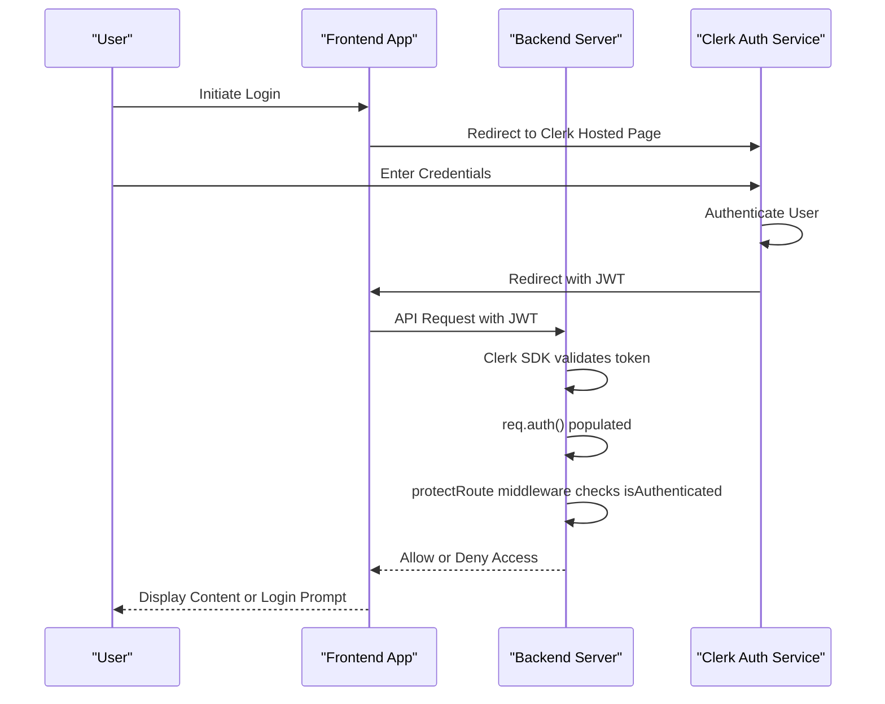
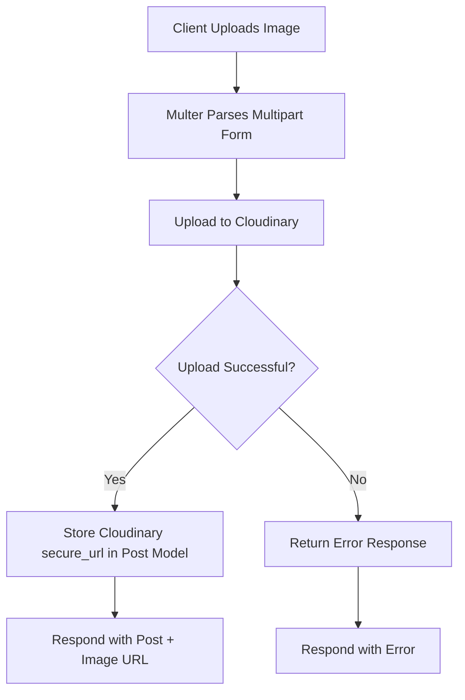
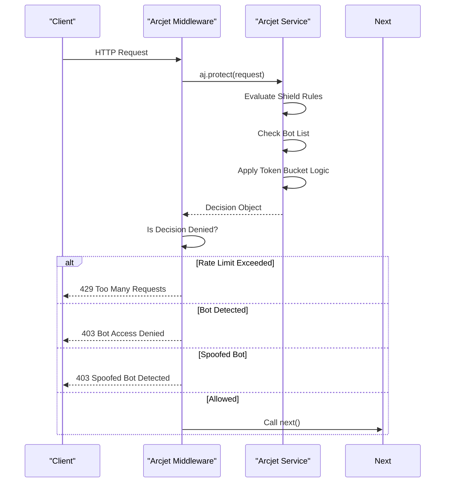

# Third-Party Integrations

<cite>
**Referenced Files in This Document**   
- [arcjet.js](file://backend/src/config/arcjet.js#L1-L31)
- [cloudinary.js](file://backend/src/config/cloudinary.js#L1-L11)
- [env.js](file://backend/src/config/env.js#L1-L16)
- [arcjet.middleware.js](file://backend/src/middleware/arcjet.middleware.js#L1-L46)
- [auth.middleware.js](file://backend/src/middleware/auth.middleware.js#L1-L9)
- [upload.middleware.js](file://backend/src/middleware/upload.middleware.js)
</cite>

## Table of Contents
1. [Introduction](#introduction)
2. [Authentication with Clerk](#authentication-with-clerk)
3. [Image Upload Processing with Cloudinary](#image-upload-processing-with-cloudinary)
4. [Security and Rate Limiting with Arcjet](#security-and-rate-limiting-with-arcjet)
5. [Middleware Integration and Initialization](#middleware-integration-and-initialization)
6. [Troubleshooting Common Integration Issues](#troubleshooting-common-integration-issues)
7. [Best Practices for Key Management and Monitoring](#best-practices-for-key-management-and-monitoring)

## Introduction
This document provides a comprehensive overview of the third-party integrations implemented in the xClone backend system. It details the configuration and usage of Clerk for user authentication, Cloudinary for image upload processing, and Arcjet for security and rate limiting. The integration points, middleware implementations, and data flow between services are analyzed to ensure clarity for developers and maintainers. Special emphasis is placed on secure practices, error handling, and performance considerations.

## Authentication with Clerk
Clerk is integrated as the primary authentication provider in xClone, managing user sign-up, login, session validation, and profile synchronization. Although specific implementation files such as `clerk.js` or route handlers are not directly visible in the provided context, the presence of Clerk environment variables and the `protectRoute` middleware confirms its usage.

The authentication flow follows the OAuth 2.0 standard:
- Users are redirected to Clerk’s hosted authentication interface.
- Upon successful login, Clerk issues a JWT (JSON Web Token) that is validated on each subsequent request.
- The `protectRoute` middleware intercepts protected routes and checks the `req.auth().isAuthenticated` property, which is populated by Clerk’s Express integration.

User session management is handled entirely by Clerk, reducing the need for local session storage. However, user profile data is synchronized with the local MongoDB database upon first login or profile update to enable personalized features within the application.



**Diagram sources**
- [auth.middleware.js](file://backend/src/middleware/auth.middleware.js#L1-L9)

**Section sources**
- [auth.middleware.js](file://backend/src/middleware/auth.middleware.js#L1-L9)

## Image Upload Processing with Cloudinary
Cloudinary is used for handling image uploads in xClone, providing scalable storage, transformation capabilities, and CDN delivery. The integration is configured through the `cloudinary.js` config file, which initializes the Cloudinary SDK using credentials stored in environment variables.

### Configuration and Initialization
The Cloudinary SDK is initialized with the following parameters:
- `cloud_name`: Identifier for the Cloudinary account
- `api_key`: Public API key for authentication
- `api_secret`: Private API secret for secure operations

These values are securely loaded from the `ENV` object defined in `env.js`.

```javascript
// cloudinary.js
cloudinary.config({
  cloud_name: ENV.CLOUDINARY_CLOUD_NAME,
  api_key: ENV.CLOUDINARY_API_KEY,
  api_secret: ENV.CLOUDINARY_API_SECRET,
});
```

### Multer Middleware Pipeline
Although the full `upload.middleware.js` file is not available, it is expected to use Multer to handle multipart form data (file uploads). The typical flow includes:
1. Receiving image file via HTTP POST request
2. Uploading file to Cloudinary using `cloudinary.uploader.upload()`
3. Transforming images (resizing, format conversion) using Cloudinary’s transformation options
4. Storing the returned secure URL in the relevant database model (e.g., Post model)

Secure upload signatures may be implemented to prevent unauthorized uploads by generating time-limited tokens on the server.

### URL Storage in Post Model
After successful upload, the `secure_url` returned by Cloudinary is stored in the `Post` model, enabling efficient retrieval and display of images without local storage overhead.



**Diagram sources**
- [cloudinary.js](file://backend/src/config/cloudinary.js#L1-L11)
- [upload.middleware.js](file://backend/src/middleware/upload.middleware.js)

**Section sources**
- [cloudinary.js](file://backend/src/config/cloudinary.js#L1-L11)

## Security and Rate Limiting with Arcjet
Arcjet is employed to protect xClone against malicious traffic, including bots, DDoS attempts, and brute-force attacks. It is configured with multiple layered rules for comprehensive protection.

### Configuration Overview
The Arcjet instance is initialized in `arcjet.js` with three primary rules:
- **Shield**: Protects against common web vulnerabilities such as SQL injection, XSS, and CSRF.
- **Bot Detection**: Blocks automated bots while allowing legitimate search engine crawlers.
- **Token Bucket Rate Limiter**: Limits requests to 10 per 10 seconds, with a burst capacity of 15.

```javascript
// arcjet.js
export const aj = arcjet({
  key: ENV.ARCJET_KEY,
  characteristics: ["ip.src"],
  rules: [
    shield({ mode: "LIVE" }),
    detectBot({
      mode: "LIVE",
      allow: ["CATEGORY:SEARCH_ENGINE"],
    }),
    tokenBucket({
      mode: "LIVE",
      refillRate: 10,
      interval: 10,
      capacity: 15,
    }),
  ],
});
```

### Request Flow and Decision Handling
The `arcjetMiddleware` processes each incoming request:
1. Calls `aj.protect(req, { requested: 1 })` to evaluate the request against active rules.
2. If the decision is denied:
   - Returns `429 Too Many Requests` for rate limit violations
   - Returns `403 Forbidden` for bot detection
3. Additional check for spoofed bots (bots masquerading as browsers)
4. Proceeds to next middleware if allowed

Errors in Arcjet processing do not block the request, ensuring availability even if the service fails.



**Diagram sources**
- [arcjet.js](file://backend/src/config/arcjet.js#L1-L31)
- [arcjet.middleware.js](file://backend/src/middleware/arcjet.middleware.js#L1-L46)

**Section sources**
- [arcjet.js](file://backend/src/config/arcjet.js#L1-L31)
- [arcjet.middleware.js](file://backend/src/middleware/arcjet.middleware.js#L1-L46)

## Middleware Integration and Initialization
Third-party services are integrated into the Express application via middleware functions that are applied to specific routes or globally.

### Initialization Flow
1. Environment variables are loaded via `dotenv` in `env.js`
2. Each service (Arcjet, Cloudinary, Clerk) is initialized with its respective configuration
3. Middleware functions are exported for use in route definitions

### Application in Routes
While route files are not fully visible, the expected usage pattern is:

```javascript
// Example route usage (inferred)
import { arcjetMiddleware } from "../middleware/arcjet.middleware.js";
import { protectRoute } from "../middleware/auth.middleware.js";

router.post("/post", arcjetMiddleware, protectRoute, createPost);
```

This ensures:
- Security checks (Arcjet) are applied first
- Authentication is verified before processing
- Business logic executes only for valid, authenticated requests

## Troubleshooting Common Integration Issues

### Expired Upload Signatures
**Issue**: Cloudinary upload fails with "Invalid signature" error  
**Cause**: Secure upload signatures have a limited validity period  
**Solution**: Ensure server time is synchronized (NTP), regenerate signatures server-side before each upload

### Rate Limit Bypasses
**Issue**: Users report being blocked despite low request volume  
**Cause**: Shared IP addresses (e.g., corporate networks) may trigger rate limits  
**Solution**: Adjust token bucket parameters or implement user-based rate limiting in addition to IP-based

### Authentication Token Mismatches
**Issue**: `req.auth()` is undefined or `isAuthenticated` is false despite valid login  
**Cause**: Missing Clerk middleware or JWT decryption failure  
**Solution**: Verify Clerk Express middleware is applied before `protectRoute`, check `CLERK_SECRET_KEY` correctness

### Bot Detection False Positives
**Issue**: Legitimate users flagged as bots  
**Cause**: Overly aggressive bot detection rules  
**Solution**: Review Arcjet dashboard, adjust `detectBot` configuration, allow additional bot categories if needed

**Section sources**
- [arcjet.middleware.js](file://backend/src/middleware/arcjet.middleware.js#L1-L46)
- [auth.middleware.js](file://backend/src/middleware/auth.middleware.js#L1-L9)
- [cloudinary.js](file://backend/src/config/cloudinary.js#L1-L11)

## Best Practices for Key Management and Monitoring

### Key Management
- Store all API keys and secrets in environment variables (as done in `env.js`)
- Never commit `.env` files to version control
- Use different keys for development, staging, and production environments
- Rotate keys periodically and revoke unused ones

### Service Monitoring
- Enable logging for Arcjet decisions to detect attack patterns
- Monitor Cloudinary usage metrics to control costs
- Set up alerts for failed authentication attempts
- Use structured logging to track integration health

### Performance and Reliability
- Implement graceful degradation: allow requests if Arcjet fails
- Cache frequently accessed Cloudinary assets
- Use Clerk webhooks to sync user data instead of polling
- Validate file types and sizes before uploading to Cloudinary