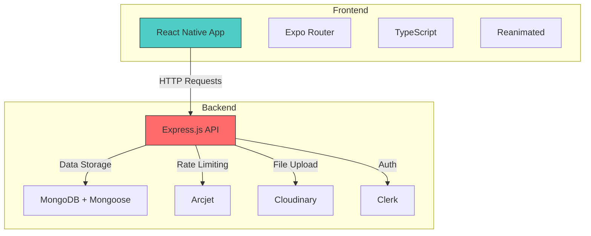

# Technology Stack

<cite>
**Referenced Files in This Document**  
- [server.js](file://backend/src/server.js)
- [db.js](file://backend/src/config/db.js)
- [env.js](file://backend/src/config/env.js)
- [cloudinary.js](file://backend/src/config/cloudinary.js)
- [arcjet.js](file://backend/src/config/arcjet.js)
- [auth.middleware.js](file://backend/src/middleware/auth.middleware.js)
- [upload.middleware.js](file://backend/src/middleware/upload.middleware.js)
- [package.json](file://backend/package.json)
- [package.json](file://mobile/package.json)
- [app.json](file://mobile/app.json)
- [tsconfig.json](file://mobile/tsconfig.json)
- [_layout.tsx](file://mobile/app/_layout.tsx)
- [_layout.tsx](file://mobile/app/(tabs)/_layout.tsx)
</cite>

## Table of Contents
1. [Backend Stack](#backend-stack)  
2. [Frontend Stack](#frontend-stack)  
3. [Third-Party Services](#third-party-services)  
4. [Architecture Overview](#architecture-overview)  
5. [Integration Patterns](#integration-patterns)  
6. [Performance and Security Considerations](#performance-and-security-considerations)

## Backend Stack

The backend of xClone is built using a modern Node.js-based technology stack centered around Express.js for REST API development, MongoDB with Mongoose for data persistence, and several supporting libraries for enhanced functionality.

### Express.js for REST APIs
Express.js (version 5.1.0) serves as the core web framework for building RESTful APIs. It provides a minimalist and flexible approach to routing, middleware integration, and request handling. The server entry point (`server.js`) initializes Express and configures essential middleware:

- `express.json()` for parsing incoming JSON payloads
- `cors()` for enabling Cross-Origin Resource Sharing
- Custom middleware for authentication, rate limiting, and file uploads

The API routes are modularized under the `routes` directory, with separate route files for users, posts, comments, and notifications, promoting maintainability and separation of concerns.

### MongoDB with Mongoose for Data Persistence
MongoDB is used as the primary NoSQL database, with Mongoose (version 8.16.0) as the ODM (Object Data Modeling) library. Mongoose provides schema-based modeling, type casting, validation, and middleware hooks for MongoDB operations.

The database connection is established via `connectDB()` in `db.js`, which uses the `MONGO_URI` environment variable. This ensures secure and configurable database access across environments.

### Node.js Runtime
The backend runs on Node.js, leveraging its non-blocking I/O model for high concurrency and performance. The `package.json` specifies ES modules (`"type": "module"`), enabling modern import/export syntax. The development script uses `node --watch` for automatic reloading during development.

### Supporting Libraries
- **multer**: Handles multipart form data for file uploads. Configured to accept only image files with a 5MB size limit, storing files in memory before Cloudinary upload.
- **cors**: Enables cross-origin requests, critical for allowing the mobile frontend to communicate with the backend API.
- **dotenv**: Loads environment variables from `.env` files for configuration management.
- **express-async-handler**: Simplifies error handling in async route handlers by automatically catching and forwarding errors to the error middleware.

**Section sources**  
- [server.js](file://backend/src/server.js#L1-L47)  
- [db.js](file://backend/src/config/db.js#L1-L11)  
- [env.js](file://backend/src/config/env.js#L1-L15)  
- [package.json](file://backend/package.json#L1-L26)

## Frontend Stack

The frontend of xClone is developed using React Native with Expo, enabling cross-platform mobile application development with a single codebase.

### React Native with Expo
React Native (version 0.79.6) provides the foundation for building native mobile UIs using React. Expo (version ~53.0.22) enhances the development experience with managed workflows, pre-configured builds, and access to native device features without requiring direct native code.

### TypeScript for Type Safety
TypeScript (version ~5.8.3) is integrated into the mobile project to provide static typing, improving code quality, developer experience, and reducing runtime errors. The `tsconfig.json` extends Expo’s base configuration with strict type checking enabled.

### Expo Router for File-Based Routing
Expo Router (version ~5.1.5) implements file-based routing, where the app’s navigation structure is defined by the file system. The root `_layout.tsx` defines a stack navigator, while the `(tabs)` directory contains a tab-based navigation layout with "Home" and "Explore" tabs.

### React Native Reanimated for Animations
React Native Reanimated (version ~3.17.4) is used for high-performance animations and gesture handling. It is imported in the root layout to ensure it is initialized early in the app lifecycle.

### UI and Navigation Components
The app uses `@react-navigation` libraries for navigation, including `bottom-tabs` and `native`. Custom components like `HapticTab` provide tactile feedback, while `IconSymbol` renders SF Symbols on iOS. The theme is managed via `useColorScheme` and `ThemeProvider` from React Navigation.

**Section sources**  
- [package.json](file://mobile/package.json#L1-L49)  
- [app.json](file://mobile/app.json#L1-L42)  
- [tsconfig.json](file://mobile/tsconfig.json#L1-L17)  
- [_layout.tsx](file://mobile/app/_layout.tsx#L1-L29)  
- [_layout.tsx](file://mobile/app/(tabs)/_layout.tsx#L1-L45)

## Third-Party Services

xClone integrates several third-party services to offload complex functionality and enhance security and scalability.

### Clerk for Authentication
Clerk (via `@clerk/express`) handles user authentication and session management. It provides secure JWT-based authentication, social logins, and user management. The `clerkMiddleware` is applied globally in `server.js`, and a custom `protectRoute` middleware enforces authentication on protected routes.

### Cloudinary for Media Storage and Transformation
Cloudinary is used for storing and transforming uploaded images. The configuration in `cloudinary.js` initializes the SDK with credentials from environment variables. Images are uploaded directly from the backend using the Cloudinary API, enabling features like resizing, format conversion, and CDN delivery.

### Arcjet for Rate Limiting and Bot Protection
Arcjet provides multi-layered security:
- **Shield**: Protects against common web attacks (e.g., SQL injection, XSS)
- **Bot Detection**: Blocks malicious bots while allowing search engines
- **Rate Limiting**: Implements a token bucket algorithm (10 tokens/10 seconds, capacity 15) to prevent abuse

The Arcjet middleware is integrated into the Express app to inspect and protect all incoming requests in real-time.

**Section sources**  
- [arcjet.js](file://backend/src/config/arcjet.js#L1-L30)  
- [cloudinary.js](file://backend/src/config/cloudinary.js#L1-L10)  
- [auth.middleware.js](file://backend/src/middleware/auth.middleware.js#L1-L8)  
- [package.json](file://backend/package.json#L1-L26)

## Architecture Overview

The xClone application follows a clean separation between frontend and backend, with well-defined integration points.

**Diagram sources**  
- [server.js](file://backend/src/server.js#L1-L47)  
- [_layout.tsx](file://mobile/app/_layout.tsx#L1-L29)  
- [package.json](file://backend/package.json#L1-L26)  
- [package.json](file://mobile/package.json#L1-L49)

## Integration Patterns

### Backend Middleware Chain
The Express app applies middleware in a specific order:
1. CORS
2. JSON parsing
3. Clerk authentication
4. Arcjet security
5. Route handlers

This ensures that requests are properly validated and secured before reaching business logic.

### Environment Configuration
Configuration is centralized in `env.js` using `dotenv`, exposing environment variables with default fallbacks. This pattern ensures consistent access to configuration across modules.

### Modular Route Organization
API routes are split by resource (users, posts, etc.), each with dedicated controller and model files. This promotes scalability and team collaboration.

### Memory-Based File Uploads
`multer` stores uploaded files in memory (via `memoryStorage`) before processing, which is ideal for forwarding to Cloudinary without disk I/O overhead.

**Section sources**  
- [server.js](file://backend/src/server.js#L1-L47)  
- [env.js](file://backend/src/config/env.js#L1-L15)  
- [upload.middleware.js](file://backend/src/middleware/upload.middleware.js#L1-L21)

## Performance and Security Considerations

### Performance
- **Backend**: Node.js event loop ensures non-blocking I/O; Mongoose queries are optimized with indexing (implied by schema design).
- **Frontend**: Reanimated enables 60fps animations; Expo’s asset bundling minimizes load times.
- **Media**: Cloudinary provides CDN delivery and on-the-fly image optimization.

### Security
- **Authentication**: Clerk handles secure JWT issuance and validation.
- **Rate Limiting**: Arcjet prevents brute-force and DDoS attacks.
- **Input Validation**: Mongoose schemas enforce data integrity.
- **File Uploads**: `multer` restricts file types and sizes; Cloudinary sanitizes media.

### Setup Requirements
- **Backend**: Node.js >=18, MongoDB URI, environment variables for Clerk, Arcjet, and Cloudinary.
- **Frontend**: Node.js, Expo CLI, and valid API endpoint configuration.

### Official Documentation Links
- [Express.js](https://expressjs.com/)
- [Mongoose](https://mongoosejs.com/)
- [Node.js](https://nodejs.org/)
- [React Native](https://reactnative.dev/)
- [Expo](https://docs.expo.dev/)
- [TypeScript](https://www.typescriptlang.org/)
- [Expo Router](https://expo.github.io/router/)
- [React Native Reanimated](https://docs.swmansion.com/react-native-reanimated)
- [Clerk](https://clerk.com/docs)
- [Cloudinary](https://cloudinary.com/documentation)
- [Arcjet](https://docs.arcjet.com/)