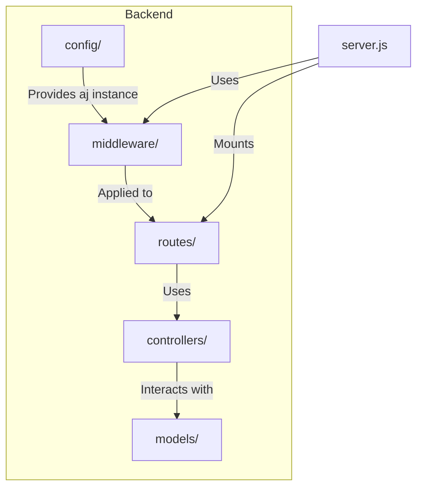
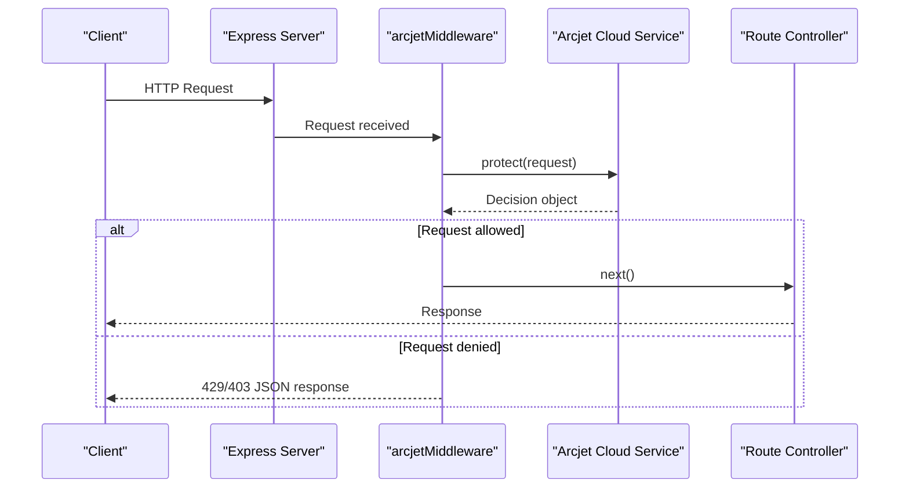
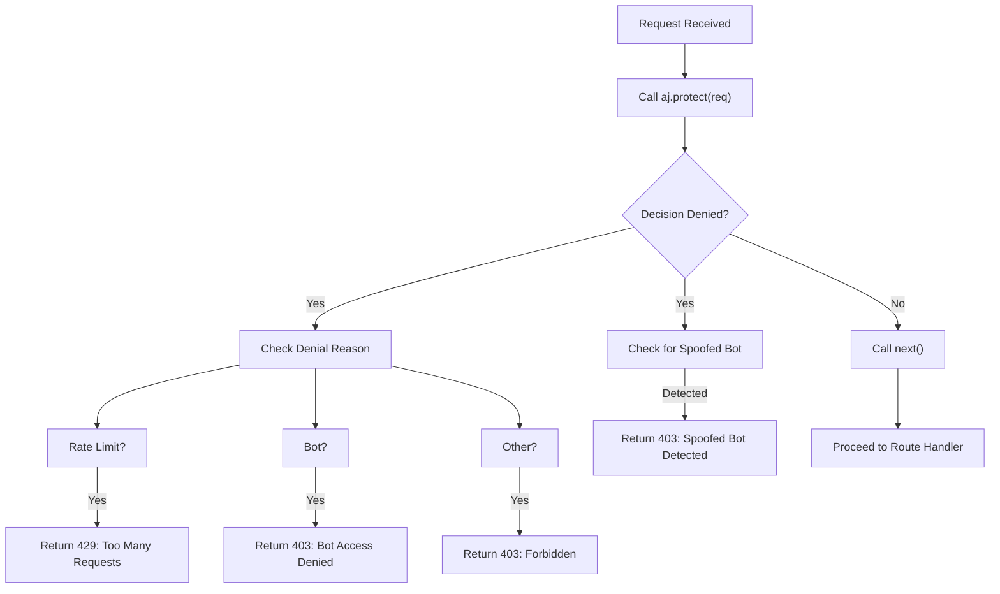
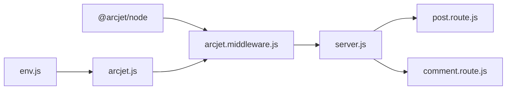

# Arcjet Security & Rate Limiting

<cite>
**Referenced Files in This Document**   
- [arcjet.js](file://backend/src/config/arcjet.js#L1-L30)
- [arcjet.middleware.js](file://backend/src/middleware/arcjet.middleware.js#L1-L45)
- [server.js](file://backend/src/server.js#L1-L47)
- [post.route.js](file://backend/src/routes/post.route.js#L1-L21)
- [comment.route.js](file://backend/src/routes/comment.route.js#L1-L15)
</cite>

## Table of Contents
1. [Introduction](#introduction)
2. [Project Structure](#project-structure)
3. [Core Components](#core-components)
4. [Architecture Overview](#architecture-overview)
5. [Detailed Component Analysis](#detailed-component-analysis)
6. [Dependency Analysis](#dependency-analysis)
7. [Performance Considerations](#performance-considerations)
8. [Troubleshooting Guide](#troubleshooting-guide)
9. [Conclusion](#conclusion)

## Introduction
This document provides a comprehensive overview of the Arcjet integration within the xClone backend system. It details how Arcjet is configured to protect the application from malicious traffic, including bot activity, rate abuse, and common web vulnerabilities. The implementation leverages middleware to enforce security policies across critical API endpoints such as post creation and comment submission. This documentation explains configuration, rule logic, request handling, error responses, and integration with Express.js, offering both technical depth and accessibility for developers and operations teams.

## Project Structure
The xClone project follows a modular backend architecture using Express.js, with clear separation of concerns across configuration, middleware, controllers, models, and routes. Security functionality is centralized in dedicated configuration and middleware files, enabling consistent enforcement across endpoints.



**Diagram sources**
- [server.js](file://backend/src/server.js#L1-L47)
- [arcjet.middleware.js](file://backend/src/middleware/arcjet.middleware.js#L1-L45)

**Section sources**
- [server.js](file://backend/src/server.js#L1-L47)
- [arcjet.middleware.js](file://backend/src/middleware/arcjet.middleware.js#L1-L45)

## Core Components
The core components of the Arcjet integration include the configuration file (`arcjet.js`) that defines security rules, and the middleware (`arcjet.middleware.js`) that applies these rules to incoming HTTP requests. These components work in tandem with Express.js routing to protect specific endpoints.

**Section sources**
- [arcjet.js](file://backend/src/config/arcjet.js#L1-L30)
- [arcjet.middleware.js](file://backend/src/middleware/arcjet.middleware.js#L1-L45)

## Architecture Overview
Arcjet is integrated at the middleware layer of the Express.js application, intercepting all incoming requests before they reach route handlers. It evaluates each request against predefined rules for bot detection, rate limiting, and attack shielding.



**Diagram sources**
- [arcjet.middleware.js](file://backend/src/middleware/arcjet.middleware.js#L1-L45)
- [server.js](file://backend/src/server.js#L1-L47)

## Detailed Component Analysis

### Arcjet Configuration Analysis
The `arcjet.js` file initializes the Arcjet client with an API key and a set of security rules. These rules are applied globally to all requests passing through the middleware.

```javascript
export const aj = arcjet({
  key: ENV.ARCJET_KEY,
  characteristics: ["ip.src"],
  rules: [
    shield({ mode: "LIVE" }),
    detectBot({
      mode: "LIVE",
      allow: ["CATEGORY:SEARCH_ENGINE"],
    }),
    tokenBucket({
      mode: "LIVE",
      refillRate: 10,
      interval: 10,
      capacity: 15,
    }),
  ],
});
```

- **shield**: Protects against common attacks like SQL injection, XSS, and CSRF by analyzing request patterns.
- **detectBot**: Blocks automated bots except for verified search engine crawlers.
- **tokenBucket**: Implements rate limiting using the token bucket algorithm with a refill rate of 10 tokens every 10 seconds and a maximum capacity of 15 tokens.

Each request consumes 1 token. Exceeding the bucket capacity triggers rate limiting.

**Section sources**
- [arcjet.js](file://backend/src/config/arcjet.js#L1-L30)

### Arcjet Middleware Implementation
The `arcjet.middleware.js` file defines the middleware function that integrates Arcjet into the Express.js request lifecycle.



**Diagram sources**
- [arcjet.middleware.js](file://backend/src/middleware/arcjet.middleware.js#L1-L45)

**Section sources**
- [arcjet.middleware.js](file://backend/src/middleware/arcjet.middleware.js#L1-L45)

The middleware performs the following steps:
1. Calls `aj.protect()` with the request object and token consumption value.
2. Evaluates the decision result:
   - If denied due to rate limiting: returns HTTP 429.
   - If denied due to bot detection: returns HTTP 403 with bot-specific message.
   - For other denials: returns generic 403 forbidden.
3. Checks for spoofed bot activity in results and blocks if detected.
4. Proceeds to the next middleware/handler if allowed.
5. Catches and logs errors, allowing the request to continue if Arcjet fails (fail-open behavior).

### Route Protection Analysis
Arcjet middleware is applied globally in `server.js`, meaning all routes are protected by default.

```javascript
app.use(arcjetMiddleware);
```

Critical user-generated content routes such as post creation and comment submission are automatically covered:

```mermaid
graph TB
POST_CreatePost[/api/posts POST] --> arcjetMiddleware
POST_CreateComment[/api/comments/post/:postId POST] --> arcjetMiddleware
arcjetMiddleware --> |Allowed| Controller
arcjetMiddleware --> |Denied| Client[Client]
```

**Diagram sources**
- [server.js](file://backend/src/server.js#L15)
- [post.route.js](file://backend/src/routes/post.route.js#L10)
- [comment.route.js](file://backend/src/routes/comment.route.js#L10)

**Section sources**
- [server.js](file://backend/src/server.js#L15)
- [post.route.js](file://backend/src/routes/post.route.js#L1-L21)
- [comment.route.js](file://backend/src/routes/comment.route.js#L1-L15)

Examples:
- **Post Creation**: `POST /api/posts` protected against spam and abuse.
- **Comment Submission**: `POST /api/comments/post/:postId` rate-limited to prevent flooding.

## Dependency Analysis
The Arcjet integration depends on several key packages and internal modules:



**Diagram sources**
- [package.json](file://backend/package.json#L10-L11)
- [arcjet.js](file://backend/src/config/arcjet.js#L1-L30)
- [arcjet.middleware.js](file://backend/src/middleware/arcjet.middleware.js#L1-L45)
- [server.js](file://backend/src/server.js#L1-L47)

Key dependencies:
- `@arcjet/node`: Core Arcjet SDK for Node.js.
- `@arcjet/inspect`: Used for debugging and inspection (listed in package.json).
- Internal config and middleware modules.

## Performance Considerations
Arcjet operates as an external service, so each protected request incurs a network round-trip. However, the integration uses a fail-open strategy—any failure in Arcjet communication allows the request to proceed, ensuring system availability.

Rate limiting uses a token bucket algorithm, which allows short bursts (up to 15 requests) before enforcing limits. This balances protection with user experience.

The global middleware application ensures consistent protection but applies to all routes, including health checks. Consider scoping middleware to specific routes if performance becomes a concern under high load.

## Troubleshooting Guide
Common issues and solutions:

**Issue: Legitimate users being rate-limited**
- **Cause**: Shared IP addresses (e.g., corporate networks) may trigger limits.
- **Solution**: Adjust `refillRate` and `capacity` in `tokenBucket`. Example: increase to 20/20 for higher tolerance.

**Issue: Search engine bots blocked**
- **Cause**: Bot not recognized or misclassified.
- **Solution**: Verify bot category in Arcjet dashboard; ensure `CATEGORY:SEARCH_ENGINE` is allowed.

**Issue: High latency in API responses**
- **Cause**: Network delay to Arcjet service.
- **Solution**: Monitor decision times; consider caching decisions for static content routes.

**Debugging Steps:**
1. Check server logs for "Arcjet middleware error" messages.
2. Use Arcjet dashboard to inspect decision logs and request details.
3. Temporarily set rule modes to "DRY_RUN" to observe decisions without blocking.
4. Test with `curl` or Postman to simulate requests and verify responses.

**Section sources**
- [arcjet.middleware.js](file://backend/src/middleware/arcjet.middleware.js#L40-L44)
- [arcjet.js](file://backend/src/config/arcjet.js#L1-L30)

## Conclusion
The Arcjet integration in xClone provides robust, multi-layered protection against bots, DDoS attempts, and common web attacks. By leveraging the token bucket rate limiting, bot detection, and shield rules, the application maintains security while ensuring a smooth experience for legitimate users. The middleware-based design ensures consistent enforcement across all routes, particularly safeguarding user-generated content endpoints. With proper monitoring and threshold tuning, this setup effectively balances security and usability.