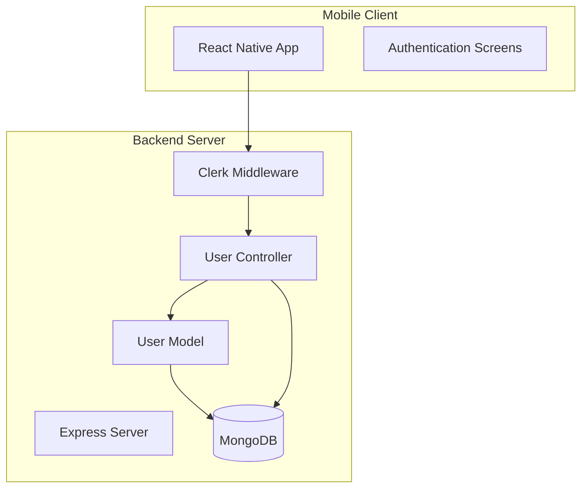
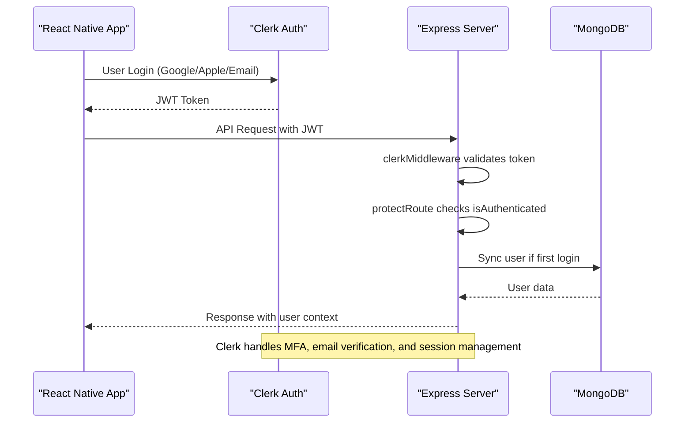
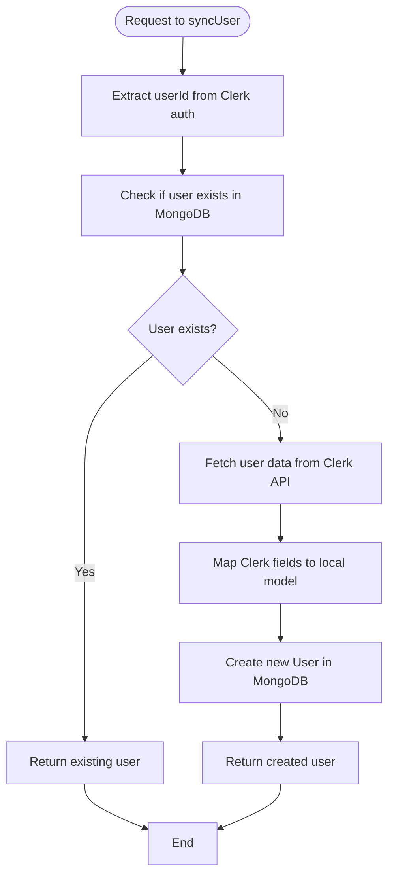

# Clerk Authentication Integration

<cite>
**Referenced Files in This Document**   
- [auth.middleware.js](file://backend/src/middleware/auth.middleware.js#L1-L9)
- [user.controller.js](file://backend/src/controllers/user.controller.js#L1-L97)
- [user.model.js](file://backend/src/models/user.model.js#L1-L64)
- [env.js](file://backend/src/config/env.js#L1-L16)
- [server.js](file://backend/src/server.js#L1-L46)
</cite>

## Table of Contents
1. [Introduction](#introduction)
2. [Project Structure](#project-structure)
3. [Core Components](#core-components)
4. [Architecture Overview](#architecture-overview)
5. [Detailed Component Analysis](#detailed-component-analysis)
6. [User Synchronization and Profile Management](#user-synchronization-and-profile-management)
7. [Session and Token Handling](#session-and-token-handling)
8. [Error Handling and Troubleshooting](#error-handling-and-troubleshooting)
9. [Setup and Configuration](#setup-and-configuration)
10. [Conclusion](#conclusion)

## Introduction
This document provides a comprehensive overview of the Clerk authentication integration within the xClone application. It details how OAuth 2.0 is implemented using Clerk’s SDK across both the React Native mobile client and backend server. The integration ensures secure user authentication, automatic profile synchronization with MongoDB, and robust session management. This system supports social logins (Google, Apple), email verification, and multi-factor authentication through Clerk’s managed identity platform.

## Project Structure
The xClone project follows a modular architecture with a clear separation between frontend (mobile) and backend services. The backend is built using Node.js with Express, while the mobile app uses React Native with Expo. Authentication logic is centralized in the backend via Clerk middleware and controllers.



**Diagram sources**
- [server.js](file://backend/src/server.js#L1-L46)
- [user.controller.js](file://backend/src/controllers/user.controller.js#L1-L97)

**Section sources**
- [server.js](file://backend/src/server.js#L1-L46)

## Core Components
The core components of the Clerk authentication system include:
- **clerkMiddleware**: Initializes Clerk authentication on every request
- **protectRoute middleware**: Ensures only authenticated users access protected endpoints
- **User model**: Stores synchronized user data from Clerk
- **User controller**: Handles user creation, profile retrieval, and follow logic
- **Environment configuration**: Manages Clerk API keys and secrets

These components work together to authenticate users, validate JWTs, and maintain a consistent user state across the application.

**Section sources**
- [auth.middleware.js](file://backend/src/middleware/auth.middleware.js#L1-L9)
- [user.controller.js](file://backend/src/controllers/user.controller.js#L1-L97)
- [user.model.js](file://backend/src/models/user.model.js#L1-L64)

## Architecture Overview
The authentication flow begins on the mobile client where users sign in via Clerk’s hosted pages or social providers. Upon successful login, Clerk issues a JWT that is sent to the backend with each request. The backend validates this token using `clerkMiddleware`, extracts user identity, and allows access to protected routes through `protectRoute`.



**Diagram sources**
- [auth.middleware.js](file://backend/src/middleware/auth.middleware.js#L1-L9)
- [user.controller.js](file://backend/src/controllers/user.controller.js#L1-L97)

## Detailed Component Analysis

### Authentication Middleware
The `protectRoute` middleware ensures that only authenticated users can access protected endpoints. It uses Clerk’s `req.auth()` method to check authentication status.

```javascript
export const protectRoute = async (req, res, next) => {
  if (!req.auth().isAuthenticated) {
    return res.status(401).json({
      message: "Unauthorized - you must be logged in",
    });
  }
  next();
};
```

This middleware is applied to all routes requiring authentication and integrates seamlessly with Clerk’s session management.

**Section sources**
- [auth.middleware.js](file://backend/src/middleware/auth.middleware.js#L1-L9)

### User Controller and Synchronization Logic
The `user.controller.js` file contains the logic for syncing Clerk users with the local MongoDB model. On first login, the `syncUser` function creates a new user record using data from Clerk’s API.



**Diagram sources**
- [user.controller.js](file://backend/src/controllers/user.controller.js#L32-L70)

**Section sources**
- [user.controller.js](file://backend/src/controllers/user.controller.js#L1-L97)

## User Synchronization and Profile Management
When a user logs in for the first time, their data is synchronized from Clerk to the local `User` model. The field mapping is as follows:

**Field Mapping**
- Clerk `userId` → Local `clerkId`
- Clerk `emailAddresses[0].emailAddress` → Local `email`
- Clerk `firstName` → Local `firstName`
- Clerk `lastName` → Local `lastName`
- Email prefix (before @) → Local `username`
- Clerk `imageUrl` → Local `profilePicture`

This synchronization occurs in the `syncUser` controller function and ensures that the application maintains a consistent user profile even if Clerk is the source of truth.

```javascript
const userData = {
  clerkId: userId,
  email: clerkUser.emailAddresses[0].emailAddress,
  firstName: clerkUser.firstName || "",
  lastName: clerkUser.lastName || "",
  username: clerkUser.emailAddresses[0].emailAddress.split("@")[0],
  profilePicture: clerkUser.imageUrl || "",
};
```

Role management is currently not implemented but can be extended using Clerk’s organization and role features.

**Section sources**
- [user.controller.js](file://backend/src/controllers/user.controller.js#L32-L70)
- [user.model.js](file://backend/src/models/user.model.js#L1-L64)

## Session and Token Handling
Clerk manages sessions and JWT tokens on the client side. The React Native app uses Clerk’s SDK to handle:
- Silent sign-in using secure session cookies
- Token refresh via Clerk’s built-in mechanisms
- Secure storage using device-safe storage (AsyncStorage with encryption)

On the backend, the `clerkMiddleware` automatically validates incoming JWTs and exposes the authenticated user via `req.auth()`. No manual token validation is required.

The `getCurrentUser` endpoint retrieves the currently logged-in user by extracting the `userId` from `getAuth(req)` and querying the local database.

```javascript
export const getCurrentUser = asyncHandler(async (req, res) => {
  const { userId } = getAuth(req);
  const user = await User.findOne({ clerkId: userId });
  if (!user) return res.status(404).json({ message: "User not found" });
  res.status(200).json({ user });
});
```

**Section sources**
- [user.controller.js](file://backend/src/controllers/user.controller.js#L50-L57)
- [server.js](file://backend/src/server.js#L1-L46)

## Error Handling and Troubleshooting
Common authentication issues and their solutions:

**Silent Sign-In Failures**
- **Cause**: Expired session or network issues
- **Fix**: Ensure Clerk publishable key is correctly set in environment variables

**User Data Desynchronization**
- **Cause**: Failed sync during first login
- **Fix**: Manually trigger `syncUser` endpoint or verify Clerk webhook delivery

**Expired or Malformed Tokens**
- **Cause**: Clock skew or tampered tokens
- **Fix**: Clerk automatically handles token expiration; ensure server time is synchronized

**401 Unauthorized Errors**
- **Cause**: Missing or invalid authentication header
- **Fix**: Verify that the mobile client sends the Clerk session token with requests

The error handling middleware in `server.js` logs unhandled exceptions and returns a generic 500 response.

```javascript
app.use((err, req, res, next) => {
  console.error("Unhandled error:", err);
  res.status(500).json({ error: err.message || "Internal server error" });
});
```

**Section sources**
- [server.js](file://backend/src/server.js#L40-L46)
- [auth.middleware.js](file://backend/src/middleware/auth.middleware.js#L1-L9)

## Setup and Configuration
To configure Clerk authentication:

1. **Environment Variables**
   ```env
   CLERK_PUBLISHABLE_KEY=your_publishable_key
   CLERK_SECRET_KEY=your_secret_key
   ```

2. **Backend Initialization**
   - Import `clerkMiddleware` in `server.js`
   - Apply it globally before route definitions

3. **Clerk Dashboard Configuration**
   - Enable required social providers (Google, Apple)
   - Configure email verification and multi-factor authentication
   - Set up webhooks for user events (e.g., user.created)

4. **Webhook Integration**
   - Endpoint: `/api/webhooks/clerk`
   - Events: `user.created`, `user.updated`, `user.deleted`

5. **Mobile Client Setup**
   - Install `@clerk/clerk-react-native`
   - Wrap app with `<ClerkProvider publishableKey={key}>`
   - Use `useAuth()` and `useUser()` hooks for session state

**Section sources**
- [env.js](file://backend/src/config/env.js#L1-L16)
- [server.js](file://backend/src/server.js#L1-L46)

## Conclusion
The Clerk authentication integration in xClone provides a secure, scalable, and feature-rich identity solution. By leveraging Clerk’s OAuth 2.0 implementation, the application supports social logins, email verification, and multi-factor authentication out of the box. The backend seamlessly synchronizes user data with MongoDB, ensuring consistency while offloading complex authentication logic to Clerk. This architecture enables rapid development, improved security, and a seamless user experience across mobile and web platforms.