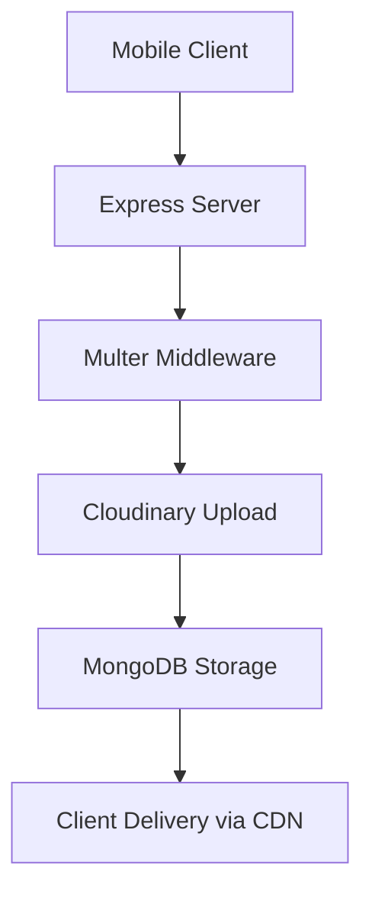
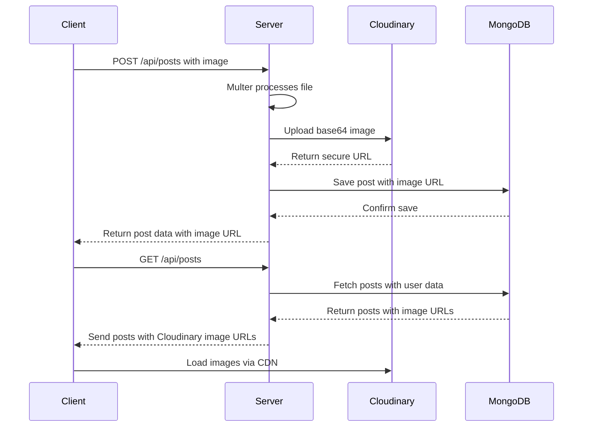
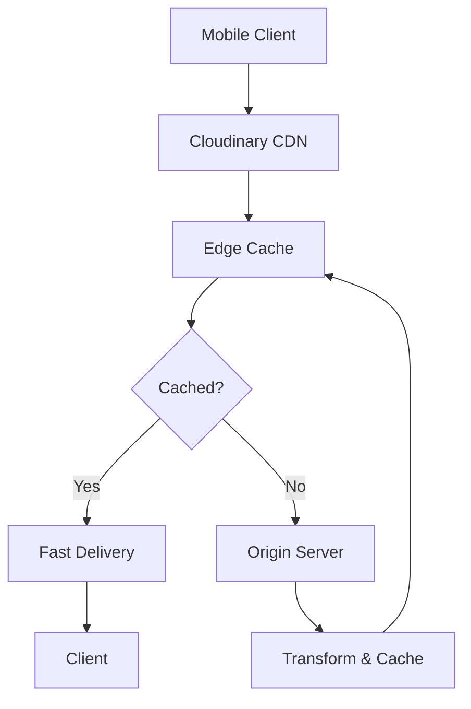

# Cloudinary Media Storage

<cite>
**Referenced Files in This Document**   
- [cloudinary.js](file://backend/src/config/cloudinary.js)
- [env.js](file://backend/src/config/env.js)
- [upload.middleware.js](file://backend/src/middleware/upload.middleware.js)
- [post.controller.js](file://backend/src/controllers/post.controller.js)
- [post.route.js](file://backend/src/routes/post.route.js)
</cite>

## Table of Contents
1. [Introduction](#introduction)
2. [Configuration Setup](#configuration-setup)
3. [Image Upload Pipeline](#image-upload-pipeline)
4. [Transformation and Optimization](#transformation-and-optimization)
5. [Storage and Retrieval in MongoDB](#storage-and-retrieval-in-mongodb)
6. [Error Handling](#error-handling)
7. [Performance Considerations](#performance-considerations)
8. [Troubleshooting Guide](#troubleshooting-guide)

## Introduction
This document provides a comprehensive overview of the Cloudinary media storage integration within the xClone application. It details the configuration, upload workflow, image transformation, error handling, and performance optimization strategies used to manage user-uploaded images efficiently and securely.

The system leverages Cloudinary as a cloud-based media management solution to store, transform, and deliver images via a global CDN. Images are uploaded from the mobile client through a secure backend pipeline, processed with optimized settings, and stored with URLs in MongoDB for fast retrieval.



**Diagram sources**
- [post.route.js](file://backend/src/routes/post.route.js#L1-L21)
- [post.controller.js](file://backend/src/controllers/post.controller.js#L38-L123)
- [upload.middleware.js](file://backend/src/middleware/upload.middleware.js#L1-L21)

## Configuration Setup
The Cloudinary integration is configured using environment variables to securely manage sensitive credentials. These variables are loaded via the `dotenv` package and accessed through a centralized configuration module.

### Environment Variables
The following environment variables are required for Cloudinary integration:

```
CLOUDINARY_CLOUD_NAME=your_cloud_name
CLOUDINARY_API_KEY=your_api_key
CLOUDINARY_API_SECRET=your_api_secret
```

These values are defined in the `ENV` object within the `env.js` configuration file and used to initialize the Cloudinary SDK.

```javascript
// src/config/env.js
export const ENV = {
    // other config...
    CLOUDINARY_CLOUD_NAME: process.env.CLOUDINARY_CLOUD_NAME,
    CLOUDINARY_API_KEY: process.env.CLOUDINARY_API_KEY,
    CLOUDINARY_API_SECRET: process.env.CLOUDINARY_API_SECRET,
}
```

The Cloudinary SDK is initialized in `cloudinary.js` using these environment variables:

```javascript
// src/config/cloudinary.js
import { v2 as cloudinary } from "cloudinary";
import { ENV } from "./env.js";

cloudinary.config({
  cloud_name: ENV.CLOUDINARY_CLOUD_NAME,
  api_key: ENV.CLOUDINARY_API_KEY,
  api_secret: ENV.CLOUDINARY_API_SECRET,
});

export default cloudinary;
```

This approach ensures that credentials are never hardcoded and can be safely managed across different deployment environments.

**Section sources**
- [env.js](file://backend/src/config/env.js#L10-L15)
- [cloudinary.js](file://backend/src/config/cloudinary.js#L1-L9)

## Image Upload Pipeline
The image upload process follows a structured pipeline from client to cloud storage, involving middleware processing and secure API communication.

### Client to Server Flow
1. Mobile client sends a POST request with image data in `multipart/form-data` format
2. Express server routes the request to the appropriate endpoint
3. Multer middleware intercepts and processes the file upload
4. Base64-encoded image is sent to Cloudinary API
5. Cloudinary returns a secure URL for the uploaded image
6. URL is stored in MongoDB with the associated post

### Route Configuration
The upload route is defined in `post.route.js` and uses both authentication and file upload middleware:

```javascript
// src/routes/post.route.js
router.post("/", protectRoute, upload.single("image"), createPosts);
```

This route applies:
- `protectRoute`: Ensures user authentication via Clerk
- `upload.single("image")`: Processes single image file from the "image" field
- `createPosts`: Controller function handling post creation

### Multer Middleware
The `upload.middleware.js` file configures Multer to handle image uploads with specific constraints:

```javascript
// src/middleware/upload.middleware.js
const storage = multer.memoryStorage();

const fileFilter = (req, file, cb) => {
    if (file.mimetype.startsWith("image/")) {
      cb(null, true);
    } else {
      cb(new Error("Only image files are allowed"), false);
    }
};

const upload = multer({
  storage: storage,
  fileFilter: fileFilter,
  limits: { fileSize: 5 * 1024 * 1024 }, // 5MB limit
});

export default upload;
```

Key features:
- **Memory Storage**: Files are stored in memory as buffers, avoiding disk writes
- **File Type Filtering**: Only image files (e.g., image/jpeg, image/png) are accepted
- **Size Limitation**: Maximum 5MB per file to prevent abuse
- **Error Handling**: Rejection of non-image files with descriptive error messages

**Section sources**
- [upload.middleware.js](file://backend/src/middleware/upload.middleware.js#L1-L21)
- [post.route.js](file://backend/src/routes/post.route.js#L15-L16)

## Transformation and Optimization
Cloudinary automatically applies image transformations to optimize quality, size, and delivery performance.

### Transformation Settings
When uploading images, the following transformations are applied:

```javascript
// src/controllers/post.controller.js
const uploadResponse = await cloudinary.uploader.upload(base64Image, {
  folder: "social_media_posts",
  resource_type: "image",
  transformation: [
    { width: 800, height: 600, crop: "limit" },
    { quality: "auto" },
    { format: "auto" },
  ],
});
```

#### Transformation Parameters
- **Size Limiting**: `width: 800, height: 600, crop: "limit"` resizes images to fit within 800x600 while maintaining aspect ratio
- **Quality Optimization**: `quality: "auto"` uses Cloudinary's intelligent quality algorithm to balance visual quality and file size
- **Format Conversion**: `format: "auto"` delivers images in the most efficient format (e.g., WebP, AVIF) based on client browser support

### Benefits
- **Bandwidth Reduction**: Smaller file sizes reduce data transfer costs
- **Faster Load Times**: Optimized images load quicker on mobile devices
- **Responsive Delivery**: Automatic format selection ensures compatibility across devices
- **Consistent Display**: Uniform sizing improves UI consistency

**Section sources**
- [post.controller.js](file://backend/src/controllers/post.controller.js#L77-L85)

## Storage and Retrieval in MongoDB
Uploaded image URLs are stored in MongoDB alongside post data for efficient retrieval and display.

### Data Model Integration
When a post is created with an image, the Cloudinary secure URL is saved in the `image` field of the Post document:

```javascript
// src/controllers/post.controller.js
const post = await Post.create({
  user: user._id,
  content: content || "",
  image: imageUrl,
});
```

The `imageUrl` comes from `uploadResponse.secure_url`, ensuring HTTPS delivery.

### Retrieval Process
Posts are retrieved with populated user data, including profile pictures and associated images:

```javascript
const posts = await Post.find()
  .sort({ createdAt: -1 })
  .populate("user", "username firstName lastName profilePicture")
  .populate({
    path: "comments",
    populate: {
      path: "user",
      select: "username firstName lastName profilePicture",
    },
  });
```

This ensures that both the post image and user profile pictures are available to the client in a single response.



**Diagram sources**
- [post.controller.js](file://backend/src/controllers/post.controller.js#L38-L123)
- [post.route.js](file://backend/src/routes/post.route.js#L15-L16)

**Section sources**
- [post.controller.js](file://backend/src/controllers/post.controller.js#L100-L115)
- [post.controller.js](file://backend/src/controllers/post.controller.js#L1-L20)

## Error Handling
The system implements robust error handling for various failure scenarios during image upload and processing.

### Upload Failure Scenarios
- Invalid file type (non-image)
- File size exceeding 5MB limit
- Cloudinary API connectivity issues
- Authentication failures with Cloudinary
- Timeout during upload

### Implementation
Errors are caught and handled gracefully in the `createPosts` controller:

```javascript
try {
  const uploadResponse = await cloudinary.uploader.upload(base64Image, {
    // transformation options
  });
  imageUrl = uploadResponse.secure_url;
} catch (uploadError) {
  console.error("Cloudinary upload error:", uploadError);
  return res.status(400).json({ error: "Failed to upload image" });
}
```

Key aspects:
- **Logging**: Errors are logged server-side for debugging
- **Client Feedback**: Users receive a clear error message
- **Graceful Degradation**: The post creation process stops, preventing partial data creation
- **Status Codes**: HTTP 400 is returned for client-side issues

### Validation
Additional validation occurs before upload:
- Content or image must be provided
- User must be authenticated
- File type must be an image

**Section sources**
- [post.controller.js](file://backend/src/controllers/post.controller.js#L70-L75)
- [upload.middleware.js](file://backend/src/middleware/upload.middleware.js#L5-L10)

## Performance Considerations
The Cloudinary integration is designed with performance optimization as a core principle.

### CDN Delivery
All images are served through Cloudinary's global CDN, providing:
- Low-latency delivery worldwide
- Automatic caching at edge locations
- High availability and scalability
- DDoS protection and rate limiting

### Caching Strategy
Cloudinary applies intelligent caching headers:
- Long TTLs for static assets
- ETag-based validation
- Cache versioning via folder structure
- Automatic cache invalidation when needed

### Bandwidth Optimization
Multiple techniques reduce bandwidth usage:
- **Auto Format**: Delivers WebP/AVIF to supporting browsers
- **Auto Quality**: Balances visual fidelity and compression
- **Responsive Resizing**: Serves appropriately sized images
- **Lazy Loading**: Client-side implementation recommended

### Memory Efficiency
Using `multer.memoryStorage()` avoids disk I/O but requires monitoring:
- Buffer size limited to 5MB per file
- Server memory usage should be monitored
- Consider streaming for larger files in future



**Diagram sources**
- [post.controller.js](file://backend/src/controllers/post.controller.js#L77-L85)

## Troubleshooting Guide
This section addresses common issues encountered with the Cloudinary integration.

### Invalid Credentials
**Symptoms**: Authentication errors, 401 responses from Cloudinary  
**Solution**: Verify environment variables:
- `CLOUDINARY_CLOUD_NAME`
- `CLOUDINARY_API_KEY`
- `CLOUDINARY_API_SECRET`

Ensure no extra spaces or quotes in `.env` file.

### CORS Errors
**Symptoms**: Browser blocks upload requests  
**Solution**: 
- Ensure backend API is properly configured
- Verify that mobile client origin is allowed
- Check network configuration and proxy settings

### Quota Limits
**Symptoms**: Uploads fail after certain volume  
**Solution**:
- Monitor Cloudinary dashboard for usage
- Upgrade plan if necessary
- Implement client-side size validation
- Add queueing for bulk uploads

### Image Quality Issues
**Symptoms**: Blurry or pixelated images  
**Solution**:
- Adjust transformation parameters
- Test different quality settings
- Verify source image resolution
- Consider removing `crop: "limit"` for higher resolution needs

### Timeout Errors
**Symptoms**: Uploads fail for large files  
**Solution**:
- Reduce file size before upload
- Increase server timeout settings
- Implement chunked uploads for large files
- Optimize network connection

### Debugging Steps
1. Check server logs for error details
2. Verify environment variables are loaded
3. Test Cloudinary credentials independently
4. Validate file type and size constraints
5. Monitor network requests in browser dev tools

**Section sources**
- [cloudinary.js](file://backend/src/config/cloudinary.js#L1-L9)
- [post.controller.js](file://backend/src/controllers/post.controller.js#L70-L75)
- [upload.middleware.js](file://backend/src/middleware/upload.middleware.js#L1-L21)