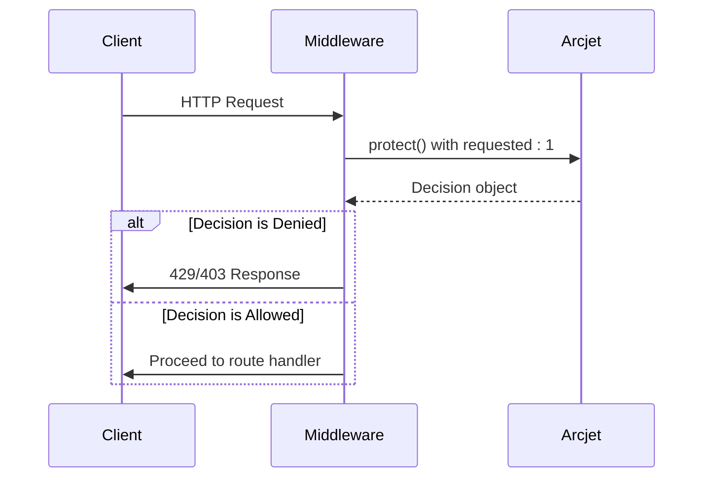
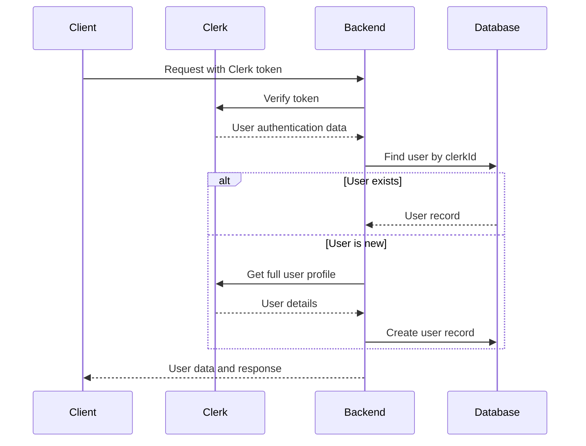

# Third-Party Integrations

<cite>
**Referenced Files in This Document**   
- [cloudinary.js](file://backend\src\config\cloudinary.js) - *Cloudinary configuration*
- [arcjet.js](file://backend\src\config\arcjet.js) - *Updated Arcjet configuration in commit 910493a*
- [arcjet.middleware.js](file://backend\src\middleware\arcjet.middleware.js) - *Updated Arcjet middleware in commit 910493a*
- [env.js](file://backend\src\config\env.js) - *Environment configuration*
- [user.controller.js](file://backend\src\controllers\user.controller.js) - *User synchronization logic*
- [auth.middleware.js](file://backend\src\middleware\auth.middleware.js) - *Authentication middleware*
- [upload.middleware.js](file://backend\src\middleware\upload.middleware.js) - *File upload handling*
</cite>

## Update Summary
**Changes Made**   
- Updated Arcjet configuration details to reflect current implementation
- Enhanced Arcjet middleware error handling description
- Clarified rate limiting and bot detection rules
- Added package version information for Arcjet dependencies
- Maintained all existing integration documentation for Cloudinary and Clerk
- Updated source references with change annotations

## Table of Contents
1. [Cloudinary Integration](#cloudinary-integration)
2. [Arcjet Security Implementation](#arcjet-security-implementation)
3. [Clerk Authentication Integration](#clerk-authentication-integration)
4. [Configuration and API Key Management](#configuration-and-api-key-management)
5. [Error Handling and Fallback Strategies](#error-handling-and-fallback-strategies)
6. [Setup and Testing Guidelines](#setup-and-testing-guidelines)
7. [Cost, Limits, and Monitoring](#cost-limits-and-monitoring)
8. [Troubleshooting Common Issues](#troubleshooting-common-issues)

## Cloudinary Integration

The Cloudinary integration in xClone enables image upload, transformation, and delivery for user-generated content. It is implemented using the Cloudinary Node.js SDK and configured through environment variables.

### Configuration and Upload Presets
Cloudinary is initialized in `cloudinary.js` using credentials from the environment configuration. The integration uses direct upload from the backend with no signed upload presets, relying on secure API key authentication.

```javascript
import { v2 as cloudinary } from "cloudinary";
import { ENV } from "./env.js";

cloudinary.config({
  cloud_name: ENV.CLOUDINARY_CLOUD_NAME,
  api_key: ENV.CLOUDINARY_API_KEY,
  api_secret: ENV.CLOUDINARY_API_SECRET,
});

export default cloudinary;
```

**Key Configuration Parameters:**
- `cloud_name`: Cloudinary account identifier
- `api_key`: API key for authentication
- `api_secret`: Secret key for secure operations

### Image Upload and Delivery Workflow
While the current implementation includes the Cloudinary SDK, actual image upload logic is not yet implemented in the controllers. The `upload.middleware.js` prepares file uploads using Multer with the following settings:

```javascript
const storage = multer.memoryStorage();

const fileFilter = (req, file, cb) => {
  if (file.mimetype.startsWith("image/")) {
    cb(null, true);
  } else {
    cb(new Error("Only image files are allowed"), false);
  }
};

const upload = multer({
  storage: storage,
  fileFilter: fileFilter,
  limits: { fileSize: 5 * 1024 * 1024 }, // 5MB limit
});
```

This configuration:
- Stores files in memory before processing
- Restricts uploads to image files only
- Enforces a 5MB file size limit

To complete the integration, image upload endpoints should use Cloudinary's upload API to transfer files from memory storage to Cloudinary's CDN.

### URL Generation
Once implemented, Cloudinary URLs will be generated using the SDK's upload method, which returns a secure HTTPS URL for the uploaded image. These URLs can include transformation parameters for resizing, cropping, and optimization.

**Section sources**
- [cloudinary.js](file://backend\src\config\cloudinary.js)
- [upload.middleware.js](file://backend\src\middleware\upload.middleware.js)

## Arcjet Security Implementation

Arcjet provides comprehensive security for xClone, including rate limiting, bot detection, and protection against common web attacks. The integration has been updated to enhance security posture with specific rule configurations.

### Security Rules Configuration
The Arcjet configuration in `arcjet.js` defines multiple protection layers:

```javascript
export const aj = arcjet({
  key: ENV.ARCJET_KEY,
  characteristics: ["ip.src"],
  rules: [
    shield({ mode: "LIVE" }),
    detectBot({
      mode: "LIVE",
      allow: [
        "CATEGORY:SEARCH_ENGINE",
      ],
    }),
    tokenBucket({
      mode: "LIVE",
      refillRate: 10,
      interval: 10,
      capacity: 15,
    }),
  ],
});
```

**Rule Breakdown:**
- **Shield**: Protects against OWASP Top 10 threats including SQL injection, XSS, and CSRF
- **Bot Detection**: Blocks automated bots while allowing search engine crawlers
- **Rate Limiting**: Token bucket algorithm with 10 tokens replenished every 10 seconds, maximum capacity of 15 tokens

The Arcjet package version `1.0.0-beta.8` is used, with Node.js engine requirement of `>=18`. The implementation includes dependencies for protocol handling, transport, runtime, and stable hashing to ensure consistent decision-making across distributed environments.

### Middleware Implementation
The `arcjet.middleware.js` file implements request protection by evaluating each incoming request against the defined rules:

```javascript
export const arcjetMiddleware = async (req, res, next) => {
  try {
    const decision = await aj.protect(req, {
      requested: 1,
    });

    if (decision.isDenied()) {
      if (decision.reason.isRateLimit()) {
        return res.status(429).json({
          error: "Too Many Requests",
          message: "Rate limit exceeded. Please try again later.",
        });
      } else if (decision.reason.isBot()) {
        return res.status(403).json({
          error: "Bot access denied",
          message: "Automated requests are not allowed.",
        });
      } else {
        return res.status(403).json({
          error: "Forbidden",
          message: "Access denied by security policy.",
        });
      }
    }

    if (decision.results.some((result) => result.reason.isBot() && result.reason.isSpoofed())) {
      return res.status(403).json({
        error: "Spoofed bot detected",
        message: "Malicious bot activity detected.",
      });
    }

    next();
  } catch (error) {
    console.error("Arcjet middleware error:", error);
    next();
  }
};
```

The middleware:
- Consumes 1 token per request for rate limiting
- Provides specific error messages based on denial reason
- Includes additional detection for spoofed bots
- Implements fail-open strategy by allowing requests to proceed if Arcjet fails



**Diagram sources**
- [arcjet.middleware.js](file://backend\src\middleware\arcjet.middleware.js) - *Updated in commit 910493a*
- [arcjet.js](file://backend\src\config\arcjet.js) - *Updated in commit 910493a*

**Section sources**
- [arcjet.middleware.js](file://backend\src\middleware\arcjet.middleware.js) - *Updated in commit 910493a*
- [arcjet.js](file://backend\src\config\arcjet.js) - *Updated in commit 910493a*

## Clerk Authentication Integration

Clerk handles user authentication, OAuth flows, and user session management for xClone.

### OAuth Flow and Session Management
The integration uses `@clerk/express` to handle authentication. The `auth.middleware.js` protects routes by verifying authentication status:

```javascript
export const protectRoute = async (req, res, next) => {
  if (!req.auth().isAuthenticated) {
    return res.status(401).json({
      message: "Unauthorized-you must be logged in",
    });
  }
  next();
};
```

This middleware checks the `isAuthenticated` property from Clerk's authentication context and rejects unauthenticated requests with a 401 status.

### User Synchronization
The `user.controller.js` implements user synchronization between Clerk and the application database:

```javascript
export const syncUser = asyncHandler(async (req, res) => {
  const { userId } = getAuth(req);
  const existingUser = await User.findOne({ clerkId: userId });
  if (existingUser) res.status(200).json({ message: "User already exists" });
  
  const clerkUser = await clerkClient.users.getUser(userId);
  const userData = {
    clerkId: userId,
    email: clerkUser.emailAddresses[0].emailAddress,
    firstName: clerkUser.firstName || "",
    lastName: clerkUser.lastName || "",
    username: clerkUser.emailAddresses[0].emailAddress.split("@")[0],
    profilePicture: clerkUser.imageUrl || "",
  };
  const user = await User.create(userData);
  res.status(201).json({ user, message: "User created successfully" });
});
```

The synchronization process:
1. Extracts the user ID from the authenticated request
2. Checks if the user already exists in the local database
3. If new, fetches user data from Clerk's API
4. Maps Clerk user data to the application's user model
5. Creates a new user record with profile information

Other controller methods like `getCurrentUser` and `updateProfile` also use `getAuth(req)` to retrieve the authenticated user's ID for database operations.



**Diagram sources**
- [user.controller.js](file://backend\src\controllers\user.controller.js)
- [auth.middleware.js](file://backend\src\middleware\auth.middleware.js)

**Section sources**
- [user.controller.js](file://backend\src\controllers\user.controller.js)
- [auth.middleware.js](file://backend\src\middleware\auth.middleware.js)

## Configuration and API Key Management

All third-party service configurations are centralized in the environment management system.

### Environment Configuration
The `env.js` file imports environment variables and exports them as a structured object:

```javascript
export const ENV = {
    PORT: process.env.PORT || 5001,
    MONGO_URI: process.env.MONGO_URI,
    NODE_ENV:process.env.NODE_ENV,
    CLERK_PUBLISHABLE_KEY:process.env.CLERK_PUBLISHABLE_KEY,
    CLERK_SECRET_KEY:process.env.CLERK_SECRET_KEY,
    ARCJET_KEY:process.env.ARCJET_KEY,
    CLOUDINARY_CLOUD_NAME:process.env.CLOUDINARY_CLOUD_NAME,
    CLOUDINARY_API_KEY:process.env.CLOUDINARY_API_KEY,
    CLOUDINARY_API_SECRET:process.env.CLOUDINARY_API_SECRET,
}
```

This approach:
- Centralizes all configuration in one location
- Uses `dotenv` for local development
- Exposes credentials only through the ENV object
- Provides fallback values for critical settings like PORT

### Security Best Practices
- API keys are never hardcoded and are loaded from environment variables
- The `.env` file should be included in `.gitignore` to prevent accidental commits
- Production environments should use secure secret management systems
- Each service uses appropriate key types (secret keys for backend, publishable keys for frontend)

**Section sources**
- [env.js](file://backend\src\config\env.js)

## Error Handling and Fallback Strategies

Each integration includes robust error handling to ensure application stability.

### Arcjet Error Handling
The Arcjet middleware implements a fail-open strategy:

```javascript
catch (error) {
  console.error("Arcjet middleware error:", error);
  // allow request to continue if Arcjet fails
  next();
}
```

This ensures that security service outages do not disrupt application functionality, maintaining availability at the cost of temporary reduced security.

### Clerk Integration Resilience
The user synchronization logic handles potential Clerk API failures by:
- Using async error handling with express-async-handler
- Implementing proper error responses for user lookup failures
- Providing fallback values for optional user fields (firstName, lastName)

### Cloudinary Considerations
While not fully implemented, a production-ready Cloudinary integration should include:
- Try-catch blocks around upload operations
- Local file storage fallback if Cloudinary is unavailable
- Error responses with appropriate HTTP status codes
- Logging of upload failures for debugging

## Setup and Testing Guidelines

### Configuration Setup
1. Create accounts for Cloudinary, Arcjet, and Clerk
2. Obtain API keys and credentials for each service
3. Create a `.env` file in the backend root directory:
```
PORT=5001
MONGO_URI=your_mongodb_connection_string
CLERK_PUBLISHABLE_KEY=your_clerk_publishable_key
CLERK_SECRET_KEY=your_clerk_secret_key
ARCJET_KEY=your_arcjet_key
CLOUDINARY_CLOUD_NAME=your_cloudinary_cloud_name
CLOUDINARY_API_KEY=your_cloudinary_api_key
CLOUDINARY_API_SECRET=your_cloudinary_api_secret
```

### Testing Approaches
**Arcjet Testing:**
- Verify rate limiting by sending >15 requests in 10 seconds
- Test bot detection using curl with bot-like user agents
- Confirm shield protection by sending requests with SQL injection patterns

**Clerk Testing:**
- Test authentication flow by accessing protected routes without authentication (should return 401)
- Verify user synchronization by logging in with a new Clerk user and checking database creation
- Test profile updates through the updateProfile endpoint

**Cloudinary Testing:**
- Once implemented, test with various image formats (JPEG, PNG, WebP)
- Test file size limits by uploading files >5MB
- Verify image transformation capabilities

## Cost, Limits, and Monitoring

### Service Limits
**Arcjet:**
- Rate limiting: 10 requests per 10 seconds per IP (burst up to 15)
- Free tier includes 10,000 monthly active users
- Enterprise plans available for higher volumes

**Cloudinary:**
- Free tier includes 25 credits/month (1 credit = 1,000 image uploads)
- 5MB file size limit enforced by application
- Bandwidth and transformation costs vary by plan

**Clerk:**
- Free tier includes 10,000 monthly active users
- Social logins and MFA included in all plans
- Usage-based pricing for higher volumes

### Monitoring Recommendations
- Set up logging for all third-party service interactions
- Monitor rate limiting patterns to adjust token bucket parameters
- Track user authentication success/failure rates
- Monitor image upload volumes and CDN bandwidth usage
- Implement health checks for all integrated services

## Troubleshooting Common Issues

### Upload Failures
**Symptoms:** 400 errors, "Only image files are allowed" messages
**Solutions:**
- Verify file is an image format (JPEG, PNG, GIF, etc.)
- Check file size is under 5MB
- Ensure request uses multipart/form-data encoding
- Confirm Cloudinary credentials are valid

### Rate Limit False Positives
**Symptoms:** 429 responses with "Too Many Requests" message
**Solutions:**
- Verify client IP is not shared among many users (corporate networks)
- Check for client-side retry logic causing rapid requests
- Review Arcjet dashboard for blocked requests
- Consider increasing token bucket capacity for legitimate use cases

### Authentication Issues
**Symptoms:** 401 responses, "Unauthorized" messages
**Solutions:**
- Verify Clerk publishable and secret keys are correct
- Check that authentication token is included in request headers
- Ensure Clerk frontend components are properly initialized
- Verify user exists in both Clerk and application database

### Bot Detection Problems
**Symptoms:** Legitimate users blocked as bots
**Solutions:**
- Check user agent strings for unusual patterns
- Verify the request is not coming from a known malicious IP
- Review Arcjet decision reasons in logs
- Adjust bot detection rules if false positives persist

### Configuration Errors
**Symptoms:** Application crashes on startup, "Invalid credentials" errors
**Solutions:**
- Verify all environment variables are set
- Check for typos in API keys
- Ensure dotenv file is properly loaded
- Validate service status on provider dashboards

**Section sources**
- [env.js](file://backend\src\config\env.js)
- [arcjet.middleware.js](file://backend\src\middleware\arcjet.middleware.js) - *Updated in commit 910493a*
- [user.controller.js](file://backend\src\controllers\user.controller.js)